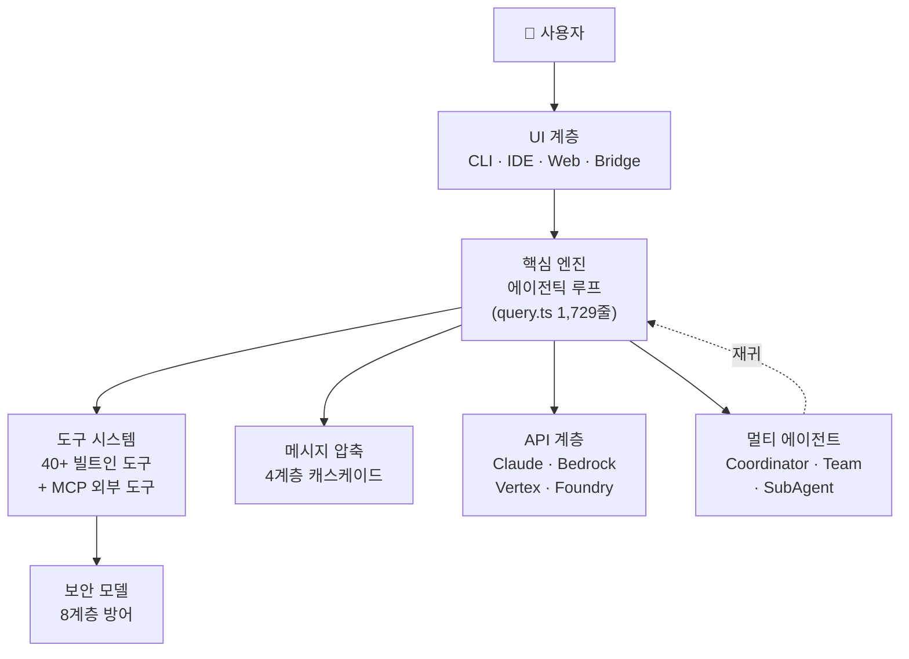
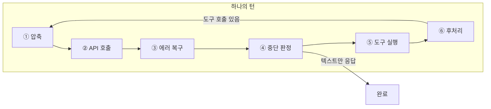
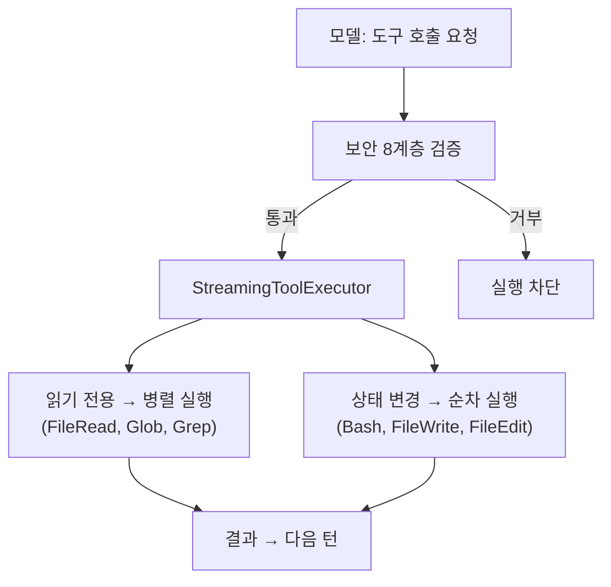
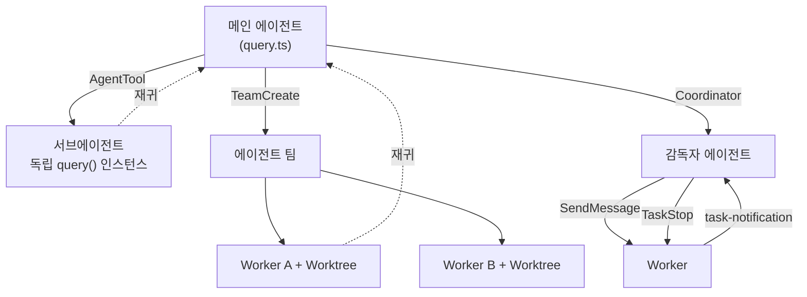
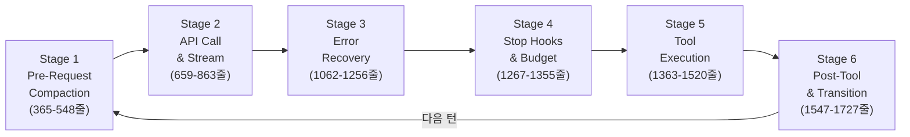
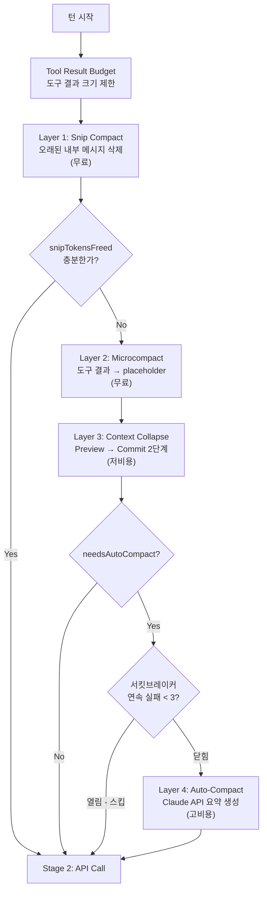

# Claude Code 아키텍처 완전 분석

> 본 문서는 2026년 3월 npm 소스맵 유출로 공개된 Claude Code v2.1.88의 내부 아키텍처를 
> 동일 기능 복제가 가능한 수준으로 분석한 종합 보고서이다.

---

## 1. 분석 개요

### 1.1 소스맵 유출 경위

2026년 3월, Anthropic이 npm에 배포한 `@anthropic-ai/claude-code` v2.1.88 패키지에 소스맵 파일(`cli.js.map`)이 포함되어 있었다. 배포된 `cli.js`는 Bun 번들러로 생성된 단일 minified 번들이며, 동봉된 소스맵에 원본 TypeScript 소스 경로와 코드가 인코딩되어 있었다.

```
cli.js        → 단일 minified 번들 (Bun 번들러 출력)
cli.js.map    → 소스맵 (원본 TypeScript 소스 포함)
src/          → 소스맵에서 추출한 원본 소스 트리
```

cli.js 헤더에는 다음과 같은 주석이 포함되어 있었다:

```javascript
#!/usr/bin/env node
// (c) Anthropic PBC. All rights reserved.
// Version: 2.1.88
// Want to see the unminified source? We're hiring!
// https://job-boards.greenhouse.io/anthropic/jobs/4816199008
```

### 1.2 공식 오픈소스 vs 실제 코드베이스 비교

| 항목 | 공식 오픈소스 | 실제 코드베이스 (소스맵) |
|------|-------------|----------------------|
| 파일 수 | 279개 (플러그인) | **4,600+개** (1,902개 src/ 파일) |
| 코드 라인 | 비공개 | **~512,664줄** |
| 공개 범위 | 플러그인 인터페이스만 | 핵심 엔진, 보안, 미공개 기능 전체 |
| 빌드 산출물 | - | cli.js 단일 번들 + cli.js.map |
| 커맨드 수 | - | **80+ 슬래시 커맨드** |
| 도구 수 | - | **40+ 기본 도구 + 15+ 미공개 도구** |
| 컴포넌트 수 | - | **144+ React(Ink) 컴포넌트** |
| 유틸리티 | - | **330+ 유틸리티 모듈** |
| 서비스 | - | **37+ 서비스 모듈** |
| 피처 플래그 | - | **60+ feature() 플래그** |

### 1.3 분석 참조 리포지토리

본 분석에 활용된 주요 참조 리포지토리와 각각의 특성은 다음과 같다:

| # | 리포지토리 | 특성 | 주요 기여 |
|---|-----------|------|----------|
| 1 | **hangsman/claude-code-source** | 소스맵 원본 추출, 파일 구조 보존 | 전체 디렉토리 맵, 핵심 파일 Top 20, 도구 전체 목록 |
| 2 | **xtherk/open-claude-code** | 빌드 가능 상태로 복원 (Codex 구동) | 빌드 시스템 복원, native-ts 재구현, 스텁 패턴 |
| 3 | **공식 오픈소스** | Anthropic 공식 279파일 플러그인 | 공개 인터페이스 기준점 |

---

## 2. 기술 스택 및 빌드 시스템

### 2.1 런타임/언어/프레임워크 상세

| 영역 | 기술 | 역할 |
|------|------|------|
| 런타임 | **Bun** | Node.js 대비 빠른 기동, 네이티브 TypeScript 지원, 번들러 내장 |
| 언어 | **TypeScript strict** | 모든 코드에 strict mode 적용, `DeepImmutable` 등 고급 타입 활용 |
| 터미널 UI | **React 18 + Ink** | JSX 기반 터미널 렌더링, 상태 관리를 React 패턴으로 통합 |
| React 렌더러 | **react-reconciler** ^0.33.0 | 커스텀 React 렌더러 (Ink 확장) |
| AI SDK | **@anthropic-ai/sdk** ^0.80.0 | Claude API 호출, 스트리밍, 메시지 관리 |
| 도구 프로토콜 | **@modelcontextprotocol/sdk** ^1.29.0 | MCP 서버 연동, 외부 도구 통합 |
| 피처 플래그 | **GrowthBook** | 런타임 기능 토글, 킬스위치, A/B 테스트 |
| 스키마 검증 | **Zod** ^4.3.6 | 도구 입력/출력 스키마 검증 |
| CLI 파싱 | **@commander-js/extra-typings** | CLI 인자 파싱, TypeScript 타입 자동 추론 |
| 텔레메트리 | **OpenTelemetry** (12개 패키지) | gRPC, HTTP, Proto 3가지 전송 방식 모두 지원 |

### 2.2 Bun 번들러와 `feature()` 빌드타임 DCE 메커니즘

Claude Code의 빌드 시스템은 Bun 번들러의 **Dead Code Elimination(DCE)** 기능을 핵심적으로 활용한다. `feature()` 함수는 `bun:bundle` 모듈에서 임포트되며, 빌드 시점에 `true` 또는 `false` 상수로 치환된다. `false`로 치환된 브랜치의 코드는 번들에서 완전히 제거된다.

```typescript
// 원본 소스에서의 import
import { feature } from 'bun:bundle'

// 패턴 1: 조건부 require (dead code elimination)
const module = feature('FLAG')
  ? require('./module.js') as typeof import('./module.js')
  : null

// 패턴 2: 직접 체크
if (feature('FLAG')) {
  // 활성화 시 로직 -- false이면 번들에서 완전 제거
}

// 패턴 3: 복합 OR 게이트
const enabled = feature('KAIROS') || feature('KAIROS_BRIEF')
```

Bun 번들러 설정 예시:

```typescript
// Bun 번들러 define 설정 (추정)
{
  define: {
    'USER_TYPE': JSON.stringify('external'),
    'FEATURE_FLAGS.voice_mode': 'false',
  }
}
// → false 브랜치의 코드가 번들에 포함되지 않음
```

총 **196개 소스 파일**에서 `feature()` 함수를 사용하며, **60+개** 고유 피처 플래그가 존재한다.

### 2.3 USER_TYPE 내부/외부 빌드 분기

`USER_TYPE` 환경변수로 빌드 변형(Build Variant)이 결정된다:

| USER_TYPE | 대상 | 포함 도구 |
|-----------|------|----------|
| `'ant'` | Anthropic 내부 빌드 | ConfigTool, TungstenTool, REPLTool, SuggestBackgroundPRTool |
| 기타 | 외부(공개) 빌드 | 위 도구들이 DCE로 완전 제거됨 |

```typescript
// USER_TYPE 분기 예시
if (feature('voice_mode') && USER_TYPE === 'ant') {
  // 이 블록은 일반 사용자 빌드에서 완전히 제거됨
  registerVoiceModeTools();
}
```

### 2.4 xtherk 빌드 복원 분석

xtherk/open-claude-code는 소스맵 추출물을 실제로 빌드 가능한 상태로 복원한 유일한 리포지토리다. 복원에 필요했던 4가지 핵심 작업:

#### macroShim -- 빌드 타임 상수 대체

원본 빌드에서 `MACRO.*` 상수를 인라인하는 부분을 정적 객체로 대체. **59개 소스 파일**에서 참조된다.

```javascript
// src/recovery/macroShim.js
export const RECOVERY_MACRO = {
  "BUILD_TIME": "2026-03-31T09:28:16.558Z",
  "FEEDBACK_CHANNEL": "github",
  "ISSUES_EXPLAINER": "https://github.com/anthropics/claude-code/issues",
  "NATIVE_PACKAGE_URL": "",
  "PACKAGE_URL": "https://github.com/anthropics/claude-code",
  "VERSION": "2.1.88",
  "VERSION_CHANGELOG": "https://github.com/anthropics/claude-code/releases"
};
```

#### bunBundleShim -- feature() 런타임 대체

`bun:bundle`의 `feature()` 함수를 환경변수 기반 런타임 판정으로 대체:

```javascript
// src/recovery/bunBundleShim.js
const enabledFeatures = new Set(
  (process.env.CLAUDE_CODE_FEATURES ?? '')
    .split(',')
    .map((item) => item.trim())
    .filter(Boolean),
);

export function feature(name) {
  return enabledFeatures.has(name);
}
```

#### native-ts 재구현 -- Rust NAPI 모듈을 순수 TypeScript로

원본이 성능을 위해 Rust NAPI로 구현한 3개 핵심 모듈을 순수 TypeScript로 재구현:

| 모듈 | 원본 (Rust) | 재구현 (TS) | 줄 수 |
|------|------------|------------|-------|
| **color-diff** | syntect + bat + similar 크레이트 | highlight.js + diff `diffArrays` | 999줄 |
| **file-index** | nucleo 크레이트 (helix 퍼지 매처) | 비트맵 필터링 + indexOf 스캔 + nucleo 스타일 스코어링 | 371줄 |
| **yoga-layout** | Meta Yoga (C++ WASM 바인딩) | 순수 TS flexbox 엔진 | 2,579줄 |

```typescript
// src/native-ts/color-diff/index.ts (999줄)
/**
 * Pure TypeScript port of vendor/color-diff-src.
 * API matches vendor/color-diff-src/index.d.ts exactly so callers don't change.
 */
export class ColorDiff {
  render(themeName: string, width: number, dim: boolean): string[] | null { ... }
}

// src/native-ts/file-index/index.ts (371줄)
/**
 * Pure-TypeScript port of vendor/file-index-src (Rust NAPI module).
 * Score semantics: lower = better. Paths containing "test" get a 1.05x penalty.
 */
export class FileIndex {
  loadFromFileList(fileList: string[]): void { ... }
  search(query: string, limit: number): SearchResult[] { ... }
}
```

#### stubs -- 비공개 의존성 스텁

비공개 또는 네이티브 바이너리 의존 패키지 3개를 로컬 스텁으로 대체:

| 스텁 패키지 | 원본 | 대체 방식 |
|------------|------|----------|
| `@ant/claude-for-chrome-mcp` | Chrome 확장 MCP 서버 | 빈 connect/close 구현 |
| `color-diff-napi` | 네이티브 색상 차이 모듈 | 빈 클래스 + null 반환 |
| `modifiers-napi` | 키보드 수정자 키 감지 | `isModifierPressed()` → false |

복원 불가능한 도구 4개는 `createRecoveredDisabledTool` 팩토리 패턴으로 안전하게 비활성화:

```javascript
// src/tools/recovery/createRecoveredDisabledTool.js
export function createRecoveredDisabledTool({ name, searchHint, unavailableMessage }) {
  return buildTool({
    name,
    isEnabled() { return false },
    async call() {
      return { data: { status: 'unavailable', message: unavailableMessage } }
    },
  })
}
```

비활성화된 도구: TungstenTool, SuggestBackgroundPRTool, VerifyPlanExecutionTool, REPLTool

### 2.5 의존성 전체 카테고리별 정리

| 카테고리 | 주요 패키지 | 용도 |
|----------|-----------|------|
| **AI/API** | `@anthropic-ai/sdk` ^0.80.0, `@anthropic-ai/bedrock-sdk` ^0.26.4, `@anthropic-ai/vertex-sdk` ^0.14.4, `@anthropic-ai/foundry-sdk` ^0.2.3 | Claude API, AWS Bedrock, GCP Vertex, Foundry 통합 |
| **MCP** | `@modelcontextprotocol/sdk` ^1.29.0, `@anthropic-ai/mcpb` ^2.1.2 | MCP 프로토콜 SDK, MCP 브릿지 |
| **UI/터미널** | `react` ^19.2.4, `react-reconciler` ^0.33.0, `chalk` ^5.6.2, `chokidar` ^5.0.0 | Ink 기반 터미널 UI, 파일 감시 |
| **AWS** | `@aws-sdk/client-bedrock` ^3.1020.0, `@aws-sdk/credential-providers` ^3.1020.0 | Bedrock 클라이언트, AWS 인증 |
| **Azure** | `@azure/identity`, `@azure/msal-common` | Azure 인증 지원 |
| **GCP** | `google-auth-library` | GCP Vertex AI 인증 |
| **텔레메트리** | `@opentelemetry/*` (12개 패키지) | gRPC/HTTP/Proto 분산 추적, 메트릭, 로깅 |
| **유틸리티** | `zod` ^4.3.6, `lodash-es` ^4.17.23, `yaml` ^2.8.3, `marked` ^17.0.5 | 스키마 검증, 유틸리티, YAML, 마크다운 |
| **이미지** | `sharp` (9개 플랫폼별 바이너리) | 이미지 리사이징/변환 (스크린샷 첨부) |
| **통신** | `ws` | WebSocket (원격 세션, 브릿지 모드) |
| **코드 인텔리전스** | `vscode-jsonrpc` | LSP 통신 |
| **CLI** | `@commander-js/extra-typings` | CLI 인자 파싱, TypeScript 타입 추론 |
| **바이너리 (vendor)** | ripgrep (6 플랫폼), audio-capture (6 플랫폼) | GrepTool 백엔드, 음성 캡처 |

---

## 3. 전체 아키텍처 개요

### 3.0 High-Level Architecture

Claude Code는 사용자의 자연어 입력을 받아 코드 작업을 자율적으로 수행하는 **에이전틱 AI 시스템**이다. 전체 시스템은 7개의 핵심 모듈로 구성된다.



| 모듈 | 핵심 역할 | 규모 | 상세 섹션 |
|------|----------|------|----------|
| **UI 계층** | 사용자 입출력, 터미널 렌더링 | React 18 + Ink, 389개 컴포넌트 | §10 |
| **핵심 엔진** | AsyncGenerator 상태머신, 6단계 파이프라인 | query.ts 1,729줄 + QueryEngine 1,295줄 | §4 |
| **도구 시스템** | 파일/검색/실행/웹/에이전트 도구 실행 | 40+ 빌트인 + 15+ 미공개 | §6 |
| **메시지 압축** | 컨텍스트 윈도우 최적화 | Snip → Microcompact → Collapse → Auto-Compact | §5 |
| **API 계층** | LLM 호출, 스트리밍, 재시도 | 4개 프로바이더, claude.ts 3,419줄 | §9 |
| **보안 모델** | 도구 실행 전 다층 검증 | 8계층, yoloClassifier 52K | §8 |
| **멀티 에이전트** | 워커 오케스트레이션, 재귀 에이전트 | Coordinator 19K, TeamCreate, AgentTool | §11 |

---

#### 3.0.1 모듈 간 데이터 흐름

사용자 입력이 최종 응답이 되기까지의 전체 흐름:

```
사용자 입력
    │
    ▼
┌─ UI 계층 ──────────────────────────────────────┐
│  CLI / IDE / Web / Bridge (4개 진입점)           │
│  → init.ts (OAuth, 설정, MCP 연결, 피처 플래그)  │
│  → 시스템 프롬프트 조립 (14개 섹션)               │
└────────────────────┬───────────────────────────┘
                     ▼
┌─ 핵심 엔진 ────────────────────────────────────┐
│  QueryEngine (세션 관리)                         │
│    └→ query.ts (AsyncGenerator 상태머신)         │
│         └→ 턴(Turn) 반복:                       │
│            ① 압축 → ② API호출 → ③ 에러복구      │
│            → ④ 중단판정 → ⑤ 도구실행 → ⑥ 후처리  │
└──────┬──────────┬──────────┬───────────────────┘
       │          │          │
       ▼          ▼          ▼
   메시지 압축   API 계층   도구 시스템
   (4계층)     (스트리밍)  (40+ 도구)
                              │
                              ▼
                         보안 모델 (8계층 검증)
                              │
                              ▼
                    ┌─────────┴─────────┐
                    │                   │
              읽기 전용 도구        상태 변경 도구
              (병렬 실행)          (순차 실행)
```

---

#### 3.0.2 핵심 엔진 상세

에이전틱 루프는 시스템의 심장부로, 모든 모듈을 **턴(Turn)** 단위로 조율한다.



| 단계 | 연결 모듈 | 역할 |
|------|----------|------|
| ① 압축 | 메시지 압축 (§5) | 4계층 캐스케이드로 컨텍스트 최적화 |
| ② API 호출 | API 계층 (§9) | Claude API 스트리밍 + 모델 폴백 |
| ③ 에러 복구 | API 계층 (§9) | PTL 3단계, Max-Output-Tokens 3단계 |
| ④ 중단 판정 | 핵심 엔진 (§4) | 감소 수익 감지 (3턴 < 500토큰) |
| ⑤ 도구 실행 | 도구 시스템 (§6) + 보안 (§8) | 8계층 검증 후 병렬/순차 실행 |
| ⑥ 후처리 | 메모리/MCP/스킬 | 스킬 디스커버리, 메모리 첨부, MCP 갱신 |

---

#### 3.0.3 도구 실행과 보안

모델이 도구 호출을 요청하면, 보안 모델이 먼저 검증하고 StreamingToolExecutor가 실행한다.



---

#### 3.0.4 멀티 에이전트 (재귀 구조)

AgentTool 호출 시 동일한 `query()` 엔진이 재귀적으로 생성된다. 3가지 모드가 존재한다.



| 모드 | 도구 | 격리 | 용도 |
|------|------|------|------|
| **서브에이전트** | AgentTool | 선택적 Worktree | 단발 작업 (탐색, 계획) |
| **에이전트 팀** | TeamCreate + SendMessage | 각 Worker별 Worktree | 병렬 협업 |
| **Coordinator** | AgentTool + SendMessage + TaskStop | 필수 Worktree + 스크래치패드 | 감독자가 워커 관리 (코드 직접 작성 안함) |

---

#### 3.0.5 핵심 아키텍처 원칙

| 원칙 | 구현 | 이유 |
|------|------|------|
| **비용 인식** | 무료 압축 우선, API 호출은 최후 | API 비용이 아키텍처 결정을 좌우 |
| **캐시 안정성** | 빌트인/MCP 분리 정렬, 정적/동적 프롬프트 경계 | 프롬프트 캐시 히트율 극대화 |
| **Fail-Closed** | 보안 검증 실패 시 도구 실행 차단 | 안전이 기본, 허용은 예외 |
| **원자적 전이** | Continue Site 패턴 (상태 객체 재할당) | 중간 상태 노출 방지 |
| **비대칭 영속화** | 사용자=블로킹, AI=비동기 | 사용자 입력 손실은 치명적, AI 응답은 재생성 가능 |
| **재귀적 에이전트** | query() → AgentTool → query() | 동일 엔진으로 멀티에이전트 구현 |

> 각 모듈의 세부 아키텍처는 해당 섹션(§4~§11)에서 코드 수준으로 상세히 다룬다.

### 3.2 코드베이스 규모 통계

| 항목 | 수치 |
|------|------|
| src/ 하위 총 파일 수 | **~1,902개** |
| 총 코드 라인 | **~512,664줄** |
| 최대 파일 | `src/cli/print.ts` (5,594줄) |
| commands/ 하위 항목 | **103개** (80+ 슬래시 커맨드) |
| components/ 하위 항목 | **144개** |
| hooks/ 하위 항목 | **85개** |
| utils/ 하위 항목 | **330개** |
| tools/ 하위 항목 | **48+ 도구 디렉토리** |
| services/ 하위 항목 | **37+ 서비스** |
| bridge/ 파일 수 | **31개** |
| 피처 플래그 수 | **60+개** |

### 3.3 핵심 파일 Top 20과 역할 매핑 (hangsman 기반)

| 순위 | 파일 경로 | 줄 수 | 역할 |
|------|----------|-------|------|
| 1 | `src/cli/print.ts` | 5,594 | CLI 출력 렌더링 (전체 메시지 포맷팅) |
| 2 | `src/utils/messages.ts` | 5,512 | 메시지 정규화/변환 |
| 3 | `src/utils/sessionStorage.ts` | 5,105 | 세션 저장/복원 로직 |
| 4 | `src/utils/hooks.ts` | 5,022 | Hook 시스템 (PreToolUse, PostToolUse 등) |
| 5 | `src/screens/REPL.tsx` | 5,005 | 메인 REPL 화면 (React 컴포넌트) |
| 6 | `src/main.tsx` | 4,683 | 애플리케이션 진입/초기화 로직 |
| 7 | `src/utils/bash/bashParser.ts` | 4,436 | Bash 명령어 파서 |
| 8 | `src/utils/attachments.ts` | 3,997 | 파일 첨부 처리 |
| 9 | `src/services/api/claude.ts` | 3,419 | Claude API 호출 핵심 로직 |
| 10 | `src/services/mcp/client.ts` | 3,348 | MCP 클라이언트 구현 |
| 11 | `src/utils/plugins/pluginLoader.ts` | 3,302 | 플러그인 로딩 시스템 |
| 12 | `src/commands/insights.ts` | 3,200 | insights 명령어 |
| 13 | `src/bridge/bridgeMain.ts` | 2,999 | Bridge 메인 루프 |
| 14 | `src/utils/bash/ast.ts` | 2,679 | Bash AST 파싱 |
| 15 | `src/utils/plugins/marketplaceManager.ts` | 2,643 | 플러그인 마켓플레이스 |
| 16 | `src/tools/BashTool/bashPermissions.ts` | 2,621 | Bash 권한 검사 |
| 17 | `src/tools/BashTool/bashSecurity.ts` | 2,592 | Bash 보안 검사 |
| 18 | `src/native-ts/yoga-layout/index.ts` | 2,578 | Yoga 레이아웃 엔진 포팅 |
| 19 | `src/services/mcp/auth.ts` | 2,465 | MCP OAuth 인증 |
| 20 | `src/bridge/replBridge.ts` | 2,406 | REPL Bridge 연결 |

**특징**: 최대 파일들은 주로 CLI 출력(`print.ts`), 메시지 처리(`messages.ts`), REPL UI(`REPL.tsx`), API 호출(`claude.ts`)에 집중. BashTool의 권한/보안 관련 파일만 합계 5,213줄이다.

### 3.4 src/ 전체 디렉토리 구조

```
src/
├── assistant/          # 어시스턴트 모드 (Kairos 프로액티브 에이전트)
├── bootstrap/          # 부트스트랩 상태 관리 (sessionId, cwd, 비용 추적 -- 350+ getter/setter)
├── bridge/             # 원격 Bridge 시스템 (31개 파일)
├── buddy/              # 컴패니언 캐릭터 시스템
├── cli/                # CLI 출력/입력 처리
│   ├── handlers/
│   └── transports/
├── commands/           # 슬래시 명령어 (80+ 디렉토리)
│   ├── add-dir/        ├── agents/        ├── ant-trace/
│   ├── autofix-pr/     ├── bridge/        ├── bughunter/
│   ├── chrome/         ├── compact/       ├── config/
│   ├── context/        ├── diff/          ├── doctor/
│   ├── effort/         ├── export/        ├── feedback/
│   ├── hooks/          ├── ide/           ├── issue/
│   ├── login/          ├── mcp/           ├── memory/
│   ├── model/          ├── permissions/   ├── plan/
│   ├── plugin/         ├── pr_comments/   ├── review/
│   ├── session/        ├── skills/        ├── stats/
│   ├── tasks/          ├── teleport/      ├── theme/
│   ├── voice/          └── ... (80+ 디렉토리)
├── components/         # React (Ink) UI 컴포넌트 (144개)
│   ├── agents/         ├── design-system/ ├── diff/
│   ├── grove/          ├── hooks/         ├── mcp/
│   ├── memory/         ├── messages/      ├── permissions/
│   ├── PromptInput/    ├── sandbox/       ├── Settings/
│   ├── shell/          ├── skills/        ├── TrustDialog/
│   └── wizard/
├── constants/          # 시스템 상수, 프롬프트, 도구 목록
├── context/            # React Context (알림, 보이스 등)
├── coordinator/        # 코디네이터 모드 (멀티 워커 오케스트레이션)
├── entrypoints/        # 진입점 정의
│   ├── cli.tsx         # CLI 메인 엔트리포인트
│   ├── init.ts         # 초기화
│   ├── mcp.ts          # MCP 서버 모드 진입점
│   └── sdk/            # SDK 스키마/타입
├── hooks/              # React Hooks (85개)
│   ├── notifs/
│   └── toolPermission/
├── ink/                # 커스텀 Ink 렌더링 엔진
│   ├── components/     ├── events/        ├── hooks/
│   ├── layout/         └── termio/
├── keybindings/        # 키 바인딩 시스템
├── memdir/             # 메모리 디렉토리 (CLAUDE.md 등)
├── migrations/         # 설정 마이그레이션
├── moreright/          # 추가 권한 시스템
├── native-ts/          # 네이티브 TypeScript 구현 (Rust NAPI 대체)
│   ├── color-diff/     # 구문 강조 + diff (999줄)
│   ├── file-index/     # 퍼지 파일 검색 (371줄)
│   └── yoga-layout/    # Flexbox 레이아웃 엔진 (2,579줄)
├── outputStyles/       # 출력 스타일 처리
├── plugins/            # 플러그인 시스템
│   └── bundled/
├── query/              # 쿼리 처리 (stopHooks 등)
├── remote/             # 원격 접속 관련
├── schemas/            # JSON 스키마 정의
├── screens/            # 메인 화면
│   ├── REPL.tsx        # 메인 REPL (5,005줄)
│   └── ResumeConversation.tsx
├── server/             # MCP 서버 모드
├── services/           # 핵심 서비스 레이어 (37+)
│   ├── AgentSummary/   ├── analytics/     ├── api/
│   ├── autoDream/      ├── compact/       ├── extractMemories/
│   ├── lsp/            ├── MagicDocs/     ├── mcp/
│   ├── oauth/          ├── plugins/       ├── policyLimits/
│   ├── PromptSuggestion/ ├── SessionMemory/ ├── settingsSync/
│   ├── teamMemorySync/ ├── tips/          ├── tools/
│   └── toolUseSummary/
├── skills/             # 스킬 시스템
│   └── bundled/
├── state/              # 앱 상태 관리 (AppState, AppStateStore)
├── tasks/              # 백그라운드 태스크 시스템
│   ├── DreamTask/      ├── InProcessTeammateTask/
│   ├── LocalAgentTask/ ├── LocalShellTask/
│   └── RemoteAgentTask/
├── tools/              # 40+ 도구 구현
├── types/              # 타입 정의
│   └── generated/      # protobuf 생성 타입
├── upstreamproxy/      # 업스트림 프록시
├── utils/              # 유틸리티 (330+ 서브디렉토리/파일)
│   ├── bash/           ├── git/           ├── github/
│   ├── hooks/          ├── mcp/           ├── memory/
│   ├── messages/       ├── model/         ├── permissions/
│   ├── plugins/        ├── sandbox/       ├── settings/
│   ├── shell/          ├── skills/        ├── swarm/
│   ├── task/           ├── telemetry/     └── teleport/
├── vim/                # Vim 모드 통합
└── voice/              # 보이스 모드 (voiceModeEnabled.ts)
```

---

## 4. 에이전틱 루프 (Core Engine)

### 4.1 query.ts AsyncGenerator 상태머신

Claude Code의 에이전틱 루프는 **Async Generator**로 구현된 상태머신이다. 제너레이터는 각 단계에서 이벤트를 `yield`하며, 외부 소비자(QueryEngine)가 이벤트를 처리한다.

```typescript
// query.ts - 메인 시그니처 (1,729줄)
export async function* query(params: QueryParams): AsyncGenerator<
  StreamEvent | RequestStartEvent | Message | TombstoneMessage | ToolUseSummaryMessage,
  Terminal // 반환 타입: 9개 터미널 상태 중 하나
> {
  // ...
}
```

### 4.2 불변 파라미터와 가변 상태

에이전틱 루프의 상태는 **불변 파라미터**(생성 시 고정)와 **가변 상태**(턴마다 원자적 업데이트)로 분리된다.

**불변 파라미터** (생성 시 고정):

| 파라미터 | 타입 | 역할 |
|---------|------|------|
| `messages` | `Message[]` | 대화 이력 |
| `systemPrompt` | `string` | 시스템 프롬프트 |
| `canUseTool` | `(tool: string) => boolean` | 도구 사용 권한 함수 |
| `toolUseContext` | `ToolUseContext` (40+ 필드) | 도구 컨텍스트 |
| `taskBudget` | `TokenBudget` | 토큰 예산 |
| `maxTurns` | `number` | 최대 턴 수 |
| `fallbackModel` | `string` | 폴백 모델 |
| `querySource` | `string` | 쿼리 소스 식별자 |

**가변 상태** (원자적 업데이트):

| 상태 필드 | 타입 | 역할 |
|----------|------|------|
| `messages` | `Message[]` | 현재 메시지 배열 (복제본) |
| `toolUseContext` | `ToolUseContext` | 현재 도구 컨텍스트 |
| `autoCompactTracking` | `{ consecutiveFailures: number }` | Auto-Compact 서킷브레이커 |
| `maxOutputTokensRecoveryCount` | `number` | 출력 토큰 복구 횟수 |
| `hasAttemptedReactiveCompact` | `boolean` | 리액티브 압축 시도 여부 |
| `maxOutputTokensOverride` | `number \| undefined` | 출력 토큰 상한 오버라이드 |
| `pendingToolUseSummary` | `ToolUseSummary \| undefined` | 대기 중인 도구 사용 요약 |
| `stopHookActive` | `boolean` | 중단 훅 활성화 여부 |
| `turnCount` | `number` | 현재 턴 수 |
| `transition` | `StateTransition \| undefined` | 상태 전환 정보 |

### 4.3 Continue Site 패턴

상태 전환 시 개별 필드를 변경하지 않고, **전체 상태 객체를 새로 할당**한다. 이는 중간 상태(partial update)가 외부에 노출되는 것을 방지하며, 제너레이터의 `yield` 시점에서 항상 일관된 상태를 보장한다.

```typescript
// "Continue Site" 패턴: 상태 전환은 객체 재할당
while (true) {
  // 개별 필드 변경이 아닌 전체 객체 재할당
  // → 원자적 전환 보장, 부분 업데이트로 인한 불일치 방지
  state = { ...state, /* 변경된 필드만 덮어씀 */ };
  // ... 6단계 파이프라인 실행
}
```

### 4.4 6단계 파이프라인 상세



#### Stage 1: Pre-Request Compaction (365-548줄)

API 호출 전에 컨텍스트 윈도우를 최적화하는 5단계 압축 캐스케이드. 비용이 낮은 계층부터 우선 적용한다.

```typescript
// Stage 1: 압축 캐스케이드 (비용 순서대로 시도)
async function preRequestCompaction(state: LoopState): Promise<LoopState> {
  // 1. Tool Result Budget - 개별 도구 결과 크기 제한
  state = applyToolResultBudget(state);

  // 2. Snip Compact - 오래된 내부 메시지 삭제 (무료)
  const snipResult = snipCompact(state.messages);
  if (snipResult.snipTokensFreed > 0) {
    state = { ...state, messages: snipResult.messages };
    return state; // snipTokensFreed가 충분하면 이후 단계 스킵
  }

  // 3. Microcompact - 도구 결과를 placeholder로 교체 (무료)
  state = microcompact(state);

  // 4. Context Collapse - Preview→Commit 2단계 (저비용)
  state = contextCollapse(state);

  // 5. Auto-Compact - Claude API로 요약 생성 (고비용, 최후의 수단)
  if (needsAutoCompact(state)) {
    state = await autoCompact(state);
  }

  return state;
}
```

#### Stage 2: API Call & Streaming (659-863줄)

StreamingToolExecutor로 병렬/순차 도구 실행을 관리한다.

```typescript
class StreamingToolExecutor {
  // 동시성 안전 도구: 병렬 실행 가능
  private static readonly CONCURRENCY_SAFE_TOOLS = new Set([
    'FileRead', 'Glob', 'Grep', 'WebSearch', 'WebFetch'
  ]);

  // 상태 변경 도구: 순차 실행 필수
  private static readonly STATE_MUTATING_TOOLS = new Set([
    'FileWrite', 'Bash', 'FileEdit'
  ]);

  async executeTools(toolCalls: ToolCall[]): Promise<ToolResult[]> {
    const concurrent: ToolCall[] = [];
    const sequential: ToolCall[] = [];

    for (const call of toolCalls) {
      if (this.isConcurrencySafe(call.tool)) {
        concurrent.push(call);
      } else {
        sequential.push(call);
      }
    }

    // 읽기 전용 도구는 동시 실행
    const concurrentResults = await Promise.all(
      concurrent.map(call => this.executeTool(call))
    );

    // 상태 변경 도구는 순차 실행
    const sequentialResults: ToolResult[] = [];
    for (const call of sequential) {
      sequentialResults.push(await this.executeTool(call));
    }

    return [...concurrentResults, ...sequentialResults];
  }
}
```

모델 폴백 시 대화 일관성을 유지하기 위한 TombstoneMessage:

```typescript
// TombstoneMessage: 모델 폴백 시 대화 일관성 유지
interface TombstoneMessage {
  type: 'tombstone';
  originalModel: string;
  fallbackModel: string;
  reason: string;
  // 이전 모델의 응답을 tombstone으로 표시하여
  // 폴백 모델이 혼동 없이 이어갈 수 있도록 함
}

// 중단 사유 타입
type AbortReason =
  | 'sibling_error'        // 동시 실행 도구 중 하나가 실패
  | 'user_interrupted'     // 사용자가 Ctrl+C
  | 'streaming_fallback';  // 스트리밍 오류로 폴백
```

#### Stage 3: Error Recovery (1062-1256줄)

두 가지 독립적 복구 전략이 존재한다.

**PTL(Prompt Too Long, 413) 복구 -- 3단계:**

```typescript
async function handlePromptTooLong(state: LoopState): Promise<LoopState | Terminal> {
  // 1단계: Context Collapse Drain (비용 0)
  //   - 아직 커밋되지 않은 Context Collapse를 전부 적용
  const collapsed = contextCollapseDrain(state);
  if (collapsed.tokenCount < state.contextWindow) {
    return collapsed;
  }

  // 2단계: Reactive Compact (API 1회 호출)
  //   - 긴급 요약 생성
  if (!state.hasAttemptedReactiveCompact) {
    const compacted = await reactiveCompact(state);
    return { ...compacted, hasAttemptedReactiveCompact: true };
  }

  // 3단계: Strip Retry
  //   - 최근 도구 결과를 제거하고 재시도
  return stripAndRetry(state);
}
```

**Max-Output-Tokens 복구 -- 3단계:**

```typescript
async function handleMaxOutputTokens(state: LoopState): Promise<LoopState | Terminal> {
  // 1단계: Token Cap Escalation (비용 0)
  //   - 8K → 16K → 32K → 64K 순차 증가
  if (state.maxOutputTokensOverride === undefined || state.maxOutputTokensOverride < 64000) {
    const nextCap = escalateTokenCap(state.maxOutputTokensOverride ?? 8000);
    return { ...state, maxOutputTokensOverride: nextCap };
  }

  // 2단계: Resume Message Injection (최대 3회)
  //   - "계속 작성하세요" 메시지를 주입하여 이어쓰기 유도
  if (state.maxOutputTokensRecoveryCount < 3) {
    state.messages.push({
      role: 'user',
      content: '[System: Your response was truncated. Please continue from where you left off.]'
    });
    return { ...state, maxOutputTokensRecoveryCount: state.maxOutputTokensRecoveryCount + 1 };
  }

  // 3단계: Recovery Exhaustion → 터미널 상태
  return { terminal: 'model_error', reason: 'max_output_tokens_exhausted' };
}

function escalateTokenCap(current: number): number {
  const caps = [8000, 16000, 32000, 64000];
  const idx = caps.indexOf(current);
  return idx < caps.length - 1 ? caps[idx + 1] : current;
}
```

#### Stage 4: Stop Hooks & Token Budget (1267-1355줄)

감소 수익(diminishing returns) 감지 로직으로, 모델이 실질적 진전 없이 반복하는 것을 감지하여 중단한다.

```typescript
interface StopHookState {
  continuationCount: number;
  deltaSinceLastCheck: number;
  lastDeltaTokens: number;
}

function shouldStopLoop(hook: StopHookState): boolean {
  // 3회 이상 연속 실행 AND
  // 마지막 검사 이후 변화량 < 500 토큰 AND
  // 직전 턴 출력 < 500 토큰
  return (
    hook.continuationCount >= 3 &&
    hook.deltaSinceLastCheck < 500 &&
    hook.lastDeltaTokens < 500
  );
  // → 모델이 실질적 진전 없이 반복하는 것을 감지하여 중단
}
```

#### Stage 5: Tool Execution (1363-1520줄)

실시간 UI 업데이트를 위한 Promise 기반 진행률 전달 메커니즘.

```typescript
class ToolExecutionPipeline {
  private progressAvailableResolve: (() => void) | null = null;

  async execute(toolCalls: ToolCall[]): AsyncGenerator<ToolProgress | ToolResult> {
    for (const call of toolCalls) {
      // 스트리밍 모드: 도구 실행 중 실시간 진행률 yield
      const result = this.executeTool(call);

      // progressAvailableResolve Promise로 UI에 즉시 알림
      if (this.progressAvailableResolve) {
        this.progressAvailableResolve();
        this.progressAvailableResolve = null;
      }

      yield result;
    }
  }

  // 배치 모드: 모든 도구 완료 후 한번에 반환
  async executeBatch(toolCalls: ToolCall[]): Promise<ToolResult[]> {
    return Promise.all(toolCalls.map(call => this.executeTool(call)));
  }
}
```

#### Stage 6: Post-Tool & State Transition (1547-1727줄)

턴 종료 후 4가지 후처리와 상태 전환.

```typescript
async function postToolTransition(state: LoopState): Promise<LoopState> {
  // 1. 스킬 디스커버리
  //   - 도구 실행 결과에서 새로운 스킬 후보 감지
  const discoveredSkills = await discoverSkills(state);

  // 2. 메모리 첨부
  //   - 프로젝트 메모리(.claude/memory) 파일 로드 및 첨부
  const memories = await attachMemories(state);

  // 3. 큐 드레인
  //   - 대기 중인 이벤트(사용자 입력, 시스템 알림) 처리
  const queuedEvents = drainEventQueue();

  // 4. MCP 도구 갱신
  //   - 연결된 MCP 서버의 도구 목록 리프레시
  const updatedTools = await refreshMCPTools(state.toolUseContext);

  return {
    ...state,
    discoveredSkills,
    memories,
    toolUseContext: { ...state.toolUseContext, mcpTools: updatedTools },
  };
}
```

### 4.5 9개 터미널 상태

| 터미널 상태 | 의미 | 발생 조건 |
|------------|------|----------|
| `completed` | 정상 완료 | 모델이 도구 호출 없이 응답 완료 |
| `blocking_limit` | 토큰 예산 소진 | taskBudget 초과 |
| `aborted_streaming` | 스트리밍 중 중단 | 사용자 Ctrl+C 또는 네트워크 오류 |
| `aborted_tools` | 도구 실행 중 중단 | 도구 실행 중 사용자 중단 |
| `prompt_too_long` | PTL 복구 실패 | 3단계 PTL 복구 모두 실패 |
| `image_error` | 이미지 처리 오류 | 이미지 블록 처리 실패 |
| `model_error` | 모델 오류 | API 오류 또는 Max-Output-Tokens 복구 실패 |
| `hook_stopped` | Stop Hook에 의한 중단 | diminishing returns 감지 |
| `max_turns` | 최대 턴 수 도달 | maxTurns 초과 |

```typescript
type Terminal =
  | { terminal: 'completed' }
  | { terminal: 'blocking_limit' }
  | { terminal: 'aborted_streaming' }
  | { terminal: 'aborted_tools' }
  | { terminal: 'prompt_too_long' }
  | { terminal: 'image_error' }
  | { terminal: 'model_error' }
  | { terminal: 'hook_stopped' }
  | { terminal: 'max_turns' };
```

### 4.6 QueryEngine.ts 세션 관리 (1,295줄)

QueryEngine은 query 제너레이터를 소비하는 상위 관리자로, 영속 상태와 세션 관리를 담당한다.

```typescript
class QueryEngine {
  // 영속 상태
  private mutableMessages: Message[] = [];
  private permissionDenials: Map<string, number> = new Map();
  private totalUsage: TokenUsage = { input: 0, output: 0 };

  // 세션 상태
  private readFileState: Map<string, FileReadState> = new Map();
  private discoveredSkillNames: Set<string> = new Set();
  private loadedNestedMemoryPaths: Set<string> = new Set();

  async run(input: UserMessage): Promise<Terminal> {
    const generator = query({
      messages: this.mutableMessages,
      // ... 불변 파라미터 전달
    });

    for await (const event of generator) {
      if (isStreamEvent(event)) {
        yield event; // UI로 전달
      } else if (isMessage(event)) {
        // 비대칭 영속화 전략 적용
        if (event.role === 'user') {
          await this.persistSync(event);   // 블로킹 저장
        } else {
          this.persistAsync(event);         // fire-and-forget
        }
      }
    }

    return generator.return;
  }
}
```

### 4.7 비대칭 영속화 전략

사용자 메시지와 어시스턴트 메시지에 서로 다른 영속화 전략을 적용한다.

| 메시지 타입 | 전략 | 이유 |
|------------|------|------|
| **사용자 메시지** | 블로킹 저장 (`await persistSync`) | 사용자 입력 손실은 치명적 |
| **어시스턴트 메시지** | 비동기 fire-and-forget (`persistAsync`) | 재생성 가능하므로 성능 우선 |

```typescript
// 블로킹 저장: 반드시 완료 후 다음 단계 진행
private async persistSync(message: Message): Promise<void> {
  await writeToStorage(message);
}

// 비동기 저장: 완료를 기다리지 않음
private persistAsync(message: Message): void {
  writeToStorage(message).catch(err => {
    console.error('Failed to persist assistant message:', err);
  });
}
```

---

## 5. 메시지 압축 시스템

### 5.1 4계층 상세

| 비용 | 정보손실 | 계층 | 메커니즘 | 코드 위치 |
|------|---------|------|---------|----------|
| 무료 | 높음 | **Layer 1: Snip Compact** | 오래된 내부 메시지 통째 삭제 | Stage 1 내부 |
| 무료 | 중간 | **Layer 2: Microcompact** | 도구 결과를 `[Old tool result content cleared]` placeholder로 교체 | Stage 1 내부 |
| 저비용 | 중간 | **Layer 3: Context Collapse** | Preview→Commit 2단계, 읽기 시점 프로젝션으로 원본 보존 | Stage 1 내부 |
| 고비용 | 낮음 | **Layer 4: Auto-Compact** | Claude API 호출로 대화 요약 생성 | Stage 1 최후 수단 |

### 5.2 캐스케이드 흐름 다이어그램



### 5.3 각 계층 상세

#### Layer 1: Snip Compact

오래된 내부 메시지를 통째로 삭제한다. API 호출 없이 즉시 실행.

```typescript
function snipCompact(messages: Message[]): SnipCompactResult {
  let snipTokensFreed = 0;
  const retained: Message[] = [];

  for (let i = 0; i < messages.length; i++) {
    const msg = messages[i];
    const age = messages.length - i;

    // 오래된 내부 메시지(도구 결과, 중간 사고 등)를 삭제
    if (isInternalMessage(msg) && age > SNIP_AGE_THRESHOLD) {
      snipTokensFreed += estimateTokens(msg);
      continue; // 삭제
    }

    retained.push(msg);
  }

  return { messages: retained, snipTokensFreed };
  // snipTokensFreed가 충분하면 Auto-Compact 트리거 불필요
}
```

#### Layer 2: Microcompact

특정 도구 결과의 내용을 placeholder 문자열로 교체한다.

```typescript
const MICROCOMPACT_TARGETS = [
  'file_read', 'shell', 'grep', 'glob',
  'web_search', 'web_fetch', 'file_edit', 'file_write'
];

function microcompact(state: LoopState): LoopState {
  const messages = state.messages.map(msg => {
    if (!isToolResult(msg)) return msg;
    if (!MICROCOMPACT_TARGETS.includes(msg.toolType)) return msg;

    // 캐시 핀 상태 확인 (CACHED_MICROCOMPACT 피처)
    // → 캐시된 메시지는 prompt cache hit를 위해 보존
    if (isCachePinned(msg)) {
      return msg; // 캐시 핀된 메시지는 건드리지 않음
    }

    return {
      ...msg,
      content: '[Old tool result content cleared]',
    };
  });

  return { ...state, messages };
}
```

#### Layer 3: Context Collapse

**Preview → Commit 2단계** 구조로, 원본을 보존하면서 컨텍스트를 축소한다. 읽기 시점 프로젝션을 통해 API 호출 시에만 축소된 projected 버전을 사용하고, 내부적으로는 original을 유지하여 **prompt cache hit를 극대화**한다.

```typescript
interface ContextCollapseState {
  original: Message[];   // 원본 보존 (prompt cache hit 최적화)
  projected: Message[];  // 축소된 프로젝션 (API에 전송)
  committed: boolean;    // Commit 여부
}

function contextCollapsePreview(messages: Message[]): ContextCollapseState {
  // Preview 단계: 축소 결과를 미리 계산하되, 원본 유지
  const projected = messages.map(msg => {
    if (canCollapse(msg)) {
      return collapseMessage(msg); // 요약/축소 버전 생성
    }
    return msg;
  });

  return { original: messages, projected, committed: false };
}

function contextCollapseCommit(state: ContextCollapseState): Message[] {
  // Commit 단계: projected를 실제 메시지로 확정
  // → 이 시점 이후 original은 폐기 가능
  return state.projected;
}
```

#### Layer 4: Auto-Compact

Claude API를 호출하여 대화를 요약한다. 가장 비용이 높지만 정보 손실이 가장 낮다.

```typescript
const AUTO_COMPACT_THRESHOLD_BUFFER = 13000;
const MAX_CONSECUTIVE_AUTOCOMPACT_FAILURES = 3; // 서킷브레이커

async function autoCompact(state: LoopState): Promise<LoopState> {
  const threshold = state.effectiveContextWindow - AUTO_COMPACT_THRESHOLD_BUFFER;

  if (estimateTokens(state.messages) < threshold) {
    return state; // 아직 임계값 미만
  }

  // 서킷브레이커: 연속 실패 3회 시 Auto-Compact 비활성화
  if (state.autoCompactTracking.consecutiveFailures >= MAX_CONSECUTIVE_AUTOCOMPACT_FAILURES) {
    return state; // 서킷 열림 → 스킵
  }

  try {
    // 4단계 파이프라인
    // Step 1: 이미지 스트리핑 (이미지 블록 제거)
    const textOnly = stripImages(state.messages);
    // Step 2: API 라운드 그룹핑 (연관 메시지 묶기)
    const grouped = groupByAPIRound(textOnly);
    // Step 3: Thinking 블록 제거 (모델 내부 사고 제거)
    const noThinking = removeThinkingBlocks(grouped);
    // Step 4: Claude API로 요약 생성
    const summary = await callCompactAPI(noThinking);

    return {
      ...state,
      messages: [{ role: 'system', content: summary }, ...recentMessages(state)],
      autoCompactTracking: { consecutiveFailures: 0 },
    };
  } catch (error) {
    return {
      ...state,
      autoCompactTracking: {
        consecutiveFailures: state.autoCompactTracking.consecutiveFailures + 1,
      },
    };
  }
}
```

### 5.4 Auto-Compact 임계값과 서킷브레이커

| 파라미터 | 값 | 역할 |
|---------|-----|------|
| `AUTO_COMPACT_THRESHOLD_BUFFER` | **13,000 토큰** | effectiveContextWindow에서 이 값을 뺀 것이 임계값 |
| `MAX_CONSECUTIVE_AUTOCOMPACT_FAILURES` | **3회** | 연속 실패 시 서킷브레이커 개방 |
| 실패 시 PTL 재시도 | 토큰 20%씩 감소 | 요약 입력 자체가 너무 클 경우 점진적 축소 |

### 5.5 경고 시스템 4단계

컨텍스트 윈도우 사용량에 따라 단계적 경고가 발생한다:

```
┌──────────────────────────────────────────────────────────────┐
│                  컨텍스트 윈도우 관리 흐름                       │
│                                                              │
│  토큰 사용량                                                   │
│  ▲                                                           │
│  │    ┌─── 임계값 (EffectiveWindow - 13000) ────────────     │
│  │    │                                                      │
│  │    │  4. Auto-Compact (API 호출 -- 최후의 수단)             │
│  │    │                                                      │
│  │  3. Context Collapse (Preview→Commit 2단계)               │
│  │                                                           │
│  │  2. Microcompact (placeholder 교체)                       │
│  │                                                           │
│  │  1. Snip Compact (오래된 메시지 삭제)                       │
│  │                                                           │
│  └──────────────────────────────────────────────────── ▶ 턴  │
└──────────────────────────────────────────────────────────────┘
```

압축 실패 시 PTL(413) 에러 복구 경로로 전환되며, 최종적으로 `prompt_too_long` 터미널 상태에 도달할 수 있다.
