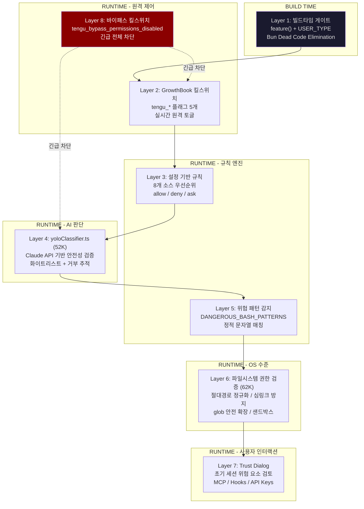
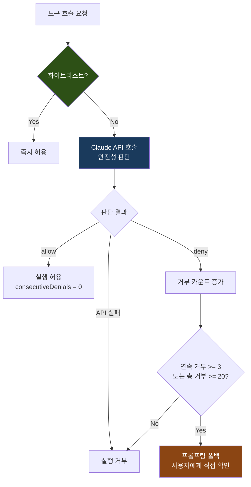
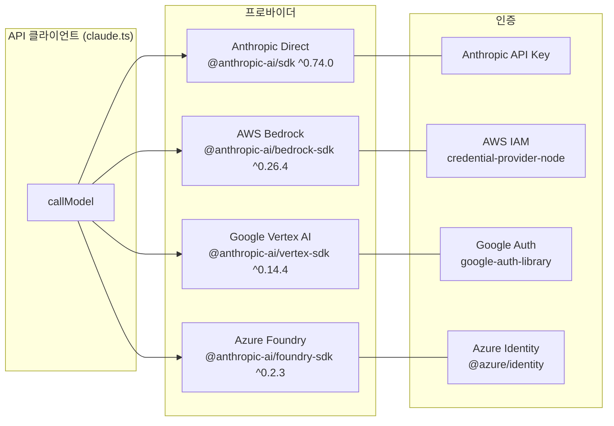
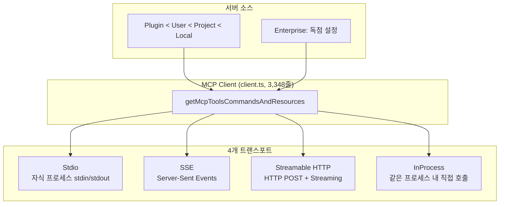
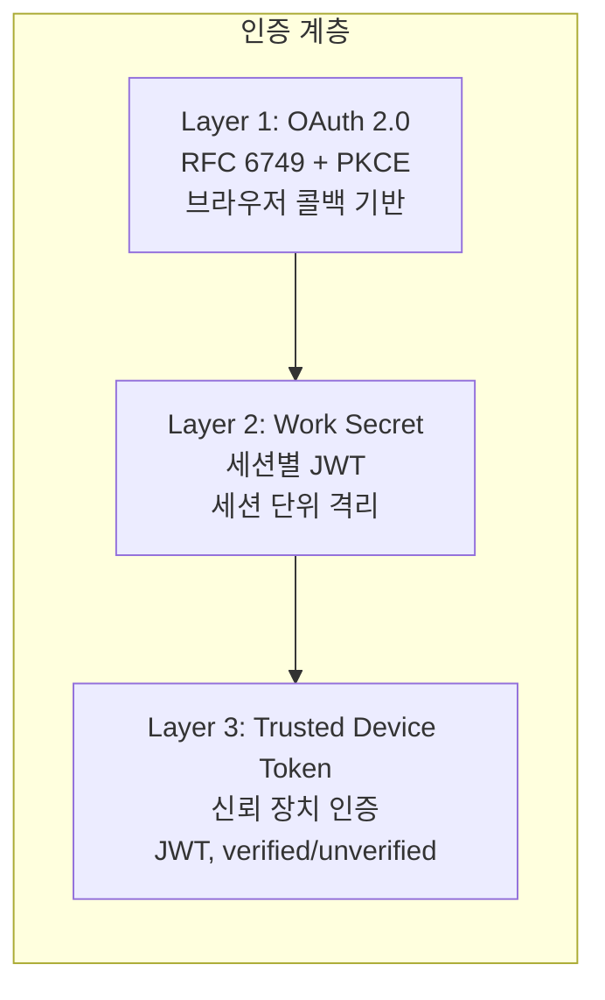
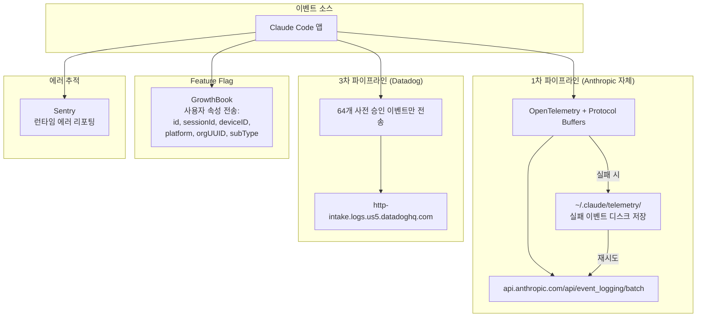
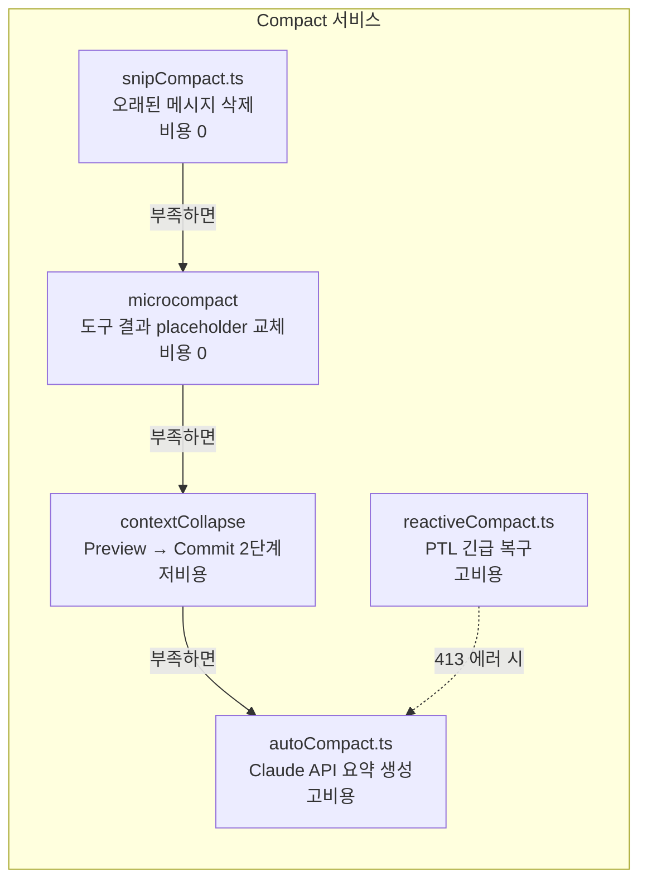
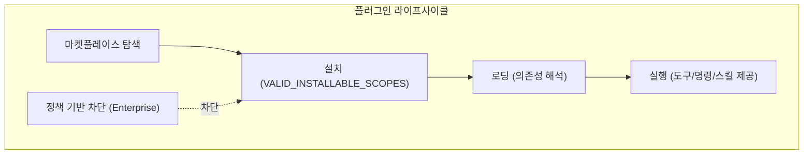
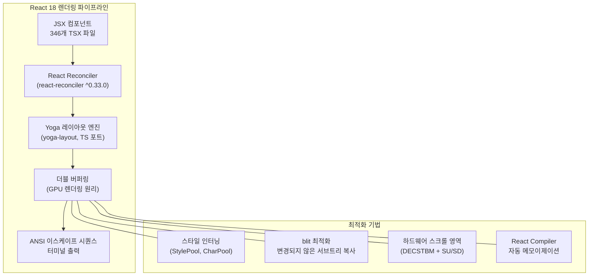
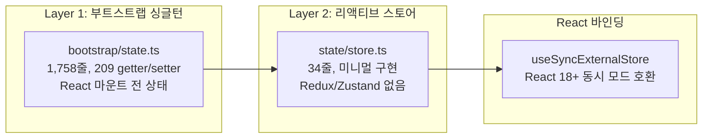

# Claude Code 심층 분석 B2: 보안, 서비스, UI 시스템

> Phase 1 블로그 아키텍처 + Phase 2 리포지토리 3종(alanisme, chatgptprojects, leafkit) 교차 분석
> 대상 버전: Claude Code v2.1.88 (1,902 TypeScript 파일, 512,664줄)

---

## 8. 보안 아키텍처

### 8.1 8계층 보안 모델 개요

Claude Code의 보안은 단일 메커니즘이 아닌 **8개 독립 계층의 중첩 방어(Defense in Depth)** 로 설계되어 있다. 빌드타임부터 런타임까지, 정적 분석부터 AI 판단까지, 각 계층이 독립적으로 위험을 필터링한다.



**설계 철학: Fail-Closed**

> "Claude Code does not try to make Bash perfectly safe. That would be unrealistic. Instead, it tries to make Bash analyzable enough, permissionable enough, sandboxable enough, monitorable enough, predictable enough." -- alanisme 리포트 14

모든 기본값이 안전한 방향으로 설정된다: `isConcurrencySafe` 기본값 `false`, 분류기 API 실패 시 거부, 파싱 불가 명령은 승인 요청.

---

### 8.2 Layer 1: 빌드타임 게이트

빌드 시점에 코드 자체를 제거하여, 배포된 바이너리에 민감한 기능이 물리적으로 존재하지 않도록 한다.

```typescript
// feature() + USER_TYPE 분기
// Bun 번들러가 Dead Code Elimination으로 false 브랜치를 완전 제거
function feature(flag: string): boolean {
  // 빌드 시점에 상수로 치환됨
  return FEATURE_FLAGS[flag] ?? false;
}

// 사용 예시
if (feature('voice_mode') && USER_TYPE === 'ant') {
  // 이 블록은 일반 사용자 빌드에서 완전히 제거됨
  registerVoiceModeTools();
}

// Bun 번들러 설정 (esbuild define)
// {
//   define: {
//     'USER_TYPE': JSON.stringify('external'),
//     'FEATURE_FLAGS.voice_mode': 'false',
//   }
// }
```

**빌드타임 게이트의 효과:**

| 항목 | 내부(ant) 빌드 | 외부(external) 빌드 |
|------|---------------|-------------------|
| Voice Mode | 포함 | **제거됨** |
| REPLTool | 포함 | **제거됨** |
| TungstenTool | 포함 | **제거됨** |
| SuggestBackgroundPRTool | 포함 | **제거됨** |
| Undercover Mode | 포함 | **제거됨** |
| 108개 피처 게이트 모듈 | 선택적 포함 | 대부분 제거 |

alanisme 리포트 03에서 발견된 Undercover Mode가 대표적인 빌드타임 게이트 사례이다:

> "There is NO force-OFF. This guards against model codename leaks" -- 외부 빌드에서는 데드코드로 완전 제거됨

---

### 8.3 Layer 2: GrowthBook 킬스위치

런타임에 GrowthBook 서비스에서 실시간으로 조회되는 원격 킬스위치. 사용자 알림 없이 기능을 즉시 비활성화할 수 있다.

**킬스위치 목록과 역할:**

| 킬스위치 플래그 | 대상 | 동작 |
|----------------|------|------|
| `tengu_amber_quartz_disabled` | Voice Mode | `true` = 음성 모드 전체 비활성화 |
| `tengu_bypass_permissions_disabled` | YOLO 모드 | `true` = 모든 바이패스 모드 즉시 차단 |
| `tengu_auto_mode_config` | Auto 모드 | 자동 모드 세부 설정 (enabled, 임계값 등) |
| `tengu_ccr_bridge` | Bridge | 원격 제어 브릿지 활성화 여부 |
| `tengu_sessions_elevated_auth_enforcement` | 인증 | 신뢰 장치 인증 강화 |

**tengu_* 플래그 명명 체계:**

```
tengu_ + 임의 단어 쌍 (형용사/재료 + 자연/사물)
```

의도적으로 기능을 추론할 수 없는 코드네임을 사용하는 운영 보안(OPSEC) 설계:

| 플래그 | 실제 기능 | 코드네임 유추 가능성 |
|--------|----------|-------------------|
| `tengu_onyx_plover` | Auto Dream (백그라운드 메모리 통합) | 불가 |
| `tengu_coral_fern` | Memdir 기능 | 불가 |
| `tengu_herring_clock` | Team 메모리 | 불가 |
| `tengu_frond_boric` | 분석 킬스위치 | 불가 |
| `tengu_penguins_off` | Fast 모드 비활성화 | 약간 유추 가능 |
| `tengu_amber_flint` | 에이전트 팀 | 불가 |
| `tengu_hive_evidence` | 검증 에이전트 | 불가 |
| `tengu_marble_sandcastle` | Fast 모드 관련 | 불가 |
| `tengu_harbor_ledger` | 채널 서버 허용 목록 | 불가 |

**원격 제어의 투명성 문제 (alanisme 리포트 04):**

> "There's no audit log, no notification system, no way for a user to know when their Claude Code instance has been remotely modified by a feature flag change."

| 제어 메커니즘 | 대상 | 사용자 알림 |
|-------------|------|-----------|
| 원격 관리 설정 | Enterprise/Team | 수락-또는-종료 대화상자 |
| GrowthBook 피처 플래그 | 전체 사용자 | **알림 없음** |
| 킬스위치 | 전체 사용자 | **알림 없음** |
| 모델 오버라이드 | 내부(ant) | **알림 없음** |
| Fast 모드 영구 비활성화 | 특정 사용자 | **알림 없음** |

---

### 8.4 Layer 3: 설정 기반 규칙

8개 설정 소스가 우선순위에 따라 병합되어 최종 권한 규칙을 결정한다.

**8개 소스 우선순위 (높은 순서):**

```
┌─────────────────────────────────────────────────────┐
│ 1. userSettings     ~/.claude/settings.json         │ ← 최고 우선순위
│ 2. projectSettings  .claude/settings.json           │
│ 3. localSettings    .claude/settings.local.json     │
│ 4. flagSettings     피처 플래그 설정                  │
│ 5. policySettings   조직 정책                        │
│ 6. cliArg           CLI 인자 (--allowedTools 등)     │
│ 7. command          명령어 기본값                     │
│ 8. session          세션 기본값                       │ ← 최저 우선순위
└─────────────────────────────────────────────────────┘
```

```typescript
// 설정 해석: 낮은 우선순위부터 적용 -> 높은 우선순위가 덮어씀
function resolveSettings(sources: Record<SettingSource, Settings>): Settings {
  const priority: SettingSource[] = [
    'userSettings', 'projectSettings', 'localSettings',
    'flagSettings', 'policySettings', 'cliArg', 'command', 'session'
  ];

  let resolved: Settings = {};
  for (const source of [...priority].reverse()) {
    resolved = { ...resolved, ...sources[source] };
  }
  return resolved;
}
```

**ruleBehavior 3가지 동작:**

| 동작 | 의미 | 사용 예 |
|------|------|---------|
| `allow` | 무조건 허용 | 읽기 전용 도구, 신뢰된 명령 |
| `deny` | 무조건 거부 | 위험 명령, 차단 도구 |
| `ask` | 사용자에게 확인 요청 | 불확실한 상황 (기본값) |

**권한 모드 전체 목록 (alanisme 리포트 08):**

| 모드 | 설명 | 대상 |
|------|------|------|
| `default` | 표준 대화형, 쓰기 작업마다 승인 요청 | 전체 |
| `plan` | 읽기 전용 계획 모드 | 전체 |
| `acceptEdits` | 파일 편집/특정 bash 명령 자동 승인 | 전체 |
| `bypassPermissions` | YOLO 모드, 모든 도구 자동 승인 | 전체 |
| `dontAsk` | 승인 필요 작업 자동 거부 (헤드리스 CI용) | 전체 |
| `auto` | AI 분류기 중재 모드 | **내부 전용** |
| `bubble` | 다중 에이전트 스웜 조정용 | **내부 전용** |

---

### 8.5 Layer 4: yoloClassifier.ts (52K)

자동 모드에서 도구 실행 전 Claude API를 호출하여 안전성을 검증하는 **AI 기반 보안 게이트**이다. 52KB 규모로, 보안 계층 중 가장 복잡한 로직을 포함한다.

**자동모드 검증 흐름:**



**화이트리스트 바이패스:**

읽기 전용 도구는 검증 없이 즉시 허용된다:

```typescript
private static readonly WHITELIST = new Set([
  'FileRead', 'Glob', 'Grep', 'WebSearch', 'WebFetch',
  'TodoRead', 'GitLog', 'GitDiff',
]);
```

**거부 추적 및 폴백 메커니즘:**

```typescript
// 연속 거부 3회 또는 총 거부 20회 -> 프롬프팅 폴백
// (자동 모드를 포기하고 사용자에게 직접 확인)
if (this.consecutiveDenials >= 3 || this.totalDenials >= 20) {
  return 'prompt'; // 사용자에게 직접 확인
}
```

| 임계값 | 값 | 의미 |
|--------|---|------|
| 연속 거부 한도 | 3회 | 모델이 반복 실패 패턴에 빠진 것으로 판단 |
| 총 거부 한도 | 20회 | 세션 전체에서 자동 모드의 신뢰도가 소진 |
| 폴백 동작 | `prompt` | 자동 모드 포기, 사용자 확인으로 전환 |

---

### 8.6 Layer 5: 위험 패턴 감지

정적 문자열 매칭으로 위험한 Bash 명령을 감지한다. AI 판단(Layer 4)과 독립적으로 동작하는 결정론적 보안 계층이다.

**DANGEROUS_BASH_PATTERNS 전체 배열:**

```typescript
const DANGEROUS_BASH_PATTERNS: string[] = [
  // 스크립트 인터프리터 실행
  'python',       // Python 스크립트
  'node',         // Node.js 스크립트
  'ruby',         // Ruby 스크립트

  // 네트워크 요청
  'curl',         // HTTP 요청 (데이터 유출 가능)
  'wget',         // 파일 다운로드

  // 권한 상승
  'sudo',         // 루트 권한 실행

  // 컨테이너/시스템 조작
  'docker',       // 컨테이너 생성/삭제/실행

  // 파괴적 파일 조작
  'rm -rf',       // 재귀적 강제 삭제

  // 권한/소유권 변경
  'chmod',        // 파일 권한 변경
  'chown',        // 파일 소유권 변경
];
```

**추가 Bash 보안 검사 (alanisme 리포트 08, 14):**

| 검사 카테고리 | 감지 대상 |
|-------------|----------|
| 명령 치환 감지 | `$()`, `${}`, 백틱 |
| Zsh 위험 명령 차단 | `zmodload`, `sysopen`, `ztcp`, `zf_*` 빌트인 |
| Heredoc 안전성 분석 | heredoc 내부 명령 주입 |
| 복합 명령 분리 | 최대 50개 서브커맨드로 분리 분석 |
| `sed -i` 인터셉트 | diff 미리보기 제공 후 시뮬레이션 경로로 실행 |
| tree-sitter AST 파싱 | 명령 구조를 AST로 분석하여 의미론적 보안 검사 |

**BashTool 보안 파이프라인 (8단계):**

```
명령 파싱/정규화 -> 위험 구문 패턴 감지 -> 복합 명령 세그먼트 분리
-> 서브커맨드 읽기전용/변형/알수없음 분류 -> 경로 및 파일시스템 영향 검증
-> 허용/거부 규칙 적용 -> 샌드박싱 적용 여부 결정 -> 불확실성 시 사용자 승인 요청
```

---

### 8.7 Layer 6: 파일시스템 권한 검증 (62K)

62KB 규모의 파일시스템 보안 모듈. 경로 정규화, 심링크 탈출 방지, glob 패턴 안전 확장을 담당한다.

```typescript
class FileSystemValidator {
  // 1. 절대 경로 정규화
  normalizePath(path: string): string {
    const normalized = resolve(path);
    // '..' 탈출 시도 감지, CWD 또는 허용 경로 내인지 확인
    if (!this.isWithinAllowedPaths(normalized)) {
      throw new SecurityError(`Path outside allowed directories: ${path}`);
    }
    return normalized;
  }

  // 2. 심링크 탈출 방지
  async resolveSymlink(path: string): Promise<string> {
    const real = await realpath(path);
    // 심링크 해석 후에도 허용 경로 내인지 재확인 (TOCTOU 방지)
    if (!this.isWithinAllowedPaths(real)) {
      throw new SecurityError(`Symlink escapes allowed directory: ${path} -> ${real}`);
    }
    return real;
  }

  // 3. glob 안전 확장
  safeGlob(pattern: string, cwd: string): string[] {
    const expanded = glob.sync(pattern, { cwd });
    return expanded.filter(p => this.isWithinAllowedPaths(resolve(cwd, p)));
  }
}
```

**추가 파일시스템 보안 기법:**

| 기법 | 설명 |
|------|------|
| TOCTOU 인식 | 셸 확장 구문, 틸다 변형, 심볼릭 링크 순회 처리 |
| macOS/Windows 대소문자 정규화 | 대소문자 무시 파일시스템에서의 우회 방지 |
| 맨 git 리포지토리 공격 방지 | `is_git_directory()` + `core.fsmonitor` 메커니즘 처리 |
| 설정 파일 자체 보호 | `.claude/settings.json` 및 `.claude/skills` 쓰기 무조건 거부 |
| CWD 전용 모드 | `cwd_only` 모드에서 현재 디렉토리 밖 접근 차단 |
| 샌드박싱 | macOS seatbelt, Linux bubblewrap 기반 OS 수준 격리 |

**SSRF 가드 (alanisme 리포트 08):**

> "Blocks private, link-local, and non-routable address ranges... Notably, loopback is explicitly allowed because local dev servers are a primary HTTP hook use case."

DNS rebinding 공격 방지를 위해 `dns.lookup` 콜백에서 주소 범위를 검증한다.

---

### 8.8 Layer 7: Trust Dialog

초기 세션 시작 시 잠재적 위험 요소를 사용자에게 검토하도록 한다.

```typescript
async function showTrustDialog(context: SessionContext): Promise<TrustDecision> {
  const risks: TrustRisk[] = [];

  if (context.mcpServers.length > 0)   risks.push({ type: 'mcp', servers: context.mcpServers });
  if (context.hooks.length > 0)        risks.push({ type: 'hooks', hooks: context.hooks });
  if (context.bashEnabled)             risks.push({ type: 'bash' });
  if (context.apiKeys.length > 0)      risks.push({ type: 'api_keys', keys: context.apiKeys });

  return promptUser(risks);  // 사용자에게 검토 요청
}
```

검토 대상: MCP 서버 연결, 사용자 정의 Hooks, Bash 도구 접근, API 키 노출 여부.

---

### 8.9 Layer 8: 바이패스 킬스위치

모든 바이패스 모드를 원격으로 즉시 차단하는 **최종 안전장치**이다.

```typescript
function checkBypassKillswitch(): boolean {
  // tengu_bypass_permissions_disabled가 true이면
  // YOLO 모드를 포함한 모든 바이패스가 즉시 비활성화됨
  return growthbook.getFeatureValue('tengu_bypass_permissions_disabled', false);
}
```

Layer 2(GrowthBook)와 결합하여, Anthropic이 전 세계 모든 Claude Code 인스턴스의 YOLO 모드를 실시간으로 차단할 수 있다.

---

### 8.10 보안 모델 평가

#### 강점 7가지 (alanisme 리포트 기반)

| # | 강점 | 상세 |
|---|------|------|
| 1 | **계층적 방어** | 단일 레이어에 의존하지 않음. Bash 명령 하나가 보안 검사 -> 읽기전용 검증 -> 모드 기반 확인 -> 경로 검증 -> 권한 규칙 -> 분류기 -> 샌드박스를 모두 통과해야 함 |
| 2 | **Fail-Closed 철학** | 분류기 API 실패 시 거부, 파싱 불가 명령은 승인 요청, 모호한 상황은 프롬프트 |
| 3 | **TOCTOU 인식** | 셸 확장 구문, 틸다 변형, 심볼릭 링크 순회, macOS/Windows 대소문자 정규화 처리 |
| 4 | **Zsh 공격 표면 커버리지** | `zmodload`, `sysopen`, `ztcp`, `zf_*` 빌트인 등 차단 |
| 5 | **맨 git 리포지토리 공격 방지** | `is_git_directory()` + `core.fsmonitor` 메커니즘 처리 |
| 6 | **설정 파일 자체 보호** | 샌드박스가 자체 설정 파일과 `.claude/skills` 쓰기를 무조건 거부 |
| 7 | **SSRF 가드** | DNS rebinding 공격 방지를 위한 `dns.lookup` 콜백 검증 |

#### 우려사항 5가지 (alanisme 리포트 기반)

| # | 우려 | 상세 |
|---|------|------|
| 1 | **복잡성 자체가 공격 표면** | `bashSecurity.ts`만 23개 이상의 보안 검사 카테고리 처리. 복잡성이 높을수록 취약점 발견이 어려움 |
| 2 | **분류기가 보안 경계** | AI 모델이 보안 결정을 내리는 확률적 시스템. 결정론적 보안과 달리 재현성이 없음 |
| 3 | **외부 빌드 스텁** | 외부 사용자는 분류기(Layer 4) 보호 없이 정적 규칙 + 샌드박스에만 의존 |
| 4 | **excludedCommands는 보안 경계 아님** | 사용자 편의 기능으로만 문서화되어 있으나, 사용자가 보안 기능으로 오해할 수 있음 |
| 5 | **프리승인 도메인에 업로드 가능 사이트 포함** | nuget.org 등 파일 업로드가 가능한 도메인이 사전 승인 목록에 포함 |

**다른 에이전트 시스템과의 비교:**

| 비교 대상 | Claude Code의 차별점 |
|----------|---------------------|
| Cursor / Windsurf | Claude Code는 OS 수준 샌드박싱(macOS seatbelt, Linux bubblewrap) 제공. 대부분의 IDE 기반 에이전트는 미제공 |
| Devin | Claude Code의 권한 규칙이 더 세분화 (도구 수준, 접두사 기반, 와일드카드) |
| OpenAI Codex CLI | Claude Code의 bash 보안 분석(tree-sitter AST 파싱, 23개 카테고리)이 훨씬 더 철저 |

---

## 9. 서비스 계층

### 9.1 API 클라이언트

#### claude.ts (125KB / 3,419줄)

API 통신의 핵심 모듈. `callModel()` 함수로 스트리밍 응답을 처리하며, 모델 폴백과 재시도 로직을 포함한다.

**4개 프로바이더 아키텍처:**



| 프로바이더 | SDK 패키지 | 인증 방식 | 모델 가격 (입력/출력) |
|-----------|-----------|----------|---------------------|
| Anthropic Direct | `@anthropic-ai/sdk` | API Key | Sonnet $3/$15, Opus 4.5/4.6 $5/$25 |
| AWS Bedrock | `@anthropic-ai/bedrock-sdk` | IAM | Bedrock 가격 정책 |
| Google Vertex AI | `@anthropic-ai/vertex-sdk` | Google Auth | Vertex 가격 정책 |
| Azure Foundry | `@anthropic-ai/foundry-sdk` | Azure Identity | Foundry 가격 정책 |

#### withRetry.ts 재시도 로직

```typescript
// FallbackTriggeredError 발생 시 fallbackModel로 전환
// 재시도 가능한 API 에러 분류: categorizeRetryableAPIError()
// - 429 (Rate Limit) -> 지수 백오프 재시도
// - 413 (Prompt Too Long) -> 압축 후 재시도
// - 500+ (서버 에러) -> 단순 재시도
// - 기타 -> 즉시 실패
```

**비용 추적 7차원 (alanisme 리포트 20):**

입력 토큰, 출력 토큰, 캐시 읽기 토큰, 캐시 생성 토큰, 웹검색 요청, USD 비용, 컨텍스트 윈도우 크기. advisor 사용량은 재귀적으로 추적된다.

---

### 9.2 MCP 통합

#### client.ts (3,348줄)

Model Context Protocol 서버와의 연결을 관리하는 핵심 모듈.

**4개 트랜스포트 구현:**



| 트랜스포트 | 프로토콜 | 사용 시나리오 |
|-----------|---------|-------------|
| **Stdio** | 자식 프로세스 stdin/stdout | 로컬 MCP 서버 (가장 일반적) |
| **SSE** | HTTP Server-Sent Events | 원격 MCP 서버 (레거시) |
| **Streamable HTTP** | HTTP POST + 스트리밍 | 원격 MCP 서버 (최신) |
| **InProcess** | 직접 함수 호출 | 내장 MCP 서버 |

**연결 관리:**

| 항목 | 값 |
|------|---|
| 자동 재연결 | 지수 백오프 (최초 1초, 최대 30초, 5회 시도) |
| 도구 호출 타임아웃 | ~27.8시간 (기본값) |
| 설정 소스 우선순위 | Plugin < User < Project < Local |
| 네임스페이스 | `mcp__serverName__toolName` (내장 도구 위장 방지) |

**인증과 레지스트리:**

- **OAuth 통합**: RFC 6749 인증 코드 플로우 + PKCE
- **macOS Keychain**: 토큰 보안 저장
- **XAA (Cross-App Access)**: 엔터프라이즈 SSO 지원
- **공식 레지스트리**: `officialRegistry.ts`에서 공식 MCP URL 프리페치

---

### 9.3 OAuth/인증

3계층 인증 아키텍처 (alanisme 리포트 17):



| 인증 티어 | 방식 | 용도 |
|----------|------|------|
| Standard | OAuth 2.0 + PKCE | 기본 인증, 대부분의 작업 |
| Elevated | OAuth + JWT Device Token | Bridge 원격 제어, 민감한 작업 |

---

### 9.4 Analytics

**이중 분석 파이프라인 (alanisme 리포트 01):**



**수집 데이터 범위:**

| 카테고리 | 세부 항목 |
|---------|---------|
| 환경 핑거프린트 | OS, 아키텍처, Node 버전, 터미널 타입, 패키지 매니저, CI/CD, WSL, 리눅스 배포판 |
| 프로세스 메트릭 | uptime, RSS, heapTotal, heapUsed, CPU 사용량 |
| 사용자/세션 추적 | 모델명, 세션 ID, 사용자 ID, 기기 ID, 계정 UUID, 조직 UUID, 구독 티어 |
| 리포지토리 핑거프린팅 | git remote URL의 SHA256 해시 처음 16자 |
| 도구 입력 | 기본 512자 잘림, JSON 4096자, 배열 20개, 중첩 2레벨 |
| 파일 확장자 | bash 명령에서 사용된 파일 확장자 추출 |

**배치 설정:**

| 설정 | 값 |
|------|---|
| 배치 크기 | 200개 이벤트 |
| 플러시 간격 | 10초 |
| 실패 시 처리 | `~/.claude/telemetry/`에 디스크 저장 후 재시도 |
| Tengu 분석 이벤트 수 | 250개 이상 |
| 옵트아웃 | **직접 API 사용자는 1차 텔레메트리 비활성화 불가** |

---

### 9.5 Compact 서비스

3가지 압축 전략을 상황에 따라 선택적으로 적용한다.

**auto / reactive / snip 3전략 비교:**

| 전략 | 트리거 | API 비용 | 정보 손실 | 파일 |
|------|--------|---------|----------|------|
| **Snip** | 항상 (턴 시작) | 무료 | 높음 (오래된 메시지 삭제) | `snipCompact.ts` |
| **Auto** | 토큰 임계값 초과 (~167K/200K) | 높음 (Claude API 1회) | 낮음 (요약 생성) | `autoCompact.ts` |
| **Reactive** | PTL 413 에러 발생 시 | 높음 (긴급 Claude API) | 중간 (긴급 요약) | `reactiveCompact.ts` |



**서킷브레이커 (alanisme 리포트 11):**

> "Before the circuit breaker, some sessions were hammering the API with over 3,000 doomed compaction attempts. At scale, that was a quarter million wasted API calls per day."

최대 3회 연속 Auto-Compact 실패 시 서킷이 열리며, 더 이상 API 호출을 시도하지 않는다.

---

### 9.6 플러그인 서비스



**플러그인 제공 기능:**

| 기능 유형 | 설명 |
|----------|------|
| 도구 (Tools) | 커스텀 도구 등록 |
| 명령 (Commands) | 슬래시 명령 추가 |
| 스킬 (Skills) | 프롬프트 기반 스킬 |
| MCP 서버 | 외부 MCP 서버 연결 |

**AppState의 plugins 상태:**

```typescript
plugins: {
  enabled: LoadedPlugin[]      // 활성화된 플러그인
  disabled: LoadedPlugin[]     // 비활성화된 플러그인
  commands: Command[]          // 플러그인 제공 명령
  errors: PluginError[]        // 로딩 에러
  installationStatus: { marketplaces: [...]; plugins: [...] }
  needsRefresh: boolean
}
```

---

## 10. UI 시스템

### 10.1 React 18 + Ink 터미널 렌더링

Claude Code의 UI는 **React 18 + 커스텀 Ink 포크**로 구현된 터미널 렌더링 엔진이다. 브라우저가 아닌 터미널에서 React Reconciler와 Yoga 레이아웃 엔진을 사용하여 JSX를 ANSI 이스케이프 시퀀스로 렌더링한다.



**핵심 기술 상세 (alanisme 리포트 18):**

| 기술 | 설명 |
|------|------|
| 더블 버퍼링 | GPU 렌더링과 동일 원리. 프레임 전환 시 깜빡임 방지 |
| 스타일 인터닝 | StylePool, CharPool로 동일 스타일 객체 재사용 |
| blit 최적화 | 변경되지 않은 서브트리는 이전 프레임에서 직접 복사 |
| 하드웨어 스크롤 영역 | DECSTBM + SU/SD 터미널 이스케이프로 하드웨어 가속 스크롤 |
| React Compiler | 자동 메모이제이션으로 불필요한 리렌더링 제거 |
| 목표 프레임 레이트 | 60fps (16ms 프레임 간격) |

**브라우저 DOM 이벤트 모델 포팅:**

| DOM 기능 | Ink 구현 |
|----------|---------|
| 캡처/버블 2단계 | 이벤트 전파 순서 그대로 구현 |
| 마우스 히트 테스팅 | 터미널 좌표 기반 클릭 영역 계산 |
| 포커스 매니저 | 탭 순환, 자동 포커스 |

---

### 10.2 컴포넌트 계층

총 **389개 컴포넌트 파일**(전체 코드의 20.5%)이 카테고리별로 분류되어 있다.

**카테고리별 분류:**

| 카테고리 | 파일 수 | 주요 컴포넌트 | 최대 크기 |
|----------|---------|-------------|----------|
| **메시지 시스템** | 36 | AssistantTextMessage, AssistantToolUseMessage, UserToolResultMessage | ~79KB (SystemTextMessage) |
| **권한 다이얼로그** | 32 | PermissionRequest, BashPermissionRequest, FilePermissionDialog | ~33KB (PermissionRequest) |
| **디자인 시스템** | 18 | Dialog, FuzzyPicker, Tabs, ThemedBox/Text, ThemeProvider | ~41KB (Tabs) |
| **에이전트 UI** | 16 | AgentProgressLine, AgentView, AgentOutput | - |
| **MCP UI** | 15 | MCPServerUI, MCPToolList, MCPResourceView | - |
| **레이아웃** | ~20 | FullscreenLayout, ScrollBox, StatusLine, Footer | - |
| **입력** | ~15 | PromptInput, BaseTextInput, QuickOpenDialog | - |
| **기타** | ~237 | Attachment, Notification, DiffDialog, Export 등 | ~76KB (ContextVisualization) |

**렌더링 계층 구조:**

```
REPL.tsx (메인 화면, 4,500줄)
├── FullscreenLayout
│   ├── ScrollBox (스크롤 가능 영역)
│   │   ├── Message 컴포넌트들
│   │   │   ├── AssistantTextMessage
│   │   │   ├── AssistantToolUseMessage (~45KB)
│   │   │   ├── UserToolResultMessage
│   │   │   └── SystemTextMessage (~79KB)
│   │   └── AgentProgressLine
│   ├── PromptInput (하단 고정 입력)
│   │   ├── BaseTextInput
│   │   ├── Footer
│   │   └── Notifications
│   └── StatusLine (상태바)
├── 모달 다이얼로그
│   ├── PermissionRequest (~33KB)
│   ├── QuickOpenDialog
│   └── DiffDialog
└── 특수 뷰
    ├── ContextVisualization (~76KB)
    └── AttachmentMessage (~71KB)
```

---

### 10.3 상태관리

**이중 레이어 구조 (alanisme 리포트 12):**



**AppState (100+ 필드) + useSyncExternalStore 패턴:**

```typescript
// store.ts - 34줄의 미니멀 외부 스토어
export type Store<T> = {
  getState: () => T
  setState: (updater: (prev: T) => T) => void
  subscribe: (listener: () => void) => () => void
}

// AppState.tsx - React 바인딩
export function useAppState<T>(selector: (state: AppState) => T): T {
  const store = useAppStore()
  const get = () => selector(store.getState())
  return useSyncExternalStore(store.subscribe, get, get)
}
```

**AppState 주요 필드 그룹:**

| 그룹 | 필드 수 | 주요 필드 |
|------|---------|----------|
| 설정 | ~10 | `settings`, `verbose`, `mainLoopModel`, `agent` |
| 원격/브릿지 | 15+ | `remoteSessionUrl`, `remoteConnectionStatus`, `replBridgeEnabled` |
| UI 상태 | ~10 | `expandedView`, `isBriefOnly`, `footerSelection`, `statusLineText` |
| MCP | ~5 | `mcp.clients`, `mcp.tools`, `mcp.commands`, `mcp.resources` |
| 플러그인 | ~6 | `plugins.enabled`, `plugins.disabled`, `plugins.errors` |
| 태스크 | ~3 | `tasks`, `todos`, `agentNameRegistry` |
| 알림/입력 | ~4 | `notifications`, `elicitation`, `thinkingEnabled` |
| 기타 | 40+ | `fileHistory`, `attribution`, `speculation`, `sessionHooks` 등 |

**DeepImmutable 타입으로 불변성 강제:**

```typescript
export type AppState = DeepImmutable<{
  settings: SettingsJson
  verbose: boolean
  mainLoopModel: ModelSetting
  // ... 대부분의 필드
}> & {
  // Mutable 필드 (Map, 복잡한 객체 등은 DeepImmutable 제외)
  tasks: { [taskId: string]: TaskState }
  agentNameRegistry: Map<string, AgentId>
  mcp: { clients: MCPServerConnection[]; tools: Tool[]; /* ... */ }
}
```

**핵심 설계 특성:**

| 특성 | 설명 |
|------|------|
| Redux/Zustand 없음 | 34줄의 자체 구현으로 외부 의존성 제거 |
| `Object.is` 체크 | 셀렉터 반환값이 참조 동일하면 리렌더링 스킵 |
| `onChangeAppState` 콜백 | 상태 변경 사이드이펙트 처리 (비React 코드와 연동) |
| 동시 모드 호환 | `useSyncExternalStore`로 React 18 Concurrent Mode 안전 |

---

### 10.4 터미널 테마

6개 내장 테마를 `/theme` 슬래시 명령으로 전환할 수 있다.

| 테마 | 설명 | 시각적 특성 |
|------|------|-----------|
| **Default** | 기본 테마 | 시스템 터미널 색상 활용 |
| **Dark** | 어두운 배경 | 고대비 밝은 텍스트 |
| **Light** | 밝은 배경 | 어두운 텍스트 |
| **Solarized Dark** | Solarized 다크 변형 | 따뜻한 톤의 다크 |
| **Solarized Light** | Solarized 라이트 변형 | 차분한 라이트 |
| **Monokai** | Monokai 색상 팔레트 | 개발자 친화적 고채도 |

**테마 시스템 구현:**

```
components/
├── design/ThemedBox.tsx     -- 테마 인식 박스 컴포넌트
├── design/ThemedText.tsx    -- 테마 인식 텍스트 컴포넌트
├── design/ThemeProvider.tsx -- 테마 컨텍스트 제공자
└── design/themes/           -- 테마 정의 파일들
```

테마는 `ThemeProvider`를 통해 React Context로 전파되며, `ThemedBox`와 `ThemedText` 컴포넌트가 현재 테마에 따라 색상을 자동 적용한다. chalk 라이브러리의 ANSI 256색 + TrueColor 지원을 활용한다.

---

## 부록: 서비스 계층 전체 맵

| 서비스 | 파일 | 핵심 역할 |
|--------|------|----------|
| **api/** | claude.ts, withRetry.ts, errors.ts, bootstrap.ts 등 | Claude API 통신, 4개 프로바이더, 재시도 |
| **mcp/** | client.ts (3,348줄), types.ts, officialRegistry.ts 등 | MCP 서버 연결, 4개 트랜스포트 |
| **oauth/** | OAuth 2.0 + PKCE | 인증 플로우 |
| **analytics/** | index.ts, growthbook.ts, sink.ts | 텔레메트리, 피처 플래그 |
| **compact/** | autoCompact.ts, snipCompact.ts, reactiveCompact.ts | 컨텍스트 압축 |
| **tools/** | StreamingToolExecutor, toolOrchestration | 도구 병렬/직렬 실행 엔진 |
| **lsp/** | LSP 클라이언트 | 코드 인텔리전스 |
| **plugins/** | 플러그인 CLI 명령 | 마켓플레이스, 설치, 차단 |
| **policyLimits/** | 레이트 리밋 | 정책 제한 로드/갱신 |
| **remoteManagedSettings/** | 원격 관리 | 엔터프라이즈 원격 설정 |
| **settingsSync/** | 동기화 | 설정 클라우드 동기화 |
| **teamMemorySync/** | 팀 메모리 | 팀 간 메모리 공유 |
| **SessionMemory/** | 세션 메모리 | 포크 에이전트가 백그라운드 메모리 업데이트 |
| **extractMemories/** | 메모리 추출 | 대화 종료 시 지속 메모리 추출 |
| **autoDream/** | Auto Dream | 백그라운드 메모리 통합 |
| **contextCollapse/** | 컨텍스트 축소 | Preview -> Commit 2단계 |
| **tips/** | 팁 레지스트리 | 사용자 팁 표시 |
| **PromptSuggestion/** | 프롬프트 제안 | 입력 자동완성 제안 |
| **MagicDocs/** | 문서 자동 생성 | - |
| **AgentSummary/** | 에이전트 요약 | - |
| **toolUseSummary/** | 도구 사용 요약 | Haiku 모델로 요약 생성 |
| **skillSearch/** | 스킬 검색 | 로컬 인덱스, 프리페치 |
