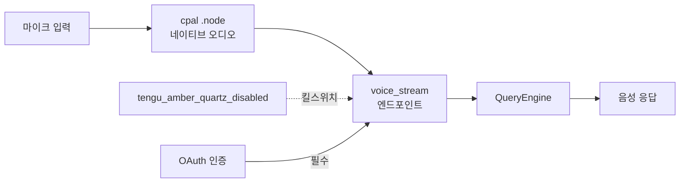
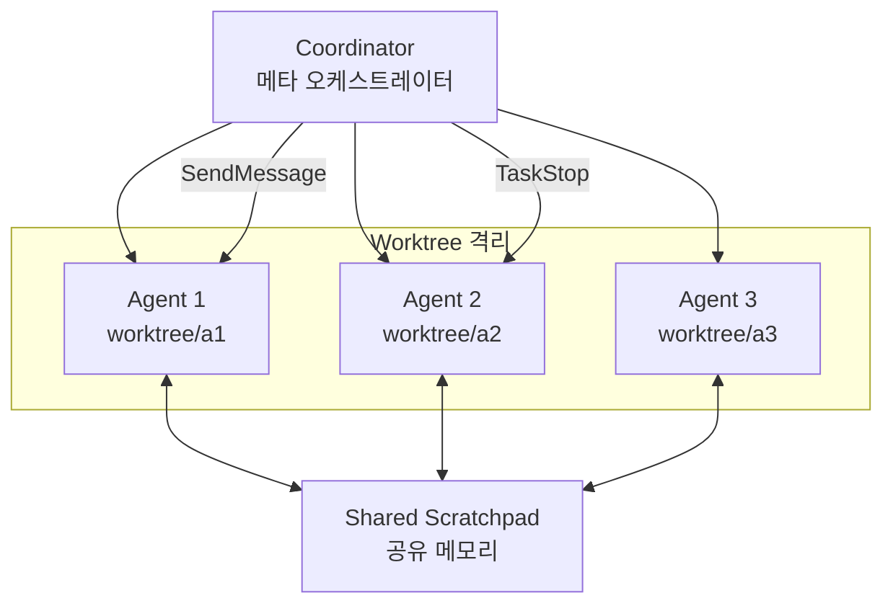
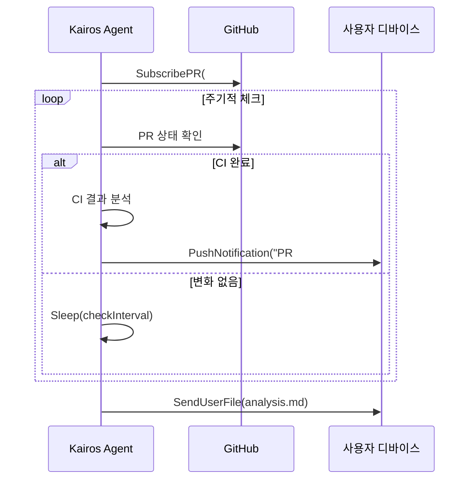
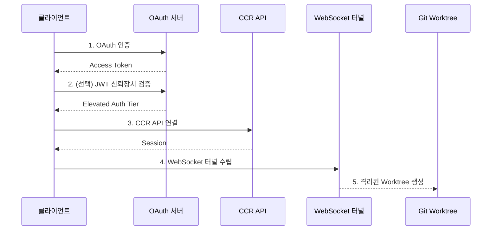
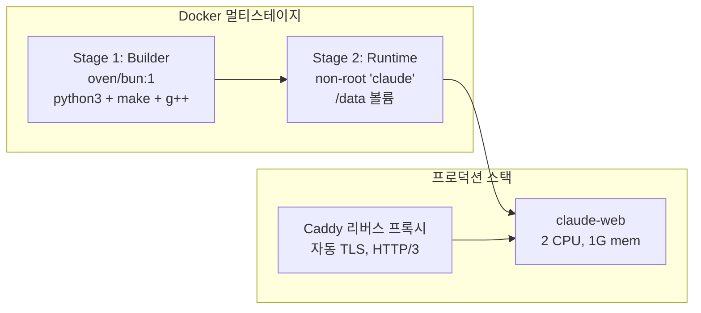
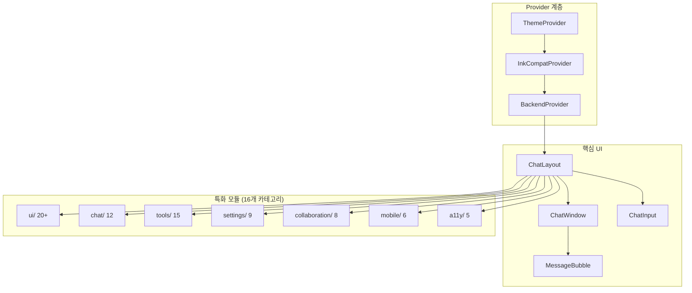
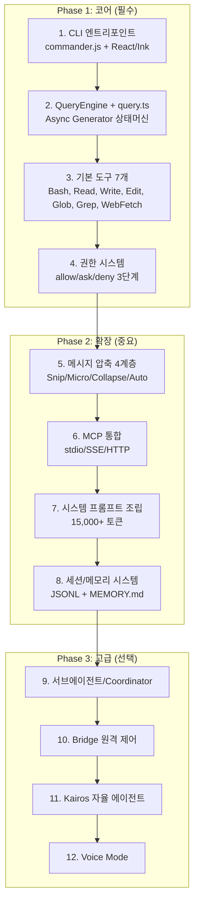
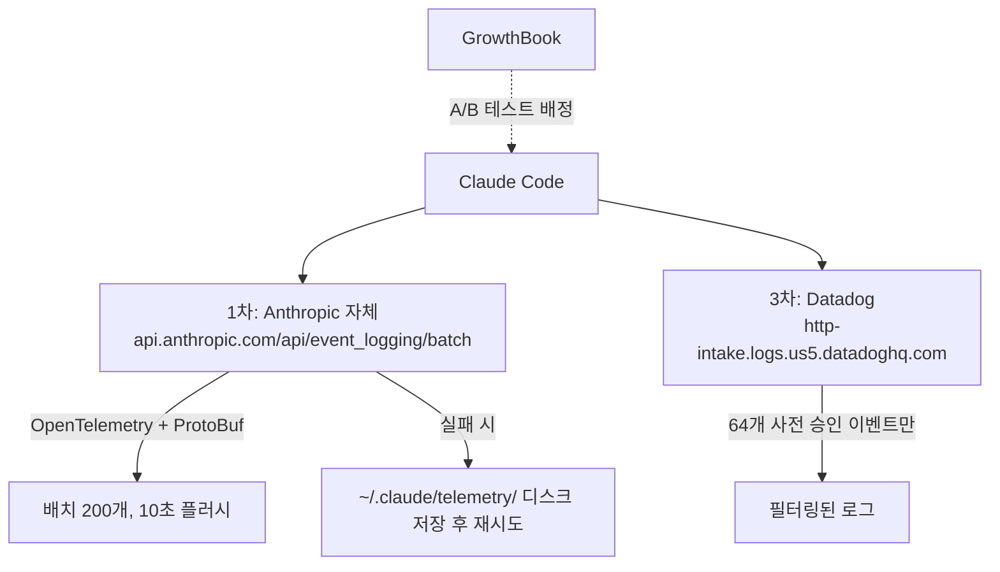

# Claude Code 아키텍처 심층 분석 (Part C)

> Phase 1 블로그 분석 + Phase 2 리포지토리 6개 교차 분석 종합
> 섹션 11~15 + 부록 A~D

---

## 11. 미공개 기능

### 11.1 Voice Mode

OAuth 전용 인증을 요구하며, `voice_stream` 엔드포인트를 사용하는 음성 입출력 기능이다. GrowthBook 킬스위치 `tengu_amber_quartz_disabled`로 원격 비활성화가 가능하다.

```typescript
// Voice Mode 활성화 조건
function canEnableVoiceMode(context: ToolUseContext): boolean {
  return (
    feature('VOICE_MODE') &&
    context.authType === 'oauth' &&    // API 키 불가, OAuth 전용
    !growthbook.getFeatureValue('tengu_amber_quartz_disabled', false)
  );
}
```

네이티브 오디오 캡처는 Rust NAPI 기반 `audio-capture` 모듈로 구현되며, 6개 플랫폼(darwin/linux/win32 x x64/arm64)용 `.node` 바이너리가 존재한다. 원본 소스에서 `voice/` 디렉토리는 54줄의 피처 게이트로, `VOICE_MODE` 플래그 뒤에서 완전히 제어된다.



### 11.2 WebBrowserTool (코드네임: Bagel)

실제 브라우저 자동화 도구로, Bun WebView API를 사용하여 페이지 탐색, 클릭, 타이핑, 스크린샷, 콘텐츠 추출이 가능하다.

```typescript
class WebBrowserTool implements Tool {
  name = 'WebBrowser';

  async execute(params: {
    url: string;
    action: 'navigate' | 'click' | 'type' | 'screenshot' | 'extract';
    selector?: string;
    text?: string;
  }): Promise<BrowserResult> {
    const page = await this.getOrCreatePage();
    switch (params.action) {
      case 'navigate': await page.goto(params.url); break;
      case 'click':    await page.click(params.selector!); break;
      case 'type':     await page.type(params.selector!, params.text!); break;
      case 'screenshot': return { screenshot: await page.screenshot() };
      case 'extract':    return { content: await page.evaluate('document.body.innerText') };
    }
    return { success: true };
  }
}
```

alanisme 분석에 따르면, 내부 코드네임 "bagel"로 참조되며 피처 플래그 뒤에서 게이팅되어 있다.

### 11.3 Coordinator Mode (19K)

메타 오케스트레이터로, 여러 서브에이전트를 동시에 관리하며 각 에이전트를 독립된 Git Worktree에서 격리 실행한다.

```typescript
// Coordinator가 허용하는 도구는 4개뿐
const COORDINATOR_MODE_ALLOWED_TOOLS = [
  'AgentTool',        // 서브에이전트 생성/관리
  'TaskStop',         // 작업 중단
  'SendMessage',      // 에이전트 간 메시지 전송
  'SyntheticOutput',  // 합성 출력 생성
];

interface CoordinatorState {
  agents: Map<string, AgentInstance>;
  sharedScratchpad: SharedMemory;     // 에이전트 간 공유 메모리
  gitWorktrees: Map<string, string>;  // 에이전트별 독립 Worktree
}
```



leaf-kit 분석에 따르면 `coordinator/` 디렉토리는 369줄의 멀티워커 오케스트레이션 모듈이며, alanisme 분석에서는 서브에이전트가 부모와 동일한 `query()` 함수를 사용하되 격리된 도구 풀과 MCP 서버를 가진다고 밝히고 있다.

### 11.4 Kairos (프로액티브 에이전트)

사용자 요청 없이 자발적으로 작업하는 자율 에이전트 모드이다. 터미널 포커스를 감지하여 사용자 부재 시 더 독립적으로 행동한다.

```typescript
// Kairos 전용 도구 세트
const KAIROS_TOOLS = {
  SendUserFile:      '사용자에게 파일을 능동적으로 전송',
  PushNotification:  '모바일/데스크톱 푸시 알림',
  SubscribePR:       'GitHub PR 이벤트 구독 (리뷰, CI 결과)',
  Sleep:             '주기적 깨어남을 위한 슬립',
  Brief:             '상황 요약 브리핑',
};
```

alanisme 리포트 05에서 발견된 Kairos 시스템 프롬프트:

> "You are running autonomously. You will receive `<tick>` prompts that keep you alive between turns. If you have nothing useful to do, call SleepTool. Bias toward action."



### 11.5 Bridge (33+ 파일)

OAuth에서 CCR(Claude Code Remote) API를 거쳐 WebSocket 터널로 연결되는 원격 제어 인프라이다.



**3계층 인증 티어:**

| 티어 | 인증 방식 | 권한 범위 |
|------|-----------|-----------|
| Standard | OAuth 2.0 | 기본 원격 제어 |
| Elevated | OAuth + JWT Device Token | 확장된 권한 (민감한 작업) |
| Work Secret | 세션별 JWT | 세션 격리 보장 |

**멀티세션 관리:**
- 3가지 스폰 모드: `single-session`, `same-dir`, `worktree`
- 최대 32개 동시 세션
- 수면 감지: 틱 간격이 2배 초과 시 에러 예산 리셋
- 30초 대기 후 SIGKILL 에스컬레이션

### 11.6 Agent Triggers/Monitoring

```typescript
// Cron 기반 트리거 -- 3개 도구
class ScheduleCronTool  { /* cron 표현식으로 작업 예약 */ }
class CronDeleteTool    { /* 예약된 작업 삭제 */ }
class CronListTool      { /* 예약된 작업 목록 */ }

// 원격 트리거
class RemoteTriggerTool { /* 외부 이벤트(웹훅)로 에이전트 실행 트리거 */ }

// 모니터링
class MonitorTool       { /* 시스템/프로세스 상태 모니터링 */ }
```

| 도구 | 피처 플래그 | 상태 |
|------|-----------|------|
| ScheduleCron | `AGENT_TRIGGERS` | 구현 완료, 게이트 |
| RemoteTrigger | `AGENT_TRIGGERS_REMOTE` | 구현 완료, 게이트 |
| Monitor | `MONITOR_TOOL` | 구현 완료, 게이트 |

### 11.7 Buddy System (가상 펫)

사용자 ID 해시 기반으로 결정론적으로 생성되는 컴패니언 캐릭터 시스템이다. leaf-kit 분석에 따르면 `buddy/` 모듈은 1,298줄이다.

| 속성 | 값 |
|------|-----|
| 종족 수 | 18종 |
| 희귀도 단계 | 5단계 |
| 모자 종류 | 7종 |
| 스탯 | DEBUGGING, PATIENCE, CHAOS, WISDOM, SNARK |
| 생성 방식 | 사용자 ID SHA256 해시 기반 결정론적 |

### 11.8 UDS Inbox (멀티디바이스 메시징)

Unix Domain Socket 기반의 에이전트 간 통신 시스템이다.

```typescript
interface UDSInbox {
  schemes: ['bridge://', 'other://'];
  send(to: DeviceId, message: InboxMessage): Promise<void>;
  subscribe(callback: (msg: InboxMessage) => void): Unsubscribe;
}

// ListPeersTool -- UDS로 피어 에이전트 발견
class ListPeersTool implements Tool {
  name = 'ListPeers';
  featureFlag = 'UDS_INBOX';
}
```

### 11.9 Workflow Scripts

번들 자동화 스크립트로, 서브에이전트 재귀 실행을 차단하여 무한 루프를 방지한다.

```typescript
interface WorkflowScript {
  name: string;
  steps: WorkflowStep[];
  maxRecursionDepth: 0;  // 재귀 차단
}
```

### 11.10 Undercover Mode (alanisme 기반)

Anthropic 직원(`USER_TYPE === 'ant'`)이 외부 리포지토리에서 작업할 때 자동 활성화되는 스텔스 모드이다.

**핵심 지시문:**

> "Do not blow your cover."
> "Write commit messages as a human developer would -- describe only what the code change does."

**특징:**
- 강제 해제 불가 ("There is NO force-OFF. This guards against model codename leaks")
- Co-Authored-By 라인 자동 제거
- AI 생성 마커 제거
- 모델명 마스킹: `capybara-v2-fast` -> `cap*****-v2-fast`
- 외부 빌드에서는 데드코드 제거(DCE)로 완전히 삭제됨

---

## 12. 코드네임과 피처 플래그

### 12.1 모델 코드네임 체계

| 코드네임 | 실체 | 비고 |
|---------|------|------|
| **Tengu** (천구) | 제품/텔레메트리 접두사 | 250+ 분석 이벤트, 모든 GrowthBook 플래그에 `tengu_` 접두사 |
| **Capybara** (카피바라) | Sonnet 계열 (현재 v8) | `capybara-v2-fast[1m]`, 허위 주장율 29-30% |
| **Fennec** (페넥여우) | Opus 4.6 전신 | `fennec-latest` -> `opus` 마이그레이션 |
| **Numbat** (넘벳) | 차기 모델 | "Remove this section when we launch numbat" |
| **Penguin** (펭귄) | Fast 모드 | `tengu_penguins_off`로 제어 |
| **Bagel** (베이글) | WebBrowserTool | 내부 코드네임 |

예정된 모델 버전: Opus 4.7, Sonnet 4.8 (언더커버 모드 지시문에서 발견). 코드베이스에 `@[MODEL LAUNCH]` 마커 20개 이상 산재.

### 12.2 feature() 플래그 카탈로그

원본 소스 196개 파일에서 `import { feature } from 'bun:bundle'`을 사용한다. 빌드 시 `feature()` 호출이 `true`/`false` 상수로 치환되어, `false` 브랜치는 DCE(Dead Code Elimination)로 완전 제거된다.

**핵심 피처 플래그 분류:**

| 카테고리 | 플래그 | 설명 |
|----------|--------|------|
| **에이전트 모드** | `PROACTIVE` | 프로액티브 에이전트 |
| | `KAIROS` | 자율 에이전트 |
| | `COORDINATOR_MODE` | 멀티에이전트 오케스트레이션 |
| | `AGENT_TRIGGERS` | 에이전트 트리거 (Cron) |
| | `AGENT_TRIGGERS_REMOTE` | 원격 트리거 |
| **통신** | `BRIDGE_MODE` | IDE 브릿지 |
| | `DAEMON` | 데몬 모드 |
| | `UDS_INBOX` | 멀티디바이스 메시징 |
| **입출력** | `VOICE_MODE` | 음성 모드 |
| | `TERMINAL_PANEL` | 터미널 패널 캡처 |
| **자동화** | `WORKFLOW_SCRIPTS` | 워크플로 자동화 |
| | `MONITOR_TOOL` | 시스템 모니터링 |
| **내부** | `DUMP_SYSTEM_PROMPT` | 시스템 프롬프트 덤프 |
| | `ABLATION_BASELINE` | 어블레이션 테스트 베이스라인 |
| **모델** | `KAIROS_GITHUB_WEBHOOKS` | GitHub 웹훅 통합 |

xtherk의 `bunBundleShim.js`를 통해 이 플래그들을 환경변수 `CLAUDE_CODE_FEATURES=FLAG_A,FLAG_B`로 런타임 제어 가능하다.

### 12.3 GrowthBook 킬스위치 목록

명명 규칙: `tengu_` + 임의 단어 쌍 (형용사/재료 + 자연/사물). 의도적으로 기능 추론을 방지하는 운영 보안 설계.

| 킬스위치 플래그 | 기능 |
|----------------|------|
| `tengu_amber_quartz_disabled` | 음성 모드 킬스위치 |
| `tengu_bypass_permissions_disabled` | 권한 바이패스 킬스위치 |
| `tengu_auto_mode_config` | 자동 모드 설정 |
| `tengu_ccr_bridge` | CCR 원격 브릿지 |
| `tengu_sessions_elevated_auth_enforcement` | 신뢰 장치 인증 강화 |
| `tengu_onyx_plover` | Auto Dream (백그라운드 메모리 통합) |
| `tengu_coral_fern` | Memdir 기능 |
| `tengu_herring_clock` | Team 메모리 |
| `tengu_sedge_lantern` | Away Summary |
| `tengu_frond_boric` | 분석 킬스위치 |
| `tengu_amber_flint` | 에이전트 팀 |
| `tengu_hive_evidence` | 검증 에이전트 |
| `tengu_penguins_off` | Fast 모드 비활성화 |
| `tengu_marble_sandcastle` | Fast 모드 관련 |
| `tengu_ant_model_override` | 내부 사용자 모델 오버라이드 |
| `tengu_bridge_repl_v2` | env-less 브릿지 |
| `tengu_ccr_bridge_multi_session` | 멀티세션 브릿지 |
| `tengu_harbor_ledger` | 채널 서버 허용 목록 |

---

## 13. 플러그인 에코시스템

### 13.1 14개 공식 플러그인 카탈로그

anthropics/claude-code 리포지토리에 등록된 공식 플러그인 전체 분석:

| # | 플러그인 | 카테고리 | 핵심 역할 | 주요 구성 |
|---|---------|----------|-----------|-----------|
| 1 | **agent-sdk-dev** | development | Agent SDK 프로젝트 생성/검증 | `/new-sdk-app` 커맨드, Python/TS 검증 에이전트 |
| 2 | **claude-opus-4-5-migration** | development | Opus 4.5 마이그레이션 자동화 | 모델 문자열/베타 헤더/프롬프트 자동 조정 스킬 |
| 3 | **code-review** | productivity | 5개 병렬 Sonnet 에이전트 PR 리뷰 | 신뢰도 기반 false positive 필터링 |
| 4 | **commit-commands** | productivity | Git 워크플로우 자동화 | `/commit`, `/commit-push-pr`, `/clean_gone` |
| 5 | **explanatory-output-style** | learning | 교육적 인사이트 주입 | SessionStart 훅으로 컨텍스트 주입 |
| 6 | **feature-dev** | development | 7단계 구조화 기능 개발 | 탐색->설계->구현->리뷰 사이클, 3개 전문 에이전트 |
| 7 | **frontend-design** | development | 프로덕션급 프론트엔드 생성 | 대담한 디자인/타이포/애니메이션 가이드 스킬 |
| 8 | **hookify** | productivity | 커스텀 훅 자동 생성 | **가장 복잡한 플러그인**, Python 코어 엔진, 4개 훅 이벤트 |
| 9 | **learning-output-style** | learning | 인터랙티브 학습 모드 | 5~10줄 코드 기여 요청 |
| 10 | **plugin-dev** | development | 플러그인 개발 종합 툴킷 | **가장 방대한 문서**, 7개 스킬, 3개 에이전트 |
| 11 | **pr-review-toolkit** | productivity | 6개 전문 에이전트 PR 리뷰 | comments/tests/errors/types/code/simplify |
| 12 | **ralph-wiggum** | development | 반복적 개발 루프 | **Stop 훅으로 세션 종료 가로채기** |
| 13 | **security-guidance** | security | 파일 편집 시 보안 패턴 감시 | 9개 보안 패턴 (XSS, 주입, 역직렬화 등) |
| 14 | (리포 자체) | operations | 이슈 관리 자동화 | triage-issue, dedupe, commit-push-pr |

### 13.2 플러그인 표준 구조

```
plugin-name/
├── .claude-plugin/
│   └── plugin.json          # 메타데이터 (name, version, description, author)
├── commands/                # 슬래시 커맨드 (마크다운)
│   └── my-command.md        # frontmatter + 프롬프트
├── agents/                  # 전문 에이전트 (마크다운)
│   └── my-agent.md          # 에이전트 시스템 프롬프트
├── skills/                  # 스킬 정의
│   └── SKILL.md             # 트리거 조건 + 지시사항
├── hooks/                   # 이벤트 핸들러
│   ├── hooks.json           # 훅 설정 (이벤트→스크립트 매핑)
│   └── pretooluse.py        # 실행 스크립트
├── .mcp.json                # MCP 서버 설정 (선택)
└── README.md
```

### 13.3 설정 프로파일 비교

| 항목 | lax | strict | sandbox |
|------|-----|--------|---------|
| `disableBypassPermissionsMode` | disable | disable | - |
| Bash 도구 권한 | 기본값 | `ask` (항상 승인 필요) | 샌드박스 내 |
| WebSearch/WebFetch | 기본값 | `deny` (완전 차단) | 기본값 |
| `allowManagedPermissionRulesOnly` | - | `true` | `true` |
| `allowManagedHooksOnly` | - | `true` | - |
| `strictKnownMarketplaces` | `[]` (전체 차단) | `[]` (전체 차단) | - |
| 네트워크 격리 | - | 완전 격리 | - |
| 샌드박스 명시적 활성화 | - | - | `true` |
| `allowUnsandboxedCommands` | - | - | `false` |
| `autoAllowBashIfSandboxed` | - | `false` | `false` |

> 참고: `sandbox` 속성은 Bash 도구에만 적용되며, Read/Write/WebSearch/MCP/훅에는 적용되지 않음

### 13.4 Hook 시스템 이벤트 전체 목록

CHANGELOG와 플러그인 분석을 통해 파악된 전체 훅 이벤트:

| 훅 이벤트 | 시점 | 사용 플러그인 |
|-----------|------|-------------|
| `PreToolUse` | 도구 실행 전 | hookify, security-guidance |
| `PostToolUse` | 도구 실행 후 | hookify |
| `Stop` | 세션 종료 시도 | hookify, ralph-wiggum |
| `SubagentStop` | 서브에이전트 종료 | - |
| `StopFailure` | 종료 실패 (v2.1.78) | - |
| `SessionStart` | 세션 시작 | learning-output-style, explanatory-output-style |
| `SessionEnd` | 세션 종료 | - |
| `UserPromptSubmit` | 사용자 입력 제출 (v1.0.54) | hookify |
| `PreCompact` | 컴팩션 전 (v1.0.48) | - |
| `PostCompact` | 컴팩션 후 | - |
| `Setup` | 리포 설정/유지보수 | - |
| `TaskCreated` | 태스크 생성 (v2.1.84) | - |
| `TaskCompleted` | 태스크 완료 | - |
| `TeammateIdle` | 팀원 유휴 | - |
| `WorktreeCreate` | 워크트리 생성 | - |
| `WorktreeRemove` | 워크트리 제거 | - |
| `CwdChanged` | 작업 디렉토리 변경 (v2.1.83) | - |
| `FileChanged` | 파일 변경 (v2.1.83) | - |
| `ConfigChange` | 설정 변경 (v2.1.47) | - |
| `InstructionsLoaded` | CLAUDE.md/규칙 로드 (v2.1.69) | - |
| `Elicitation` | MCP 정보 요청 (v2.1.76) | - |
| `ElicitationResult` | MCP 정보 응답 | - |

**훅 종료 코드 규약:**
- `exit(0)`: 도구 실행 허용
- `exit(1)`: stderr를 사용자에게 표시, Claude에게는 비노출
- `exit(2)`: 도구 실행 차단, stderr를 Claude에게 표시

### 13.5 CHANGELOG 주요 마일스톤

```mermaid
gantt
    title Claude Code 릴리스 타임라인
    dateFormat X
    axisFormat %s
    
    section v0.2.x 기반
    커스텀 슬래시 커맨드 (0.2.31)    :a1, 0, 1
    Thinking 모드 (0.2.44)           :a2, 1, 2
    자동 컴팩션 (0.2.47)             :a3, 2, 3
    WebFetch 도구 (0.2.53)           :a4, 3, 4
    
    section v1.0.x 프로덕션
    Hooks 시스템 (1.0.38)            :b1, 4, 5
    네이티브 Windows (1.0.51)        :b2, 5, 6
    커스텀 서브에이전트 (1.0.60)     :b3, 6, 7
    Opus 4.1 업그레이드 (1.0.69)     :b4, 7, 8
    
    section v2.0.x 메이저
    백그라운드 에이전트 (2.0.60)     :c1, 8, 9
    Chrome 확장 연동 (2.0.72)        :c2, 9, 10
    LSP 도구 (2.0.74)               :c3, 10, 11
    
    section v2.1.x 현재
    Opus 4.6 + 에이전트 팀 (2.1.32) :d1, 11, 12
    Sonnet 4.6 (2.1.45)             :d2, 12, 13
    worktree 플래그 (2.1.49)        :d3, 13, 14
    1M 컨텍스트 (2.1.75)            :d4, 14, 15
    채널 연구 프리뷰 (2.1.80)       :d5, 15, 16
```



---

## 14. 배포 인프라

### 14.1 Docker 멀티스테이지 빌드 + Caddy TLS

nirholas 리포에서 제공하는 프로덕션 배포 구성:



| 파일 | 용도 |
|------|------|
| `Dockerfile.all-in-one` | 2-stage: Bun builder + runtime, `node-pty` 네이티브 C++ 컴파일 |
| `docker-compose.yml` | 단일 서비스 개발용 |
| `docker-compose.prod.yml` | 멀티서비스: claude-web + Caddy |
| `Caddyfile` | 자동 HTTPS/Let's Encrypt, HTTP/3 |

**프로덕션 설정:**
- 리소스 제한: 2 CPU, 1G 메모리
- 용량 관리: `MAX_SESSIONS`, `MAX_SESSIONS_PER_USER`, `MAX_SESSIONS_PER_HOUR`
- 인증 모드: token / oauth / apikey
- 헬스 체크: `curl -f http://localhost:3000/health/live`

### 14.2 Helm 차트 (HPA, PDB, PVC)

```
helm/claude-code/
├── Chart.yaml              # appVersion: "latest"
├── values.yaml             # 기본 설정값
└── templates/
    ├── deployment.yaml     # 디플로이먼트
    ├── service.yaml        # ClusterIP:80 -> 3000
    ├── ingress.yaml        # WebSocket 지원
    ├── hpa.yaml            # 오토스케일링 (2-10 replicas)
    ├── pdb.yaml            # Pod Disruption Budget
    ├── pvc.yaml            # 10Gi Persistent Volume
    ├── secret.yaml         # API 키, 세션 시크릿
    ├── configmap.yaml      # 설정
    └── serviceaccount.yaml # 서비스 어카운트
```

| 설정 항목 | 기본값 |
|-----------|--------|
| 오토스케일링 | min 2 ~ max 10 replicas |
| CPU 기준 | 70% |
| Memory 기준 | 80% |
| PDB minAvailable | 1 |
| 리소스 requests | 256Mi / 250m |
| 리소스 limits | 512Mi / 500m |
| 보안 | runAsNonRoot, drop ALL capabilities |

### 14.3 Grafana 대시보드 4개

| 대시보드 | 메트릭 |
|---------|--------|
| **Overview** | 전체 현황, 활성 세션, 요청률 |
| **Conversations** | 대화 메트릭, 턴 수, 도구 사용 분포 |
| **Costs** | 토큰 사용량, 모델별 비용, 캐시 히트율 |
| **Infrastructure** | CPU/메모리, 네트워크, 디스크 I/O |

데이터소스: **Prometheus** (메트릭, 15s 간격) + **Loki** (로그, maxLines 1000)

### 14.4 웹 UI (Next.js App Router)

nirholas 리포에서 자체 구현한 100+ 컴포넌트의 브라우저 기반 Claude Code 경험:



**고유 기능:**
- 실시간 협업 (PresenceAvatars, CursorGhost, AnnotationThread)
- 모바일 지원 (BottomSheet, SwipeableRow)
- 접근성 (SkipToContent, FocusTrap, LiveRegion)
- 6가지 터미널 테마 (amber, monokai, dracula, solarized-dark, green-screen, tokyo-night)
- Web Workers (highlight, markdown, search 병렬 처리)
- Zustand 상태 관리 + persist 미들웨어

### 14.5 MCP 탐색 서버

npm 패키지 `claude-code-explorer-mcp`로 배포:

| 구성 요소 | 수량 | 상세 |
|-----------|------|------|
| **도구** | 8개 | list_tools, list_commands, get_tool_source, get_command_source, read_source_file, search_source, list_directory, get_architecture |
| **리소스** | 3개 | claude-code://architecture, claude-code://tools, claude-code://commands |
| **프롬프트** | 5개 | explain_tool, explain_command, architecture_overview, how_does_it_work (18개 기능 매핑), compare_tools |
| **트랜스포트** | 4개 | STDIO, Streamable HTTP, Legacy SSE, Vercel Serverless |

---

## 15. 복제 구현 가이드

### 15.1 핵심 모듈별 구현 우선순위 로드맵



### 15.2 필수 의존성 목록

xtherk/open-claude-code의 `package.json` 기반, 카테고리별 정리:

| 카테고리 | 패키지 수 | 핵심 패키지 |
|----------|----------|------------|
| AI/API | 4 | `@anthropic-ai/sdk`, `bedrock-sdk`, `vertex-sdk`, `foundry-sdk` |
| MCP | 2 | `@modelcontextprotocol/sdk` ^1.29, `@anthropic-ai/mcpb` |
| UI/터미널 | 4 | `react` ^19.2, `react-reconciler`, `chalk`, `chokidar` |
| CLI | 2 | `@commander-js/extra-typings`, `fuse.js` |
| 스키마 | 1 | `zod` ^4.3 |
| 파싱 | 3 | `tree-sitter`, `yaml`, `marked` |
| AWS | 3 | `@aws-sdk/client-bedrock`, `credential-providers`, `client-sts` |
| GCP | 1 | `google-auth-library` |
| Azure | 1 | `@azure/identity` |
| 텔레메트리 | 12 | `@opentelemetry/*` (gRPC/HTTP/Proto 3가지 전송) |
| WebSocket | 1 | `ws` |
| LSP | 2 | `vscode-jsonrpc`, `vscode-languageserver-protocol` |
| 이미지 | 1 | `sharp` (9개 플랫폼 옵션) |
| 유틸리티 | ~30 | `lodash-es`, `uuid`, `semver`, `glob` 등 |
| **합계** | **~69~107** | (옵션 포함 시 변동) |

### 15.3 빌드 복원 필요 심/스텁 목록 (xtherk 기반)

원본 Claude Code를 외부에서 빌드하려면 다음 호환 레이어가 필수적이다:

#### macroShim -- 빌드 타임 상수 대체

```javascript
// src/recovery/macroShim.js
// 59개 소스 파일에서 참조
export const RECOVERY_MACRO = {
  BUILD_TIME: "2026-03-31T09:28:16.558Z",
  FEEDBACK_CHANNEL: "github",
  ISSUES_EXPLAINER: "https://github.com/anthropics/claude-code/issues",
  NATIVE_PACKAGE_URL: "",
  PACKAGE_URL: "https://github.com/anthropics/claude-code",
  VERSION: "2.1.88",
  VERSION_CHANGELOG: "https://github.com/anthropics/claude-code/releases"
};
```

#### bunBundleShim -- feature() 런타임 대체

```javascript
// src/recovery/bunBundleShim.js
// 196개 소스 파일에서 import { feature } from 'bun:bundle' 사용
const enabledFeatures = new Set(
  (process.env.CLAUDE_CODE_FEATURES ?? '')
    .split(',').map(s => s.trim()).filter(Boolean)
);
export function feature(name) {
  return enabledFeatures.has(name);
}
```

#### native-ts -- Rust NAPI 모듈 TypeScript 재구현

| 모듈 | 원본 | 재구현 | 코드량 |
|------|------|--------|--------|
| **color-diff** | Rust syntect + bat + similar | highlight.js + `diffArrays` | 999줄 |
| **file-index** | Rust nucleo (helix 퍼지 매처) | 비트맵 필터 + indexOf + nucleo 스코어링 | 371줄 |
| **yoga-layout** | Meta Yoga (C++ WASM) | 순수 TS flexbox 엔진 | 2,579줄 |

미구현 항목: aspect-ratio, box-sizing: content-box, RTL direction

#### stubs -- 비공개 의존성 대체

| 스텁 패키지 | 대상 | 내용 |
|------------|------|------|
| `@ant/claude-for-chrome-mcp` | Chrome 확장 MCP | `BROWSER_TOOLS = []`, 빈 connect/close |
| `color-diff-napi` | 네이티브 색상 diff | 빈 클래스 export |
| `modifiers-napi` | 키보드 수정자 감지 | `isModifierPressed() -> false` |

#### 비활성 도구 팩토리

```typescript
// createRecoveredDisabledTool -- 복원 불가 도구 안전 비활성화
const DISABLED_TOOLS = [
  { name: 'Tungsten',              reason: 'tmux/terminal 관리 미복원' },
  { name: 'SuggestBackgroundPR',   reason: '내부 인프라 의존' },
  { name: 'VerifyPlanExecution',   reason: '내부 인프라 의존' },
  { name: 'REPL',                  reason: '구현 미복원' },
];
```

### 15.4 아키텍처 패턴별 구현 참고사항

| 패턴 | 핵심 원칙 | 참고 파일 |
|------|-----------|----------|
| **Async Generator 상태머신** | `query()`가 이벤트를 yield, QueryEngine이 소비 | `query.ts` (1,729줄) |
| **buildTool 팩토리** | 단일 팩토리에서 기본값 설정, fail-closed | `Tool.ts` (~29K) |
| **비대칭 영속화** | 사용자 메시지=블로킹, 어시스턴트 메시지=fire-and-forget | `QueryEngine.ts` |
| **프롬프트 캐시 안정성** | 도구 정렬 고정, 정적/동적 경계 마커 | `assembleToolPool()` |
| **서킷브레이커** | 연속 3회 실패 시 Auto-Compact 중단 | 압축 파이프라인 |
| **Continue Site** | 상태 전환 시 객체 재할당 (원자적 전환) | `query.ts` while 루프 |
| **리액티브 스토어 (34줄)** | `Object.is` 체크 + 클로저, Redux/Zustand 없음 | `state/store.ts` |
| **트랜스크립트 체인** | UUID 부모-자식 링크, 사이드체인으로 분기 보존 | JSONL 세션 파일 |

---

## 부록

### A. 참조 리포지토리 목록

#### 주요 분석 리포지토리 (7개)

| # | 리포지토리 | 특징 | 고유 가치 |
|---|-----------|------|-----------|
| 1 | **anthropics/claude-code** | 공식, 코드 미포함 | 14개 플러그인, CHANGELOG, 설정 프리셋 |
| 2 | **nirholas/claude-code** | 원본 + 웹 UI + MCP + 배포 | 100+ 웹 컴포넌트, Helm/Grafana, npm MCP 서버 |
| 3 | **alanisme/claude-code-decompiled** | 문서 전용 20개 리포트 | 텔레메트리/프라이버시, 언더커버 모드, 보안 심층 분석 |
| 4 | **leaf-kit/claude-analysis** | Obsidian 호환 지식 시스템 | 19장 튜토리얼, 54개 프롬프트 전수, 26가지 기법 |
| 5 | **xtherk/open-claude-code** | 빌드 가능한 복원 | native-ts, recovery shim, smoke 테스트 |
| 6 | (Phase 1 블로그 분석) | 아키텍처 개요 | 6단계 파이프라인, 4계층 압축, 8계층 보안 |

#### 커뮤니티에서 추가 발견된 관련 프로젝트

- 소스맵 추출 도구/가이드 리포지토리들
- Claude Code Action (anthropics/claude-code-action) -- GitHub Actions 통합
- claude-code-explorer-mcp (npm) -- MCP 탐색 서버
- LinuxDo 포럼 기반 중국 개발자 커뮤니티 프로젝트들
- VSCode 확장 관련 프로젝트들

### B. 핵심 타입 정의 모음

```typescript
// === Tool 인터페이스 ===
interface Tool<Input, Output, Progress> {
  name: string;
  aliases?: string[];
  description(): string;
  call(input: Input, context: ToolUseContext): Promise<Output>;
  checkPermissions(input: Input, context: ToolPermissionContext): PermissionResult;
  isReadOnly(input?: Input): boolean;
  isConcurrencySafe(input?: Input): boolean;
  isDestructive?(input?: Input): boolean;
  prompt(options?: PromptOptions): string;
  renderToolUseMessage(input: Input, options?: RenderOptions): JSX.Element;
  renderToolResultMessage(content: Output, progress: Progress[], options?: RenderOptions): JSX.Element;
}

// === ToolUseContext (40+ 필드) ===
interface ToolUseContext {
  cwd: string;
  allowedPaths: string[];
  fileReadState: Map<string, FileReadState>;
  canUseTool: (tool: string) => boolean;
  permissionDenials: Map<string, number>;
  sessionId: string;
  userId: string;
  userType: UserType;    // 'ant' | 'external'
  taskBudget: TokenBudget;
  totalUsage: TokenUsage;
  mcpServers: MCPServerConnection[];
  mcpTools: MCPTool[];
  featureFlags: FeatureFlags;
  // ... 30+ 추가 필드
}

// DeepImmutable 래핑
type ImmutableToolUseContext = DeepImmutable<ToolUseContext>;

// === QueryParams ===
interface QueryParams {
  messages: Message[];
  systemPrompt: string;
  canUseTool: (tool: string) => boolean;
  toolUseContext: ToolUseContext;
  taskBudget: TokenBudget;
  maxTurns: number;
  fallbackModel?: string;
  querySource: string;
}

// === AppState (209 getter/setter 싱글톤) ===
// bootstrap/state.ts -- React 마운트 전 100+ 필드
// state/store.ts -- 34줄 리액티브 스토어 (Object.is 체크)

// === Terminal 상태 (9종) ===
type Terminal =
  | { terminal: 'completed' }
  | { terminal: 'blocking_limit' }
  | { terminal: 'aborted_streaming' }
  | { terminal: 'aborted_tools' }
  | { terminal: 'prompt_too_long' }
  | { terminal: 'image_error' }
  | { terminal: 'model_error' }
  | { terminal: 'hook_stopped' }
  | { terminal: 'max_turns' };

// === StreamEvent 타입 ===
type StreamEvent = RequestStartEvent | Message | TombstoneMessage | ToolUseSummaryMessage;

// === 권한 모드 ===
type PermissionMode =
  | 'default'           // 표준 대화형
  | 'plan'              // 읽기 전용 계획
  | 'acceptEdits'       // 편집 자동 승인
  | 'bypassPermissions' // YOLO 모드
  | 'dontAsk'           // 헤드리스 CI (승인 필요 작업 자동 거부)
  | 'auto'              // AI 분류기 중재 (내부 전용)
  | 'bubble';           // 다중 에이전트 스웜 (내부 전용)

// === 커맨드 타입 ===
type CommandType = 'local' | 'local-jsx' | 'prompt';
```

### C. 의존성 전체 카테고리별 목록

xtherk/open-claude-code `package.json` 기반 정리:

#### AI/API 클라이언트
| 패키지 | 버전 | 용도 |
|--------|------|------|
| `@anthropic-ai/sdk` | ^0.80.0 | Anthropic Direct API |
| `@anthropic-ai/bedrock-sdk` | ^0.26.4 | AWS Bedrock |
| `@anthropic-ai/vertex-sdk` | ^0.14.4 | GCP Vertex AI |
| `@anthropic-ai/foundry-sdk` | ^0.2.3 | Azure Foundry |

#### MCP/프로토콜
| 패키지 | 버전 | 용도 |
|--------|------|------|
| `@modelcontextprotocol/sdk` | ^1.29.0 | MCP 프로토콜 |
| `@anthropic-ai/mcpb` | ^2.1.2 | MCP 브릿지 |
| `vscode-jsonrpc` | - | LSP JSON-RPC |
| `vscode-languageserver-protocol` | - | LSP 프로토콜 |

#### UI/렌더링
| 패키지 | 버전 | 용도 |
|--------|------|------|
| `react` | ^19.2.4 | UI 프레임워크 |
| `react-reconciler` | ^0.33.0 | 커스텀 렌더러 (Ink) |
| `chalk` | ^5.6.2 | ANSI 색상 |
| `marked` | ^17.0.5 | 마크다운 렌더링 |

#### CLI/입력
| 패키지 | 버전 | 용도 |
|--------|------|------|
| `@commander-js/extra-typings` | - | CLI 인자 파싱 |
| `fuse.js` | - | 퍼지 검색 (커맨드 매칭) |

#### 클라우드/인증
| 패키지 | 버전 | 용도 |
|--------|------|------|
| `@aws-sdk/client-bedrock` | ^3.1020.0 | AWS Bedrock |
| `@aws-sdk/credential-providers` | ^3.1020.0 | AWS 인증 |
| `@azure/identity` | - | Azure 인증 |
| `google-auth-library` | - | GCP 인증 |

#### 텔레메트리 (12개)
| 패키지 | 용도 |
|--------|------|
| `@opentelemetry/api` | 코어 API |
| `@opentelemetry/sdk-trace-node` | 트레이스 SDK |
| `@opentelemetry/sdk-metrics` | 메트릭 SDK |
| `@opentelemetry/sdk-logs` | 로그 SDK |
| `@opentelemetry/exporter-trace-otlp-grpc` | gRPC 트레이스 익스포터 |
| `@opentelemetry/exporter-trace-otlp-http` | HTTP 트레이스 익스포터 |
| `@opentelemetry/exporter-trace-otlp-proto` | Proto 트레이스 익스포터 |
| `@opentelemetry/exporter-metrics-otlp-grpc` | gRPC 메트릭 익스포터 |
| `@opentelemetry/exporter-logs-otlp-grpc` | gRPC 로그 익스포터 |
| `@opentelemetry/resources` | 리소스 정의 |
| `@opentelemetry/semantic-conventions` | 시맨틱 컨벤션 |
| `@opentelemetry/instrumentation` | 자동 계측 |

#### 유틸리티
| 패키지 | 용도 |
|--------|------|
| `zod` ^4.3 | 스키마 검증 |
| `lodash-es` | 유틸리티 함수 |
| `yaml` | YAML 파싱 |
| `uuid` | UUID 생성 |
| `semver` | 버전 비교 |
| `glob` | 파일 패턴 매칭 |
| `chokidar` ^5.0 | 파일 시스템 감시 |
| `ws` | WebSocket |
| `sharp` | 이미지 처리 (9개 플랫폼) |
| `tree-sitter` | AST 파싱 (Bash 보안) |

### D. 텔레메트리/프라이버시 분석 요약 (alanisme 기반)

#### 이중 분석 파이프라인



#### 수집 데이터 범위

| 카테고리 | 세부 항목 |
|---------|---------|
| 환경 핑거프린트 | OS, 아키텍처, Node 버전, 터미널 타입, 패키지 매니저, CI/CD 감지, WSL, 리눅스 배포판, 커널 버전 |
| 프로세스 메트릭 | uptime, RSS, heapTotal, heapUsed, CPU 사용량 |
| 사용자/세션 추적 | 모델명, 세션 ID, 사용자 ID, 기기 ID, 계정 UUID, 조직 UUID, 구독 티어 |
| 리포지토리 핑거프린팅 | git remote URL의 SHA256 해시 처음 16자 |
| 도구 입력 | 기본 512자 잘림, JSON 4096자, 배열 20개, 중첩 2레벨 |
| 파일 확장자 | Bash 명령에서 사용된 파일 확장자 추출/로깅 |

#### 옵트아웃 제한

| 조건 | 1차 텔레메트리 비활성화 |
|------|----------------------|
| 직접 Anthropic API 사용 | **불가** |
| 테스트 환경 | 가능 |
| 3자 클라우드 (Bedrock/Vertex) | 가능 |
| 비공개 글로벌 옵트아웃 플래그 | 가능 (UI 미노출) |
| `OTEL_LOG_TOOL_DETAILS=1` | 전체 도구 입력 무잘림 로깅 (확대) |

#### 원격 제어 투명성

- 원격 관리 설정: 매 1시간마다 `GET /api/claude_code/settings` 폴링
- "위험한" 변경: 수락-또는-종료 다이얼로그 (거부 시 앱 종료)
- GrowthBook 피처 플래그: **알림 없이** 동작 변경 가능
- Fast 모드: 특정 사용자에 대해 **영구** 비활성화 가능

> "There's no audit log, no notification system, no way for a user to know when their Claude Code instance has been remotely modified by a feature flag change."
> -- alanisme 리포트 04

#### A/B 테스트

GrowthBook 통합으로 사용자를 실험 그룹에 자동 배정한다. 전송 속성: id, sessionId, deviceID, platform, organizationUUID, subscriptionType. 사용자에게 가시적 표시기는 없다.
