# Claude Code 아키텍처 완전 분석

> 본 문서는 2026년 3월 npm 소스맵 유출로 공개된 Claude Code v2.1.88의 내부 아키텍처를 
> 동일 기능 복제가 가능한 수준으로 분석한 종합 보고서이다.

---

## 1. 분석 개요

### 1.1 소스맵 유출 경위

2026년 3월, Anthropic이 npm에 배포한 `@anthropic-ai/claude-code` v2.1.88 패키지에 소스맵 파일(`cli.js.map`)이 포함되어 있었다. 배포된 `cli.js`는 Bun 번들러로 생성된 단일 minified 번들이며, 동봉된 소스맵에 원본 TypeScript 소스 경로와 코드가 인코딩되어 있었다.

```
cli.js        → 단일 minified 번들 (Bun 번들러 출력)
cli.js.map    → 소스맵 (원본 TypeScript 소스 포함)
src/          → 소스맵에서 추출한 원본 소스 트리
```

cli.js 헤더에는 다음과 같은 주석이 포함되어 있었다:

```javascript
#!/usr/bin/env node
// (c) Anthropic PBC. All rights reserved.
// Version: 2.1.88
// Want to see the unminified source? We're hiring!
// https://job-boards.greenhouse.io/anthropic/jobs/4816199008
```

### 1.2 공식 오픈소스 vs 실제 코드베이스 비교

| 항목 | 공식 오픈소스 | 실제 코드베이스 (소스맵) |
|------|-------------|----------------------|
| 파일 수 | 279개 (플러그인) | **4,600+개** (1,902개 src/ 파일) |
| 코드 라인 | 비공개 | **~512,664줄** |
| 공개 범위 | 플러그인 인터페이스만 | 핵심 엔진, 보안, 미공개 기능 전체 |
| 빌드 산출물 | - | cli.js 단일 번들 + cli.js.map |
| 커맨드 수 | - | **80+ 슬래시 커맨드** |
| 도구 수 | - | **40+ 기본 도구 + 15+ 미공개 도구** |
| 컴포넌트 수 | - | **144+ React(Ink) 컴포넌트** |
| 유틸리티 | - | **330+ 유틸리티 모듈** |
| 서비스 | - | **37+ 서비스 모듈** |
| 피처 플래그 | - | **60+ feature() 플래그** |

### 1.3 분석 참조 리포지토리

본 분석에 활용된 주요 참조 리포지토리와 각각의 특성은 다음과 같다:

| # | 리포지토리 | 특성 | 주요 기여 |
|---|-----------|------|----------|
| 1 | **hangsman/claude-code-source** | 소스맵 원본 추출, 파일 구조 보존 | 전체 디렉토리 맵, 핵심 파일 Top 20, 도구 전체 목록 |
| 2 | **xtherk/open-claude-code** | 빌드 가능 상태로 복원 (Codex 구동) | 빌드 시스템 복원, native-ts 재구현, 스텁 패턴 |
| 3 | **공식 오픈소스** | Anthropic 공식 279파일 플러그인 | 공개 인터페이스 기준점 |

---

## 2. 기술 스택 및 빌드 시스템

### 2.1 런타임/언어/프레임워크 상세

| 영역 | 기술 | 역할 |
|------|------|------|
| 런타임 | **Bun** | Node.js 대비 빠른 기동, 네이티브 TypeScript 지원, 번들러 내장 |
| 언어 | **TypeScript strict** | 모든 코드에 strict mode 적용, `DeepImmutable` 등 고급 타입 활용 |
| 터미널 UI | **React 18 + Ink** | JSX 기반 터미널 렌더링, 상태 관리를 React 패턴으로 통합 |
| React 렌더러 | **react-reconciler** ^0.33.0 | 커스텀 React 렌더러 (Ink 확장) |
| AI SDK | **@anthropic-ai/sdk** ^0.80.0 | Claude API 호출, 스트리밍, 메시지 관리 |
| 도구 프로토콜 | **@modelcontextprotocol/sdk** ^1.29.0 | MCP 서버 연동, 외부 도구 통합 |
| 피처 플래그 | **GrowthBook** | 런타임 기능 토글, 킬스위치, A/B 테스트 |
| 스키마 검증 | **Zod** ^4.3.6 | 도구 입력/출력 스키마 검증 |
| CLI 파싱 | **@commander-js/extra-typings** | CLI 인자 파싱, TypeScript 타입 자동 추론 |
| 텔레메트리 | **OpenTelemetry** (12개 패키지) | gRPC, HTTP, Proto 3가지 전송 방식 모두 지원 |

### 2.2 Bun 번들러와 `feature()` 빌드타임 DCE 메커니즘

Claude Code의 빌드 시스템은 Bun 번들러의 **Dead Code Elimination(DCE)** 기능을 핵심적으로 활용한다. `feature()` 함수는 `bun:bundle` 모듈에서 임포트되며, 빌드 시점에 `true` 또는 `false` 상수로 치환된다. `false`로 치환된 브랜치의 코드는 번들에서 완전히 제거된다.

```typescript
// 원본 소스에서의 import
import { feature } from 'bun:bundle'

// 패턴 1: 조건부 require (dead code elimination)
const module = feature('FLAG')
  ? require('./module.js') as typeof import('./module.js')
  : null

// 패턴 2: 직접 체크
if (feature('FLAG')) {
  // 활성화 시 로직 -- false이면 번들에서 완전 제거
}

// 패턴 3: 복합 OR 게이트
const enabled = feature('KAIROS') || feature('KAIROS_BRIEF')
```

Bun 번들러 설정 예시:

```typescript
// Bun 번들러 define 설정 (추정)
{
  define: {
    'USER_TYPE': JSON.stringify('external'),
    'FEATURE_FLAGS.voice_mode': 'false',
  }
}
// → false 브랜치의 코드가 번들에 포함되지 않음
```

총 **196개 소스 파일**에서 `feature()` 함수를 사용하며, **60+개** 고유 피처 플래그가 존재한다.

### 2.3 USER_TYPE 내부/외부 빌드 분기

`USER_TYPE` 환경변수로 빌드 변형(Build Variant)이 결정된다:

| USER_TYPE | 대상 | 포함 도구 |
|-----------|------|----------|
| `'ant'` | Anthropic 내부 빌드 | ConfigTool, TungstenTool, REPLTool, SuggestBackgroundPRTool |
| 기타 | 외부(공개) 빌드 | 위 도구들이 DCE로 완전 제거됨 |

```typescript
// USER_TYPE 분기 예시
if (feature('voice_mode') && USER_TYPE === 'ant') {
  // 이 블록은 일반 사용자 빌드에서 완전히 제거됨
  registerVoiceModeTools();
}
```

### 2.4 xtherk 빌드 복원 분석

xtherk/open-claude-code는 소스맵 추출물을 실제로 빌드 가능한 상태로 복원한 유일한 리포지토리다. 복원에 필요했던 4가지 핵심 작업:

#### macroShim -- 빌드 타임 상수 대체

원본 빌드에서 `MACRO.*` 상수를 인라인하는 부분을 정적 객체로 대체. **59개 소스 파일**에서 참조된다.

```javascript
// src/recovery/macroShim.js
export const RECOVERY_MACRO = {
  "BUILD_TIME": "2026-03-31T09:28:16.558Z",
  "FEEDBACK_CHANNEL": "github",
  "ISSUES_EXPLAINER": "https://github.com/anthropics/claude-code/issues",
  "NATIVE_PACKAGE_URL": "",
  "PACKAGE_URL": "https://github.com/anthropics/claude-code",
  "VERSION": "2.1.88",
  "VERSION_CHANGELOG": "https://github.com/anthropics/claude-code/releases"
};
```

#### bunBundleShim -- feature() 런타임 대체

`bun:bundle`의 `feature()` 함수를 환경변수 기반 런타임 판정으로 대체:

```javascript
// src/recovery/bunBundleShim.js
const enabledFeatures = new Set(
  (process.env.CLAUDE_CODE_FEATURES ?? '')
    .split(',')
    .map((item) => item.trim())
    .filter(Boolean),
);

export function feature(name) {
  return enabledFeatures.has(name);
}
```

#### native-ts 재구현 -- Rust NAPI 모듈을 순수 TypeScript로

원본이 성능을 위해 Rust NAPI로 구현한 3개 핵심 모듈을 순수 TypeScript로 재구현:

| 모듈 | 원본 (Rust) | 재구현 (TS) | 줄 수 |
|------|------------|------------|-------|
| **color-diff** | syntect + bat + similar 크레이트 | highlight.js + diff `diffArrays` | 999줄 |
| **file-index** | nucleo 크레이트 (helix 퍼지 매처) | 비트맵 필터링 + indexOf 스캔 + nucleo 스타일 스코어링 | 371줄 |
| **yoga-layout** | Meta Yoga (C++ WASM 바인딩) | 순수 TS flexbox 엔진 | 2,579줄 |

```typescript
// src/native-ts/color-diff/index.ts (999줄)
/**
 * Pure TypeScript port of vendor/color-diff-src.
 * API matches vendor/color-diff-src/index.d.ts exactly so callers don't change.
 */
export class ColorDiff {
  render(themeName: string, width: number, dim: boolean): string[] | null { ... }
}

// src/native-ts/file-index/index.ts (371줄)
/**
 * Pure-TypeScript port of vendor/file-index-src (Rust NAPI module).
 * Score semantics: lower = better. Paths containing "test" get a 1.05x penalty.
 */
export class FileIndex {
  loadFromFileList(fileList: string[]): void { ... }
  search(query: string, limit: number): SearchResult[] { ... }
}
```

#### stubs -- 비공개 의존성 스텁

비공개 또는 네이티브 바이너리 의존 패키지 3개를 로컬 스텁으로 대체:

| 스텁 패키지 | 원본 | 대체 방식 |
|------------|------|----------|
| `@ant/claude-for-chrome-mcp` | Chrome 확장 MCP 서버 | 빈 connect/close 구현 |
| `color-diff-napi` | 네이티브 색상 차이 모듈 | 빈 클래스 + null 반환 |
| `modifiers-napi` | 키보드 수정자 키 감지 | `isModifierPressed()` → false |

복원 불가능한 도구 4개는 `createRecoveredDisabledTool` 팩토리 패턴으로 안전하게 비활성화:

```javascript
// src/tools/recovery/createRecoveredDisabledTool.js
export function createRecoveredDisabledTool({ name, searchHint, unavailableMessage }) {
  return buildTool({
    name,
    isEnabled() { return false },
    async call() {
      return { data: { status: 'unavailable', message: unavailableMessage } }
    },
  })
}
```

비활성화된 도구: TungstenTool, SuggestBackgroundPRTool, VerifyPlanExecutionTool, REPLTool

### 2.5 의존성 전체 카테고리별 정리

| 카테고리 | 주요 패키지 | 용도 |
|----------|-----------|------|
| **AI/API** | `@anthropic-ai/sdk` ^0.80.0, `@anthropic-ai/bedrock-sdk` ^0.26.4, `@anthropic-ai/vertex-sdk` ^0.14.4, `@anthropic-ai/foundry-sdk` ^0.2.3 | Claude API, AWS Bedrock, GCP Vertex, Foundry 통합 |
| **MCP** | `@modelcontextprotocol/sdk` ^1.29.0, `@anthropic-ai/mcpb` ^2.1.2 | MCP 프로토콜 SDK, MCP 브릿지 |
| **UI/터미널** | `react` ^19.2.4, `react-reconciler` ^0.33.0, `chalk` ^5.6.2, `chokidar` ^5.0.0 | Ink 기반 터미널 UI, 파일 감시 |
| **AWS** | `@aws-sdk/client-bedrock` ^3.1020.0, `@aws-sdk/credential-providers` ^3.1020.0 | Bedrock 클라이언트, AWS 인증 |
| **Azure** | `@azure/identity`, `@azure/msal-common` | Azure 인증 지원 |
| **GCP** | `google-auth-library` | GCP Vertex AI 인증 |
| **텔레메트리** | `@opentelemetry/*` (12개 패키지) | gRPC/HTTP/Proto 분산 추적, 메트릭, 로깅 |
| **유틸리티** | `zod` ^4.3.6, `lodash-es` ^4.17.23, `yaml` ^2.8.3, `marked` ^17.0.5 | 스키마 검증, 유틸리티, YAML, 마크다운 |
| **이미지** | `sharp` (9개 플랫폼별 바이너리) | 이미지 리사이징/변환 (스크린샷 첨부) |
| **통신** | `ws` | WebSocket (원격 세션, 브릿지 모드) |
| **코드 인텔리전스** | `vscode-jsonrpc` | LSP 통신 |
| **CLI** | `@commander-js/extra-typings` | CLI 인자 파싱, TypeScript 타입 추론 |
| **바이너리 (vendor)** | ripgrep (6 플랫폼), audio-capture (6 플랫폼) | GrepTool 백엔드, 음성 캡처 |

---

## 3. 전체 아키텍처 개요

### 3.1 계층 다이어그램

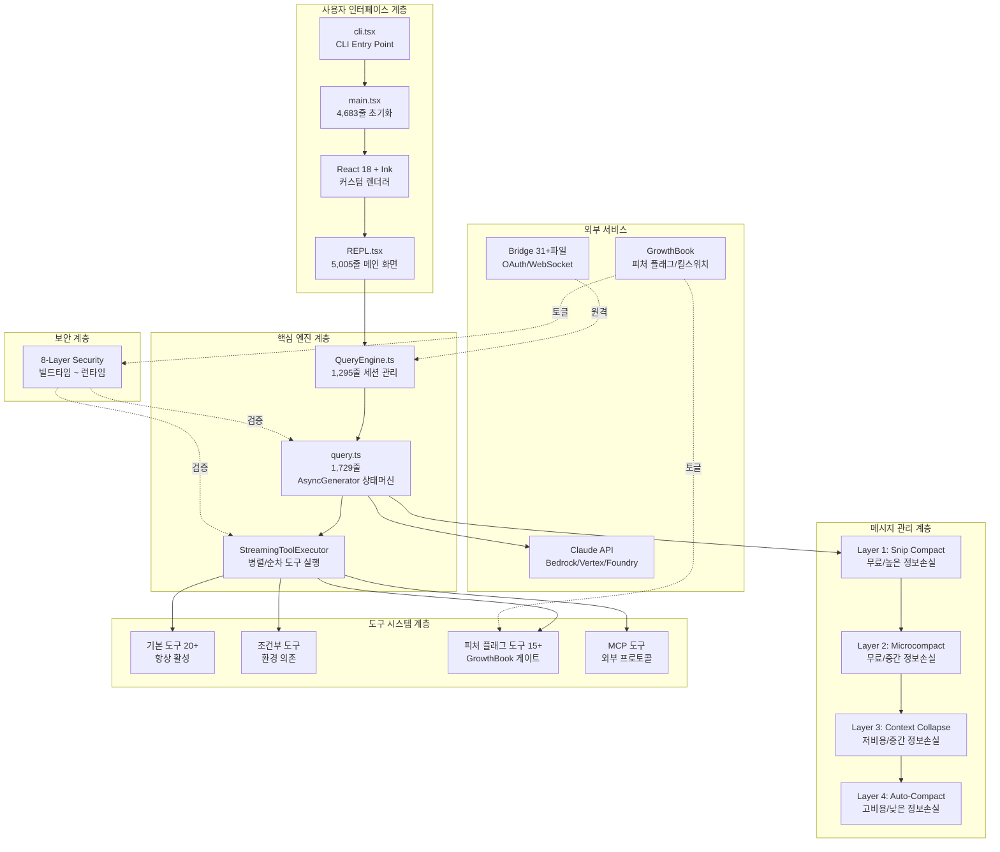

### 3.2 코드베이스 규모 통계

| 항목 | 수치 |
|------|------|
| src/ 하위 총 파일 수 | **~1,902개** |
| 총 코드 라인 | **~512,664줄** |
| 최대 파일 | `src/cli/print.ts` (5,594줄) |
| commands/ 하위 항목 | **103개** (80+ 슬래시 커맨드) |
| components/ 하위 항목 | **144개** |
| hooks/ 하위 항목 | **85개** |
| utils/ 하위 항목 | **330개** |
| tools/ 하위 항목 | **48+ 도구 디렉토리** |
| services/ 하위 항목 | **37+ 서비스** |
| bridge/ 파일 수 | **31개** |
| 피처 플래그 수 | **60+개** |

### 3.3 핵심 파일 Top 20과 역할 매핑 (hangsman 기반)

| 순위 | 파일 경로 | 줄 수 | 역할 |
|------|----------|-------|------|
| 1 | `src/cli/print.ts` | 5,594 | CLI 출력 렌더링 (전체 메시지 포맷팅) |
| 2 | `src/utils/messages.ts` | 5,512 | 메시지 정규화/변환 |
| 3 | `src/utils/sessionStorage.ts` | 5,105 | 세션 저장/복원 로직 |
| 4 | `src/utils/hooks.ts` | 5,022 | Hook 시스템 (PreToolUse, PostToolUse 등) |
| 5 | `src/screens/REPL.tsx` | 5,005 | 메인 REPL 화면 (React 컴포넌트) |
| 6 | `src/main.tsx` | 4,683 | 애플리케이션 진입/초기화 로직 |
| 7 | `src/utils/bash/bashParser.ts` | 4,436 | Bash 명령어 파서 |
| 8 | `src/utils/attachments.ts` | 3,997 | 파일 첨부 처리 |
| 9 | `src/services/api/claude.ts` | 3,419 | Claude API 호출 핵심 로직 |
| 10 | `src/services/mcp/client.ts` | 3,348 | MCP 클라이언트 구현 |
| 11 | `src/utils/plugins/pluginLoader.ts` | 3,302 | 플러그인 로딩 시스템 |
| 12 | `src/commands/insights.ts` | 3,200 | insights 명령어 |
| 13 | `src/bridge/bridgeMain.ts` | 2,999 | Bridge 메인 루프 |
| 14 | `src/utils/bash/ast.ts` | 2,679 | Bash AST 파싱 |
| 15 | `src/utils/plugins/marketplaceManager.ts` | 2,643 | 플러그인 마켓플레이스 |
| 16 | `src/tools/BashTool/bashPermissions.ts` | 2,621 | Bash 권한 검사 |
| 17 | `src/tools/BashTool/bashSecurity.ts` | 2,592 | Bash 보안 검사 |
| 18 | `src/native-ts/yoga-layout/index.ts` | 2,578 | Yoga 레이아웃 엔진 포팅 |
| 19 | `src/services/mcp/auth.ts` | 2,465 | MCP OAuth 인증 |
| 20 | `src/bridge/replBridge.ts` | 2,406 | REPL Bridge 연결 |

**특징**: 최대 파일들은 주로 CLI 출력(`print.ts`), 메시지 처리(`messages.ts`), REPL UI(`REPL.tsx`), API 호출(`claude.ts`)에 집중. BashTool의 권한/보안 관련 파일만 합계 5,213줄이다.

### 3.4 src/ 전체 디렉토리 구조

```
src/
├── assistant/          # 어시스턴트 모드 (Kairos 프로액티브 에이전트)
├── bootstrap/          # 부트스트랩 상태 관리 (sessionId, cwd, 비용 추적 -- 350+ getter/setter)
├── bridge/             # 원격 Bridge 시스템 (31개 파일)
├── buddy/              # 컴패니언 캐릭터 시스템
├── cli/                # CLI 출력/입력 처리
│   ├── handlers/
│   └── transports/
├── commands/           # 슬래시 명령어 (80+ 디렉토리)
│   ├── add-dir/        ├── agents/        ├── ant-trace/
│   ├── autofix-pr/     ├── bridge/        ├── bughunter/
│   ├── chrome/         ├── compact/       ├── config/
│   ├── context/        ├── diff/          ├── doctor/
│   ├── effort/         ├── export/        ├── feedback/
│   ├── hooks/          ├── ide/           ├── issue/
│   ├── login/          ├── mcp/           ├── memory/
│   ├── model/          ├── permissions/   ├── plan/
│   ├── plugin/         ├── pr_comments/   ├── review/
│   ├── session/        ├── skills/        ├── stats/
│   ├── tasks/          ├── teleport/      ├── theme/
│   ├── voice/          └── ... (80+ 디렉토리)
├── components/         # React (Ink) UI 컴포넌트 (144개)
│   ├── agents/         ├── design-system/ ├── diff/
│   ├── grove/          ├── hooks/         ├── mcp/
│   ├── memory/         ├── messages/      ├── permissions/
│   ├── PromptInput/    ├── sandbox/       ├── Settings/
│   ├── shell/          ├── skills/        ├── TrustDialog/
│   └── wizard/
├── constants/          # 시스템 상수, 프롬프트, 도구 목록
├── context/            # React Context (알림, 보이스 등)
├── coordinator/        # 코디네이터 모드 (멀티 워커 오케스트레이션)
├── entrypoints/        # 진입점 정의
│   ├── cli.tsx         # CLI 메인 엔트리포인트
│   ├── init.ts         # 초기화
│   ├── mcp.ts          # MCP 서버 모드 진입점
│   └── sdk/            # SDK 스키마/타입
├── hooks/              # React Hooks (85개)
│   ├── notifs/
│   └── toolPermission/
├── ink/                # 커스텀 Ink 렌더링 엔진
│   ├── components/     ├── events/        ├── hooks/
│   ├── layout/         └── termio/
├── keybindings/        # 키 바인딩 시스템
├── memdir/             # 메모리 디렉토리 (CLAUDE.md 등)
├── migrations/         # 설정 마이그레이션
├── moreright/          # 추가 권한 시스템
├── native-ts/          # 네이티브 TypeScript 구현 (Rust NAPI 대체)
│   ├── color-diff/     # 구문 강조 + diff (999줄)
│   ├── file-index/     # 퍼지 파일 검색 (371줄)
│   └── yoga-layout/    # Flexbox 레이아웃 엔진 (2,579줄)
├── outputStyles/       # 출력 스타일 처리
├── plugins/            # 플러그인 시스템
│   └── bundled/
├── query/              # 쿼리 처리 (stopHooks 등)
├── remote/             # 원격 접속 관련
├── schemas/            # JSON 스키마 정의
├── screens/            # 메인 화면
│   ├── REPL.tsx        # 메인 REPL (5,005줄)
│   └── ResumeConversation.tsx
├── server/             # MCP 서버 모드
├── services/           # 핵심 서비스 레이어 (37+)
│   ├── AgentSummary/   ├── analytics/     ├── api/
│   ├── autoDream/      ├── compact/       ├── extractMemories/
│   ├── lsp/            ├── MagicDocs/     ├── mcp/
│   ├── oauth/          ├── plugins/       ├── policyLimits/
│   ├── PromptSuggestion/ ├── SessionMemory/ ├── settingsSync/
│   ├── teamMemorySync/ ├── tips/          ├── tools/
│   └── toolUseSummary/
├── skills/             # 스킬 시스템
│   └── bundled/
├── state/              # 앱 상태 관리 (AppState, AppStateStore)
├── tasks/              # 백그라운드 태스크 시스템
│   ├── DreamTask/      ├── InProcessTeammateTask/
│   ├── LocalAgentTask/ ├── LocalShellTask/
│   └── RemoteAgentTask/
├── tools/              # 40+ 도구 구현
├── types/              # 타입 정의
│   └── generated/      # protobuf 생성 타입
├── upstreamproxy/      # 업스트림 프록시
├── utils/              # 유틸리티 (330+ 서브디렉토리/파일)
│   ├── bash/           ├── git/           ├── github/
│   ├── hooks/          ├── mcp/           ├── memory/
│   ├── messages/       ├── model/         ├── permissions/
│   ├── plugins/        ├── sandbox/       ├── settings/
│   ├── shell/          ├── skills/        ├── swarm/
│   ├── task/           ├── telemetry/     └── teleport/
├── vim/                # Vim 모드 통합
└── voice/              # 보이스 모드 (voiceModeEnabled.ts)
```

---

## 4. 에이전틱 루프 (Core Engine)

### 4.1 query.ts AsyncGenerator 상태머신

Claude Code의 에이전틱 루프는 **Async Generator**로 구현된 상태머신이다. 제너레이터는 각 단계에서 이벤트를 `yield`하며, 외부 소비자(QueryEngine)가 이벤트를 처리한다.

```typescript
// query.ts - 메인 시그니처 (1,729줄)
export async function* query(params: QueryParams): AsyncGenerator<
  StreamEvent | RequestStartEvent | Message | TombstoneMessage | ToolUseSummaryMessage,
  Terminal // 반환 타입: 9개 터미널 상태 중 하나
> {
  // ...
}
```

### 4.2 불변 파라미터와 가변 상태

에이전틱 루프의 상태는 **불변 파라미터**(생성 시 고정)와 **가변 상태**(턴마다 원자적 업데이트)로 분리된다.

**불변 파라미터** (생성 시 고정):

| 파라미터 | 타입 | 역할 |
|---------|------|------|
| `messages` | `Message[]` | 대화 이력 |
| `systemPrompt` | `string` | 시스템 프롬프트 |
| `canUseTool` | `(tool: string) => boolean` | 도구 사용 권한 함수 |
| `toolUseContext` | `ToolUseContext` (40+ 필드) | 도구 컨텍스트 |
| `taskBudget` | `TokenBudget` | 토큰 예산 |
| `maxTurns` | `number` | 최대 턴 수 |
| `fallbackModel` | `string` | 폴백 모델 |
| `querySource` | `string` | 쿼리 소스 식별자 |

**가변 상태** (원자적 업데이트):

| 상태 필드 | 타입 | 역할 |
|----------|------|------|
| `messages` | `Message[]` | 현재 메시지 배열 (복제본) |
| `toolUseContext` | `ToolUseContext` | 현재 도구 컨텍스트 |
| `autoCompactTracking` | `{ consecutiveFailures: number }` | Auto-Compact 서킷브레이커 |
| `maxOutputTokensRecoveryCount` | `number` | 출력 토큰 복구 횟수 |
| `hasAttemptedReactiveCompact` | `boolean` | 리액티브 압축 시도 여부 |
| `maxOutputTokensOverride` | `number \| undefined` | 출력 토큰 상한 오버라이드 |
| `pendingToolUseSummary` | `ToolUseSummary \| undefined` | 대기 중인 도구 사용 요약 |
| `stopHookActive` | `boolean` | 중단 훅 활성화 여부 |
| `turnCount` | `number` | 현재 턴 수 |
| `transition` | `StateTransition \| undefined` | 상태 전환 정보 |

### 4.3 Continue Site 패턴

상태 전환 시 개별 필드를 변경하지 않고, **전체 상태 객체를 새로 할당**한다. 이는 중간 상태(partial update)가 외부에 노출되는 것을 방지하며, 제너레이터의 `yield` 시점에서 항상 일관된 상태를 보장한다.

```typescript
// "Continue Site" 패턴: 상태 전환은 객체 재할당
while (true) {
  // 개별 필드 변경이 아닌 전체 객체 재할당
  // → 원자적 전환 보장, 부분 업데이트로 인한 불일치 방지
  state = { ...state, /* 변경된 필드만 덮어씀 */ };
  // ... 6단계 파이프라인 실행
}
```

### 4.4 6단계 파이프라인 상세

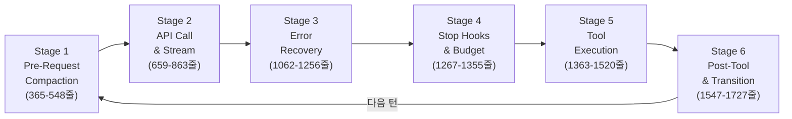

#### Stage 1: Pre-Request Compaction (365-548줄)

API 호출 전에 컨텍스트 윈도우를 최적화하는 5단계 압축 캐스케이드. 비용이 낮은 계층부터 우선 적용한다.

```typescript
// Stage 1: 압축 캐스케이드 (비용 순서대로 시도)
async function preRequestCompaction(state: LoopState): Promise<LoopState> {
  // 1. Tool Result Budget - 개별 도구 결과 크기 제한
  state = applyToolResultBudget(state);

  // 2. Snip Compact - 오래된 내부 메시지 삭제 (무료)
  const snipResult = snipCompact(state.messages);
  if (snipResult.snipTokensFreed > 0) {
    state = { ...state, messages: snipResult.messages };
    return state; // snipTokensFreed가 충분하면 이후 단계 스킵
  }

  // 3. Microcompact - 도구 결과를 placeholder로 교체 (무료)
  state = microcompact(state);

  // 4. Context Collapse - Preview→Commit 2단계 (저비용)
  state = contextCollapse(state);

  // 5. Auto-Compact - Claude API로 요약 생성 (고비용, 최후의 수단)
  if (needsAutoCompact(state)) {
    state = await autoCompact(state);
  }

  return state;
}
```

#### Stage 2: API Call & Streaming (659-863줄)

StreamingToolExecutor로 병렬/순차 도구 실행을 관리한다.

```typescript
class StreamingToolExecutor {
  // 동시성 안전 도구: 병렬 실행 가능
  private static readonly CONCURRENCY_SAFE_TOOLS = new Set([
    'FileRead', 'Glob', 'Grep', 'WebSearch', 'WebFetch'
  ]);

  // 상태 변경 도구: 순차 실행 필수
  private static readonly STATE_MUTATING_TOOLS = new Set([
    'FileWrite', 'Bash', 'FileEdit'
  ]);

  async executeTools(toolCalls: ToolCall[]): Promise<ToolResult[]> {
    const concurrent: ToolCall[] = [];
    const sequential: ToolCall[] = [];

    for (const call of toolCalls) {
      if (this.isConcurrencySafe(call.tool)) {
        concurrent.push(call);
      } else {
        sequential.push(call);
      }
    }

    // 읽기 전용 도구는 동시 실행
    const concurrentResults = await Promise.all(
      concurrent.map(call => this.executeTool(call))
    );

    // 상태 변경 도구는 순차 실행
    const sequentialResults: ToolResult[] = [];
    for (const call of sequential) {
      sequentialResults.push(await this.executeTool(call));
    }

    return [...concurrentResults, ...sequentialResults];
  }
}
```

모델 폴백 시 대화 일관성을 유지하기 위한 TombstoneMessage:

```typescript
// TombstoneMessage: 모델 폴백 시 대화 일관성 유지
interface TombstoneMessage {
  type: 'tombstone';
  originalModel: string;
  fallbackModel: string;
  reason: string;
  // 이전 모델의 응답을 tombstone으로 표시하여
  // 폴백 모델이 혼동 없이 이어갈 수 있도록 함
}

// 중단 사유 타입
type AbortReason =
  | 'sibling_error'        // 동시 실행 도구 중 하나가 실패
  | 'user_interrupted'     // 사용자가 Ctrl+C
  | 'streaming_fallback';  // 스트리밍 오류로 폴백
```

#### Stage 3: Error Recovery (1062-1256줄)

두 가지 독립적 복구 전략이 존재한다.

**PTL(Prompt Too Long, 413) 복구 -- 3단계:**

```typescript
async function handlePromptTooLong(state: LoopState): Promise<LoopState | Terminal> {
  // 1단계: Context Collapse Drain (비용 0)
  //   - 아직 커밋되지 않은 Context Collapse를 전부 적용
  const collapsed = contextCollapseDrain(state);
  if (collapsed.tokenCount < state.contextWindow) {
    return collapsed;
  }

  // 2단계: Reactive Compact (API 1회 호출)
  //   - 긴급 요약 생성
  if (!state.hasAttemptedReactiveCompact) {
    const compacted = await reactiveCompact(state);
    return { ...compacted, hasAttemptedReactiveCompact: true };
  }

  // 3단계: Strip Retry
  //   - 최근 도구 결과를 제거하고 재시도
  return stripAndRetry(state);
}
```

**Max-Output-Tokens 복구 -- 3단계:**

```typescript
async function handleMaxOutputTokens(state: LoopState): Promise<LoopState | Terminal> {
  // 1단계: Token Cap Escalation (비용 0)
  //   - 8K → 16K → 32K → 64K 순차 증가
  if (state.maxOutputTokensOverride === undefined || state.maxOutputTokensOverride < 64000) {
    const nextCap = escalateTokenCap(state.maxOutputTokensOverride ?? 8000);
    return { ...state, maxOutputTokensOverride: nextCap };
  }

  // 2단계: Resume Message Injection (최대 3회)
  //   - "계속 작성하세요" 메시지를 주입하여 이어쓰기 유도
  if (state.maxOutputTokensRecoveryCount < 3) {
    state.messages.push({
      role: 'user',
      content: '[System: Your response was truncated. Please continue from where you left off.]'
    });
    return { ...state, maxOutputTokensRecoveryCount: state.maxOutputTokensRecoveryCount + 1 };
  }

  // 3단계: Recovery Exhaustion → 터미널 상태
  return { terminal: 'model_error', reason: 'max_output_tokens_exhausted' };
}

function escalateTokenCap(current: number): number {
  const caps = [8000, 16000, 32000, 64000];
  const idx = caps.indexOf(current);
  return idx < caps.length - 1 ? caps[idx + 1] : current;
}
```

#### Stage 4: Stop Hooks & Token Budget (1267-1355줄)

감소 수익(diminishing returns) 감지 로직으로, 모델이 실질적 진전 없이 반복하는 것을 감지하여 중단한다.

```typescript
interface StopHookState {
  continuationCount: number;
  deltaSinceLastCheck: number;
  lastDeltaTokens: number;
}

function shouldStopLoop(hook: StopHookState): boolean {
  // 3회 이상 연속 실행 AND
  // 마지막 검사 이후 변화량 < 500 토큰 AND
  // 직전 턴 출력 < 500 토큰
  return (
    hook.continuationCount >= 3 &&
    hook.deltaSinceLastCheck < 500 &&
    hook.lastDeltaTokens < 500
  );
  // → 모델이 실질적 진전 없이 반복하는 것을 감지하여 중단
}
```

#### Stage 5: Tool Execution (1363-1520줄)

실시간 UI 업데이트를 위한 Promise 기반 진행률 전달 메커니즘.

```typescript
class ToolExecutionPipeline {
  private progressAvailableResolve: (() => void) | null = null;

  async execute(toolCalls: ToolCall[]): AsyncGenerator<ToolProgress | ToolResult> {
    for (const call of toolCalls) {
      // 스트리밍 모드: 도구 실행 중 실시간 진행률 yield
      const result = this.executeTool(call);

      // progressAvailableResolve Promise로 UI에 즉시 알림
      if (this.progressAvailableResolve) {
        this.progressAvailableResolve();
        this.progressAvailableResolve = null;
      }

      yield result;
    }
  }

  // 배치 모드: 모든 도구 완료 후 한번에 반환
  async executeBatch(toolCalls: ToolCall[]): Promise<ToolResult[]> {
    return Promise.all(toolCalls.map(call => this.executeTool(call)));
  }
}
```

#### Stage 6: Post-Tool & State Transition (1547-1727줄)

턴 종료 후 4가지 후처리와 상태 전환.

```typescript
async function postToolTransition(state: LoopState): Promise<LoopState> {
  // 1. 스킬 디스커버리
  //   - 도구 실행 결과에서 새로운 스킬 후보 감지
  const discoveredSkills = await discoverSkills(state);

  // 2. 메모리 첨부
  //   - 프로젝트 메모리(.claude/memory) 파일 로드 및 첨부
  const memories = await attachMemories(state);

  // 3. 큐 드레인
  //   - 대기 중인 이벤트(사용자 입력, 시스템 알림) 처리
  const queuedEvents = drainEventQueue();

  // 4. MCP 도구 갱신
  //   - 연결된 MCP 서버의 도구 목록 리프레시
  const updatedTools = await refreshMCPTools(state.toolUseContext);

  return {
    ...state,
    discoveredSkills,
    memories,
    toolUseContext: { ...state.toolUseContext, mcpTools: updatedTools },
  };
}
```

### 4.5 9개 터미널 상태

| 터미널 상태 | 의미 | 발생 조건 |
|------------|------|----------|
| `completed` | 정상 완료 | 모델이 도구 호출 없이 응답 완료 |
| `blocking_limit` | 토큰 예산 소진 | taskBudget 초과 |
| `aborted_streaming` | 스트리밍 중 중단 | 사용자 Ctrl+C 또는 네트워크 오류 |
| `aborted_tools` | 도구 실행 중 중단 | 도구 실행 중 사용자 중단 |
| `prompt_too_long` | PTL 복구 실패 | 3단계 PTL 복구 모두 실패 |
| `image_error` | 이미지 처리 오류 | 이미지 블록 처리 실패 |
| `model_error` | 모델 오류 | API 오류 또는 Max-Output-Tokens 복구 실패 |
| `hook_stopped` | Stop Hook에 의한 중단 | diminishing returns 감지 |
| `max_turns` | 최대 턴 수 도달 | maxTurns 초과 |

```typescript
type Terminal =
  | { terminal: 'completed' }
  | { terminal: 'blocking_limit' }
  | { terminal: 'aborted_streaming' }
  | { terminal: 'aborted_tools' }
  | { terminal: 'prompt_too_long' }
  | { terminal: 'image_error' }
  | { terminal: 'model_error' }
  | { terminal: 'hook_stopped' }
  | { terminal: 'max_turns' };
```

### 4.6 QueryEngine.ts 세션 관리 (1,295줄)

QueryEngine은 query 제너레이터를 소비하는 상위 관리자로, 영속 상태와 세션 관리를 담당한다.

```typescript
class QueryEngine {
  // 영속 상태
  private mutableMessages: Message[] = [];
  private permissionDenials: Map<string, number> = new Map();
  private totalUsage: TokenUsage = { input: 0, output: 0 };

  // 세션 상태
  private readFileState: Map<string, FileReadState> = new Map();
  private discoveredSkillNames: Set<string> = new Set();
  private loadedNestedMemoryPaths: Set<string> = new Set();

  async run(input: UserMessage): Promise<Terminal> {
    const generator = query({
      messages: this.mutableMessages,
      // ... 불변 파라미터 전달
    });

    for await (const event of generator) {
      if (isStreamEvent(event)) {
        yield event; // UI로 전달
      } else if (isMessage(event)) {
        // 비대칭 영속화 전략 적용
        if (event.role === 'user') {
          await this.persistSync(event);   // 블로킹 저장
        } else {
          this.persistAsync(event);         // fire-and-forget
        }
      }
    }

    return generator.return;
  }
}
```

### 4.7 비대칭 영속화 전략

사용자 메시지와 어시스턴트 메시지에 서로 다른 영속화 전략을 적용한다.

| 메시지 타입 | 전략 | 이유 |
|------------|------|------|
| **사용자 메시지** | 블로킹 저장 (`await persistSync`) | 사용자 입력 손실은 치명적 |
| **어시스턴트 메시지** | 비동기 fire-and-forget (`persistAsync`) | 재생성 가능하므로 성능 우선 |

```typescript
// 블로킹 저장: 반드시 완료 후 다음 단계 진행
private async persistSync(message: Message): Promise<void> {
  await writeToStorage(message);
}

// 비동기 저장: 완료를 기다리지 않음
private persistAsync(message: Message): void {
  writeToStorage(message).catch(err => {
    console.error('Failed to persist assistant message:', err);
  });
}
```

---

## 5. 메시지 압축 시스템

### 5.1 4계층 상세

| 비용 | 정보손실 | 계층 | 메커니즘 | 코드 위치 |
|------|---------|------|---------|----------|
| 무료 | 높음 | **Layer 1: Snip Compact** | 오래된 내부 메시지 통째 삭제 | Stage 1 내부 |
| 무료 | 중간 | **Layer 2: Microcompact** | 도구 결과를 `[Old tool result content cleared]` placeholder로 교체 | Stage 1 내부 |
| 저비용 | 중간 | **Layer 3: Context Collapse** | Preview→Commit 2단계, 읽기 시점 프로젝션으로 원본 보존 | Stage 1 내부 |
| 고비용 | 낮음 | **Layer 4: Auto-Compact** | Claude API 호출로 대화 요약 생성 | Stage 1 최후 수단 |

### 5.2 캐스케이드 흐름 다이어그램

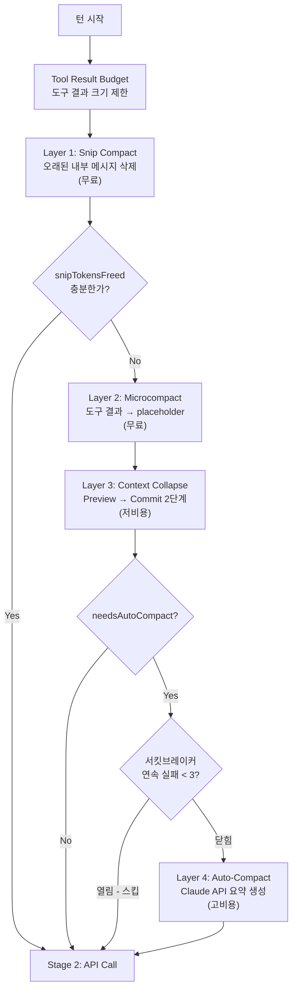

### 5.3 각 계층 상세

#### Layer 1: Snip Compact

오래된 내부 메시지를 통째로 삭제한다. API 호출 없이 즉시 실행.

```typescript
function snipCompact(messages: Message[]): SnipCompactResult {
  let snipTokensFreed = 0;
  const retained: Message[] = [];

  for (let i = 0; i < messages.length; i++) {
    const msg = messages[i];
    const age = messages.length - i;

    // 오래된 내부 메시지(도구 결과, 중간 사고 등)를 삭제
    if (isInternalMessage(msg) && age > SNIP_AGE_THRESHOLD) {
      snipTokensFreed += estimateTokens(msg);
      continue; // 삭제
    }

    retained.push(msg);
  }

  return { messages: retained, snipTokensFreed };
  // snipTokensFreed가 충분하면 Auto-Compact 트리거 불필요
}
```

#### Layer 2: Microcompact

특정 도구 결과의 내용을 placeholder 문자열로 교체한다.

```typescript
const MICROCOMPACT_TARGETS = [
  'file_read', 'shell', 'grep', 'glob',
  'web_search', 'web_fetch', 'file_edit', 'file_write'
];

function microcompact(state: LoopState): LoopState {
  const messages = state.messages.map(msg => {
    if (!isToolResult(msg)) return msg;
    if (!MICROCOMPACT_TARGETS.includes(msg.toolType)) return msg;

    // 캐시 핀 상태 확인 (CACHED_MICROCOMPACT 피처)
    // → 캐시된 메시지는 prompt cache hit를 위해 보존
    if (isCachePinned(msg)) {
      return msg; // 캐시 핀된 메시지는 건드리지 않음
    }

    return {
      ...msg,
      content: '[Old tool result content cleared]',
    };
  });

  return { ...state, messages };
}
```

#### Layer 3: Context Collapse

**Preview → Commit 2단계** 구조로, 원본을 보존하면서 컨텍스트를 축소한다. 읽기 시점 프로젝션을 통해 API 호출 시에만 축소된 projected 버전을 사용하고, 내부적으로는 original을 유지하여 **prompt cache hit를 극대화**한다.

```typescript
interface ContextCollapseState {
  original: Message[];   // 원본 보존 (prompt cache hit 최적화)
  projected: Message[];  // 축소된 프로젝션 (API에 전송)
  committed: boolean;    // Commit 여부
}

function contextCollapsePreview(messages: Message[]): ContextCollapseState {
  // Preview 단계: 축소 결과를 미리 계산하되, 원본 유지
  const projected = messages.map(msg => {
    if (canCollapse(msg)) {
      return collapseMessage(msg); // 요약/축소 버전 생성
    }
    return msg;
  });

  return { original: messages, projected, committed: false };
}

function contextCollapseCommit(state: ContextCollapseState): Message[] {
  // Commit 단계: projected를 실제 메시지로 확정
  // → 이 시점 이후 original은 폐기 가능
  return state.projected;
}
```

#### Layer 4: Auto-Compact

Claude API를 호출하여 대화를 요약한다. 가장 비용이 높지만 정보 손실이 가장 낮다.

```typescript
const AUTO_COMPACT_THRESHOLD_BUFFER = 13000;
const MAX_CONSECUTIVE_AUTOCOMPACT_FAILURES = 3; // 서킷브레이커

async function autoCompact(state: LoopState): Promise<LoopState> {
  const threshold = state.effectiveContextWindow - AUTO_COMPACT_THRESHOLD_BUFFER;

  if (estimateTokens(state.messages) < threshold) {
    return state; // 아직 임계값 미만
  }

  // 서킷브레이커: 연속 실패 3회 시 Auto-Compact 비활성화
  if (state.autoCompactTracking.consecutiveFailures >= MAX_CONSECUTIVE_AUTOCOMPACT_FAILURES) {
    return state; // 서킷 열림 → 스킵
  }

  try {
    // 4단계 파이프라인
    // Step 1: 이미지 스트리핑 (이미지 블록 제거)
    const textOnly = stripImages(state.messages);
    // Step 2: API 라운드 그룹핑 (연관 메시지 묶기)
    const grouped = groupByAPIRound(textOnly);
    // Step 3: Thinking 블록 제거 (모델 내부 사고 제거)
    const noThinking = removeThinkingBlocks(grouped);
    // Step 4: Claude API로 요약 생성
    const summary = await callCompactAPI(noThinking);

    return {
      ...state,
      messages: [{ role: 'system', content: summary }, ...recentMessages(state)],
      autoCompactTracking: { consecutiveFailures: 0 },
    };
  } catch (error) {
    return {
      ...state,
      autoCompactTracking: {
        consecutiveFailures: state.autoCompactTracking.consecutiveFailures + 1,
      },
    };
  }
}
```

### 5.4 Auto-Compact 임계값과 서킷브레이커

| 파라미터 | 값 | 역할 |
|---------|-----|------|
| `AUTO_COMPACT_THRESHOLD_BUFFER` | **13,000 토큰** | effectiveContextWindow에서 이 값을 뺀 것이 임계값 |
| `MAX_CONSECUTIVE_AUTOCOMPACT_FAILURES` | **3회** | 연속 실패 시 서킷브레이커 개방 |
| 실패 시 PTL 재시도 | 토큰 20%씩 감소 | 요약 입력 자체가 너무 클 경우 점진적 축소 |

### 5.5 경고 시스템 4단계

컨텍스트 윈도우 사용량에 따라 단계적 경고가 발생한다:

```
┌──────────────────────────────────────────────────────────────┐
│                  컨텍스트 윈도우 관리 흐름                       │
│                                                              │
│  토큰 사용량                                                   │
│  ▲                                                           │
│  │    ┌─── 임계값 (EffectiveWindow - 13000) ────────────     │
│  │    │                                                      │
│  │    │  4. Auto-Compact (API 호출 -- 최후의 수단)             │
│  │    │                                                      │
│  │  3. Context Collapse (Preview→Commit 2단계)               │
│  │                                                           │
│  │  2. Microcompact (placeholder 교체)                       │
│  │                                                           │
│  │  1. Snip Compact (오래된 메시지 삭제)                       │
│  │                                                           │
│  └──────────────────────────────────────────────────── ▶ 턴  │
└──────────────────────────────────────────────────────────────┘
```

압축 실패 시 PTL(413) 에러 복구 경로로 전환되며, 최종적으로 `prompt_too_long` 터미널 상태에 도달할 수 있다.
# Claude Code 분석 B1: 도구 시스템과 명령어 시스템

> 소스맵에서 복원된 `@anthropic-ai/claude-code` v2.1.88 (약 1,902개 파일, 512K+ 줄) 기반 분석
> Phase 1 아키텍처 문서 + Phase 2 리포지토리 분석(chatgptprojects, hangsman) 종합

---

## 6. 도구 시스템

### 6.1 Tool 인터페이스

모든 도구는 `src/Tool.ts`에 정의된 제네릭 타입 `Tool<Input, Output, Progress>`를 구현한다. 이 타입은 도구의 실행, 권한, UI 렌더링, 분류까지 포괄하는 **완전한 인터페이스**를 정의한다.

```typescript
export type Tool<
  Input extends AnyObject = AnyObject,
  Output = unknown,
  P extends ToolProgressData = ToolProgressData,
> = {
  // === 메타데이터 ===
  readonly name: string
  aliases?: string[]
  searchHint?: string
  readonly inputSchema: Input
  readonly inputJSONSchema?: ToolInputJSONSchema
  readonly shouldDefer?: boolean      // 지연 로딩 대상 여부
  readonly alwaysLoad?: boolean       // 항상 로드 여부
  readonly strict?: boolean           // 엄격 모드
  isMcp?: boolean                     // MCP 도구 여부
  isLsp?: boolean                     // LSP 도구 여부
  maxResultSizeChars: number          // 결과 최대 크기

  // === 핵심 실행 메서드 ===
  call(args, context, canUseTool, parentMessage, onProgress?): Promise<ToolResult<Output>>
  description(input, options): Promise<string>
  prompt(options): Promise<string>

  // === 권한 및 검증 ===
  checkPermissions(input, context): Promise<PermissionResult>
  validateInput?(input, context): Promise<ValidationResult>
  isEnabled(): boolean
  isReadOnly(input): boolean
  isDestructive?(input): boolean
  isConcurrencySafe(input): boolean
  interruptBehavior?(): 'cancel' | 'block'

  // === UI 렌더링 (React/Ink) ===
  renderToolUseMessage(input, options): React.ReactNode
  renderToolResultMessage?(content, progressMessages, options): React.ReactNode
  renderToolUseProgressMessage?(progressMessages, options): React.ReactNode
  userFacingName(input): string
  getToolUseSummary?(input): string | null
  getActivityDescription?(input): string | null

  // === 권한 매칭 및 분류 ===
  preparePermissionMatcher?(input): Promise<(pattern: string) => boolean>
  toAutoClassifierInput(input): unknown
  mapToolResultToToolResultBlockParam(content, toolUseID): ToolResultBlockParam
}
```

#### ToolUseContext (50+ 필드)

도구 실행 시 전달되는 컨텍스트 객체로, 파일시스템, 권한, 세션, 예산, MCP, 기능 플래그 등 **도구가 필요로 하는 모든 런타임 정보**를 포함한다.

```typescript
export type ToolUseContext = {
  // 옵션 그룹
  options: {
    commands: Command[]
    mainLoopModel: string
    tools: Tools
    thinkingConfig: ThinkingConfig
    mcpClients: MCPServerConnection[]
    // ...
  }

  // 제어
  abortController: AbortController

  // 파일시스템 상태
  readFileState: FileStateCache

  // 앱 상태 접근
  getAppState(): AppState
  setAppState(f: (prev: AppState) => AppState): void

  // 대화 이력
  messages: Message[]

  // 에이전트 식별
  agentId?: AgentId

  // ... 50+ 추가 필드
}
```

#### DeepImmutable<> 래핑

도구가 컨텍스트를 변경하는 것을 **타입 레벨에서 방지**하기 위해 `DeepImmutable` 유틸리티 타입으로 래핑한다. 이는 재귀적으로 모든 프로퍼티를 `readonly`로 변환한다.

```typescript
// DeepImmutable 유틸리티 타입 - 재귀적 불변 변환
type DeepImmutable<T> =
  T extends Map<infer K, infer V> ? ReadonlyMap<DeepImmutable<K>, DeepImmutable<V>> :
  T extends Set<infer V> ? ReadonlySet<DeepImmutable<V>> :
  T extends Array<infer V> ? ReadonlyArray<DeepImmutable<V>> :
  T extends object ? { readonly [K in keyof T]: DeepImmutable<T[K]> } :
  T;

// 사용 예: AppState는 DeepImmutable로 래핑
export type AppState = DeepImmutable<{
  settings: SettingsJson
  verbose: boolean
  mainLoopModel: ModelSetting
  // ...
}> & {
  // Mutable 필드 (의도적으로 DeepImmutable 제외)
  tasks: { [taskId: string]: TaskState }
  agentNameRegistry: Map<string, AgentId>
  mcp: { clients: MCPServerConnection[]; tools: Tool[]; /* ... */ }
  // ...
}
```

**설계 의도**: `DeepImmutable`은 함수 타입 필드를 제외한 모든 데이터를 불변으로 만들어, 도구 실행 중 상태 오염을 컴파일 타임에 차단한다. 단, `tasks`, `mcp` 등 런타임에 빈번하게 갱신되어야 하는 필드는 의도적으로 mutable로 유지된다.

---

### 6.2 buildTool() 팩토리

도구 정의(`ToolDef`)에서 완전한 `Tool` 인스턴스를 생성하는 팩토리 함수이다. 기본값을 주입하여 모든 도구가 일관된 인터페이스를 갖추도록 보장한다.

```typescript
export function buildTool<D extends AnyToolDef>(def: D): BuiltTool<D> {
  return {
    ...TOOL_DEFAULTS,            // 기본값 주입 (isEnabled: () => true 등)
    userFacingName: () => def.name,  // 기본 사용자 표시명 = 도구 이름
    ...def,                       // 사용자 정의로 기본값 덮어쓰기
  } as BuiltTool<D>
}
```

**팩토리 패턴의 효과**:
- 도구 개발자는 `name`, `inputSchema`, `call` 등 핵심 필드만 정의하면 된다
- `TOOL_DEFAULTS`가 `isEnabled`, `isReadOnly`, `isConcurrencySafe`, `renderToolUseMessage` 등의 기본 구현을 제공한다
- 스프레드 연산자로 기본값을 덮어쓰는 패턴으로, 선택적 오버라이드가 간단하다
- 타입 추론(`BuiltTool<D>`)으로 입력 스키마와 출력 타입이 도구 정의에서 자동으로 도출된다

---

### 6.3 빌트인 도구 전체 카탈로그

`src/tools/` 디렉토리에 구현된 **40+ 도구**를 카테고리별로 분류한다.

#### 파일 조작 도구

| 도구명 | 역할 | isConcurrencySafe | 비고 |
|--------|------|:-----------------:|------|
| **FileReadTool** | 파일 읽기 (이미지, PDF, 노트북 지원) | O | `imageProcessor.ts`, `limits.ts` 포함 |
| **FileWriteTool** | 새 파일 작성 또는 전체 덮어쓰기 | X | 상태 변경 도구 |
| **FileEditTool** | 정확한 문자열 교체 기반 편집 | X | `old_string` -> `new_string` 패턴 |
| **NotebookEditTool** | Jupyter 노트북 셀 편집 | X | `.ipynb` 전용 |

#### 검색 도구

| 도구명 | 역할 | isConcurrencySafe | 비고 |
|--------|------|:-----------------:|------|
| **GlobTool** | 파일 패턴 검색 (glob 매칭) | O | 읽기 전용 |
| **GrepTool** | ripgrep 기반 정규식 콘텐츠 검색 | O | 읽기 전용 |

#### 실행 도구

| 도구명 | 역할 | isConcurrencySafe | 비고 |
|--------|------|:-----------------:|------|
| **BashTool** | 셸 명령 실행 | X | 보안 검사 18개 파일 (bashSecurity.ts 2,592줄, bashPermissions.ts 2,621줄) |
| **PowerShellTool** | PowerShell 명령 실행 | X | Windows 환경 전용 |
| **REPLTool** | VM 기반 REPL 실행 | X | ANT(Anthropic 내부) 전용 |

#### 웹 도구

| 도구명 | 역할 | isConcurrencySafe | 비고 |
|--------|------|:-----------------:|------|
| **WebFetchTool** | URL 콘텐츠 가져오기 | O | 사전 승인 URL 목록(`preapproved.ts`) 포함 |
| **WebSearchTool** | 웹 검색 | O | 읽기 전용 |
| **WebBrowserTool** | 실제 브라우저 자동화 | X | `feature('WEB_BROWSER_TOOL')` 게이트 |

#### 에이전트/협업 도구

| 도구명 | 역할 | isConcurrencySafe | 비고 |
|--------|------|:-----------------:|------|
| **AgentTool** | 서브에이전트 생성/관리 | X | `runAgent.ts`, `forkSubagent.ts`, `builtInAgents.ts`, 5개 내장 에이전트 |
| **SendMessageTool** | 피어 에이전트에게 메시지 전송 | X | 코디네이터 모드에서 사용 |
| **TeamCreateTool** | 에이전트 팀(swarm) 생성 | X | `feature('AGENT_SWARMS')` 게이트 |
| **TeamDeleteTool** | 에이전트 팀 삭제 | X | `feature('AGENT_SWARMS')` 게이트 |
| **ListPeersTool** | 피어 목록 조회 | O | `feature('UDS_INBOX')` 게이트 |

#### 태스크 관리 도구

| 도구명 | 역할 | isConcurrencySafe | 비고 |
|--------|------|:-----------------:|------|
| **TodoWriteTool** | 할 일 목록 관리 (체크리스트) | X | 기본 TODO 시스템 |
| **TaskCreateTool** | 태스크 생성 | X | TodoV2 시스템, `feature('TODO_V2')` |
| **TaskGetTool** | 태스크 조회 | O | TodoV2 시스템 |
| **TaskUpdateTool** | 태스크 갱신 | X | TodoV2 시스템 |
| **TaskListTool** | 태스크 목록 | O | TodoV2 시스템 |
| **TaskStopTool** | 작업 중단 | X | 기본 도구 |
| **TaskOutputTool** | 백그라운드 태스크 출력 | O | 기본 도구 |

#### MCP 관련 도구

| 도구명 | 역할 | isConcurrencySafe | 비고 |
|--------|------|:-----------------:|------|
| **MCPTool** | MCP 프로토콜 도구 래퍼 | 동적 | MCP 서버에서 제공하는 도구를 래핑 |
| **McpAuthTool** | MCP OAuth 인증 처리 | X | |
| **ListMcpResourcesTool** | MCP 리소스 목록 조회 | O | 읽기 전용 |
| **ReadMcpResourceTool** | MCP 리소스 읽기 | O | 읽기 전용 |

#### 플랜/모드 도구

| 도구명 | 역할 | isConcurrencySafe | 비고 |
|--------|------|:-----------------:|------|
| **EnterPlanModeTool** | 플랜 모드 진입 (읽기 전용) | X | |
| **ExitPlanModeV2Tool** | 플랜 모드 종료 및 실행 전환 | X | |
| **EnterWorktreeTool** | Git worktree 생성/진입 | X | `isWorktreeModeEnabled()` 조건 |
| **ExitWorktreeTool** | Git worktree 종료 | X | `isWorktreeModeEnabled()` 조건 |

#### Kairos/프로액티브 도구

| 도구명 | 역할 | isConcurrencySafe | 비고 |
|--------|------|:-----------------:|------|
| **SleepTool** | 대기 (백그라운드 알림 수집) | X | `feature('PROACTIVE')` \| `feature('KAIROS')` |
| **SendUserFileTool** | 사용자에게 파일 능동 전송 | X | `feature('KAIROS')` |
| **PushNotificationTool** | 모바일/데스크톱 푸시 알림 | X | `feature('KAIROS')` \| `feature('KAIROS_PUSH_NOTIFICATION')` |
| **SubscribePRTool** | PR 이벤트 웹훅 구독 | X | `feature('KAIROS_GITHUB_WEBHOOKS')` |

#### 트리거/스케줄 도구

| 도구명 | 역할 | isConcurrencySafe | 비고 |
|--------|------|:-----------------:|------|
| **CronCreateTool** | 크론 스케줄 생성 | X | `feature('AGENT_TRIGGERS')` |
| **CronDeleteTool** | 크론 스케줄 삭제 | X | `feature('AGENT_TRIGGERS')` |
| **CronListTool** | 크론 스케줄 목록 | O | `feature('AGENT_TRIGGERS')` |
| **RemoteTriggerTool** | 원격 트리거 | X | `feature('AGENT_TRIGGERS_REMOTE')` |
| **MonitorTool** | 시스템/서비스 모니터링 | O | `feature('MONITOR_TOOL')` |

#### 기타 도구

| 도구명 | 역할 | isConcurrencySafe | 비고 |
|--------|------|:-----------------:|------|
| **AskUserQuestionTool** | 사용자에게 대화형 질문 | X | 기본 도구 |
| **SkillTool** | 슬래시 명령 스킬 실행 | X | 기본 도구 |
| **ToolSearchTool** | 지연 로딩된 도구 검색 (Fuse.js) | O | `isToolSearchEnabledOptimistic()` |
| **BriefTool** | 브리핑 생성 및 파일 업로드 | X | 기본 도구 |
| **LSPTool** | Language Server Protocol 통합 | O | `ENABLE_LSP_TOOL` 환경변수 |
| **SyntheticOutputTool** | JSON 스키마 기반 구조화 출력 | X | SDK 전용 |
| **SnipTool** | 히스토리 스닙 관리 | X | `feature('HISTORY_SNIP')` |
| **CtxInspectTool** | 컨텍스트 상태 검사 | O | `feature('CONTEXT_COLLAPSE')` |
| **TerminalCaptureTool** | 터미널 캡처 | X | `feature('TERMINAL_PANEL')` |
| **WorkflowTool** | 워크플로우 스크립트 실행 | X | `feature('WORKFLOW_SCRIPTS')` |
| **OverflowTestTool** | 오버플로우 테스트 | X | `feature('OVERFLOW_TEST_TOOL')` |
| **VerifyPlanExecutionTool** | 플랜 실행 검증 | X | `feature('CLAUDE_CODE_VERIFY_PLAN')` |
| **ConfigTool** | 시스템 설정 관리 | X | ANT 전용 |
| **TungstenTool** | tmux 세션 관리 (내부 인프라) | X | ANT 전용 |
| **SuggestBackgroundPRTool** | 백그라운드 PR 제안 | X | ANT 전용 |

---

### 6.4 3계층 등록

`src/tools.ts`의 `getAllBaseTools()` 함수에서 모든 도구를 3계층으로 등록한다.

#### Always Enabled (20+ 기본 도구)

환경과 무관하게 항상 활성화되는 핵심 도구 세트이다.

```typescript
export function getAllBaseTools(): Tools {
  return [
    AgentTool, TaskOutputTool, BashTool,
    ...(hasEmbeddedSearchTools() ? [] : [GlobTool, GrepTool]),
    ExitPlanModeV2Tool, FileReadTool, FileEditTool, FileWriteTool,
    NotebookEditTool, WebFetchTool, TodoWriteTool, WebSearchTool,
    TaskStopTool, AskUserQuestionTool, SkillTool, EnterPlanModeTool,
    BriefTool, ListMcpResourcesTool, ReadMcpResourceTool,
    // ...
  ]
}
```

포함 도구: `AgentTool`, `BashTool`, `FileReadTool`, `FileEditTool`, `FileWriteTool`, `GlobTool`, `GrepTool`, `NotebookEditTool`, `WebFetchTool`, `WebSearchTool`, `TodoWriteTool`, `TaskStopTool`, `TaskOutputTool`, `AskUserQuestionTool`, `SkillTool`, `EnterPlanModeTool`, `ExitPlanModeV2Tool`, `BriefTool`, `ListMcpResourcesTool`, `ReadMcpResourceTool`, `SendMessageTool`(lazy)

#### Conditionally Enabled (환경 의존)

런타임 환경, OS, 설정에 따라 조건부로 활성화되는 도구이다.

```typescript
// tools.ts 내 조건부 등록 패턴
...(isWorktreeModeEnabled() ? [EnterWorktreeTool, ExitWorktreeTool] : []),
...(isPowerShellToolEnabled() ? [PowerShellTool] : []),
...(isToolSearchEnabledOptimistic() ? [ToolSearchTool] : []),
...(isTodoV2Enabled() ? [TaskCreateTool, TaskGetTool, TaskUpdateTool, TaskListTool] : []),
...(isAgentSwarmsEnabled() ? [TeamCreateTool, TeamDeleteTool] : []),
```

| 도구 | 활성화 조건 |
|------|------------|
| EnterWorktreeTool / ExitWorktreeTool | `isWorktreeModeEnabled()` - Git 환경 |
| PowerShellTool | `isPowerShellToolEnabled()` - Windows 환경 |
| ToolSearchTool | `isToolSearchEnabledOptimistic()` - Beta 기능 |
| TaskCreate/Get/Update/ListTool | `isTodoV2Enabled()` - TodoV2 피처 |
| TeamCreate/DeleteTool | `isAgentSwarmsEnabled()` - 에이전트 스웜 |
| LSPTool | `ENABLE_LSP_TOOL` 환경변수 |

#### Feature-Flag Gated (15+ 미공개)

`feature()` 함수(Bun 번들러의 빌드타임 매크로)에 의해 게이트되는 미공개 도구이다. 외부 빌드에서는 dead code elimination으로 **코드 자체가 번들에서 제거**된다.

```typescript
// feature() 게이트 패턴
...(feature('KAIROS') ? [SleepTool, SendUserFileTool] : []),
...(feature('KAIROS_PUSH_NOTIFICATION') ? [PushNotificationTool] : []),
...(feature('KAIROS_GITHUB_WEBHOOKS') ? [SubscribePRTool] : []),
...(feature('AGENT_TRIGGERS') ? [...cronTools] : []),
...(feature('AGENT_TRIGGERS_REMOTE') ? [RemoteTriggerTool] : []),
...(feature('MONITOR_TOOL') ? [MonitorTool] : []),
...(feature('WEB_BROWSER_TOOL') ? [WebBrowserTool] : []),
...(feature('TERMINAL_PANEL') ? [TerminalCaptureTool] : []),
...(feature('CONTEXT_COLLAPSE') ? [CtxInspectTool] : []),
...(feature('HISTORY_SNIP') ? [SnipTool] : []),
...(feature('UDS_INBOX') ? [ListPeersTool] : []),
...(feature('WORKFLOW_SCRIPTS') ? [WorkflowTool] : []),
...(feature('OVERFLOW_TEST_TOOL') ? [OverflowTestTool] : []),
```

#### ANT 전용 (Anthropic 내부 빌드)

`USER_TYPE === 'ant'` 빌드 변형에서만 포함되는 내부 전용 도구이다.

| 도구명 | 역할 |
|--------|------|
| **REPLTool** | VM 기반 대화형 REPL 실행 |
| **ConfigTool** | 내부 시스템 설정 관리 |
| **TungstenTool** | tmux 세션 기반 내부 인프라 도구 |
| **SuggestBackgroundPRTool** | 백그라운드 PR 자동 제안 |

---

### 6.5 assembleToolPool 캐시 안정성

`assembleToolPool()`은 빌트인 도구와 MCP 도구를 병합하여 최종 도구 풀을 조립한다. **순서 안정성**이 핵심이다.

```typescript
export function assembleToolPool(
  permissionContext: ToolPermissionContext,
  mcpTools: Tools,
): Tools {
  // 1. 빌트인 도구: 이름순 정렬 (캐시 안정성)
  const sortedBuiltin = [...builtinTools].sort((a, b) =>
    a.name.localeCompare(b.name)
  );

  // 2. MCP 도구: 서버 이름 -> 도구 이름 순 2단계 정렬
  const sortedMCP = [...mcpTools].sort((a, b) => {
    const serverCmp = a.serverName.localeCompare(b.serverName);
    return serverCmp !== 0 ? serverCmp : a.name.localeCompare(b.name);
  });

  // 3. 빌트인 먼저, MCP 뒤에 연결
  return [...sortedBuiltin, ...sortedMCP];
}
```

**캐시 안정성이 중요한 이유**:
- 도구 목록은 시스템 프롬프트에 포함되어 API로 전송된다
- 도구 순서가 변하면 시스템 프롬프트 텍스트가 달라진다
- 시스템 프롬프트가 달라지면 **prompt cache hit율이 급락**한다
- 빌트인과 MCP를 분리 정렬하는 이유: MCP 도구 추가/제거가 빌트인 도구의 정렬 순서에 영향을 주지 않도록 격리한다

또한 `assembleToolPool`은 `permissionContext`의 deny 규칙을 적용하여 금지된 도구를 필터링한다.

---

### 6.6 StreamingToolExecutor

`src/services/tools/` 디렉토리에 구현된 도구 실행 엔진으로, **병렬/순차 실행을 자동 분류**한다.

#### 병렬 실행 메커니즘

```typescript
class StreamingToolExecutor {
  // 동시성 안전 도구: 병렬 실행 가능 (읽기 전용)
  private static readonly CONCURRENCY_SAFE_TOOLS = new Set([
    'FileRead', 'Glob', 'Grep', 'WebSearch', 'WebFetch'
  ]);

  // 상태 변경 도구: 순차 실행 필수
  private static readonly STATE_MUTATING_TOOLS = new Set([
    'FileWrite', 'Bash', 'FileEdit'
  ]);

  async executeTools(toolCalls: ToolCall[]): Promise<ToolResult[]> {
    const concurrent: ToolCall[] = [];
    const sequential: ToolCall[] = [];

    for (const call of toolCalls) {
      if (this.isConcurrencySafe(call.tool)) {
        concurrent.push(call);
      } else {
        sequential.push(call);
      }
    }

    // 읽기 전용 도구: Promise.all로 동시 실행
    const concurrentResults = await Promise.all(
      concurrent.map(call => this.executeTool(call))
    );

    // 상태 변경 도구: for 루프로 순차 실행
    const sequentialResults: ToolResult[] = [];
    for (const call of sequential) {
      sequentialResults.push(await this.executeTool(call));
    }

    return [...concurrentResults, ...sequentialResults];
  }
}
```

#### AbortReason 타입

도구 실행이 중단되는 3가지 사유를 명시적으로 구분한다.

```typescript
type AbortReason =
  | 'sibling_error'        // 동시 실행 도구 중 하나가 실패 -> 나머지 중단
  | 'user_interrupted'     // 사용자가 Ctrl+C로 중단
  | 'streaming_fallback';  // 스트리밍 오류로 폴백 모드 전환
```

#### 실시간 UI 진행률

```typescript
class ToolExecutionPipeline {
  private progressAvailableResolve: (() => void) | null = null;

  async execute(toolCalls: ToolCall[]): AsyncGenerator<ToolProgress | ToolResult> {
    for (const call of toolCalls) {
      const result = this.executeTool(call);

      // progressAvailableResolve Promise로 UI에 즉시 알림
      if (this.progressAvailableResolve) {
        this.progressAvailableResolve();
        this.progressAvailableResolve = null;
      }

      yield result;
    }
  }
}
```

---

### 6.7 Tool Search (Beta)

도구 수가 40+개를 넘으면서 모든 도구 스키마를 시스템 프롬프트에 포함하는 것은 토큰 낭비가 된다. Tool Search는 **필요할 때만 도구 스키마를 로딩**하는 지연 로딩 메커니즘이다.

```typescript
// ToolSearchTool: Fuse.js 기반 퍼지 검색
class ToolSearchTool implements Tool {
  name = 'ToolSearch';

  // 모든 도구의 메타데이터(이름, 설명)만 보유
  // 실제 실행 로직과 전체 스키마는 필요 시 동적 로딩
  private toolRegistry: Map<string, ToolMetadata> = new Map();

  inputSchema = z.object({
    query: z.string().describe('Query to find deferred tools...'),
    max_results: z.number().optional().default(5)
      .describe('Maximum number of results to return (default: 5)'),
  })

  async execute(params: { query: string; max_results?: number }): Promise<ToolSearchResult> {
    // Fuse.js로 쿼리와 매칭되는 도구 검색
    const matches = this.searchTools(params.query);

    // 매칭된 도구의 전체 스키마를 반환
    // -> 모델이 다음 턴에서 해당 도구를 호출할 수 있도록
    return {
      tools: matches.map(tool => ({
        name: tool.name,
        description: tool.description,
        parameters: tool.parameterSchema,
      })),
    };
  }
}
```

**지연 로딩 흐름**:
1. 도구에 `shouldDefer: true` 설정 -> 시스템 프롬프트에 전체 스키마 대신 이름만 포함
2. 모델이 `ToolSearch`를 호출하여 필요한 도구를 검색
3. 검색 결과로 전체 스키마가 반환되어 `<functions>` 블록에 추가
4. 모델이 다음 턴에서 해당 도구를 정상 호출

`shouldDefer`와 `alwaysLoad` 플래그로 도구별 로딩 전략을 제어한다:
- `shouldDefer: true` + `alwaysLoad: false` = 지연 로딩 (ToolSearch로만 접근)
- `shouldDefer: false` 또는 `alwaysLoad: true` = 즉시 로딩 (시스템 프롬프트에 포함)

---

## 7. 명령어 시스템

### 7.1 명령어 레지스트리

`src/commands.ts`에서 **80개 이상의 슬래시 명령어**를 등록한다. 각 명령어는 `src/commands/` 디렉토리의 개별 폴더에 구현되어 있다.

#### 일반 사용자 명령어

| 명령어 | 카테고리 | 타입 | 역할 |
|--------|---------|------|------|
| `/help` | 정보 | local-jsx | 도움말 표시 |
| `/clear` | 세션 | local | 대화 초기화, 캐시 삭제 |
| `/compact` | 세션 | local | 컨텍스트 수동 컴팩션 |
| `/resume` | 세션 | local-jsx | 이전 세션 복원 |
| `/model` | 설정 | local-jsx | 모델 선택/변경 |
| `/config` | 설정 | local-jsx | 설정 관리 |
| `/mcp` | 통합 | local-jsx | MCP 서버 추가/관리 |
| `/permissions` | 보안 | local-jsx | 권한 규칙 관리 |
| `/hooks` | 설정 | local-jsx | 후크 설정 |
| `/memory` | 컨텍스트 | local-jsx | CLAUDE.md 메모리 파일 편집 |
| `/plugin` | 통합 | local-jsx | 플러그인 관리 (마켓플레이스 탐색, 설치, 삭제) |
| `/skills` | 정보 | local-jsx | 스킬 목록 조회 |
| `/agents` | 에이전트 | local-jsx | 에이전트 관리 |
| `/context` | 정보 | local-jsx / local | 컨텍스트 상태 표시 |
| `/cost` | 정보 | local | 세션 비용 표시 |
| `/usage` | 정보 | local-jsx | 사용량 표시 |
| `/diff` | Git | local-jsx | 변경사항 diff 표시 |
| `/rewind` | Git | local | 파일 변경 되돌리기 |
| `/branch` | Git | local | Git 브랜치 관리 |
| `/session` | 세션 | local-jsx | 세션 정보/QR 코드 |
| `/export` | 세션 | local-jsx | 대화 내보내기 |
| `/copy` | 유틸리티 | local-jsx | 마지막 메시지 복사 |
| `/theme` | UI | local-jsx | 테마 변경 |
| `/vim` | UI | local | Vim 모드 토글 |
| `/plan` | 모드 | local-jsx | 플랜 모드 토글 |
| `/fast` | 모드 | local-jsx | 빠른 모드 토글 |
| `/effort` | 모드 | local-jsx | 노력 수준 설정 |
| `/thinkback` | 디버그 | local-jsx | 사고 과정 재생 |
| `/doctor` | 진단 | local-jsx | 환경 진단 |
| `/add-dir` | 파일 | local-jsx | 추가 작업 디렉토리 |
| `/tasks` | 태스크 | local-jsx | 백그라운드 태스크 관리 |
| `/stats` | 정보 | local-jsx | 통계 표시 |
| `/files` | 파일 | local | 추적 파일 목록 |
| `/status` | 정보 | local-jsx | 상태 표시 |
| `/feedback` | 소통 | local-jsx | 피드백 전송 |
| `/ide` | 통합 | local-jsx | IDE 통합 설치 |
| `/mobile` | 통합 | local-jsx | 모바일 QR 코드 |
| `/desktop` | 통합 | local-jsx | 데스크톱 앱 설치 |
| `/upgrade` | 관리 | local-jsx | 업그레이드 |
| `/login` | 인증 | local-jsx | 로그인 |
| `/logout` | 인증 | local-jsx | 로그아웃 |
| `/install-github-app` | 통합 | local-jsx | GitHub 앱 설치 (다단계 위자드) |
| `/install-slack-app` | 통합 | local | Slack 앱 설치 |
| `/sandbox-toggle` | 보안 | local-jsx | 샌드박스 모드 토글 |
| `/keybindings` | UI | local | 키바인딩 관리 |
| `/passes` | 정보 | local-jsx | 패스 정보 |
| `/privacy-settings` | 보안 | local-jsx | 프라이버시 설정 |
| `/rate-limit-options` | 설정 | local-jsx | 속도 제한 옵션 |
| `/release-notes` | 정보 | local-jsx | 릴리스 노트 |
| `/output-style` | UI | local-jsx | 출력 스타일 변경 |
| `/rename` | 세션 | local-jsx | 세션 이름 변경 |
| `/review` | Git | local-jsx | 코드 리뷰 |
| `/tag` | 세션 | local-jsx | 세션 태그 |
| `/stickers` | UI | local-jsx | 스티커 |
| `/exit` | 세션 | local | 종료 |

#### ANT(내부 전용) 명령어

```typescript
export const INTERNAL_ONLY_COMMANDS = [
  backfillSessions, breakCache, bughunter, commit, commitPushPr,
  ctx_viz, goodClaude, issue, initVerifiers, mockLimits,
  bridgeKick, version, resetLimits, onboarding, share, summary,
  teleport, antTrace, perfIssue, env, oauthRefresh, debugToolCall,
  agentsPlatform, autofixPr,
]
```

| 명령어 | 역할 |
|--------|------|
| `/commit`, `/commit-push-pr` | 내부 Git 워크플로우 |
| `/ctx_viz` | 컨텍스트 시각화 |
| `/good-claude` | 모델 피드백 |
| `/issue` | 이슈 관리 |
| `/bridge-kick` | Bridge 세션 강제 재시작 |
| `/teleport` | 세션 텔레포트 |
| `/ant-trace` | 내부 추적 |
| `/perf-issue` | 성능 이슈 리포트 |
| `/debug-tool-call` | 도구 호출 디버그 |
| `/autofix-pr` | PR 자동 수정 |
| `/mock-limits` / `/reset-limits` | 제한 테스트/리셋 |
| `/backfill-sessions` | 세션 백필 |
| `/break-cache` | 캐시 무효화 |

---

### 7.2 명령어 타입

명령어는 3가지 타입으로 구분된다.

#### prompt (프롬프트 타입)

모델에게 직접 전달되는 프롬프트 기반 명령이다. 스킬(Skills) 시스템이 이 타입을 사용한다.

```typescript
// 스킬은 prompt 타입 명령어로 등록
// SkillTool이 모델 응답 중 직접 호출 가능
type PromptCommand = {
  type: 'prompt'
  name: string
  description: string
  // 실행 시 프롬프트 텍스트가 모델 입력에 주입됨
  getPrompt(args: string): Promise<string>
}
```

스킬 소스:
- **번들 스킬**: `src/skills/bundled/` 디렉토리에서 로드
- **플러그인 스킬**: 플러그인 시스템에서 제공
- **사용자 스킬**: `.claude/skills/` 디렉토리에서 로드
- **MCP 스킬**: MCP 서버에서 제공 (`feature('MCP_SKILLS')`)

#### local (로컬 타입)

로컬에서 실행되고 텍스트 결과를 반환한다. 모델을 거치지 않는 순수 클라이언트사이드 명령이다.

```typescript
type LocalCommand = {
  type: 'local'
  name: string
  description: string
  // 텍스트 문자열을 반환
  execute(args: string, context: CommandContext): Promise<string>
}
```

예: `/clear`, `/compact`, `/cost`, `/vim`, `/exit`, `/branch`, `/files`

#### local-jsx (로컬 JSX 타입)

로컬에서 실행되고 React/Ink 컴포넌트를 렌더링한다. 대화형 UI가 필요한 명령에 사용된다.

```typescript
type LocalJSXCommand = {
  type: 'local-jsx'
  name: string
  description: string
  // React 컴포넌트를 반환하여 Ink로 터미널에 렌더링
  render(args: string, context: CommandContext): React.ReactNode
}
```

예: `/help`, `/config`, `/mcp`, `/plugin`, `/model`, `/resume`, `/doctor`

---

### 7.3 핵심 명령어 상세

#### /compact - 컨텍스트 수동 컴팩션

```
타입: local
동작: 현재 대화 이력을 Claude API로 요약하여 토큰 사용량 축소
```

대화가 길어져 컨텍스트 윈도우에 근접할 때 수동으로 트리거한다. 내부적으로는 Auto-Compact와 동일한 파이프라인(이미지 스트리핑 -> API 라운드 그룹핑 -> Thinking 블록 제거 -> Claude API 요약)을 실행한다.

#### /resume - 이전 세션 복원

```
타입: local-jsx
동작: 이전 대화 세션 목록을 표시하고 선택한 세션을 복원
```

`ResumeConversation.tsx` 화면을 렌더링하여 세션 목록을 보여주고, 선택 시 해당 세션의 메시지를 로드한다. 코디네이터 모드와 일반 모드의 세션을 구분한다 (`matchSessionMode()`).

#### /mcp - MCP 서버 관리

```
타입: local-jsx
동작: MCP 서버 추가, 제거, 상태 확인
```

Stdio, SSE, StreamableHTTP 트랜스포트를 지원하며, MCP 서버 연결 후 해당 서버의 도구, 리소스, 프롬프트를 Claude Code에 통합한다. OAuth 인증이 필요한 MCP 서버도 지원한다 (`services/mcp/auth.ts` - 2,465줄).

#### /plugin - 플러그인 관리

```
타입: local-jsx
동작: 마켓플레이스 탐색, 플러그인 설치/삭제, 활성화/비활성화
```

`pluginLoader.ts` (3,302줄)과 `marketplaceManager.ts` (2,643줄)이 핵심 로직을 담당한다. 플러그인은 도구, 명령어, 스킬을 제공할 수 있다.

#### /config - 설정 관리

```
타입: local-jsx
동작: 사용자 및 프로젝트 설정 편집
```

8개 소스 우선순위(userSettings > projectSettings > localSettings > flagSettings > policySettings > cliArg > command > session)에 따라 설정이 해석된다.

#### /help - 도움말

```
타입: local-jsx
동작: 사용 가능한 명령어, 도구, 키바인딩 목록 표시
```

#### /commit - 커밋 (스킬)

```
타입: prompt (스킬)
동작: Git 변경사항을 분석하여 커밋 메시지를 생성하고 커밋
```

`src/skills/bundled/` 디렉토리에서 로드되는 번들 스킬이다. SkillTool을 통해 모델이 직접 호출할 수도 있다.

---

### 7.4 미공개 명령어

피처 플래그 뒤에 숨겨진 미공개 명령어들이다. 60+개의 피처 플래그 중 명령어와 관련된 주요 항목:

| 명령어 | 피처 플래그 | 역할 |
|--------|-----------|------|
| `/voice` | `VOICE_MODE` | 음성 모드 활성화. OAuth 전용, push-to-talk STT. 킬스위치: `tengu_amber_quartz_disabled` |
| `/proactive` | `PROACTIVE` | 프로액티브 모드. 사용자 요청 없이 자발적 작업 수행 |
| `/buddy` | `BUDDY` | 컴패니언 캐릭터 시스템. `src/buddy/` 디렉토리에 구현 |
| `/ultraplan` | `ULTRAPLAN` | 울트라플랜. 고급 계획 수립 기능. `src/utils/ultraplan/` |
| `/torch` | `TORCH` | Torch 명령어 (상세 미공개) |
| `/peers` | `UDS_INBOX` | Unix Domain Socket 기반 피어 목록/메시징. 멀티디바이스 통신 |
| `/fork` | `FORK_SUBAGENT` | 서브에이전트 포크. 현재 대화를 분기하여 독립 에이전트로 실행 |
| `/chrome` | - | Chrome 관련 기능 (`src/commands/chrome/`) |
| `/bridge` | `BRIDGE_MODE` | Bridge 원격 제어 설정 |
| `/remote-setup` | `CCR_REMOTE_SETUP` | 원격 환경 설정 |
| `/remote-env` | - | 원격 환경 변수 |
| `/stickers` | - | 스티커 시스템 |
| `/thinkback-play` | - | 사고 과정 재생 (애니메이션) |
| `/insights` | - | 인사이트 분석 (`src/commands/insights.ts` - 3,200줄) |

#### Voice Mode 상세

```typescript
// voice/voiceModeEnabled.ts
export function isVoiceModeEnabled(): boolean {
  return hasVoiceAuth() && isVoiceGrowthBookEnabled()
}

export function isVoiceGrowthBookEnabled(): boolean {
  return feature('VOICE_MODE')
    ? !getFeatureValue_CACHED_MAY_BE_STALE('tengu_amber_quartz_disabled', false)
    : false
}

export function hasVoiceAuth(): boolean {
  if (!isAnthropicAuthEnabled()) return false
  const tokens = getClaudeAIOAuthTokens()
  return Boolean(tokens?.accessToken)
}
```

네이티브 오디오 캡처 기반:
- **macOS/Linux/Windows**: `audio-capture-napi` (cpal 기반)
- **Fallback**: SoX `rec` 또는 `arecord` (ALSA)
- **설정**: 16kHz, mono, 2초 무음 감지, 3% 무음 임계값

#### Coordinator Mode 관련 명령어

코디네이터 모드가 활성화되면 워커 에이전트 관리 명령어가 사용 가능해진다:

```typescript
export function isCoordinatorMode(): boolean {
  if (feature('COORDINATOR_MODE')) {
    return isEnvTruthy(process.env.CLAUDE_CODE_COORDINATOR_MODE)
  }
  return false
}

// 코디네이터 전용 도구 집합
const INTERNAL_WORKER_TOOLS = new Set([
  TEAM_CREATE_TOOL_NAME,
  TEAM_DELETE_TOOL_NAME,
  SEND_MESSAGE_TOOL_NAME,
  SYNTHETIC_OUTPUT_TOOL_NAME,
])
```

---

## 부록: 도구/명령어 수치 요약

| 항목 | 수치 |
|------|------|
| 빌트인 도구 총수 | 40+ |
| Always Enabled 도구 | 20+ |
| Feature-Flag Gated 도구 | 15+ |
| ANT 전용 도구 | 4 (REPLTool, ConfigTool, TungstenTool, SuggestBackgroundPRTool) |
| 슬래시 명령어 총수 | 80+ |
| ANT 전용 명령어 | 24 |
| 명령어 타입 | 3 (prompt, local, local-jsx) |
| ToolUseContext 필드 | 50+ |
| 피처 플래그 총수 | 60+ |
| BashTool 보안 관련 파일 | 18개 (5,213줄+) |
| MCP 클라이언트 코드 | 3,348줄 (client.ts) + 2,465줄 (auth.ts) |
| 플러그인 로더 코드 | 3,302줄 (pluginLoader.ts) + 2,643줄 (marketplaceManager.ts) |
# Claude Code 심층 분석 B2: 보안, 서비스, UI 시스템

> Phase 1 블로그 아키텍처 + Phase 2 리포지토리 3종(alanisme, chatgptprojects, leafkit) 교차 분석
> 대상 버전: Claude Code v2.1.88 (1,902 TypeScript 파일, 512,664줄)

---

## 8. 보안 아키텍처

### 8.1 8계층 보안 모델 개요

Claude Code의 보안은 단일 메커니즘이 아닌 **8개 독립 계층의 중첩 방어(Defense in Depth)** 로 설계되어 있다. 빌드타임부터 런타임까지, 정적 분석부터 AI 판단까지, 각 계층이 독립적으로 위험을 필터링한다.

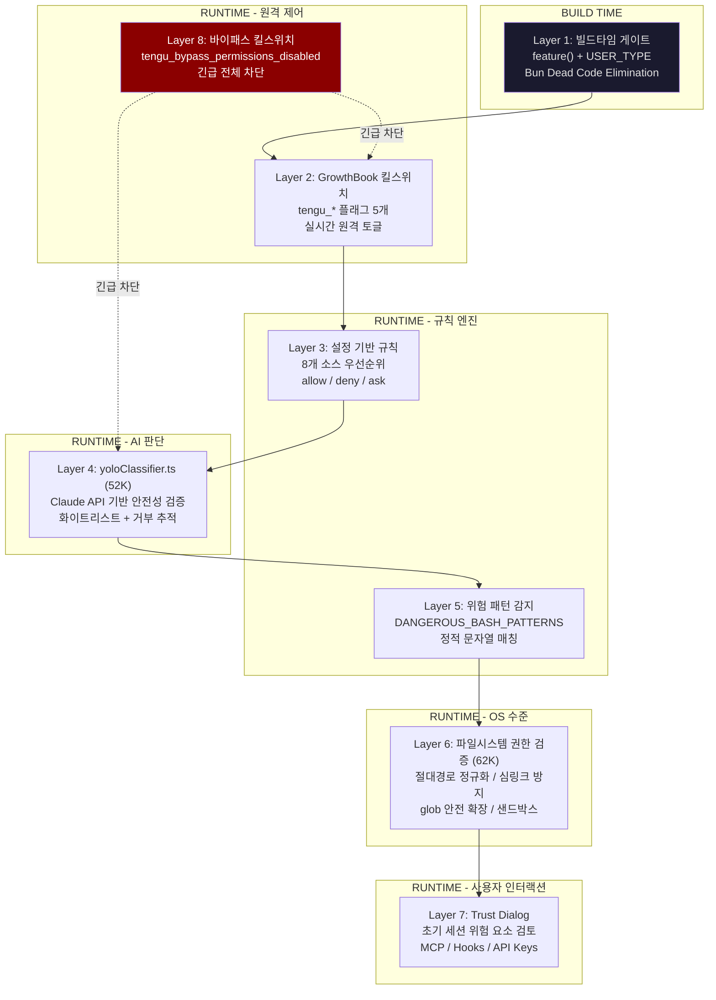

**설계 철학: Fail-Closed**

> "Claude Code does not try to make Bash perfectly safe. That would be unrealistic. Instead, it tries to make Bash analyzable enough, permissionable enough, sandboxable enough, monitorable enough, predictable enough." -- alanisme 리포트 14

모든 기본값이 안전한 방향으로 설정된다: `isConcurrencySafe` 기본값 `false`, 분류기 API 실패 시 거부, 파싱 불가 명령은 승인 요청.

---

### 8.2 Layer 1: 빌드타임 게이트

빌드 시점에 코드 자체를 제거하여, 배포된 바이너리에 민감한 기능이 물리적으로 존재하지 않도록 한다.

```typescript
// feature() + USER_TYPE 분기
// Bun 번들러가 Dead Code Elimination으로 false 브랜치를 완전 제거
function feature(flag: string): boolean {
  // 빌드 시점에 상수로 치환됨
  return FEATURE_FLAGS[flag] ?? false;
}

// 사용 예시
if (feature('voice_mode') && USER_TYPE === 'ant') {
  // 이 블록은 일반 사용자 빌드에서 완전히 제거됨
  registerVoiceModeTools();
}

// Bun 번들러 설정 (esbuild define)
// {
//   define: {
//     'USER_TYPE': JSON.stringify('external'),
//     'FEATURE_FLAGS.voice_mode': 'false',
//   }
// }
```

**빌드타임 게이트의 효과:**

| 항목 | 내부(ant) 빌드 | 외부(external) 빌드 |
|------|---------------|-------------------|
| Voice Mode | 포함 | **제거됨** |
| REPLTool | 포함 | **제거됨** |
| TungstenTool | 포함 | **제거됨** |
| SuggestBackgroundPRTool | 포함 | **제거됨** |
| Undercover Mode | 포함 | **제거됨** |
| 108개 피처 게이트 모듈 | 선택적 포함 | 대부분 제거 |

alanisme 리포트 03에서 발견된 Undercover Mode가 대표적인 빌드타임 게이트 사례이다:

> "There is NO force-OFF. This guards against model codename leaks" -- 외부 빌드에서는 데드코드로 완전 제거됨

---

### 8.3 Layer 2: GrowthBook 킬스위치

런타임에 GrowthBook 서비스에서 실시간으로 조회되는 원격 킬스위치. 사용자 알림 없이 기능을 즉시 비활성화할 수 있다.

**킬스위치 목록과 역할:**

| 킬스위치 플래그 | 대상 | 동작 |
|----------------|------|------|
| `tengu_amber_quartz_disabled` | Voice Mode | `true` = 음성 모드 전체 비활성화 |
| `tengu_bypass_permissions_disabled` | YOLO 모드 | `true` = 모든 바이패스 모드 즉시 차단 |
| `tengu_auto_mode_config` | Auto 모드 | 자동 모드 세부 설정 (enabled, 임계값 등) |
| `tengu_ccr_bridge` | Bridge | 원격 제어 브릿지 활성화 여부 |
| `tengu_sessions_elevated_auth_enforcement` | 인증 | 신뢰 장치 인증 강화 |

**tengu_* 플래그 명명 체계:**

```
tengu_ + 임의 단어 쌍 (형용사/재료 + 자연/사물)
```

의도적으로 기능을 추론할 수 없는 코드네임을 사용하는 운영 보안(OPSEC) 설계:

| 플래그 | 실제 기능 | 코드네임 유추 가능성 |
|--------|----------|-------------------|
| `tengu_onyx_plover` | Auto Dream (백그라운드 메모리 통합) | 불가 |
| `tengu_coral_fern` | Memdir 기능 | 불가 |
| `tengu_herring_clock` | Team 메모리 | 불가 |
| `tengu_frond_boric` | 분석 킬스위치 | 불가 |
| `tengu_penguins_off` | Fast 모드 비활성화 | 약간 유추 가능 |
| `tengu_amber_flint` | 에이전트 팀 | 불가 |
| `tengu_hive_evidence` | 검증 에이전트 | 불가 |
| `tengu_marble_sandcastle` | Fast 모드 관련 | 불가 |
| `tengu_harbor_ledger` | 채널 서버 허용 목록 | 불가 |

**원격 제어의 투명성 문제 (alanisme 리포트 04):**

> "There's no audit log, no notification system, no way for a user to know when their Claude Code instance has been remotely modified by a feature flag change."

| 제어 메커니즘 | 대상 | 사용자 알림 |
|-------------|------|-----------|
| 원격 관리 설정 | Enterprise/Team | 수락-또는-종료 대화상자 |
| GrowthBook 피처 플래그 | 전체 사용자 | **알림 없음** |
| 킬스위치 | 전체 사용자 | **알림 없음** |
| 모델 오버라이드 | 내부(ant) | **알림 없음** |
| Fast 모드 영구 비활성화 | 특정 사용자 | **알림 없음** |

---

### 8.4 Layer 3: 설정 기반 규칙

8개 설정 소스가 우선순위에 따라 병합되어 최종 권한 규칙을 결정한다.

**8개 소스 우선순위 (높은 순서):**

```
┌─────────────────────────────────────────────────────┐
│ 1. userSettings     ~/.claude/settings.json         │ ← 최고 우선순위
│ 2. projectSettings  .claude/settings.json           │
│ 3. localSettings    .claude/settings.local.json     │
│ 4. flagSettings     피처 플래그 설정                  │
│ 5. policySettings   조직 정책                        │
│ 6. cliArg           CLI 인자 (--allowedTools 등)     │
│ 7. command          명령어 기본값                     │
│ 8. session          세션 기본값                       │ ← 최저 우선순위
└─────────────────────────────────────────────────────┘
```

```typescript
// 설정 해석: 낮은 우선순위부터 적용 -> 높은 우선순위가 덮어씀
function resolveSettings(sources: Record<SettingSource, Settings>): Settings {
  const priority: SettingSource[] = [
    'userSettings', 'projectSettings', 'localSettings',
    'flagSettings', 'policySettings', 'cliArg', 'command', 'session'
  ];

  let resolved: Settings = {};
  for (const source of [...priority].reverse()) {
    resolved = { ...resolved, ...sources[source] };
  }
  return resolved;
}
```

**ruleBehavior 3가지 동작:**

| 동작 | 의미 | 사용 예 |
|------|------|---------|
| `allow` | 무조건 허용 | 읽기 전용 도구, 신뢰된 명령 |
| `deny` | 무조건 거부 | 위험 명령, 차단 도구 |
| `ask` | 사용자에게 확인 요청 | 불확실한 상황 (기본값) |

**권한 모드 전체 목록 (alanisme 리포트 08):**

| 모드 | 설명 | 대상 |
|------|------|------|
| `default` | 표준 대화형, 쓰기 작업마다 승인 요청 | 전체 |
| `plan` | 읽기 전용 계획 모드 | 전체 |
| `acceptEdits` | 파일 편집/특정 bash 명령 자동 승인 | 전체 |
| `bypassPermissions` | YOLO 모드, 모든 도구 자동 승인 | 전체 |
| `dontAsk` | 승인 필요 작업 자동 거부 (헤드리스 CI용) | 전체 |
| `auto` | AI 분류기 중재 모드 | **내부 전용** |
| `bubble` | 다중 에이전트 스웜 조정용 | **내부 전용** |

---

### 8.5 Layer 4: yoloClassifier.ts (52K)

자동 모드에서 도구 실행 전 Claude API를 호출하여 안전성을 검증하는 **AI 기반 보안 게이트**이다. 52KB 규모로, 보안 계층 중 가장 복잡한 로직을 포함한다.

**자동모드 검증 흐름:**

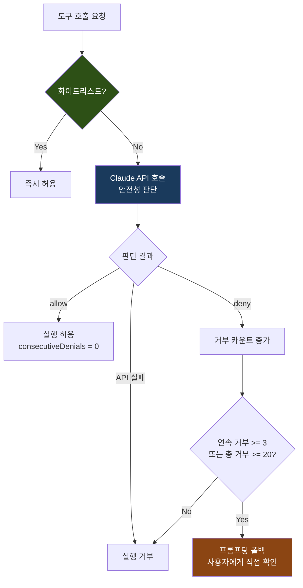

**화이트리스트 바이패스:**

읽기 전용 도구는 검증 없이 즉시 허용된다:

```typescript
private static readonly WHITELIST = new Set([
  'FileRead', 'Glob', 'Grep', 'WebSearch', 'WebFetch',
  'TodoRead', 'GitLog', 'GitDiff',
]);
```

**거부 추적 및 폴백 메커니즘:**

```typescript
// 연속 거부 3회 또는 총 거부 20회 -> 프롬프팅 폴백
// (자동 모드를 포기하고 사용자에게 직접 확인)
if (this.consecutiveDenials >= 3 || this.totalDenials >= 20) {
  return 'prompt'; // 사용자에게 직접 확인
}
```

| 임계값 | 값 | 의미 |
|--------|---|------|
| 연속 거부 한도 | 3회 | 모델이 반복 실패 패턴에 빠진 것으로 판단 |
| 총 거부 한도 | 20회 | 세션 전체에서 자동 모드의 신뢰도가 소진 |
| 폴백 동작 | `prompt` | 자동 모드 포기, 사용자 확인으로 전환 |

---

### 8.6 Layer 5: 위험 패턴 감지

정적 문자열 매칭으로 위험한 Bash 명령을 감지한다. AI 판단(Layer 4)과 독립적으로 동작하는 결정론적 보안 계층이다.

**DANGEROUS_BASH_PATTERNS 전체 배열:**

```typescript
const DANGEROUS_BASH_PATTERNS: string[] = [
  // 스크립트 인터프리터 실행
  'python',       // Python 스크립트
  'node',         // Node.js 스크립트
  'ruby',         // Ruby 스크립트

  // 네트워크 요청
  'curl',         // HTTP 요청 (데이터 유출 가능)
  'wget',         // 파일 다운로드

  // 권한 상승
  'sudo',         // 루트 권한 실행

  // 컨테이너/시스템 조작
  'docker',       // 컨테이너 생성/삭제/실행

  // 파괴적 파일 조작
  'rm -rf',       // 재귀적 강제 삭제

  // 권한/소유권 변경
  'chmod',        // 파일 권한 변경
  'chown',        // 파일 소유권 변경
];
```

**추가 Bash 보안 검사 (alanisme 리포트 08, 14):**

| 검사 카테고리 | 감지 대상 |
|-------------|----------|
| 명령 치환 감지 | `$()`, `${}`, 백틱 |
| Zsh 위험 명령 차단 | `zmodload`, `sysopen`, `ztcp`, `zf_*` 빌트인 |
| Heredoc 안전성 분석 | heredoc 내부 명령 주입 |
| 복합 명령 분리 | 최대 50개 서브커맨드로 분리 분석 |
| `sed -i` 인터셉트 | diff 미리보기 제공 후 시뮬레이션 경로로 실행 |
| tree-sitter AST 파싱 | 명령 구조를 AST로 분석하여 의미론적 보안 검사 |

**BashTool 보안 파이프라인 (8단계):**

```
명령 파싱/정규화 -> 위험 구문 패턴 감지 -> 복합 명령 세그먼트 분리
-> 서브커맨드 읽기전용/변형/알수없음 분류 -> 경로 및 파일시스템 영향 검증
-> 허용/거부 규칙 적용 -> 샌드박싱 적용 여부 결정 -> 불확실성 시 사용자 승인 요청
```

---

### 8.7 Layer 6: 파일시스템 권한 검증 (62K)

62KB 규모의 파일시스템 보안 모듈. 경로 정규화, 심링크 탈출 방지, glob 패턴 안전 확장을 담당한다.

```typescript
class FileSystemValidator {
  // 1. 절대 경로 정규화
  normalizePath(path: string): string {
    const normalized = resolve(path);
    // '..' 탈출 시도 감지, CWD 또는 허용 경로 내인지 확인
    if (!this.isWithinAllowedPaths(normalized)) {
      throw new SecurityError(`Path outside allowed directories: ${path}`);
    }
    return normalized;
  }

  // 2. 심링크 탈출 방지
  async resolveSymlink(path: string): Promise<string> {
    const real = await realpath(path);
    // 심링크 해석 후에도 허용 경로 내인지 재확인 (TOCTOU 방지)
    if (!this.isWithinAllowedPaths(real)) {
      throw new SecurityError(`Symlink escapes allowed directory: ${path} -> ${real}`);
    }
    return real;
  }

  // 3. glob 안전 확장
  safeGlob(pattern: string, cwd: string): string[] {
    const expanded = glob.sync(pattern, { cwd });
    return expanded.filter(p => this.isWithinAllowedPaths(resolve(cwd, p)));
  }
}
```

**추가 파일시스템 보안 기법:**

| 기법 | 설명 |
|------|------|
| TOCTOU 인식 | 셸 확장 구문, 틸다 변형, 심볼릭 링크 순회 처리 |
| macOS/Windows 대소문자 정규화 | 대소문자 무시 파일시스템에서의 우회 방지 |
| 맨 git 리포지토리 공격 방지 | `is_git_directory()` + `core.fsmonitor` 메커니즘 처리 |
| 설정 파일 자체 보호 | `.claude/settings.json` 및 `.claude/skills` 쓰기 무조건 거부 |
| CWD 전용 모드 | `cwd_only` 모드에서 현재 디렉토리 밖 접근 차단 |
| 샌드박싱 | macOS seatbelt, Linux bubblewrap 기반 OS 수준 격리 |

**SSRF 가드 (alanisme 리포트 08):**

> "Blocks private, link-local, and non-routable address ranges... Notably, loopback is explicitly allowed because local dev servers are a primary HTTP hook use case."

DNS rebinding 공격 방지를 위해 `dns.lookup` 콜백에서 주소 범위를 검증한다.

---

### 8.8 Layer 7: Trust Dialog

초기 세션 시작 시 잠재적 위험 요소를 사용자에게 검토하도록 한다.

```typescript
async function showTrustDialog(context: SessionContext): Promise<TrustDecision> {
  const risks: TrustRisk[] = [];

  if (context.mcpServers.length > 0)   risks.push({ type: 'mcp', servers: context.mcpServers });
  if (context.hooks.length > 0)        risks.push({ type: 'hooks', hooks: context.hooks });
  if (context.bashEnabled)             risks.push({ type: 'bash' });
  if (context.apiKeys.length > 0)      risks.push({ type: 'api_keys', keys: context.apiKeys });

  return promptUser(risks);  // 사용자에게 검토 요청
}
```

검토 대상: MCP 서버 연결, 사용자 정의 Hooks, Bash 도구 접근, API 키 노출 여부.

---

### 8.9 Layer 8: 바이패스 킬스위치

모든 바이패스 모드를 원격으로 즉시 차단하는 **최종 안전장치**이다.

```typescript
function checkBypassKillswitch(): boolean {
  // tengu_bypass_permissions_disabled가 true이면
  // YOLO 모드를 포함한 모든 바이패스가 즉시 비활성화됨
  return growthbook.getFeatureValue('tengu_bypass_permissions_disabled', false);
}
```

Layer 2(GrowthBook)와 결합하여, Anthropic이 전 세계 모든 Claude Code 인스턴스의 YOLO 모드를 실시간으로 차단할 수 있다.

---

### 8.10 보안 모델 평가

#### 강점 7가지 (alanisme 리포트 기반)

| # | 강점 | 상세 |
|---|------|------|
| 1 | **계층적 방어** | 단일 레이어에 의존하지 않음. Bash 명령 하나가 보안 검사 -> 읽기전용 검증 -> 모드 기반 확인 -> 경로 검증 -> 권한 규칙 -> 분류기 -> 샌드박스를 모두 통과해야 함 |
| 2 | **Fail-Closed 철학** | 분류기 API 실패 시 거부, 파싱 불가 명령은 승인 요청, 모호한 상황은 프롬프트 |
| 3 | **TOCTOU 인식** | 셸 확장 구문, 틸다 변형, 심볼릭 링크 순회, macOS/Windows 대소문자 정규화 처리 |
| 4 | **Zsh 공격 표면 커버리지** | `zmodload`, `sysopen`, `ztcp`, `zf_*` 빌트인 등 차단 |
| 5 | **맨 git 리포지토리 공격 방지** | `is_git_directory()` + `core.fsmonitor` 메커니즘 처리 |
| 6 | **설정 파일 자체 보호** | 샌드박스가 자체 설정 파일과 `.claude/skills` 쓰기를 무조건 거부 |
| 7 | **SSRF 가드** | DNS rebinding 공격 방지를 위한 `dns.lookup` 콜백 검증 |

#### 우려사항 5가지 (alanisme 리포트 기반)

| # | 우려 | 상세 |
|---|------|------|
| 1 | **복잡성 자체가 공격 표면** | `bashSecurity.ts`만 23개 이상의 보안 검사 카테고리 처리. 복잡성이 높을수록 취약점 발견이 어려움 |
| 2 | **분류기가 보안 경계** | AI 모델이 보안 결정을 내리는 확률적 시스템. 결정론적 보안과 달리 재현성이 없음 |
| 3 | **외부 빌드 스텁** | 외부 사용자는 분류기(Layer 4) 보호 없이 정적 규칙 + 샌드박스에만 의존 |
| 4 | **excludedCommands는 보안 경계 아님** | 사용자 편의 기능으로만 문서화되어 있으나, 사용자가 보안 기능으로 오해할 수 있음 |
| 5 | **프리승인 도메인에 업로드 가능 사이트 포함** | nuget.org 등 파일 업로드가 가능한 도메인이 사전 승인 목록에 포함 |

**다른 에이전트 시스템과의 비교:**

| 비교 대상 | Claude Code의 차별점 |
|----------|---------------------|
| Cursor / Windsurf | Claude Code는 OS 수준 샌드박싱(macOS seatbelt, Linux bubblewrap) 제공. 대부분의 IDE 기반 에이전트는 미제공 |
| Devin | Claude Code의 권한 규칙이 더 세분화 (도구 수준, 접두사 기반, 와일드카드) |
| OpenAI Codex CLI | Claude Code의 bash 보안 분석(tree-sitter AST 파싱, 23개 카테고리)이 훨씬 더 철저 |

---

## 9. 서비스 계층

### 9.1 API 클라이언트

#### claude.ts (125KB / 3,419줄)

API 통신의 핵심 모듈. `callModel()` 함수로 스트리밍 응답을 처리하며, 모델 폴백과 재시도 로직을 포함한다.

**4개 프로바이더 아키텍처:**

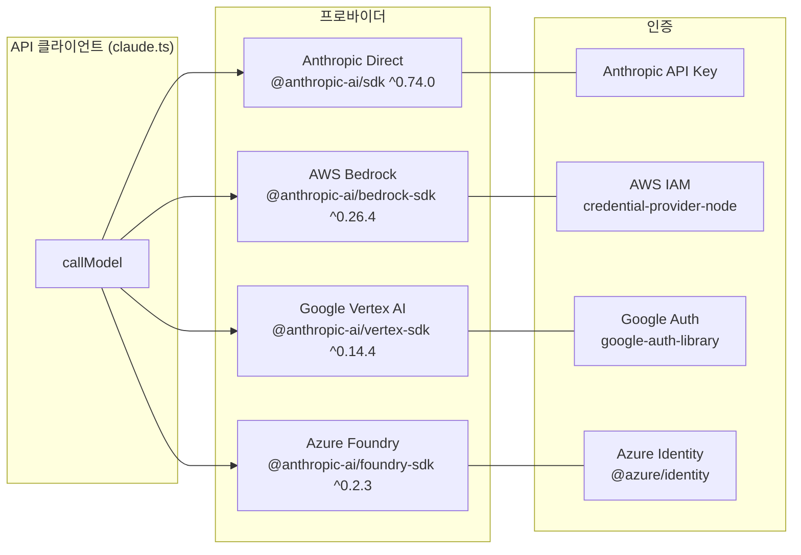

| 프로바이더 | SDK 패키지 | 인증 방식 | 모델 가격 (입력/출력) |
|-----------|-----------|----------|---------------------|
| Anthropic Direct | `@anthropic-ai/sdk` | API Key | Sonnet $3/$15, Opus 4.5/4.6 $5/$25 |
| AWS Bedrock | `@anthropic-ai/bedrock-sdk` | IAM | Bedrock 가격 정책 |
| Google Vertex AI | `@anthropic-ai/vertex-sdk` | Google Auth | Vertex 가격 정책 |
| Azure Foundry | `@anthropic-ai/foundry-sdk` | Azure Identity | Foundry 가격 정책 |

#### withRetry.ts 재시도 로직

```typescript
// FallbackTriggeredError 발생 시 fallbackModel로 전환
// 재시도 가능한 API 에러 분류: categorizeRetryableAPIError()
// - 429 (Rate Limit) -> 지수 백오프 재시도
// - 413 (Prompt Too Long) -> 압축 후 재시도
// - 500+ (서버 에러) -> 단순 재시도
// - 기타 -> 즉시 실패
```

**비용 추적 7차원 (alanisme 리포트 20):**

입력 토큰, 출력 토큰, 캐시 읽기 토큰, 캐시 생성 토큰, 웹검색 요청, USD 비용, 컨텍스트 윈도우 크기. advisor 사용량은 재귀적으로 추적된다.

---

### 9.2 MCP 통합

#### client.ts (3,348줄)

Model Context Protocol 서버와의 연결을 관리하는 핵심 모듈.

**4개 트랜스포트 구현:**

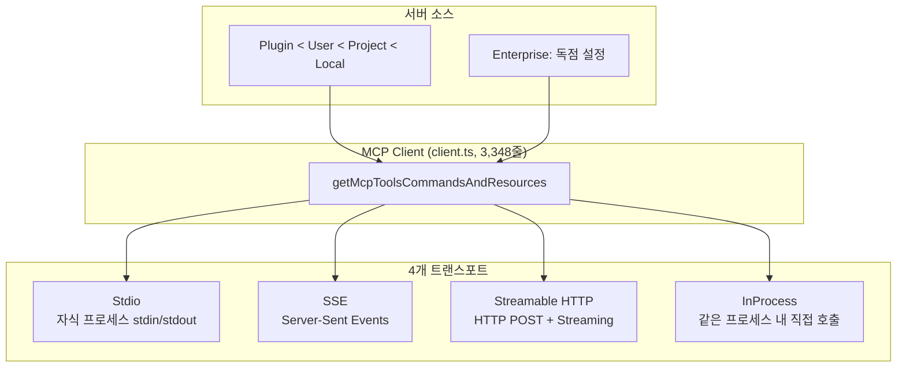

| 트랜스포트 | 프로토콜 | 사용 시나리오 |
|-----------|---------|-------------|
| **Stdio** | 자식 프로세스 stdin/stdout | 로컬 MCP 서버 (가장 일반적) |
| **SSE** | HTTP Server-Sent Events | 원격 MCP 서버 (레거시) |
| **Streamable HTTP** | HTTP POST + 스트리밍 | 원격 MCP 서버 (최신) |
| **InProcess** | 직접 함수 호출 | 내장 MCP 서버 |

**연결 관리:**

| 항목 | 값 |
|------|---|
| 자동 재연결 | 지수 백오프 (최초 1초, 최대 30초, 5회 시도) |
| 도구 호출 타임아웃 | ~27.8시간 (기본값) |
| 설정 소스 우선순위 | Plugin < User < Project < Local |
| 네임스페이스 | `mcp__serverName__toolName` (내장 도구 위장 방지) |

**인증과 레지스트리:**

- **OAuth 통합**: RFC 6749 인증 코드 플로우 + PKCE
- **macOS Keychain**: 토큰 보안 저장
- **XAA (Cross-App Access)**: 엔터프라이즈 SSO 지원
- **공식 레지스트리**: `officialRegistry.ts`에서 공식 MCP URL 프리페치

---

### 9.3 OAuth/인증

3계층 인증 아키텍처 (alanisme 리포트 17):

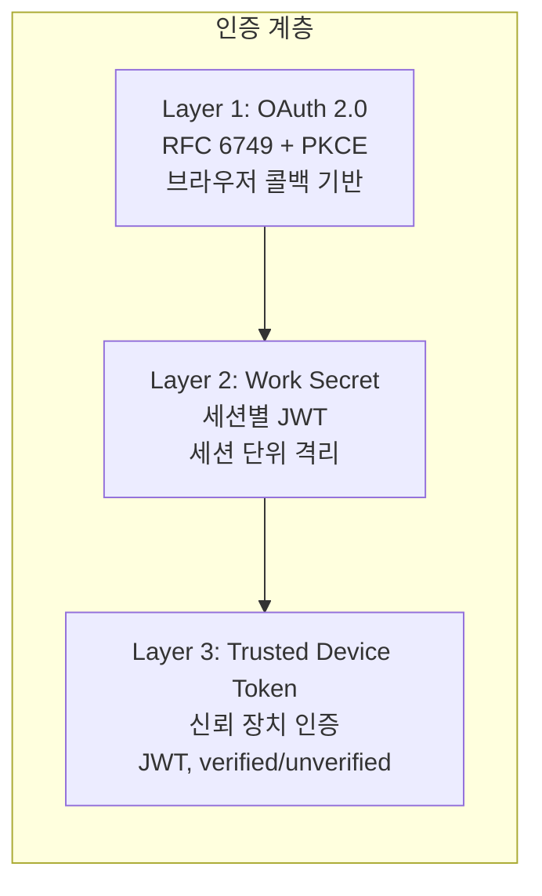

| 인증 티어 | 방식 | 용도 |
|----------|------|------|
| Standard | OAuth 2.0 + PKCE | 기본 인증, 대부분의 작업 |
| Elevated | OAuth + JWT Device Token | Bridge 원격 제어, 민감한 작업 |

---

### 9.4 Analytics

**이중 분석 파이프라인 (alanisme 리포트 01):**

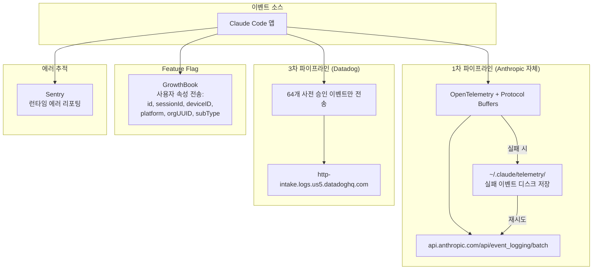

**수집 데이터 범위:**

| 카테고리 | 세부 항목 |
|---------|---------|
| 환경 핑거프린트 | OS, 아키텍처, Node 버전, 터미널 타입, 패키지 매니저, CI/CD, WSL, 리눅스 배포판 |
| 프로세스 메트릭 | uptime, RSS, heapTotal, heapUsed, CPU 사용량 |
| 사용자/세션 추적 | 모델명, 세션 ID, 사용자 ID, 기기 ID, 계정 UUID, 조직 UUID, 구독 티어 |
| 리포지토리 핑거프린팅 | git remote URL의 SHA256 해시 처음 16자 |
| 도구 입력 | 기본 512자 잘림, JSON 4096자, 배열 20개, 중첩 2레벨 |
| 파일 확장자 | bash 명령에서 사용된 파일 확장자 추출 |

**배치 설정:**

| 설정 | 값 |
|------|---|
| 배치 크기 | 200개 이벤트 |
| 플러시 간격 | 10초 |
| 실패 시 처리 | `~/.claude/telemetry/`에 디스크 저장 후 재시도 |
| Tengu 분석 이벤트 수 | 250개 이상 |
| 옵트아웃 | **직접 API 사용자는 1차 텔레메트리 비활성화 불가** |

---

### 9.5 Compact 서비스

3가지 압축 전략을 상황에 따라 선택적으로 적용한다.

**auto / reactive / snip 3전략 비교:**

| 전략 | 트리거 | API 비용 | 정보 손실 | 파일 |
|------|--------|---------|----------|------|
| **Snip** | 항상 (턴 시작) | 무료 | 높음 (오래된 메시지 삭제) | `snipCompact.ts` |
| **Auto** | 토큰 임계값 초과 (~167K/200K) | 높음 (Claude API 1회) | 낮음 (요약 생성) | `autoCompact.ts` |
| **Reactive** | PTL 413 에러 발생 시 | 높음 (긴급 Claude API) | 중간 (긴급 요약) | `reactiveCompact.ts` |

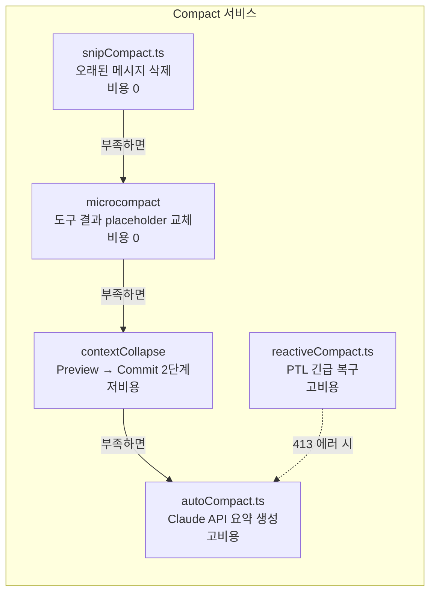

**서킷브레이커 (alanisme 리포트 11):**

> "Before the circuit breaker, some sessions were hammering the API with over 3,000 doomed compaction attempts. At scale, that was a quarter million wasted API calls per day."

최대 3회 연속 Auto-Compact 실패 시 서킷이 열리며, 더 이상 API 호출을 시도하지 않는다.

---

### 9.6 플러그인 서비스

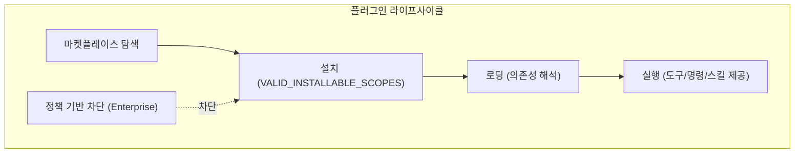

**플러그인 제공 기능:**

| 기능 유형 | 설명 |
|----------|------|
| 도구 (Tools) | 커스텀 도구 등록 |
| 명령 (Commands) | 슬래시 명령 추가 |
| 스킬 (Skills) | 프롬프트 기반 스킬 |
| MCP 서버 | 외부 MCP 서버 연결 |

**AppState의 plugins 상태:**

```typescript
plugins: {
  enabled: LoadedPlugin[]      // 활성화된 플러그인
  disabled: LoadedPlugin[]     // 비활성화된 플러그인
  commands: Command[]          // 플러그인 제공 명령
  errors: PluginError[]        // 로딩 에러
  installationStatus: { marketplaces: [...]; plugins: [...] }
  needsRefresh: boolean
}
```

---

## 10. UI 시스템

### 10.1 React 18 + Ink 터미널 렌더링

Claude Code의 UI는 **React 18 + 커스텀 Ink 포크**로 구현된 터미널 렌더링 엔진이다. 브라우저가 아닌 터미널에서 React Reconciler와 Yoga 레이아웃 엔진을 사용하여 JSX를 ANSI 이스케이프 시퀀스로 렌더링한다.

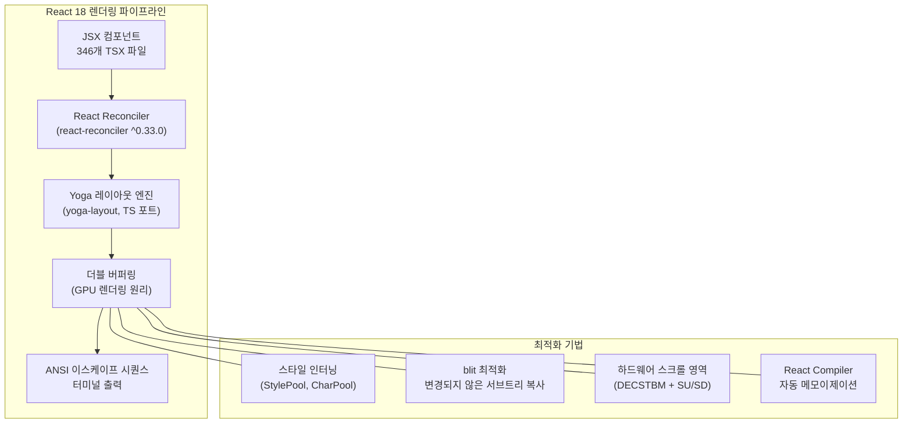

**핵심 기술 상세 (alanisme 리포트 18):**

| 기술 | 설명 |
|------|------|
| 더블 버퍼링 | GPU 렌더링과 동일 원리. 프레임 전환 시 깜빡임 방지 |
| 스타일 인터닝 | StylePool, CharPool로 동일 스타일 객체 재사용 |
| blit 최적화 | 변경되지 않은 서브트리는 이전 프레임에서 직접 복사 |
| 하드웨어 스크롤 영역 | DECSTBM + SU/SD 터미널 이스케이프로 하드웨어 가속 스크롤 |
| React Compiler | 자동 메모이제이션으로 불필요한 리렌더링 제거 |
| 목표 프레임 레이트 | 60fps (16ms 프레임 간격) |

**브라우저 DOM 이벤트 모델 포팅:**

| DOM 기능 | Ink 구현 |
|----------|---------|
| 캡처/버블 2단계 | 이벤트 전파 순서 그대로 구현 |
| 마우스 히트 테스팅 | 터미널 좌표 기반 클릭 영역 계산 |
| 포커스 매니저 | 탭 순환, 자동 포커스 |

---

### 10.2 컴포넌트 계층

총 **389개 컴포넌트 파일**(전체 코드의 20.5%)이 카테고리별로 분류되어 있다.

**카테고리별 분류:**

| 카테고리 | 파일 수 | 주요 컴포넌트 | 최대 크기 |
|----------|---------|-------------|----------|
| **메시지 시스템** | 36 | AssistantTextMessage, AssistantToolUseMessage, UserToolResultMessage | ~79KB (SystemTextMessage) |
| **권한 다이얼로그** | 32 | PermissionRequest, BashPermissionRequest, FilePermissionDialog | ~33KB (PermissionRequest) |
| **디자인 시스템** | 18 | Dialog, FuzzyPicker, Tabs, ThemedBox/Text, ThemeProvider | ~41KB (Tabs) |
| **에이전트 UI** | 16 | AgentProgressLine, AgentView, AgentOutput | - |
| **MCP UI** | 15 | MCPServerUI, MCPToolList, MCPResourceView | - |
| **레이아웃** | ~20 | FullscreenLayout, ScrollBox, StatusLine, Footer | - |
| **입력** | ~15 | PromptInput, BaseTextInput, QuickOpenDialog | - |
| **기타** | ~237 | Attachment, Notification, DiffDialog, Export 등 | ~76KB (ContextVisualization) |

**렌더링 계층 구조:**

```
REPL.tsx (메인 화면, 4,500줄)
├── FullscreenLayout
│   ├── ScrollBox (스크롤 가능 영역)
│   │   ├── Message 컴포넌트들
│   │   │   ├── AssistantTextMessage
│   │   │   ├── AssistantToolUseMessage (~45KB)
│   │   │   ├── UserToolResultMessage
│   │   │   └── SystemTextMessage (~79KB)
│   │   └── AgentProgressLine
│   ├── PromptInput (하단 고정 입력)
│   │   ├── BaseTextInput
│   │   ├── Footer
│   │   └── Notifications
│   └── StatusLine (상태바)
├── 모달 다이얼로그
│   ├── PermissionRequest (~33KB)
│   ├── QuickOpenDialog
│   └── DiffDialog
└── 특수 뷰
    ├── ContextVisualization (~76KB)
    └── AttachmentMessage (~71KB)
```

---

### 10.3 상태관리

**이중 레이어 구조 (alanisme 리포트 12):**

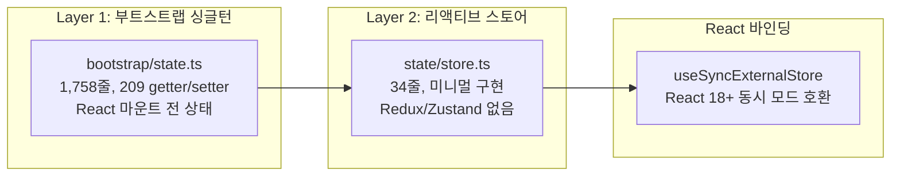

**AppState (100+ 필드) + useSyncExternalStore 패턴:**

```typescript
// store.ts - 34줄의 미니멀 외부 스토어
export type Store<T> = {
  getState: () => T
  setState: (updater: (prev: T) => T) => void
  subscribe: (listener: () => void) => () => void
}

// AppState.tsx - React 바인딩
export function useAppState<T>(selector: (state: AppState) => T): T {
  const store = useAppStore()
  const get = () => selector(store.getState())
  return useSyncExternalStore(store.subscribe, get, get)
}
```

**AppState 주요 필드 그룹:**

| 그룹 | 필드 수 | 주요 필드 |
|------|---------|----------|
| 설정 | ~10 | `settings`, `verbose`, `mainLoopModel`, `agent` |
| 원격/브릿지 | 15+ | `remoteSessionUrl`, `remoteConnectionStatus`, `replBridgeEnabled` |
| UI 상태 | ~10 | `expandedView`, `isBriefOnly`, `footerSelection`, `statusLineText` |
| MCP | ~5 | `mcp.clients`, `mcp.tools`, `mcp.commands`, `mcp.resources` |
| 플러그인 | ~6 | `plugins.enabled`, `plugins.disabled`, `plugins.errors` |
| 태스크 | ~3 | `tasks`, `todos`, `agentNameRegistry` |
| 알림/입력 | ~4 | `notifications`, `elicitation`, `thinkingEnabled` |
| 기타 | 40+ | `fileHistory`, `attribution`, `speculation`, `sessionHooks` 등 |

**DeepImmutable 타입으로 불변성 강제:**

```typescript
export type AppState = DeepImmutable<{
  settings: SettingsJson
  verbose: boolean
  mainLoopModel: ModelSetting
  // ... 대부분의 필드
}> & {
  // Mutable 필드 (Map, 복잡한 객체 등은 DeepImmutable 제외)
  tasks: { [taskId: string]: TaskState }
  agentNameRegistry: Map<string, AgentId>
  mcp: { clients: MCPServerConnection[]; tools: Tool[]; /* ... */ }
}
```

**핵심 설계 특성:**

| 특성 | 설명 |
|------|------|
| Redux/Zustand 없음 | 34줄의 자체 구현으로 외부 의존성 제거 |
| `Object.is` 체크 | 셀렉터 반환값이 참조 동일하면 리렌더링 스킵 |
| `onChangeAppState` 콜백 | 상태 변경 사이드이펙트 처리 (비React 코드와 연동) |
| 동시 모드 호환 | `useSyncExternalStore`로 React 18 Concurrent Mode 안전 |

---

### 10.4 터미널 테마

6개 내장 테마를 `/theme` 슬래시 명령으로 전환할 수 있다.

| 테마 | 설명 | 시각적 특성 |
|------|------|-----------|
| **Default** | 기본 테마 | 시스템 터미널 색상 활용 |
| **Dark** | 어두운 배경 | 고대비 밝은 텍스트 |
| **Light** | 밝은 배경 | 어두운 텍스트 |
| **Solarized Dark** | Solarized 다크 변형 | 따뜻한 톤의 다크 |
| **Solarized Light** | Solarized 라이트 변형 | 차분한 라이트 |
| **Monokai** | Monokai 색상 팔레트 | 개발자 친화적 고채도 |

**테마 시스템 구현:**

```
components/
├── design/ThemedBox.tsx     -- 테마 인식 박스 컴포넌트
├── design/ThemedText.tsx    -- 테마 인식 텍스트 컴포넌트
├── design/ThemeProvider.tsx -- 테마 컨텍스트 제공자
└── design/themes/           -- 테마 정의 파일들
```

테마는 `ThemeProvider`를 통해 React Context로 전파되며, `ThemedBox`와 `ThemedText` 컴포넌트가 현재 테마에 따라 색상을 자동 적용한다. chalk 라이브러리의 ANSI 256색 + TrueColor 지원을 활용한다.

---

## 부록: 서비스 계층 전체 맵

| 서비스 | 파일 | 핵심 역할 |
|--------|------|----------|
| **api/** | claude.ts, withRetry.ts, errors.ts, bootstrap.ts 등 | Claude API 통신, 4개 프로바이더, 재시도 |
| **mcp/** | client.ts (3,348줄), types.ts, officialRegistry.ts 등 | MCP 서버 연결, 4개 트랜스포트 |
| **oauth/** | OAuth 2.0 + PKCE | 인증 플로우 |
| **analytics/** | index.ts, growthbook.ts, sink.ts | 텔레메트리, 피처 플래그 |
| **compact/** | autoCompact.ts, snipCompact.ts, reactiveCompact.ts | 컨텍스트 압축 |
| **tools/** | StreamingToolExecutor, toolOrchestration | 도구 병렬/직렬 실행 엔진 |
| **lsp/** | LSP 클라이언트 | 코드 인텔리전스 |
| **plugins/** | 플러그인 CLI 명령 | 마켓플레이스, 설치, 차단 |
| **policyLimits/** | 레이트 리밋 | 정책 제한 로드/갱신 |
| **remoteManagedSettings/** | 원격 관리 | 엔터프라이즈 원격 설정 |
| **settingsSync/** | 동기화 | 설정 클라우드 동기화 |
| **teamMemorySync/** | 팀 메모리 | 팀 간 메모리 공유 |
| **SessionMemory/** | 세션 메모리 | 포크 에이전트가 백그라운드 메모리 업데이트 |
| **extractMemories/** | 메모리 추출 | 대화 종료 시 지속 메모리 추출 |
| **autoDream/** | Auto Dream | 백그라운드 메모리 통합 |
| **contextCollapse/** | 컨텍스트 축소 | Preview -> Commit 2단계 |
| **tips/** | 팁 레지스트리 | 사용자 팁 표시 |
| **PromptSuggestion/** | 프롬프트 제안 | 입력 자동완성 제안 |
| **MagicDocs/** | 문서 자동 생성 | - |
| **AgentSummary/** | 에이전트 요약 | - |
| **toolUseSummary/** | 도구 사용 요약 | Haiku 모델로 요약 생성 |
| **skillSearch/** | 스킬 검색 | 로컬 인덱스, 프리페치 |
# Claude Code 아키텍처 심층 분석 (Part C)

> Phase 1 블로그 분석 + Phase 2 리포지토리 6개 교차 분석 종합
> 섹션 11~15 + 부록 A~D

---

## 11. 미공개 기능

### 11.1 Voice Mode

OAuth 전용 인증을 요구하며, `voice_stream` 엔드포인트를 사용하는 음성 입출력 기능이다. GrowthBook 킬스위치 `tengu_amber_quartz_disabled`로 원격 비활성화가 가능하다.

```typescript
// Voice Mode 활성화 조건
function canEnableVoiceMode(context: ToolUseContext): boolean {
  return (
    feature('VOICE_MODE') &&
    context.authType === 'oauth' &&    // API 키 불가, OAuth 전용
    !growthbook.getFeatureValue('tengu_amber_quartz_disabled', false)
  );
}
```

네이티브 오디오 캡처는 Rust NAPI 기반 `audio-capture` 모듈로 구현되며, 6개 플랫폼(darwin/linux/win32 x x64/arm64)용 `.node` 바이너리가 존재한다. 원본 소스에서 `voice/` 디렉토리는 54줄의 피처 게이트로, `VOICE_MODE` 플래그 뒤에서 완전히 제어된다.

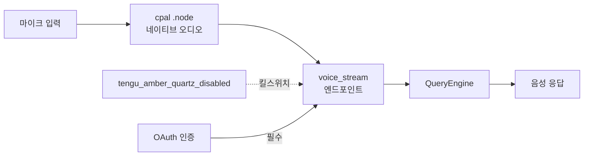

### 11.2 WebBrowserTool (코드네임: Bagel)

실제 브라우저 자동화 도구로, Bun WebView API를 사용하여 페이지 탐색, 클릭, 타이핑, 스크린샷, 콘텐츠 추출이 가능하다.

```typescript
class WebBrowserTool implements Tool {
  name = 'WebBrowser';

  async execute(params: {
    url: string;
    action: 'navigate' | 'click' | 'type' | 'screenshot' | 'extract';
    selector?: string;
    text?: string;
  }): Promise<BrowserResult> {
    const page = await this.getOrCreatePage();
    switch (params.action) {
      case 'navigate': await page.goto(params.url); break;
      case 'click':    await page.click(params.selector!); break;
      case 'type':     await page.type(params.selector!, params.text!); break;
      case 'screenshot': return { screenshot: await page.screenshot() };
      case 'extract':    return { content: await page.evaluate('document.body.innerText') };
    }
    return { success: true };
  }
}
```

alanisme 분석에 따르면, 내부 코드네임 "bagel"로 참조되며 피처 플래그 뒤에서 게이팅되어 있다.

### 11.3 Coordinator Mode (19K)

메타 오케스트레이터로, 여러 서브에이전트를 동시에 관리하며 각 에이전트를 독립된 Git Worktree에서 격리 실행한다.

```typescript
// Coordinator가 허용하는 도구는 4개뿐
const COORDINATOR_MODE_ALLOWED_TOOLS = [
  'AgentTool',        // 서브에이전트 생성/관리
  'TaskStop',         // 작업 중단
  'SendMessage',      // 에이전트 간 메시지 전송
  'SyntheticOutput',  // 합성 출력 생성
];

interface CoordinatorState {
  agents: Map<string, AgentInstance>;
  sharedScratchpad: SharedMemory;     // 에이전트 간 공유 메모리
  gitWorktrees: Map<string, string>;  // 에이전트별 독립 Worktree
}
```

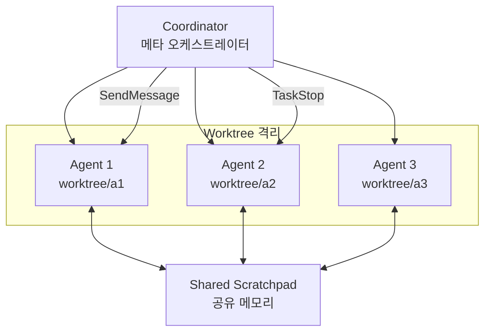

leaf-kit 분석에 따르면 `coordinator/` 디렉토리는 369줄의 멀티워커 오케스트레이션 모듈이며, alanisme 분석에서는 서브에이전트가 부모와 동일한 `query()` 함수를 사용하되 격리된 도구 풀과 MCP 서버를 가진다고 밝히고 있다.

### 11.4 Kairos (프로액티브 에이전트)

사용자 요청 없이 자발적으로 작업하는 자율 에이전트 모드이다. 터미널 포커스를 감지하여 사용자 부재 시 더 독립적으로 행동한다.

```typescript
// Kairos 전용 도구 세트
const KAIROS_TOOLS = {
  SendUserFile:      '사용자에게 파일을 능동적으로 전송',
  PushNotification:  '모바일/데스크톱 푸시 알림',
  SubscribePR:       'GitHub PR 이벤트 구독 (리뷰, CI 결과)',
  Sleep:             '주기적 깨어남을 위한 슬립',
  Brief:             '상황 요약 브리핑',
};
```

alanisme 리포트 05에서 발견된 Kairos 시스템 프롬프트:

> "You are running autonomously. You will receive `<tick>` prompts that keep you alive between turns. If you have nothing useful to do, call SleepTool. Bias toward action."

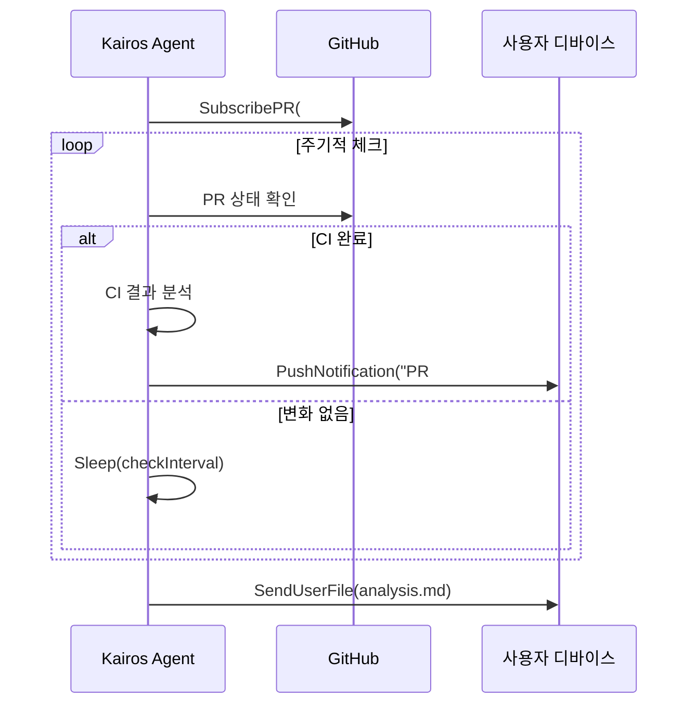

### 11.5 Bridge (33+ 파일)

OAuth에서 CCR(Claude Code Remote) API를 거쳐 WebSocket 터널로 연결되는 원격 제어 인프라이다.

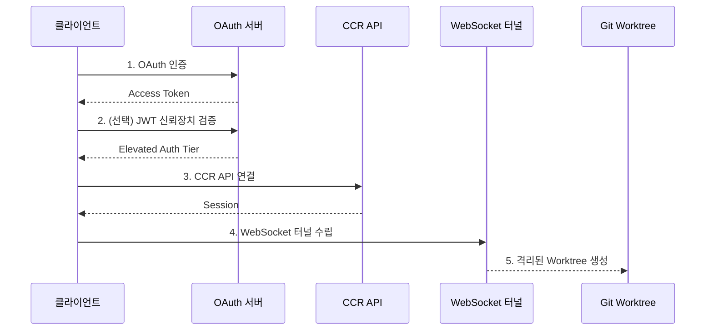

**3계층 인증 티어:**

| 티어 | 인증 방식 | 권한 범위 |
|------|-----------|-----------|
| Standard | OAuth 2.0 | 기본 원격 제어 |
| Elevated | OAuth + JWT Device Token | 확장된 권한 (민감한 작업) |
| Work Secret | 세션별 JWT | 세션 격리 보장 |

**멀티세션 관리:**
- 3가지 스폰 모드: `single-session`, `same-dir`, `worktree`
- 최대 32개 동시 세션
- 수면 감지: 틱 간격이 2배 초과 시 에러 예산 리셋
- 30초 대기 후 SIGKILL 에스컬레이션

### 11.6 Agent Triggers/Monitoring

```typescript
// Cron 기반 트리거 -- 3개 도구
class ScheduleCronTool  { /* cron 표현식으로 작업 예약 */ }
class CronDeleteTool    { /* 예약된 작업 삭제 */ }
class CronListTool      { /* 예약된 작업 목록 */ }

// 원격 트리거
class RemoteTriggerTool { /* 외부 이벤트(웹훅)로 에이전트 실행 트리거 */ }

// 모니터링
class MonitorTool       { /* 시스템/프로세스 상태 모니터링 */ }
```

| 도구 | 피처 플래그 | 상태 |
|------|-----------|------|
| ScheduleCron | `AGENT_TRIGGERS` | 구현 완료, 게이트 |
| RemoteTrigger | `AGENT_TRIGGERS_REMOTE` | 구현 완료, 게이트 |
| Monitor | `MONITOR_TOOL` | 구현 완료, 게이트 |

### 11.7 Buddy System (가상 펫)

사용자 ID 해시 기반으로 결정론적으로 생성되는 컴패니언 캐릭터 시스템이다. leaf-kit 분석에 따르면 `buddy/` 모듈은 1,298줄이다.

| 속성 | 값 |
|------|-----|
| 종족 수 | 18종 |
| 희귀도 단계 | 5단계 |
| 모자 종류 | 7종 |
| 스탯 | DEBUGGING, PATIENCE, CHAOS, WISDOM, SNARK |
| 생성 방식 | 사용자 ID SHA256 해시 기반 결정론적 |

### 11.8 UDS Inbox (멀티디바이스 메시징)

Unix Domain Socket 기반의 에이전트 간 통신 시스템이다.

```typescript
interface UDSInbox {
  schemes: ['bridge://', 'other://'];
  send(to: DeviceId, message: InboxMessage): Promise<void>;
  subscribe(callback: (msg: InboxMessage) => void): Unsubscribe;
}

// ListPeersTool -- UDS로 피어 에이전트 발견
class ListPeersTool implements Tool {
  name = 'ListPeers';
  featureFlag = 'UDS_INBOX';
}
```

### 11.9 Workflow Scripts

번들 자동화 스크립트로, 서브에이전트 재귀 실행을 차단하여 무한 루프를 방지한다.

```typescript
interface WorkflowScript {
  name: string;
  steps: WorkflowStep[];
  maxRecursionDepth: 0;  // 재귀 차단
}
```

### 11.10 Undercover Mode (alanisme 기반)

Anthropic 직원(`USER_TYPE === 'ant'`)이 외부 리포지토리에서 작업할 때 자동 활성화되는 스텔스 모드이다.

**핵심 지시문:**

> "Do not blow your cover."
> "Write commit messages as a human developer would -- describe only what the code change does."

**특징:**
- 강제 해제 불가 ("There is NO force-OFF. This guards against model codename leaks")
- Co-Authored-By 라인 자동 제거
- AI 생성 마커 제거
- 모델명 마스킹: `capybara-v2-fast` -> `cap*****-v2-fast`
- 외부 빌드에서는 데드코드 제거(DCE)로 완전히 삭제됨

---

## 12. 코드네임과 피처 플래그

### 12.1 모델 코드네임 체계

| 코드네임 | 실체 | 비고 |
|---------|------|------|
| **Tengu** (천구) | 제품/텔레메트리 접두사 | 250+ 분석 이벤트, 모든 GrowthBook 플래그에 `tengu_` 접두사 |
| **Capybara** (카피바라) | Sonnet 계열 (현재 v8) | `capybara-v2-fast[1m]`, 허위 주장율 29-30% |
| **Fennec** (페넥여우) | Opus 4.6 전신 | `fennec-latest` -> `opus` 마이그레이션 |
| **Numbat** (넘벳) | 차기 모델 | "Remove this section when we launch numbat" |
| **Penguin** (펭귄) | Fast 모드 | `tengu_penguins_off`로 제어 |
| **Bagel** (베이글) | WebBrowserTool | 내부 코드네임 |

예정된 모델 버전: Opus 4.7, Sonnet 4.8 (언더커버 모드 지시문에서 발견). 코드베이스에 `@[MODEL LAUNCH]` 마커 20개 이상 산재.

### 12.2 feature() 플래그 카탈로그

원본 소스 196개 파일에서 `import { feature } from 'bun:bundle'`을 사용한다. 빌드 시 `feature()` 호출이 `true`/`false` 상수로 치환되어, `false` 브랜치는 DCE(Dead Code Elimination)로 완전 제거된다.

**핵심 피처 플래그 분류:**

| 카테고리 | 플래그 | 설명 |
|----------|--------|------|
| **에이전트 모드** | `PROACTIVE` | 프로액티브 에이전트 |
| | `KAIROS` | 자율 에이전트 |
| | `COORDINATOR_MODE` | 멀티에이전트 오케스트레이션 |
| | `AGENT_TRIGGERS` | 에이전트 트리거 (Cron) |
| | `AGENT_TRIGGERS_REMOTE` | 원격 트리거 |
| **통신** | `BRIDGE_MODE` | IDE 브릿지 |
| | `DAEMON` | 데몬 모드 |
| | `UDS_INBOX` | 멀티디바이스 메시징 |
| **입출력** | `VOICE_MODE` | 음성 모드 |
| | `TERMINAL_PANEL` | 터미널 패널 캡처 |
| **자동화** | `WORKFLOW_SCRIPTS` | 워크플로 자동화 |
| | `MONITOR_TOOL` | 시스템 모니터링 |
| **내부** | `DUMP_SYSTEM_PROMPT` | 시스템 프롬프트 덤프 |
| | `ABLATION_BASELINE` | 어블레이션 테스트 베이스라인 |
| **모델** | `KAIROS_GITHUB_WEBHOOKS` | GitHub 웹훅 통합 |

xtherk의 `bunBundleShim.js`를 통해 이 플래그들을 환경변수 `CLAUDE_CODE_FEATURES=FLAG_A,FLAG_B`로 런타임 제어 가능하다.

### 12.3 GrowthBook 킬스위치 목록

명명 규칙: `tengu_` + 임의 단어 쌍 (형용사/재료 + 자연/사물). 의도적으로 기능 추론을 방지하는 운영 보안 설계.

| 킬스위치 플래그 | 기능 |
|----------------|------|
| `tengu_amber_quartz_disabled` | 음성 모드 킬스위치 |
| `tengu_bypass_permissions_disabled` | 권한 바이패스 킬스위치 |
| `tengu_auto_mode_config` | 자동 모드 설정 |
| `tengu_ccr_bridge` | CCR 원격 브릿지 |
| `tengu_sessions_elevated_auth_enforcement` | 신뢰 장치 인증 강화 |
| `tengu_onyx_plover` | Auto Dream (백그라운드 메모리 통합) |
| `tengu_coral_fern` | Memdir 기능 |
| `tengu_herring_clock` | Team 메모리 |
| `tengu_sedge_lantern` | Away Summary |
| `tengu_frond_boric` | 분석 킬스위치 |
| `tengu_amber_flint` | 에이전트 팀 |
| `tengu_hive_evidence` | 검증 에이전트 |
| `tengu_penguins_off` | Fast 모드 비활성화 |
| `tengu_marble_sandcastle` | Fast 모드 관련 |
| `tengu_ant_model_override` | 내부 사용자 모델 오버라이드 |
| `tengu_bridge_repl_v2` | env-less 브릿지 |
| `tengu_ccr_bridge_multi_session` | 멀티세션 브릿지 |
| `tengu_harbor_ledger` | 채널 서버 허용 목록 |

---

## 13. 플러그인 에코시스템

### 13.1 14개 공식 플러그인 카탈로그

anthropics/claude-code 리포지토리에 등록된 공식 플러그인 전체 분석:

| # | 플러그인 | 카테고리 | 핵심 역할 | 주요 구성 |
|---|---------|----------|-----------|-----------|
| 1 | **agent-sdk-dev** | development | Agent SDK 프로젝트 생성/검증 | `/new-sdk-app` 커맨드, Python/TS 검증 에이전트 |
| 2 | **claude-opus-4-5-migration** | development | Opus 4.5 마이그레이션 자동화 | 모델 문자열/베타 헤더/프롬프트 자동 조정 스킬 |
| 3 | **code-review** | productivity | 5개 병렬 Sonnet 에이전트 PR 리뷰 | 신뢰도 기반 false positive 필터링 |
| 4 | **commit-commands** | productivity | Git 워크플로우 자동화 | `/commit`, `/commit-push-pr`, `/clean_gone` |
| 5 | **explanatory-output-style** | learning | 교육적 인사이트 주입 | SessionStart 훅으로 컨텍스트 주입 |
| 6 | **feature-dev** | development | 7단계 구조화 기능 개발 | 탐색->설계->구현->리뷰 사이클, 3개 전문 에이전트 |
| 7 | **frontend-design** | development | 프로덕션급 프론트엔드 생성 | 대담한 디자인/타이포/애니메이션 가이드 스킬 |
| 8 | **hookify** | productivity | 커스텀 훅 자동 생성 | **가장 복잡한 플러그인**, Python 코어 엔진, 4개 훅 이벤트 |
| 9 | **learning-output-style** | learning | 인터랙티브 학습 모드 | 5~10줄 코드 기여 요청 |
| 10 | **plugin-dev** | development | 플러그인 개발 종합 툴킷 | **가장 방대한 문서**, 7개 스킬, 3개 에이전트 |
| 11 | **pr-review-toolkit** | productivity | 6개 전문 에이전트 PR 리뷰 | comments/tests/errors/types/code/simplify |
| 12 | **ralph-wiggum** | development | 반복적 개발 루프 | **Stop 훅으로 세션 종료 가로채기** |
| 13 | **security-guidance** | security | 파일 편집 시 보안 패턴 감시 | 9개 보안 패턴 (XSS, 주입, 역직렬화 등) |
| 14 | (리포 자체) | operations | 이슈 관리 자동화 | triage-issue, dedupe, commit-push-pr |

### 13.2 플러그인 표준 구조

```
plugin-name/
├── .claude-plugin/
│   └── plugin.json          # 메타데이터 (name, version, description, author)
├── commands/                # 슬래시 커맨드 (마크다운)
│   └── my-command.md        # frontmatter + 프롬프트
├── agents/                  # 전문 에이전트 (마크다운)
│   └── my-agent.md          # 에이전트 시스템 프롬프트
├── skills/                  # 스킬 정의
│   └── SKILL.md             # 트리거 조건 + 지시사항
├── hooks/                   # 이벤트 핸들러
│   ├── hooks.json           # 훅 설정 (이벤트→스크립트 매핑)
│   └── pretooluse.py        # 실행 스크립트
├── .mcp.json                # MCP 서버 설정 (선택)
└── README.md
```

### 13.3 설정 프로파일 비교

| 항목 | lax | strict | sandbox |
|------|-----|--------|---------|
| `disableBypassPermissionsMode` | disable | disable | - |
| Bash 도구 권한 | 기본값 | `ask` (항상 승인 필요) | 샌드박스 내 |
| WebSearch/WebFetch | 기본값 | `deny` (완전 차단) | 기본값 |
| `allowManagedPermissionRulesOnly` | - | `true` | `true` |
| `allowManagedHooksOnly` | - | `true` | - |
| `strictKnownMarketplaces` | `[]` (전체 차단) | `[]` (전체 차단) | - |
| 네트워크 격리 | - | 완전 격리 | - |
| 샌드박스 명시적 활성화 | - | - | `true` |
| `allowUnsandboxedCommands` | - | - | `false` |
| `autoAllowBashIfSandboxed` | - | `false` | `false` |

> 참고: `sandbox` 속성은 Bash 도구에만 적용되며, Read/Write/WebSearch/MCP/훅에는 적용되지 않음

### 13.4 Hook 시스템 이벤트 전체 목록

CHANGELOG와 플러그인 분석을 통해 파악된 전체 훅 이벤트:

| 훅 이벤트 | 시점 | 사용 플러그인 |
|-----------|------|-------------|
| `PreToolUse` | 도구 실행 전 | hookify, security-guidance |
| `PostToolUse` | 도구 실행 후 | hookify |
| `Stop` | 세션 종료 시도 | hookify, ralph-wiggum |
| `SubagentStop` | 서브에이전트 종료 | - |
| `StopFailure` | 종료 실패 (v2.1.78) | - |
| `SessionStart` | 세션 시작 | learning-output-style, explanatory-output-style |
| `SessionEnd` | 세션 종료 | - |
| `UserPromptSubmit` | 사용자 입력 제출 (v1.0.54) | hookify |
| `PreCompact` | 컴팩션 전 (v1.0.48) | - |
| `PostCompact` | 컴팩션 후 | - |
| `Setup` | 리포 설정/유지보수 | - |
| `TaskCreated` | 태스크 생성 (v2.1.84) | - |
| `TaskCompleted` | 태스크 완료 | - |
| `TeammateIdle` | 팀원 유휴 | - |
| `WorktreeCreate` | 워크트리 생성 | - |
| `WorktreeRemove` | 워크트리 제거 | - |
| `CwdChanged` | 작업 디렉토리 변경 (v2.1.83) | - |
| `FileChanged` | 파일 변경 (v2.1.83) | - |
| `ConfigChange` | 설정 변경 (v2.1.47) | - |
| `InstructionsLoaded` | CLAUDE.md/규칙 로드 (v2.1.69) | - |
| `Elicitation` | MCP 정보 요청 (v2.1.76) | - |
| `ElicitationResult` | MCP 정보 응답 | - |

**훅 종료 코드 규약:**
- `exit(0)`: 도구 실행 허용
- `exit(1)`: stderr를 사용자에게 표시, Claude에게는 비노출
- `exit(2)`: 도구 실행 차단, stderr를 Claude에게 표시

### 13.5 CHANGELOG 주요 마일스톤

```mermaid
gantt
    title Claude Code 릴리스 타임라인
    dateFormat X
    axisFormat %s
    
    section v0.2.x 기반
    커스텀 슬래시 커맨드 (0.2.31)    :a1, 0, 1
    Thinking 모드 (0.2.44)           :a2, 1, 2
    자동 컴팩션 (0.2.47)             :a3, 2, 3
    WebFetch 도구 (0.2.53)           :a4, 3, 4
    
    section v1.0.x 프로덕션
    Hooks 시스템 (1.0.38)            :b1, 4, 5
    네이티브 Windows (1.0.51)        :b2, 5, 6
    커스텀 서브에이전트 (1.0.60)     :b3, 6, 7
    Opus 4.1 업그레이드 (1.0.69)     :b4, 7, 8
    
    section v2.0.x 메이저
    백그라운드 에이전트 (2.0.60)     :c1, 8, 9
    Chrome 확장 연동 (2.0.72)        :c2, 9, 10
    LSP 도구 (2.0.74)               :c3, 10, 11
    
    section v2.1.x 현재
    Opus 4.6 + 에이전트 팀 (2.1.32) :d1, 11, 12
    Sonnet 4.6 (2.1.45)             :d2, 12, 13
    worktree 플래그 (2.1.49)        :d3, 13, 14
    1M 컨텍스트 (2.1.75)            :d4, 14, 15
    채널 연구 프리뷰 (2.1.80)       :d5, 15, 16
```

---

## 14. 배포 인프라

### 14.1 Docker 멀티스테이지 빌드 + Caddy TLS

nirholas 리포에서 제공하는 프로덕션 배포 구성:

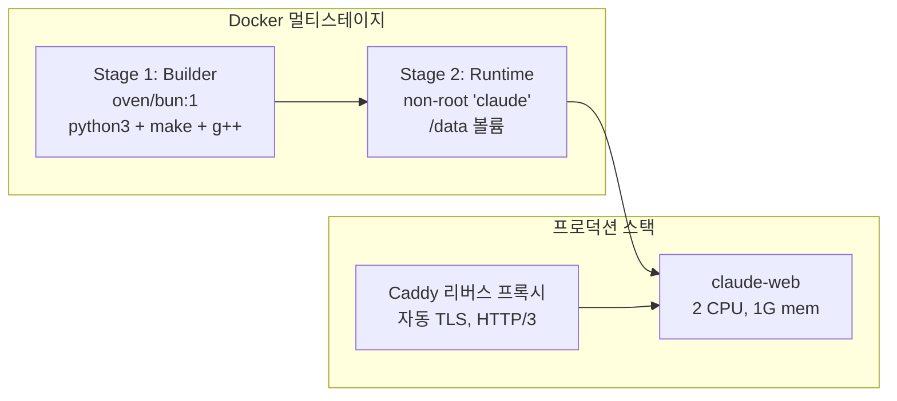

| 파일 | 용도 |
|------|------|
| `Dockerfile.all-in-one` | 2-stage: Bun builder + runtime, `node-pty` 네이티브 C++ 컴파일 |
| `docker-compose.yml` | 단일 서비스 개발용 |
| `docker-compose.prod.yml` | 멀티서비스: claude-web + Caddy |
| `Caddyfile` | 자동 HTTPS/Let's Encrypt, HTTP/3 |

**프로덕션 설정:**
- 리소스 제한: 2 CPU, 1G 메모리
- 용량 관리: `MAX_SESSIONS`, `MAX_SESSIONS_PER_USER`, `MAX_SESSIONS_PER_HOUR`
- 인증 모드: token / oauth / apikey
- 헬스 체크: `curl -f http://localhost:3000/health/live`

### 14.2 Helm 차트 (HPA, PDB, PVC)

```
helm/claude-code/
├── Chart.yaml              # appVersion: "latest"
├── values.yaml             # 기본 설정값
└── templates/
    ├── deployment.yaml     # 디플로이먼트
    ├── service.yaml        # ClusterIP:80 -> 3000
    ├── ingress.yaml        # WebSocket 지원
    ├── hpa.yaml            # 오토스케일링 (2-10 replicas)
    ├── pdb.yaml            # Pod Disruption Budget
    ├── pvc.yaml            # 10Gi Persistent Volume
    ├── secret.yaml         # API 키, 세션 시크릿
    ├── configmap.yaml      # 설정
    └── serviceaccount.yaml # 서비스 어카운트
```

| 설정 항목 | 기본값 |
|-----------|--------|
| 오토스케일링 | min 2 ~ max 10 replicas |
| CPU 기준 | 70% |
| Memory 기준 | 80% |
| PDB minAvailable | 1 |
| 리소스 requests | 256Mi / 250m |
| 리소스 limits | 512Mi / 500m |
| 보안 | runAsNonRoot, drop ALL capabilities |

### 14.3 Grafana 대시보드 4개

| 대시보드 | 메트릭 |
|---------|--------|
| **Overview** | 전체 현황, 활성 세션, 요청률 |
| **Conversations** | 대화 메트릭, 턴 수, 도구 사용 분포 |
| **Costs** | 토큰 사용량, 모델별 비용, 캐시 히트율 |
| **Infrastructure** | CPU/메모리, 네트워크, 디스크 I/O |

데이터소스: **Prometheus** (메트릭, 15s 간격) + **Loki** (로그, maxLines 1000)

### 14.4 웹 UI (Next.js App Router)

nirholas 리포에서 자체 구현한 100+ 컴포넌트의 브라우저 기반 Claude Code 경험:

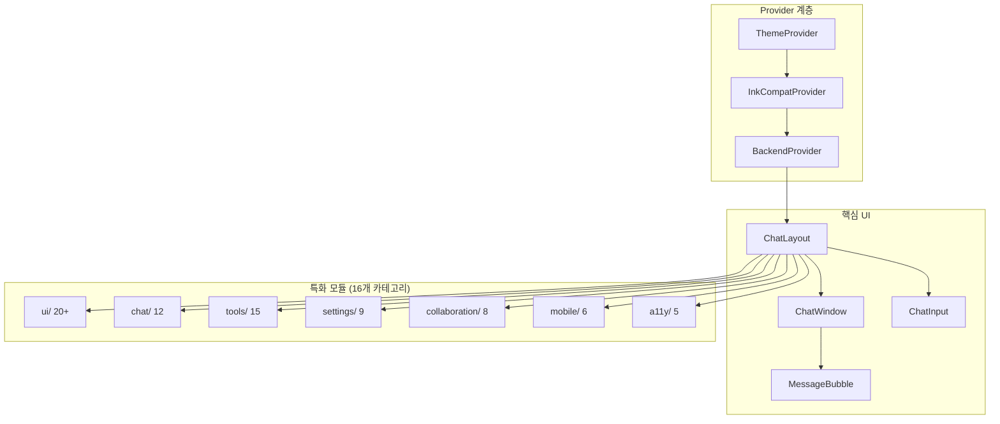

**고유 기능:**
- 실시간 협업 (PresenceAvatars, CursorGhost, AnnotationThread)
- 모바일 지원 (BottomSheet, SwipeableRow)
- 접근성 (SkipToContent, FocusTrap, LiveRegion)
- 6가지 터미널 테마 (amber, monokai, dracula, solarized-dark, green-screen, tokyo-night)
- Web Workers (highlight, markdown, search 병렬 처리)
- Zustand 상태 관리 + persist 미들웨어

### 14.5 MCP 탐색 서버

npm 패키지 `claude-code-explorer-mcp`로 배포:

| 구성 요소 | 수량 | 상세 |
|-----------|------|------|
| **도구** | 8개 | list_tools, list_commands, get_tool_source, get_command_source, read_source_file, search_source, list_directory, get_architecture |
| **리소스** | 3개 | claude-code://architecture, claude-code://tools, claude-code://commands |
| **프롬프트** | 5개 | explain_tool, explain_command, architecture_overview, how_does_it_work (18개 기능 매핑), compare_tools |
| **트랜스포트** | 4개 | STDIO, Streamable HTTP, Legacy SSE, Vercel Serverless |

---

## 15. 복제 구현 가이드

### 15.1 핵심 모듈별 구현 우선순위 로드맵

```mermaid
graph TB
    subgraph "Phase 1: 코어 (필수)"
        P1A[1. CLI 엔트리포인트<br/>commander.js + React/Ink]
        P1B[2. QueryEngine + query.ts<br/>Async Generator 상태머신]
        P1C[3. 기본 도구 7개<br/>Bash, Read, Write, Edit, Glob, Grep, WebFetch]
        P1D[4. 권한 시스템<br/>allow/ask/deny 3단계]
    end
    
    subgraph "Phase 2: 확장 (중요)"
        P2A[5. 메시지 압축 4계층<br/>Snip/Micro/Collapse/Auto]
        P2B[6. MCP 통합<br/>stdio/SSE/HTTP]
        P2C[7. 시스템 프롬프트 조립<br/>15,000+ 토큰]
        P2D[8. 세션/메모리 시스템<br/>JSONL + MEMORY.md]
    end
    
    subgraph "Phase 3: 고급 (선택)"
        P3A[9. 서브에이전트/Coordinator]
        P3B[10. Bridge 원격 제어]
        P3C[11. Kairos 자율 에이전트]
        P3D[12. Voice Mode]
    end
    
    P1A --> P1B --> P1C --> P1D
    P1D --> P2A --> P2B --> P2C --> P2D
    P2D --> P3A --> P3B --> P3C --> P3D
```

### 15.2 필수 의존성 목록

xtherk/open-claude-code의 `package.json` 기반, 카테고리별 정리:

| 카테고리 | 패키지 수 | 핵심 패키지 |
|----------|----------|------------|
| AI/API | 4 | `@anthropic-ai/sdk`, `bedrock-sdk`, `vertex-sdk`, `foundry-sdk` |
| MCP | 2 | `@modelcontextprotocol/sdk` ^1.29, `@anthropic-ai/mcpb` |
| UI/터미널 | 4 | `react` ^19.2, `react-reconciler`, `chalk`, `chokidar` |
| CLI | 2 | `@commander-js/extra-typings`, `fuse.js` |
| 스키마 | 1 | `zod` ^4.3 |
| 파싱 | 3 | `tree-sitter`, `yaml`, `marked` |
| AWS | 3 | `@aws-sdk/client-bedrock`, `credential-providers`, `client-sts` |
| GCP | 1 | `google-auth-library` |
| Azure | 1 | `@azure/identity` |
| 텔레메트리 | 12 | `@opentelemetry/*` (gRPC/HTTP/Proto 3가지 전송) |
| WebSocket | 1 | `ws` |
| LSP | 2 | `vscode-jsonrpc`, `vscode-languageserver-protocol` |
| 이미지 | 1 | `sharp` (9개 플랫폼 옵션) |
| 유틸리티 | ~30 | `lodash-es`, `uuid`, `semver`, `glob` 등 |
| **합계** | **~69~107** | (옵션 포함 시 변동) |

### 15.3 빌드 복원 필요 심/스텁 목록 (xtherk 기반)

원본 Claude Code를 외부에서 빌드하려면 다음 호환 레이어가 필수적이다:

#### macroShim -- 빌드 타임 상수 대체

```javascript
// src/recovery/macroShim.js
// 59개 소스 파일에서 참조
export const RECOVERY_MACRO = {
  BUILD_TIME: "2026-03-31T09:28:16.558Z",
  FEEDBACK_CHANNEL: "github",
  ISSUES_EXPLAINER: "https://github.com/anthropics/claude-code/issues",
  NATIVE_PACKAGE_URL: "",
  PACKAGE_URL: "https://github.com/anthropics/claude-code",
  VERSION: "2.1.88",
  VERSION_CHANGELOG: "https://github.com/anthropics/claude-code/releases"
};
```

#### bunBundleShim -- feature() 런타임 대체

```javascript
// src/recovery/bunBundleShim.js
// 196개 소스 파일에서 import { feature } from 'bun:bundle' 사용
const enabledFeatures = new Set(
  (process.env.CLAUDE_CODE_FEATURES ?? '')
    .split(',').map(s => s.trim()).filter(Boolean)
);
export function feature(name) {
  return enabledFeatures.has(name);
}
```

#### native-ts -- Rust NAPI 모듈 TypeScript 재구현

| 모듈 | 원본 | 재구현 | 코드량 |
|------|------|--------|--------|
| **color-diff** | Rust syntect + bat + similar | highlight.js + `diffArrays` | 999줄 |
| **file-index** | Rust nucleo (helix 퍼지 매처) | 비트맵 필터 + indexOf + nucleo 스코어링 | 371줄 |
| **yoga-layout** | Meta Yoga (C++ WASM) | 순수 TS flexbox 엔진 | 2,579줄 |

미구현 항목: aspect-ratio, box-sizing: content-box, RTL direction

#### stubs -- 비공개 의존성 대체

| 스텁 패키지 | 대상 | 내용 |
|------------|------|------|
| `@ant/claude-for-chrome-mcp` | Chrome 확장 MCP | `BROWSER_TOOLS = []`, 빈 connect/close |
| `color-diff-napi` | 네이티브 색상 diff | 빈 클래스 export |
| `modifiers-napi` | 키보드 수정자 감지 | `isModifierPressed() -> false` |

#### 비활성 도구 팩토리

```typescript
// createRecoveredDisabledTool -- 복원 불가 도구 안전 비활성화
const DISABLED_TOOLS = [
  { name: 'Tungsten',              reason: 'tmux/terminal 관리 미복원' },
  { name: 'SuggestBackgroundPR',   reason: '내부 인프라 의존' },
  { name: 'VerifyPlanExecution',   reason: '내부 인프라 의존' },
  { name: 'REPL',                  reason: '구현 미복원' },
];
```

### 15.4 아키텍처 패턴별 구현 참고사항

| 패턴 | 핵심 원칙 | 참고 파일 |
|------|-----------|----------|
| **Async Generator 상태머신** | `query()`가 이벤트를 yield, QueryEngine이 소비 | `query.ts` (1,729줄) |
| **buildTool 팩토리** | 단일 팩토리에서 기본값 설정, fail-closed | `Tool.ts` (~29K) |
| **비대칭 영속화** | 사용자 메시지=블로킹, 어시스턴트 메시지=fire-and-forget | `QueryEngine.ts` |
| **프롬프트 캐시 안정성** | 도구 정렬 고정, 정적/동적 경계 마커 | `assembleToolPool()` |
| **서킷브레이커** | 연속 3회 실패 시 Auto-Compact 중단 | 압축 파이프라인 |
| **Continue Site** | 상태 전환 시 객체 재할당 (원자적 전환) | `query.ts` while 루프 |
| **리액티브 스토어 (34줄)** | `Object.is` 체크 + 클로저, Redux/Zustand 없음 | `state/store.ts` |
| **트랜스크립트 체인** | UUID 부모-자식 링크, 사이드체인으로 분기 보존 | JSONL 세션 파일 |

---

## 부록

### A. 참조 리포지토리 목록

#### 주요 분석 리포지토리 (7개)

| # | 리포지토리 | 특징 | 고유 가치 |
|---|-----------|------|-----------|
| 1 | **anthropics/claude-code** | 공식, 코드 미포함 | 14개 플러그인, CHANGELOG, 설정 프리셋 |
| 2 | **nirholas/claude-code** | 원본 + 웹 UI + MCP + 배포 | 100+ 웹 컴포넌트, Helm/Grafana, npm MCP 서버 |
| 3 | **alanisme/claude-code-decompiled** | 문서 전용 20개 리포트 | 텔레메트리/프라이버시, 언더커버 모드, 보안 심층 분석 |
| 4 | **leaf-kit/claude-analysis** | Obsidian 호환 지식 시스템 | 19장 튜토리얼, 54개 프롬프트 전수, 26가지 기법 |
| 5 | **xtherk/open-claude-code** | 빌드 가능한 복원 | native-ts, recovery shim, smoke 테스트 |
| 6 | (Phase 1 블로그 분석) | 아키텍처 개요 | 6단계 파이프라인, 4계층 압축, 8계층 보안 |

#### 커뮤니티에서 추가 발견된 관련 프로젝트

- 소스맵 추출 도구/가이드 리포지토리들
- Claude Code Action (anthropics/claude-code-action) -- GitHub Actions 통합
- claude-code-explorer-mcp (npm) -- MCP 탐색 서버
- LinuxDo 포럼 기반 중국 개발자 커뮤니티 프로젝트들
- VSCode 확장 관련 프로젝트들

### B. 핵심 타입 정의 모음

```typescript
// === Tool 인터페이스 ===
interface Tool<Input, Output, Progress> {
  name: string;
  aliases?: string[];
  description(): string;
  call(input: Input, context: ToolUseContext): Promise<Output>;
  checkPermissions(input: Input, context: ToolPermissionContext): PermissionResult;
  isReadOnly(input?: Input): boolean;
  isConcurrencySafe(input?: Input): boolean;
  isDestructive?(input?: Input): boolean;
  prompt(options?: PromptOptions): string;
  renderToolUseMessage(input: Input, options?: RenderOptions): JSX.Element;
  renderToolResultMessage(content: Output, progress: Progress[], options?: RenderOptions): JSX.Element;
}

// === ToolUseContext (40+ 필드) ===
interface ToolUseContext {
  cwd: string;
  allowedPaths: string[];
  fileReadState: Map<string, FileReadState>;
  canUseTool: (tool: string) => boolean;
  permissionDenials: Map<string, number>;
  sessionId: string;
  userId: string;
  userType: UserType;    // 'ant' | 'external'
  taskBudget: TokenBudget;
  totalUsage: TokenUsage;
  mcpServers: MCPServerConnection[];
  mcpTools: MCPTool[];
  featureFlags: FeatureFlags;
  // ... 30+ 추가 필드
}

// DeepImmutable 래핑
type ImmutableToolUseContext = DeepImmutable<ToolUseContext>;

// === QueryParams ===
interface QueryParams {
  messages: Message[];
  systemPrompt: string;
  canUseTool: (tool: string) => boolean;
  toolUseContext: ToolUseContext;
  taskBudget: TokenBudget;
  maxTurns: number;
  fallbackModel?: string;
  querySource: string;
}

// === AppState (209 getter/setter 싱글톤) ===
// bootstrap/state.ts -- React 마운트 전 100+ 필드
// state/store.ts -- 34줄 리액티브 스토어 (Object.is 체크)

// === Terminal 상태 (9종) ===
type Terminal =
  | { terminal: 'completed' }
  | { terminal: 'blocking_limit' }
  | { terminal: 'aborted_streaming' }
  | { terminal: 'aborted_tools' }
  | { terminal: 'prompt_too_long' }
  | { terminal: 'image_error' }
  | { terminal: 'model_error' }
  | { terminal: 'hook_stopped' }
  | { terminal: 'max_turns' };

// === StreamEvent 타입 ===
type StreamEvent = RequestStartEvent | Message | TombstoneMessage | ToolUseSummaryMessage;

// === 권한 모드 ===
type PermissionMode =
  | 'default'           // 표준 대화형
  | 'plan'              // 읽기 전용 계획
  | 'acceptEdits'       // 편집 자동 승인
  | 'bypassPermissions' // YOLO 모드
  | 'dontAsk'           // 헤드리스 CI (승인 필요 작업 자동 거부)
  | 'auto'              // AI 분류기 중재 (내부 전용)
  | 'bubble';           // 다중 에이전트 스웜 (내부 전용)

// === 커맨드 타입 ===
type CommandType = 'local' | 'local-jsx' | 'prompt';
```

### C. 의존성 전체 카테고리별 목록

xtherk/open-claude-code `package.json` 기반 정리:

#### AI/API 클라이언트
| 패키지 | 버전 | 용도 |
|--------|------|------|
| `@anthropic-ai/sdk` | ^0.80.0 | Anthropic Direct API |
| `@anthropic-ai/bedrock-sdk` | ^0.26.4 | AWS Bedrock |
| `@anthropic-ai/vertex-sdk` | ^0.14.4 | GCP Vertex AI |
| `@anthropic-ai/foundry-sdk` | ^0.2.3 | Azure Foundry |

#### MCP/프로토콜
| 패키지 | 버전 | 용도 |
|--------|------|------|
| `@modelcontextprotocol/sdk` | ^1.29.0 | MCP 프로토콜 |
| `@anthropic-ai/mcpb` | ^2.1.2 | MCP 브릿지 |
| `vscode-jsonrpc` | - | LSP JSON-RPC |
| `vscode-languageserver-protocol` | - | LSP 프로토콜 |

#### UI/렌더링
| 패키지 | 버전 | 용도 |
|--------|------|------|
| `react` | ^19.2.4 | UI 프레임워크 |
| `react-reconciler` | ^0.33.0 | 커스텀 렌더러 (Ink) |
| `chalk` | ^5.6.2 | ANSI 색상 |
| `marked` | ^17.0.5 | 마크다운 렌더링 |

#### CLI/입력
| 패키지 | 버전 | 용도 |
|--------|------|------|
| `@commander-js/extra-typings` | - | CLI 인자 파싱 |
| `fuse.js` | - | 퍼지 검색 (커맨드 매칭) |

#### 클라우드/인증
| 패키지 | 버전 | 용도 |
|--------|------|------|
| `@aws-sdk/client-bedrock` | ^3.1020.0 | AWS Bedrock |
| `@aws-sdk/credential-providers` | ^3.1020.0 | AWS 인증 |
| `@azure/identity` | - | Azure 인증 |
| `google-auth-library` | - | GCP 인증 |

#### 텔레메트리 (12개)
| 패키지 | 용도 |
|--------|------|
| `@opentelemetry/api` | 코어 API |
| `@opentelemetry/sdk-trace-node` | 트레이스 SDK |
| `@opentelemetry/sdk-metrics` | 메트릭 SDK |
| `@opentelemetry/sdk-logs` | 로그 SDK |
| `@opentelemetry/exporter-trace-otlp-grpc` | gRPC 트레이스 익스포터 |
| `@opentelemetry/exporter-trace-otlp-http` | HTTP 트레이스 익스포터 |
| `@opentelemetry/exporter-trace-otlp-proto` | Proto 트레이스 익스포터 |
| `@opentelemetry/exporter-metrics-otlp-grpc` | gRPC 메트릭 익스포터 |
| `@opentelemetry/exporter-logs-otlp-grpc` | gRPC 로그 익스포터 |
| `@opentelemetry/resources` | 리소스 정의 |
| `@opentelemetry/semantic-conventions` | 시맨틱 컨벤션 |
| `@opentelemetry/instrumentation` | 자동 계측 |

#### 유틸리티
| 패키지 | 용도 |
|--------|------|
| `zod` ^4.3 | 스키마 검증 |
| `lodash-es` | 유틸리티 함수 |
| `yaml` | YAML 파싱 |
| `uuid` | UUID 생성 |
| `semver` | 버전 비교 |
| `glob` | 파일 패턴 매칭 |
| `chokidar` ^5.0 | 파일 시스템 감시 |
| `ws` | WebSocket |
| `sharp` | 이미지 처리 (9개 플랫폼) |
| `tree-sitter` | AST 파싱 (Bash 보안) |

### D. 텔레메트리/프라이버시 분석 요약 (alanisme 기반)

#### 이중 분석 파이프라인

```mermaid
graph TB
    CC[Claude Code] --> P1[1차: Anthropic 자체<br/>api.anthropic.com/api/event_logging/batch]
    CC --> P3[3차: Datadog<br/>http-intake.logs.us5.datadoghq.com]
    
    P1 --> |OpenTelemetry + ProtoBuf| S1[배치 200개, 10초 플러시]
    P1 --> |실패 시| DISK[~/.claude/telemetry/ 디스크 저장 후 재시도]
    P3 --> |64개 사전 승인 이벤트만| S3[필터링된 로그]
    
    GB[GrowthBook] -.->|A/B 테스트 배정| CC
```

#### 수집 데이터 범위

| 카테고리 | 세부 항목 |
|---------|---------|
| 환경 핑거프린트 | OS, 아키텍처, Node 버전, 터미널 타입, 패키지 매니저, CI/CD 감지, WSL, 리눅스 배포판, 커널 버전 |
| 프로세스 메트릭 | uptime, RSS, heapTotal, heapUsed, CPU 사용량 |
| 사용자/세션 추적 | 모델명, 세션 ID, 사용자 ID, 기기 ID, 계정 UUID, 조직 UUID, 구독 티어 |
| 리포지토리 핑거프린팅 | git remote URL의 SHA256 해시 처음 16자 |
| 도구 입력 | 기본 512자 잘림, JSON 4096자, 배열 20개, 중첩 2레벨 |
| 파일 확장자 | Bash 명령에서 사용된 파일 확장자 추출/로깅 |

#### 옵트아웃 제한

| 조건 | 1차 텔레메트리 비활성화 |
|------|----------------------|
| 직접 Anthropic API 사용 | **불가** |
| 테스트 환경 | 가능 |
| 3자 클라우드 (Bedrock/Vertex) | 가능 |
| 비공개 글로벌 옵트아웃 플래그 | 가능 (UI 미노출) |
| `OTEL_LOG_TOOL_DETAILS=1` | 전체 도구 입력 무잘림 로깅 (확대) |

#### 원격 제어 투명성

- 원격 관리 설정: 매 1시간마다 `GET /api/claude_code/settings` 폴링
- "위험한" 변경: 수락-또는-종료 다이얼로그 (거부 시 앱 종료)
- GrowthBook 피처 플래그: **알림 없이** 동작 변경 가능
- Fast 모드: 특정 사용자에 대해 **영구** 비활성화 가능

> "There's no audit log, no notification system, no way for a user to know when their Claude Code instance has been remotely modified by a feature flag change."
> -- alanisme 리포트 04

#### A/B 테스트

GrowthBook 통합으로 사용자를 실험 그룹에 자동 배정한다. 전송 속성: id, sessionId, deviceID, platform, organizationUUID, subscriptionType. 사용자에게 가시적 표시기는 없다.
