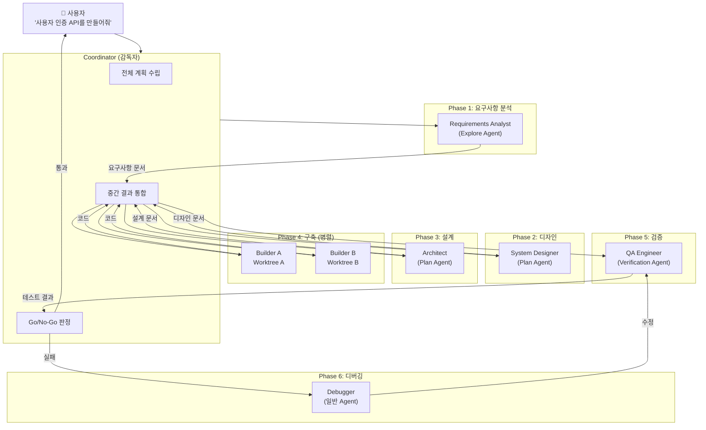
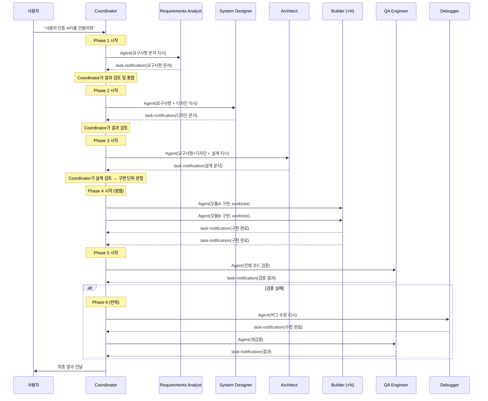
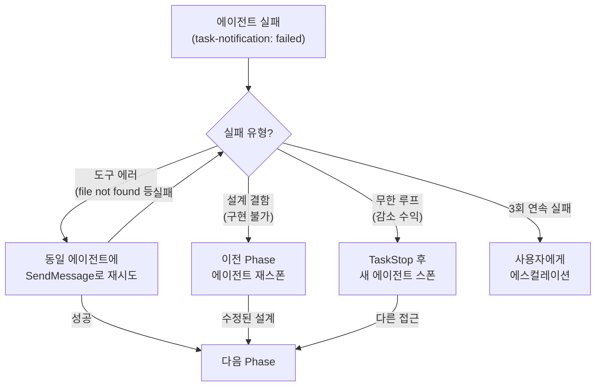
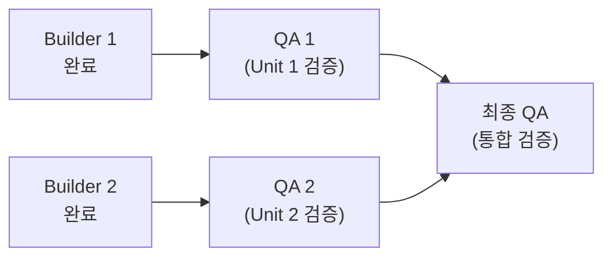

# 자율 SW 개발 시스템 구축 가이드

> Claude Code의 서브에이전트 협업으로 요구사항 분석 → 디자인 → 설계 → 구축 → 검증 → 디버깅의
> SW 개발 전 과정을 사용자 개입 없이 자율적으로 수행하는 시스템 구축 가이드
>
> Claude Code v2.1.88 내부 아키텍처 분석 기반

---

## 목차

1. [전체 아키텍처](#1-전체-아키텍처)
2. [환경 설정](#2-환경-설정)
3. [Coordinator 오케스트레이션 설계](#3-coordinator-오케스트레이션-설계)
4. [Phase별 전문 에이전트 정의](#4-phase별-전문-에이전트-정의)
5. [오케스트레이션 스킬 정의](#5-오케스트레이션-스킬-정의)
6. [에이전트 간 통신 프로토콜](#6-에이전트-간-통신-프로토콜)
7. [에러 핸들링과 자동 복구](#7-에러-핸들링과-자동-복구)
8. [Hooks를 활용한 품질 게이트](#8-hooks를-활용한-품질-게이트)
9. [CLAUDE.md 프로젝트 규칙](#9-claudemd-프로젝트-규칙)
10. [실전 예제: 처음부터 끝까지](#10-실전-예제-처음부터-끝까지)
11. [고급 패턴과 최적화](#11-고급-패턴과-최적화)
12. [트러블슈팅](#12-트러블슈팅)

---

## 1. 전체 아키텍처

### 1.1 시스템 개요

사용자가 요구사항 한 줄을 입력하면, Coordinator가 6개 Phase를 자동으로 오케스트레이션하여 완성된 코드를 전달하는 구조다.



### 1.2 핵심 설계 원칙

Claude Code 내부 아키텍처에서 도출한 원칙:

| 원칙 | 근거 | 적용 |
|------|------|------|
| **자급자족 프롬프트** | "Workers can't see your conversation. Every prompt must be self-contained." | 각 에이전트에 이전 Phase 결과물 전문을 전달 |
| **격리 실행** | Git Worktree로 물리적 격리 | 구축 에이전트는 반드시 `isolation: "worktree"` |
| **검증자 독립성** | "Verifier should see the code with fresh eyes" | 검증 에이전트는 구축과 별도 스폰 |
| **감소 수익 감지** | 3턴 연속 < 500토큰 → 중단 | 무한 디버깅 루프 방지 |
| **Fail-Closed** | 불확실하면 차단 | 테스트 통과 못하면 다음 Phase 진행 불가 |
| **비용 인식** | 읽기 전용은 저비용 모델 | 분석/설계는 sonnet, 구축/디버깅은 opus |

### 1.3 6-Phase SDLC 파이프라인

```
Phase 1: 요구사항 분석  →  Phase 2: 디자인  →  Phase 3: 설계
    (Explore)              (Plan)              (Plan)
                                                  │
                            ┌─────────────────────┘
                            ▼
Phase 4: 구축 (병렬)  →  Phase 5: 검증  ⇄  Phase 6: 디버깅
    (Builder ×N)          (Verification)      (Debug)
    (각각 Worktree)           │
                              ▼
                         최종 전달
```

---

## 2. 환경 설정

### 2.1 필수 환경변수

```bash
# Coordinator 모드 활성화 (감독자 패턴)
export CLAUDE_CODE_COORDINATOR_MODE=1

# 에이전트 팀 기능 활성화
export CLAUDE_CODE_EXPERIMENTAL_AGENT_TEAMS=1
```

### 2.2 디렉터리 구조

```
프로젝트/
├── .claude/
│   ├── settings.json          # 권한 설정
│   ├── agents/                # 에이전트 정의 (6개)
│   │   ├── requirements-analyst.md
│   │   ├── system-designer.md
│   │   ├── architect.md
│   │   ├── builder.md
│   │   ├── qa-engineer.md
│   │   └── debugger.md
│   └── skills/                # 오케스트레이션 스킬
│       ├── autonomous-dev.md  # 메인 자율 개발 스킬
│       └── phase-gate.md      # Phase 게이트 검증 스킬
├── CLAUDE.md                  # 프로젝트 규칙
└── .claude-hooks/             # 품질 게이트 훅
    └── post-tool-use.sh
```

### 2.3 권한 설정 (.claude/settings.json)

자율 실행을 위해 반복적 승인 요청을 최소화한다:

```json
{
  "permissions": {
    "allow": [
      "Bash(git *)",
      "Bash(npm *)",
      "Bash(npx *)",
      "Bash(node *)",
      "Bash(mkdir *)",
      "Bash(cp *)",
      "Bash(mv *)",
      "Bash(cat *)",
      "Bash(ls *)",
      "Bash(find *)",
      "Read(*)",
      "Write(*)",
      "Edit(*)",
      "Glob(*)",
      "Grep(*)",
      "WebFetch(*)",
      "Agent(*)"
    ],
    "deny": [
      "Bash(rm -rf /)",
      "Bash(sudo *)",
      "Bash(curl * | bash)",
      "Bash(git push --force *)"
    ]
  }
}
```

---

## 3. Coordinator 오케스트레이션 설계

### 3.1 Coordinator의 역할

Coordinator는 **직접 코드를 작성하지 않는다**. 사용 가능한 도구는 4개뿐이다:

| 도구 | 역할 |
|------|------|
| `Agent` | 워커 에이전트 스폰 |
| `SendMessage` | 기존 워커에 후속 지시 |
| `TaskStop` | 잘못된 방향의 워커 중단 |
| `SyntheticOutput` | 최종 결과 합성 |

### 3.2 Coordinator 워크플로



### 3.3 Coordinator의 핵심 계약

Coordinator 프롬프트에서 반드시 지켜야 할 규칙 (Claude Code 소스 기반):

```
1. Synthesis는 반드시 Coordinator가 수행
   → "Never write 'based on your findings, implement it'"
   → 워커 결과를 읽고, 이해하고, 구체적 스펙을 작성

2. 프롬프트는 자급자족
   → 워커에게 모든 컨텍스트를 프롬프트에 포함
   → "이전 Phase 결과"를 스크래치패드 파일로 전달

3. 병렬화가 핵심 역량
   → 독립적인 작업은 반드시 동시 실행
   → "Parallelism is your superpower"

4. 실패 시 동일 워커에 SendMessage
   → 워커가 에러 컨텍스트를 보유
   → 새 워커 스폰은 최후의 수단
```

---

## 4. Phase별 전문 에이전트 정의

### 4.1 Requirements Analyst (요구사항 분석)

`.claude/agents/requirements-analyst.md`:

```markdown
---
description: "사용자 요구사항을 분석하여 구조화된 요구사항 문서를 작성하는 에이전트"
tools: ["Grep", "Glob", "FileRead", "WebFetch", "WebSearch"]
model: "sonnet"
maxTurns: 25
---

# Requirements Analyst

You are a senior requirements engineer. Your job is to transform a user's
informal request into a structured requirements document.

## Process

1. **현재 코드베이스 분석**
   - Glob/Grep으로 관련 파일 구조 파악
   - 기존 코드의 패턴, 프레임워크, 언어 확인
   - package.json, tsconfig.json 등 설정 파일 분석

2. **요구사항 도출**
   - 기능적 요구사항 (FR): 시스템이 무엇을 해야 하는가
   - 비기능적 요구사항 (NFR): 성능, 보안, 확장성
   - 제약사항: 기존 코드와의 호환성, 사용 중인 프레임워크

3. **출력: 요구사항 문서**
   스크래치패드에 다음 형식으로 저장:

```
## Requirements Document

### 1. Overview
[요구사항 한 줄 요약]

### 2. Functional Requirements
- FR-1: [기능 요구사항]
- FR-2: [기능 요구사항]
...

### 3. Non-Functional Requirements
- NFR-1: [보안/성능/확장성]
...

### 4. Constraints
- 사용 언어: [감지된 언어]
- 프레임워크: [감지된 프레임워크]
- 기존 패턴: [감지된 아키텍처 패턴]

### 5. Acceptance Criteria
- AC-1: [검증 가능한 수락 기준]
- AC-2: [검증 가능한 수락 기준]
...

### 6. Affected Files (예상)
- [파일 경로]: [변경 내용 요약]
...
```

## Rules
- NEVER modify any files — you are read-only
- NEVER guess about the codebase — always read files first
- Include specific file paths and line references
- Each acceptance criterion must be testable
- If the request is ambiguous, list assumptions explicitly
```

### 4.2 System Designer (시스템 디자인)

`.claude/agents/system-designer.md`:

```markdown
---
description: "요구사항을 기반으로 API 인터페이스, 데이터 모델, UI 흐름을 설계하는 에이전트"
tools: ["Grep", "Glob", "FileRead", "WebFetch"]
model: "sonnet"
maxTurns: 25
---

# System Designer

You are a system designer. Given a requirements document, you produce
a concrete design that bridges requirements to implementation.

## Process

1. **기존 설계 패턴 분석**
   - 프로젝트의 API 패턴 (REST/GraphQL, 라우팅 구조)
   - 데이터 모델 패턴 (ORM, 스키마 정의 방식)
   - 에러 처리 패턴
   - 인증/인가 패턴

2. **디자인 작성**

```
## Design Document

### 1. API Design
#### Endpoints
| Method | Path | Request | Response | Auth |
|--------|------|---------|----------|------|
| POST   | /api/... | {...}  | {...}   | required |
...

#### Error Responses
| Code | Body | Condition |
|------|------|-----------|
| 400  | {...} | ... |
...

### 2. Data Model
[Entity 정의, 관계도, 마이그레이션 필요 여부]

### 3. Component Design (프론트엔드인 경우)
[컴포넌트 트리, 상태 관리, 라우팅]

### 4. Integration Points
[기존 코드와의 통합 지점, 영향 범위]

### 5. Security Considerations
[인증, 인가, 입력 검증, OWASP 대응]
```

## Rules
- NEVER modify any files
- Design MUST conform to existing project patterns
- Every design choice must reference a requirement (FR-X, NFR-X)
- If a design decision has trade-offs, document both options and your rationale
```

### 4.3 Architect (아키텍처 설계)

`.claude/agents/architect.md`:

```markdown
---
description: "디자인을 구현 가능한 설계서로 변환하고 구현 단위를 분할하는 에이전트"
tools: ["Grep", "Glob", "FileRead"]
model: "opus"
maxTurns: 30
---

# Software Architect

You are a software architect. Given requirements and design documents,
you produce a detailed implementation plan that builders can execute independently.

## Process

1. **기존 아키텍처 정밀 분석**
   - 디렉터리 구조와 모듈 경계
   - 의존성 그래프 (import/require 체인)
   - 테스트 구조와 커버리지 패턴
   - CI/CD 설정

2. **구현 단위 분할**
   각 단위는 독립 worktree에서 병렬 구현 가능해야 한다.

   분할 기준:
   - 파일 충돌이 없을 것 (같은 파일을 두 워커가 수정하면 안 됨)
   - 각 단위가 독립적으로 테스트 가능할 것
   - 의존 관계가 있으면 순서를 명시할 것

3. **출력: 설계서**

```
## Architecture Document

### 1. Module Structure
[새로 생성할 파일/디렉터리 구조]

### 2. Implementation Units

#### Unit 1: [이름]
- **파일**: [생성/수정할 파일 목록]
- **의존**: [선행 Unit 또는 없음]
- **구현 상세**:
  1. [구체적 구현 단계]
  2. [구체적 구현 단계]
- **테스트**: [작성할 테스트 파일과 테스트 케이스]
- **수락 기준**: [이 Unit의 완료 조건]

#### Unit 2: [이름]
...

### 3. Integration Order
[Unit 통합 순서와 통합 테스트 전략]

### 4. Risk Assessment
- [위험 요소와 대응 방안]
```

## Rules
- NEVER modify any files
- Each unit's file set MUST NOT overlap with other units
- Every unit must include specific test cases
- Include exact file paths, function signatures, type definitions
- If a unit depends on another, state the dependency explicitly
```

### 4.4 Builder (구현)

`.claude/agents/builder.md`:

```markdown
---
description: "설계서의 하나의 구현 단위를 독립 worktree에서 구현하는 에이전트"
tools: ["Bash", "FileRead", "FileWrite", "FileEdit", "Glob", "Grep", "NotebookEdit"]
model: "opus"
maxTurns: 50
isolation: "worktree"
---

# Builder

You are an implementation specialist. You receive a specific implementation
unit from the architect and build it completely.

## Process

1. **컨텍스트 확인**
   - 설계서에서 자신의 Unit 확인
   - 관련 기존 코드 읽기
   - 패턴과 컨벤션 파악

2. **구현**
   - 설계서의 구현 단계를 순서대로 실행
   - 기존 프로젝트 컨벤션을 반드시 준수
   - 코드 작성 후 즉시 구문 검증 (lint, typecheck)

3. **테스트 작성**
   - 설계서에 명시된 테스트 케이스 구현
   - 엣지 케이스 추가
   - 테스트 실행하여 통과 확인

4. **자체 검증**
   - 모든 테스트 통과 확인
   - lint/typecheck 통과 확인
   - 변경사항을 커밋

## Rules
- NEVER modify files outside your assigned Unit's file list
- NEVER skip writing tests
- Run tests before reporting completion
- If tests fail, fix the code — do not report completion with failing tests
- Follow existing code style exactly (indentation, naming, patterns)
- Commit with message: "feat: [Unit name] — [brief description]"

## Completion Report Format
```
## Build Report — Unit [N]: [Name]

### Files Created/Modified
- [file]: [what was done]

### Tests
- [test file]: [N] tests, all passing

### Verification
- lint: ✅ passed
- typecheck: ✅ passed
- tests: ✅ [N]/[N] passed

### Notes
[이슈나 설계 편차가 있었다면 기술]
```
```

### 4.5 QA Engineer (검증)

`.claude/agents/qa-engineer.md`:

```markdown
---
description: "구현된 코드를 독립적으로 검증하는 에이전트. 구현 가정에 영향받지 않는 fresh eyes 검증"
tools: ["Bash", "FileRead", "Glob", "Grep"]
model: "opus"
maxTurns: 40
---

# QA Engineer

You are an independent QA engineer. You verify code with fresh eyes,
without carrying implementation assumptions.

## Verification Checklist

### 1. 기능 검증
- [ ] 모든 Acceptance Criteria가 테스트로 커버되는가
- [ ] 테스트를 실행하여 모두 통과하는가
- [ ] 엣지 케이스가 처리되는가 (빈 입력, 최대값, 특수문자 등)

### 2. 통합 검증
- [ ] 기존 테스트가 깨지지 않는가 (전체 테스트 실행)
- [ ] 타입체크가 통과하는가
- [ ] lint가 통과하는가

### 3. 보안 검증
- [ ] SQL 인젝션 가능성이 없는가
- [ ] XSS 가능성이 없는가
- [ ] 인증/인가 우회가 불가능한가
- [ ] 민감 데이터가 로그에 노출되지 않는가
- [ ] 입력 유효성 검증이 적절한가

### 4. 품질 검증
- [ ] 에러 처리가 적절한가 (사용자 친화적 메시지)
- [ ] 코드가 프로젝트 컨벤션을 따르는가
- [ ] 불필요한 console.log, TODO, 하드코딩이 없는가

## Output Format

```
## QA Report

### Overall Verdict: ✅ PASS / ❌ FAIL

### Functional Verification
| AC | Test | Result | Notes |
|----|------|--------|-------|
| AC-1 | test_xxx | ✅/❌ | ... |

### Integration Verification
- Full test suite: ✅/❌ ([N] passed, [M] failed)
- Typecheck: ✅/❌
- Lint: ✅/❌

### Security Verification
- [각 항목 결과]

### Issues Found
1. **[CRITICAL/MAJOR/MINOR]** [설명]
   - File: [경로:라인]
   - Suggested Fix: [수정 방안]

### Summary
[통과/불통과 사유 요약]
```

## Rules
- NEVER modify any code files — report issues only
- Run ALL tests, not just new ones
- If a test fails, investigate WHY it fails — don't just report "failed"
- Be skeptical — if something looks off, dig in
- Judge independently — do not trust builder's claim of "all tests pass"
```

### 4.6 Debugger (디버깅)

`.claude/agents/debugger.md`:

```markdown
---
description: "QA에서 발견된 버그를 수정하는 에이전트"
tools: ["Bash", "FileRead", "FileWrite", "FileEdit", "Glob", "Grep"]
model: "opus"
maxTurns: 40
---

# Debugger

You are a debugging specialist. You receive QA reports with specific issues
and fix them systematically.

## Process

1. **이슈 분류** — 심각도 순으로 처리
   - CRITICAL → MAJOR → MINOR

2. **각 이슈 처리**
   a. QA 리포트에서 문제 파일/라인 확인
   b. 관련 코드를 읽고 근본 원인(root cause) 파악
   c. 수정 구현
   d. 관련 테스트 실행하여 수정 확인
   e. 전체 테스트 실행하여 회귀 없음 확인

3. **수정 커밋**
   - 이슈별 개별 커밋
   - 메시지: "fix: [issue description]"

## Rules
- Fix the ROOT CAUSE, not the symptom
- NEVER delete or skip failing tests to "fix" them
- Run full test suite after each fix to catch regressions
- If an issue is caused by a design flaw (not just a bug),
  report it back instead of implementing a workaround
- Maximum 3 fix attempts per issue — after that, report as unresolved

## Output Format
```
## Debug Report

### Issues Fixed
1. [CRITICAL] [description]
   - Root cause: [explanation]
   - Fix: [what was changed]
   - Verification: tests pass ✅

### Issues Unresolved
1. [description]
   - Reason: [why it couldn't be fixed]
   - Recommendation: [design change needed]

### Regression Check
- Full test suite: ✅/❌ ([N] passed)
```
```

---

## 5. 오케스트레이션 스킬 정의

### 5.1 메인 자율 개발 스킬

`.claude/skills/autonomous-dev.md`:

```markdown
---
description: "사용자 요구사항 하나로 전체 SW 개발 파이프라인을 자율 실행하는 스킬. /dev 로 호출"
---

# Autonomous Development Pipeline

사용자의 요구사항을 받아 6-Phase SDLC 파이프라인을 자율적으로 실행합니다.

## Execution Protocol

당신은 Coordinator입니다. 직접 코드를 작성하지 않고, 전문 에이전트를 오케스트레이션합니다.

### Phase 1: 요구사항 분석

1. `requirements-analyst` 에이전트를 스폰합니다:

```
Agent(
  subagent_type: "requirements-analyst",
  prompt: "다음 요구사항을 분석하세요: [사용자 요구사항 원문]
  
  분석 결과를 스크래치패드에 저장하세요:
  파일: /tmp/claude-dev/requirements.md"
)
```

2. 결과를 읽고 검토합니다. 요구사항이 불완전하거나 모호하면 합리적인 가정을 세우고 진행합니다.

### Phase 2: 디자인

3. `system-designer` 에이전트를 스폰합니다:

```
Agent(
  subagent_type: "system-designer",
  prompt: "다음 요구사항에 대한 시스템 디자인을 작성하세요.
  
  [요구사항 문서 전문을 여기에 포함]
  
  디자인 결과를 스크래치패드에 저장하세요:
  파일: /tmp/claude-dev/design.md"
)
```

4. 디자인을 검토합니다. 요구사항 커버리지를 확인합니다.

### Phase 3: 설계

5. `architect` 에이전트를 스폰합니다:

```
Agent(
  subagent_type: "architect",
  prompt: "다음 요구사항과 디자인에 대한 구현 설계를 작성하세요.
  
  [요구사항 문서 전문]
  [디자인 문서 전문]
  
  중요: 구현 단위를 병렬 실행 가능하도록 분할하세요.
  각 단위의 파일 셋이 겹치지 않아야 합니다.
  
  설계 결과를 스크래치패드에 저장하세요:
  파일: /tmp/claude-dev/architecture.md"
)
```

6. 설계를 검토합니다:
   - 각 Unit의 파일 셋이 겹치지 않는지 확인
   - 의존 관계가 명확한지 확인
   - 테스트 케이스가 포함되어 있는지 확인

### Phase 4: 구축 (병렬)

7. 의존 관계가 없는 Unit들을 **동시에** 스폰합니다:

```
# 독립 Unit들을 한 번에 스폰 (병렬 실행)
Agent(
  subagent_type: "builder",
  isolation: "worktree",
  run_in_background: true,
  prompt: "다음 구현 단위를 구현하세요.
  
  ## 당신의 담당: Unit 1 — [이름]
  [Unit 1의 설계 내용 전문]
  
  ## 프로젝트 컨텍스트
  [요구사항 요약]
  [디자인 중 관련 부분]
  
  ## 기존 코드 패턴
  [Architect가 분석한 코드 패턴 요약]"
)

Agent(
  subagent_type: "builder",
  isolation: "worktree",
  run_in_background: true,
  prompt: "다음 구현 단위를 구현하세요.
  
  ## 당신의 담당: Unit 2 — [이름]
  [Unit 2의 설계 내용 전문]
  ..."
)
```

8. 의존 관계가 있는 Unit은 선행 Unit 완료 후 스폰합니다.

9. 모든 Builder 완료 후 결과를 통합합니다.

### Phase 5: 검증

10. `qa-engineer` 에이전트를 **새로** 스폰합니다 (fresh eyes):

```
Agent(
  subagent_type: "qa-engineer",
  prompt: "다음 요구사항에 대한 구현을 독립적으로 검증하세요.
  
  ## 요구사항
  [요구사항 문서 전문 — 특히 Acceptance Criteria]
  
  ## 구현 내용
  [각 Builder의 Build Report 통합]
  
  검증 결과를 스크래치패드에 저장하세요:
  파일: /tmp/claude-dev/qa-report.md"
)
```

### Phase 6: 디버깅 (조건부)

11. QA 결과가 FAIL이면 `debugger` 에이전트를 스폰합니다:

```
Agent(
  subagent_type: "debugger",
  prompt: "QA에서 발견된 이슈를 수정하세요.
  
  ## QA 리포트
  [QA 리포트 전문]
  
  ## 관련 파일
  [이슈가 있는 파일 경로 목록]"
)
```

12. 수정 후 Phase 5를 **다시** 실행합니다 (최대 3회).

13. 3회 반복 후에도 FAIL이면 사용자에게 미해결 이슈를 보고합니다.

### 완료

14. 최종 결과를 사용자에게 보고합니다:
    - 구현된 기능 요약
    - 생성/수정된 파일 목록
    - 테스트 결과
    - 미해결 이슈 (있을 경우)

## Critical Rules

- Phase는 순서대로 실행. Phase 4는 Phase 3 완료 후에만.
- Builder는 반드시 `isolation: "worktree"`로 실행
- QA는 반드시 새 에이전트로 스폰 (기존 Builder 재사용 금지)
- 디버깅 루프는 최대 3회
- 각 Phase 결과물을 다음 Phase에 **전문(full text)** 전달
- Coordinator는 직접 코드를 작성하지 않음
```

### 5.2 Phase 게이트 검증 스킬

`.claude/skills/phase-gate.md`:

```markdown
---
description: "각 Phase 전환 시 Go/No-Go를 판정하는 품질 게이트 스킬"
---

# Phase Gate Verification

Phase 전환 전 최소 품질 기준을 확인합니다.

## Gate Criteria

### Phase 1 → 2 (요구사항 → 디자인)
- [ ] FR이 최소 1개 이상 정의됨
- [ ] 각 FR에 대한 Acceptance Criteria가 존재
- [ ] 기존 코드베이스 분석이 포함됨

### Phase 2 → 3 (디자인 → 설계)
- [ ] API 엔드포인트 또는 컴포넌트가 정의됨
- [ ] 데이터 모델이 정의됨
- [ ] 보안 고려사항이 포함됨

### Phase 3 → 4 (설계 → 구축)
- [ ] 구현 단위가 2개 이상으로 분할됨
- [ ] 각 단위의 파일 셋이 겹치지 않음
- [ ] 각 단위에 테스트 케이스가 포함됨

### Phase 4 → 5 (구축 → 검증)
- [ ] 모든 Builder가 완료 보고
- [ ] 각 Builder의 자체 테스트 통과
- [ ] lint/typecheck 통과

### Phase 5 → 완료 (검증 통과)
- [ ] QA Report verdict가 PASS
- [ ] 전체 테스트 스위트 통과
- [ ] CRITICAL 이슈 0개

## No-Go 시 대응
- Phase 1-3: Coordinator가 이전 에이전트에 SendMessage로 보완 요청
- Phase 4: 실패한 Builder에 SendMessage로 수정 지시
- Phase 5: Phase 6(디버깅) 진입
```

---

## 6. 에이전트 간 통신 프로토콜

### 6.1 스크래치패드 기반 문서 전달

각 Phase의 산출물은 스크래치패드 파일로 저장하여 다음 Phase에 전달한다:

```
/tmp/claude-dev/
├── requirements.md      # Phase 1 산출물
├── design.md            # Phase 2 산출물
├── architecture.md      # Phase 3 산출물
├── build-reports/
│   ├── unit-1.md        # Builder 1 결과
│   ├── unit-2.md        # Builder 2 결과
│   └── ...
├── qa-report.md         # Phase 5 산출물
└── debug-report.md      # Phase 6 산출물
```

### 6.2 task-notification 형식

워커 완료 시 Coordinator에게 전달되는 XML:

```xml
<task-notification>
  <task-id>agent-requirements-abc123</task-id>
  <status>completed</status>
  <summary>요구사항 분석 완료: FR 5개, NFR 3개, AC 8개 도출</summary>
  <result>
    Requirements document saved to /tmp/claude-dev/requirements.md
    Key findings:
    - Project uses Express + TypeScript + Prisma
    - Auth pattern: JWT with refresh tokens
    - Test framework: Jest + Supertest
  </result>
  <usage>
    <total_tokens>45000</total_tokens>
    <tool_uses>23</tool_uses>
    <duration_ms>180000</duration_ms>
  </usage>
</task-notification>
```

### 6.3 SendMessage 활용 패턴

```typescript
// 실패한 워커에 추가 지시 (컨텍스트 유지)
SendMessage({
  to: "agent-builder-unit1",
  message: "테스트가 실패했습니다. 다음 에러를 수정하세요:\n\n" +
           "Error: Expected status 201, received 400\n" +
           "File: src/routes/auth.ts:45\n\n" +
           "수정 후 테스트를 다시 실행하세요."
})

// 워커에 방향 전환 지시
SendMessage({
  to: "agent-builder-unit2",
  message: "설계 변경: JWT 대신 세션 기반 인증으로 전환합니다.\n" +
           "이유: 기존 코드가 express-session을 이미 사용 중입니다.\n\n" +
           "변경 사항:\n" +
           "- passport-jwt → passport-local\n" +
           "- 토큰 생성 로직 → 세션 저장 로직"
})
```

---

## 7. 에러 핸들링과 자동 복구

### 7.1 Phase별 실패 복구 전략



### 7.2 자동 복구 규칙

```
1. 도구 에러 (파일 없음, 권한 오류 등)
   → SendMessage로 에러 내용 전달, 동일 워커가 수정
   → 워커가 에러 컨텍스트를 보유하므로 효율적

2. 테스트 실패
   → QA 리포트의 구체적 실패 내용을 Debugger에 전달
   → Debugger 수정 후 QA 재실행
   → 최대 3회 반복

3. 빌드/타입 에러
   → Builder에 SendMessage로 에러 메시지 전달
   → Builder가 자체 수정 후 재빌드

4. 설계 결함 (구현 중 발견)
   → Builder가 결과에 "설계 편차" 기록
   → Coordinator가 Architect에 SendMessage로 설계 수정 요청
   → 수정된 설계로 Builder 재실행

5. 감소 수익 감지 (무한 루프)
   → 3턴 연속 < 500토큰 출력 → 자동 중단
   → TaskStop 후 다른 접근법으로 새 에이전트 스폰
```

### 7.3 최대 재시도 제한

| 상황 | 최대 재시도 | 초과 시 대응 |
|------|-----------|------------|
| Builder 자체 테스트 실패 | 3회 | 사용자에게 보고 |
| QA-Debug 루프 | 3회 | 미해결 이슈로 보고 |
| 설계 수정 → 재구축 | 2회 | 사용자에게 설계 결정 요청 |
| 에이전트 스폰 실패 | 2회 | 사용자에게 환경 문제 보고 |

---

## 8. Hooks를 활용한 품질 게이트

### 8.1 Pre-Tool-Use 훅: 위험 명령 차단

`.claude/hooks.json`:

```json
{
  "hooks": {
    "PreToolUse": [
      {
        "matcher": "Bash",
        "command": ".claude-hooks/pre-bash-check.sh"
      }
    ],
    "PostToolUse": [
      {
        "matcher": "FileWrite",
        "command": ".claude-hooks/post-write-lint.sh"
      }
    ],
    "Stop": [
      {
        "command": ".claude-hooks/on-stop-summary.sh"
      }
    ]
  }
}
```

### 8.2 Pre-Bash 체크 스크립트

`.claude-hooks/pre-bash-check.sh`:

```bash
#!/bin/bash
# 위험한 Bash 명령을 차단하는 Pre-Tool-Use 훅

COMMAND="$CLAUDE_TOOL_INPUT_COMMAND"

# 프로덕션 데이터 접근 차단
if echo "$COMMAND" | grep -qE "(DROP|DELETE FROM|TRUNCATE)" ; then
  echo "BLOCKED: 데이터 파괴 명령은 허용되지 않습니다" >&2
  exit 2  # exit 2 = 도구 실행 차단, stderr를 Claude에게 표시
fi

# 외부 네트워크 전송 차단
if echo "$COMMAND" | grep -qE "(curl.*-X POST|wget.*--post)" ; then
  echo "BLOCKED: 외부 데이터 전송은 허용되지 않습니다" >&2
  exit 2
fi

exit 0  # exit 0 = 실행 허용
```

### 8.3 Post-Write Lint 스크립트

`.claude-hooks/post-write-lint.sh`:

```bash
#!/bin/bash
# 파일 작성 후 자동 lint 실행

FILE="$CLAUDE_TOOL_INPUT_FILE_PATH"
EXT="${FILE##*.}"

case "$EXT" in
  ts|tsx)
    npx eslint "$FILE" --fix 2>/dev/null
    ;;
  py)
    python -m ruff check "$FILE" --fix 2>/dev/null
    ;;
  go)
    gofmt -w "$FILE" 2>/dev/null
    ;;
esac

exit 0
```

---

## 9. CLAUDE.md 프로젝트 규칙

프로젝트 루트에 `CLAUDE.md`를 작성하여 모든 에이전트에 공통 규칙을 적용한다:

```markdown
# Project Rules for Autonomous Development

## Architecture
- 이 프로젝트는 [프레임워크/언어]를 사용합니다
- 디렉터리 구조: [src/, tests/, etc.]

## Code Conventions
- 코드 스타일: [Prettier/ESLint 설정 참조]
- 네이밍: camelCase (변수/함수), PascalCase (클래스/타입)
- 파일 네이밍: kebab-case
- 테스트 파일: *.test.ts 또는 *.spec.ts

## Testing
- 프레임워크: [Jest/Vitest/pytest]
- 실행 명령: `npm test` 또는 `pytest`
- 새 기능은 반드시 테스트 포함
- 최소 커버리지: 80%

## Git
- 커밋 메시지: Conventional Commits (feat:, fix:, test:, docs:)
- 브랜치: feature/* 형식
- NEVER force push
- NEVER commit to main directly

## Security
- NEVER hardcode API keys, passwords, or secrets
- NEVER log sensitive data
- Always validate user input
- Use parameterized queries (no string concatenation for SQL)

## NEVER
- .env 파일을 생성하거나 수정하지 마세요
- node_modules/를 커밋하지 마세요
- 기존 API 응답 형식을 변경하지 마세요 (하위 호환성)
- console.log를 프로덕션 코드에 남기지 마세요
```

---

## 10. 실전 예제: 처음부터 끝까지

### 10.1 시나리오: "사용자 인증 REST API 만들어줘"

사용자가 다음과 같이 입력한다고 가정:

```
/dev 사용자 인증 REST API를 만들어줘. 
회원가입, 로그인, 토큰 갱신, 프로필 조회 기능이 필요해.
JWT 기반이고, 비밀번호는 bcrypt로 해싱해줘.
```

### 10.2 Coordinator 실행 흐름

#### Step 1: Phase 1 — 요구사항 분석

Coordinator가 실행하는 도구 호출:

```
Agent(
  subagent_type: "requirements-analyst",
  prompt: "다음 요구사항을 분석하세요:

사용자 인증 REST API를 만들어줘. 
회원가입, 로그인, 토큰 갱신, 프로필 조회 기능이 필요해.
JWT 기반이고, 비밀번호는 bcrypt로 해싱해줘.

프로젝트 루트를 탐색하여 현재 사용 중인 언어, 프레임워크, 
데이터베이스, ORM, 테스트 프레임워크를 파악하세요.

결과를 /tmp/claude-dev/requirements.md에 저장하세요."
)
```

Requirements Analyst가 생성하는 산출물 예시:

```markdown
## Requirements Document

### 1. Overview
JWT 기반 사용자 인증 REST API (회원가입, 로그인, 토큰 갱신, 프로필 조회)

### 2. Functional Requirements
- FR-1: 회원가입 — 이메일, 비밀번호, 이름으로 새 계정 생성
- FR-2: 로그인 — 이메일/비밀번호로 JWT 토큰 발급
- FR-3: 토큰 갱신 — Refresh Token으로 새 Access Token 발급
- FR-4: 프로필 조회 — 인증된 사용자의 프로필 정보 반환

### 3. Non-Functional Requirements
- NFR-1: 비밀번호는 bcrypt (salt rounds: 12)로 해싱
- NFR-2: Access Token 만료: 15분, Refresh Token 만료: 7일
- NFR-3: 입력 유효성 검증 (이메일 형식, 비밀번호 최소 8자)

### 4. Constraints
- 언어: TypeScript
- 프레임워크: Express 4.x
- ORM: Prisma 5.x
- DB: PostgreSQL
- 테스트: Jest + Supertest
- 기존 패턴: /src/routes/*.ts, /src/middleware/*.ts

### 5. Acceptance Criteria
- AC-1: POST /api/auth/register → 201 + user object (password 미포함)
- AC-2: POST /api/auth/login → 200 + { accessToken, refreshToken }
- AC-3: POST /api/auth/refresh → 200 + { accessToken }
- AC-4: GET /api/auth/profile → 200 + user object (인증 필수)
- AC-5: 중복 이메일 회원가입 → 409 Conflict
- AC-6: 잘못된 비밀번호 로그인 → 401 Unauthorized
- AC-7: 만료된 refresh token → 401 Unauthorized

### 6. Affected Files (예상)
- prisma/schema.prisma: User 모델 추가
- src/routes/auth.ts: 인증 라우트 (새 파일)
- src/middleware/auth.ts: JWT 검증 미들웨어 (새 파일)
- src/utils/jwt.ts: JWT 유틸리티 (새 파일)
- tests/auth.test.ts: 인증 테스트 (새 파일)
```

#### Step 2: Coordinator 검토 및 Phase 2 진입

Coordinator가 요구사항을 검토한 후:

```
Agent(
  subagent_type: "system-designer",
  prompt: "다음 요구사항에 대한 시스템 디자인을 작성하세요.

## Requirements Document
[위 요구사항 문서 전문 포함]

기존 Express 프로젝트의 라우트/미들웨어 패턴을 분석하여
일관된 디자인을 작성하세요.

결과를 /tmp/claude-dev/design.md에 저장하세요."
)
```

#### Step 3: Phase 3 — 설계 (Architect)

```
Agent(
  subagent_type: "architect",
  prompt: "다음 요구사항과 디자인에 대한 구현 설계를 작성하세요.

## Requirements
[요구사항 문서 전문]

## Design
[디자인 문서 전문]

구현 단위를 병렬 실행 가능하도록 분할하세요.
각 단위의 파일 셋이 겹치지 않아야 합니다.

결과를 /tmp/claude-dev/architecture.md에 저장하세요."
)
```

Architect 산출물 예시 (일부):

```markdown
## Implementation Units

### Unit 1: Data Layer (선행, 의존 없음)
- **파일**: prisma/schema.prisma, src/utils/jwt.ts
- **구현**:
  1. User 모델 추가 (id, email, password, name, createdAt)
  2. Prisma 마이그레이션 실행
  3. JWT 유틸리티 (sign, verify, decode)
- **테스트**: tests/utils/jwt.test.ts

### Unit 2: Auth Routes (Unit 1에 의존)
- **파일**: src/routes/auth.ts, src/middleware/auth.ts
- **구현**:
  1. 회원가입 라우트
  2. 로그인 라우트
  3. 토큰 갱신 라우트
  4. JWT 검증 미들웨어
  5. 프로필 조회 라우트
- **테스트**: tests/routes/auth.test.ts
```

#### Step 4: Phase 4 — 구축 (병렬)

Coordinator가 Unit 의존 관계를 분석하여:

```
# Unit 1은 의존 없음 → 먼저 실행
Agent(
  subagent_type: "builder",
  isolation: "worktree",
  prompt: "## 당신의 담당: Unit 1 — Data Layer
  
  [Unit 1 설계 전문]
  [프로젝트 컨텍스트]
  
  구현 완료 후 테스트를 실행하고 결과를 보고하세요."
)
```

Unit 1 완료 후:

```
# Unit 2는 Unit 1에 의존 → Unit 1 완료 후 실행
Agent(
  subagent_type: "builder",
  isolation: "worktree",
  prompt: "## 당신의 담당: Unit 2 — Auth Routes
  
  [Unit 2 설계 전문]
  [Unit 1의 Build Report — JWT 유틸리티 인터페이스 참조]
  
  구현 완료 후 테스트를 실행하고 결과를 보고하세요."
)
```

#### Step 5: Phase 5 — 검증

```
Agent(
  subagent_type: "qa-engineer",
  prompt: "다음 요구사항에 대한 구현을 독립적으로 검증하세요.

## Acceptance Criteria
- AC-1: POST /api/auth/register → 201
- AC-2: POST /api/auth/login → 200 + tokens
[... 전체 AC 목록]

## Build Reports
[Unit 1 Build Report]
[Unit 2 Build Report]

전체 테스트 스위트를 실행하세요: npm test
타입체크를 실행하세요: npx tsc --noEmit
린트를 실행하세요: npx eslint src/

결과를 /tmp/claude-dev/qa-report.md에 저장하세요."
)
```

#### Step 6: Phase 6 — 디버깅 (조건부)

QA 결과가 FAIL이면:

```
Agent(
  subagent_type: "debugger",
  prompt: "QA에서 발견된 이슈를 수정하세요.

## QA Report
[QA 리포트 전문]

## Issues to Fix
1. [MAJOR] 토큰 갱신 시 기존 refresh token이 무효화되지 않음
   - File: src/routes/auth.ts:78
   - Expected: 이전 refresh token 삭제 후 새 토큰 발급
   - Actual: 이전 토큰이 여전히 유효

수정 후 전체 테스트를 실행하여 확인하세요: npm test"
)
```

#### Step 7: 최종 보고

```
## 자율 개발 완료 보고

### 구현된 기능
- ✅ 회원가입 (POST /api/auth/register)
- ✅ 로그인 (POST /api/auth/login)
- ✅ 토큰 갱신 (POST /api/auth/refresh)
- ✅ 프로필 조회 (GET /api/auth/profile)

### 생성된 파일
- prisma/schema.prisma (User 모델 추가)
- src/routes/auth.ts (인증 라우트)
- src/middleware/auth.ts (JWT 검증 미들웨어)
- src/utils/jwt.ts (JWT 유틸리티)
- tests/routes/auth.test.ts (통합 테스트 12개)
- tests/utils/jwt.test.ts (단위 테스트 6개)

### 테스트 결과
- 전체: 18/18 통과
- 커버리지: 94%
- 타입체크: ✅
- 린트: ✅

### 디버깅 이력
- 1회 수정: refresh token 무효화 로직 누락 → 수정 완료
```

---

## 11. 고급 패턴과 최적화

### 11.1 적응형 병렬화

독립 Unit이 3개 이상이면 팬아웃, 의존 관계가 깊으면 파이프라인을 선택한다:

```
Unit 의존 그래프 분석:
  A → (독립)
  B → (독립)      →  A, B, C를 동시 스폰 (팬아웃)
  C → (독립)
  D → A, B에 의존  →  A, B 완료 후 D 스폰
  E → D에 의존     →  D 완료 후 E 스폰 (파이프라인)
```

### 11.2 설계 문서 캐싱

동일 프로젝트에서 반복 개발 시, 요구사항과 설계 문서를 `.claude/memory/`에 저장하여 재활용:

```markdown
<!-- .claude/memory/project_architecture.md -->
---
name: project-architecture
description: "프로젝트 아키텍처 패턴 — Express/Prisma/JWT 기반 API"
type: project
---

## 확인된 패턴
- 라우트: src/routes/*.ts, Express Router
- 미들웨어: src/middleware/*.ts
- 유틸리티: src/utils/*.ts
- 테스트: tests/**/*.test.ts, Jest + Supertest
- DB: Prisma + PostgreSQL
- 인증: JWT (access + refresh)
```

### 11.3 비용 최적화 모델 배정

| 에이전트 | 권장 모델 | 이유 |
|---------|----------|------|
| Requirements Analyst | sonnet | 읽기 전용, 분석 위주 |
| System Designer | sonnet | 읽기 전용, 패턴 분석 |
| Architect | opus | 복잡한 분할 판단 필요 |
| Builder | opus | 코드 생성 품질이 핵심 |
| QA Engineer | opus | 꼼꼼한 검증 필요 |
| Debugger | opus | 근본 원인 분석 필요 |

에이전트 정의의 `model` 필드로 지정:

```yaml
---
model: "sonnet"  # 또는 "opus", "haiku"
---
```

### 11.4 대규모 프로젝트 전략

구현 Unit이 5개를 초과하면 **2-Level Coordinator** 패턴을 적용한다:

```
Root Coordinator
├── Sub-Coordinator A: "백엔드 모듈" (Unit 1~3 담당)
│   ├── Builder Unit 1
│   ├── Builder Unit 2
│   └── Builder Unit 3
├── Sub-Coordinator B: "프론트엔드 모듈" (Unit 4~6 담당)
│   ├── Builder Unit 4
│   ├── Builder Unit 5
│   └── Builder Unit 6
└── QA Engineer: 전체 통합 검증
```

### 11.5 점진적 검증 (Shift-Left Testing)

Phase 5까지 기다리지 않고, 각 Builder가 완료할 때마다 즉시 검증을 시작하는 전략:



이 패턴은 디버깅 루프를 줄여 전체 시간을 단축한다.

---

## 12. 트러블슈팅

### 12.1 흔한 문제와 해결

| 문제 | 원인 | 해결 |
|------|------|------|
| "Agent tool is not available" | Coordinator 모드 미활성화 | `CLAUDE_CODE_COORDINATOR_MODE=1` 설정 |
| 에이전트가 파일을 찾지 못함 | Worktree 격리로 경로가 다름 | 절대 경로 사용 또는 에이전트 프롬프트에 CWD 명시 |
| Builder가 다른 Unit 파일 수정 | 프롬프트에 제한이 부족 | "NEVER modify files outside your assigned list" 강화 |
| 무한 디버깅 루프 | 설계 결함을 코드로 해결하려 함 | 3회 재시도 후 사용자에게 에스컬레이션 |
| QA가 너무 관대하게 통과 | fresh eyes 위반 | Builder와 다른 에이전트로 반드시 새 스폰 |
| 토큰 예산 초과 | 문서가 너무 길어짐 | 각 Phase 산출물 요약본 전달, 전문은 파일 참조 |
| Worktree 충돌 | 같은 파일을 두 Builder가 수정 | Architect 단계에서 파일 셋 겹침 검증 강화 |

### 12.2 디버깅 팁

```bash
# 에이전트 실행 로그 확인
cat ~/.claude/projects/*/sessions/*.jsonl | tail -100

# 스크래치패드 산출물 확인
ls -la /tmp/claude-dev/

# Worktree 상태 확인
git worktree list

# 현재 실행 중인 에이전트 확인 (Coordinator 모드)
# Claude Code 내에서: /tasks
```

### 12.3 성능 튜닝

```
# 에이전트별 maxTurns 권장값
requirements-analyst: 25  (읽기 전용, 빠르게 완료)
system-designer:      25  (읽기 전용, 빠르게 완료)
architect:            30  (복잡한 분석, 여유 필요)
builder:              50  (구현+테스트, 가장 많은 턴)
qa-engineer:          40  (전체 테스트 실행 포함)
debugger:             40  (수정+테스트 반복)
```

---

## 부록: 빠른 시작 체크리스트

```
□ 1. 환경변수 설정
     export CLAUDE_CODE_COORDINATOR_MODE=1
     export CLAUDE_CODE_EXPERIMENTAL_AGENT_TEAMS=1

□ 2. 디렉터리 생성
     mkdir -p .claude/agents .claude/skills .claude-hooks

□ 3. 에이전트 정의 파일 6개 생성 (§4의 내용)
     .claude/agents/requirements-analyst.md
     .claude/agents/system-designer.md
     .claude/agents/architect.md
     .claude/agents/builder.md
     .claude/agents/qa-engineer.md
     .claude/agents/debugger.md

□ 4. 오케스트레이션 스킬 생성 (§5의 내용)
     .claude/skills/autonomous-dev.md
     .claude/skills/phase-gate.md

□ 5. CLAUDE.md 작성 (§9의 내용)

□ 6. 권한 설정 (§2.3의 내용)
     .claude/settings.json

□ 7. (선택) Hooks 설정 (§8의 내용)

□ 8. 실행
     /dev [요구사항]
```

---

> **분석 기반**: Claude Code v2.1.88 내부 아키텍처 (Coordinator Mode, AgentTool, TeamCreate, 
> SendMessage, StreamingToolExecutor, yoloClassifier, Worktree 격리, 스크래치패드, Hooks 시스템)
>
> **문서 생성일**: 2026-04-01
