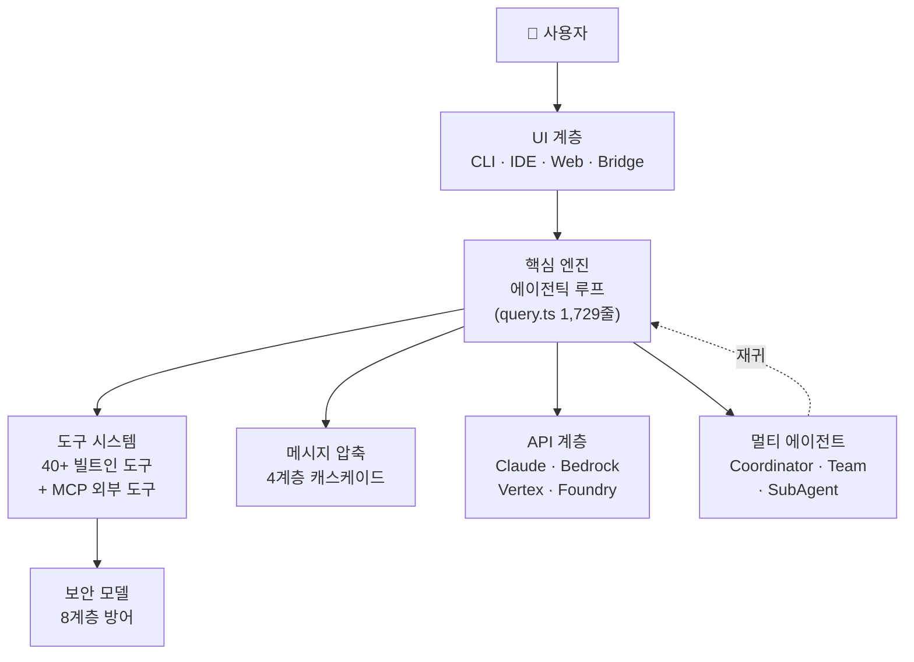
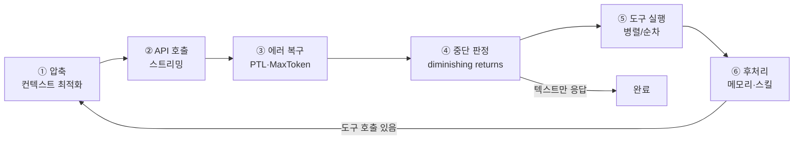
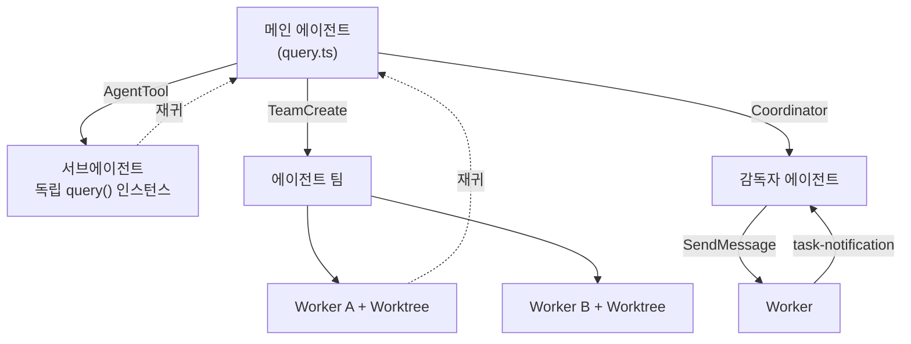
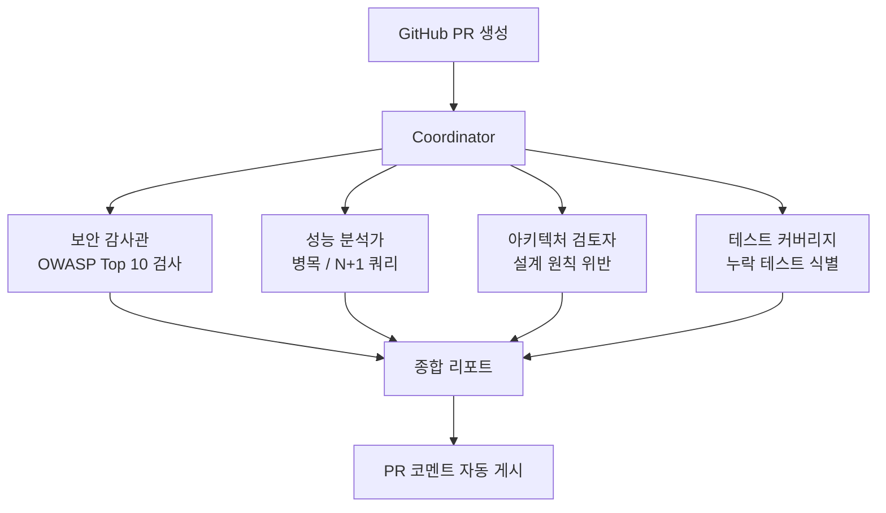
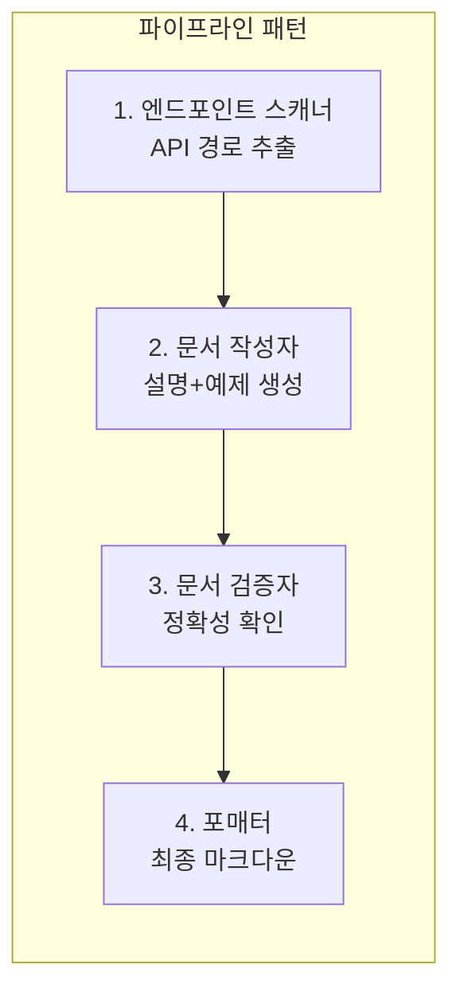
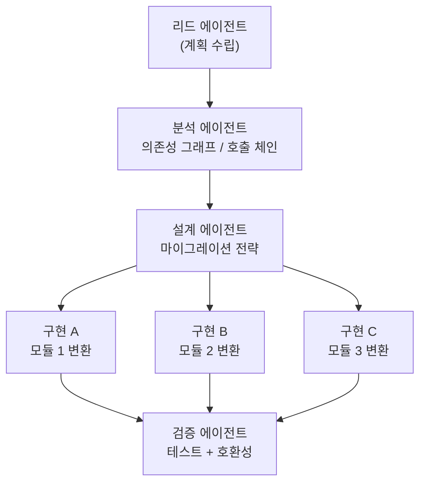
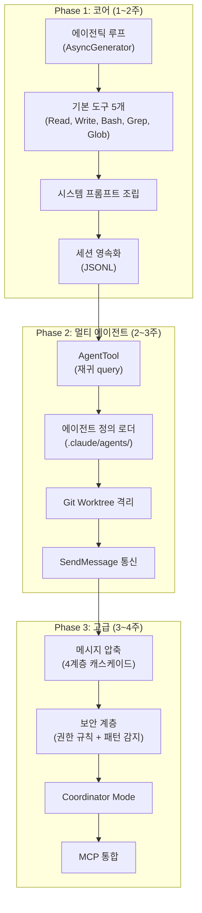

# Claude Code 해부: 에이전틱 AI 아키텍처에서 멀티 에이전트 플랫폼까지

> **Claude Code v2.1.88 유출 소스 코드 기반 심층 분석**
> 
> 2026년 3월, npm 소스맵 유출로 공개된 Claude Code의 내부를 해부하여
> 에이전틱 AI의 설계 원칙과 멀티 에이전트 오케스트레이션의 실체를 파악하고,
> 이를 활용하거나 재현하기 위한 실전 가이드를 제공한다.

---

## 목차

1. [아키텍처와 에이전틱 AI의 실체](#1-아키텍처와-에이전틱-ai의-실체)
2. [Claude Code 잠재력 극대화: 프롬프트, 스킬, 서브에이전트 활용 원칙](#2-claude-code-잠재력-극대화-프롬프트-스킬-서브에이전트-활용-원칙)
3. [플랫폼으로서의 Claude Code: 에이전트 활용 시나리오](#3-플랫폼으로서의-claude-code-에이전트-활용-시나리오)
4. [Core로 멀티 에이전트 플랫폼 구축하기](#4-core로-멀티-에이전트-플랫폼-구축하기)

---

## 1. 아키텍처와 에이전틱 AI의 실체

### 1.1 Claude Code는 터미널 앱이 아니다

Claude Code의 코드베이스는 1,902개 TypeScript 파일, 512,664줄이다. 공식 오픈소스(279개 플러그인 파일)와는 차원이 다른 규모다. 이것은 단순한 CLI 도구가 아니라, **프로덕션 그레이드 에이전틱 AI 런타임**이다.

```
공식 오픈소스:  279개 파일  →  플러그인 인터페이스만
실제 코드베이스: 4,600+개 파일  →  핵심 엔진, 보안, 미공개 기능 전체
```

전체 시스템은 7개 핵심 모듈로 구성된다:



### 1.2 에이전틱 루프: 시스템의 심장

Claude Code의 핵심은 `query.ts`의 **AsyncGenerator 상태머신**이다. 이 1,729줄의 함수가 모든 것을 조율한다.

```typescript
export async function* query(params: QueryParams): AsyncGenerator<
  StreamEvent | Message | TombstoneMessage,
  Terminal  // 9개 터미널 상태 중 하나
> {
  // 매 턴마다 6단계 파이프라인을 반복
}
```

에이전틱 루프는 **턴(Turn)** 단위로 동작하며, 각 턴은 6단계 파이프라인을 수행한다:



**왜 AsyncGenerator인가?** 제너레이터는 각 단계에서 이벤트를 `yield`하여 외부(UI)에 실시간으로 진행률을 전달하면서, 내부 상태는 캡슐화한다. 이 패턴은 "일시정지 가능한 파이프라인"을 우아하게 구현한다.

#### 에이전틱 AI의 핵심: 자율적 루프

일반적인 챗봇은 "질문 → 응답" 1회 왕복으로 끝난다. 에이전틱 AI는 다르다:

1. 모델이 **도구를 호출**한다 (파일 읽기, 검색, 코드 실행 등)
2. 도구 결과를 **다음 턴의 입력**으로 사용한다
3. 목표를 달성하거나, 더 이상 진전이 없다고 판단할 때까지 **반복**한다

이것이 "에이전틱"의 핵심이다. Claude Code에서 이 자율적 루프는 다음과 같이 종료된다:

| 종료 조건 | 설명 |
|----------|------|
| 텍스트만 응답 | 모델이 도구 없이 응답 → 정상 완료 |
| 감소 수익 감지 | 3턴 연속 < 500토큰 출력 → 진전 없음 판단 |
| 토큰 예산 소진 | taskBudget 초과 |
| 최대 턴 도달 | maxTurns 초과 |
| 사용자 중단 | Ctrl+C |

### 1.3 Continue Site 패턴: 원자적 상태 전이

에이전틱 루프의 상태 관리에서 가장 주목할 패턴은 **Continue Site**다. 상태 전환 시 개별 필드를 변경하지 않고, **전체 상태 객체를 새로 할당**한다:

```typescript
// 개별 필드 변경이 아닌 전체 객체 재할당
state = { ...state, messages: newMessages, turnCount: state.turnCount + 1 };
```

이유는 명확하다. 제너레이터가 `yield` 하는 시점에서 외부 소비자가 상태를 읽을 수 있는데, 필드별 변경은 중간 상태(partial update)를 노출할 수 있다. 전체 객체 재할당은 항상 일관된 스냅샷을 보장한다.

### 1.4 비대칭 영속화: 사용자 메시지 vs AI 메시지

```typescript
// 사용자 메시지: 반드시 저장 완료 후 다음 단계
await persistSync(userMessage);

// AI 메시지: 저장 완료를 기다리지 않음
persistAsync(assistantMessage).catch(console.error);
```

사용자의 입력을 잃는 것은 치명적이지만, AI 응답은 재생성할 수 있다. 이 비대칭성을 아키텍처 수준에서 반영한 것이다.

### 1.5 도구 실행: 병렬과 순차의 자동 분류

40개 이상의 빌트인 도구가 `StreamingToolExecutor`에 의해 실행된다. 핵심은 **읽기 전용 도구는 병렬, 상태 변경 도구는 순차**로 자동 분류되는 것이다:

```
모델이 한 턴에서 여러 도구를 호출할 때:

  Glob + Grep + FileRead  →  Promise.all()로 동시 실행
  FileWrite              →  순차 실행 (앞의 결과 반영 후)
  Bash                   →  순차 실행
```

이 자동 분류는 `isConcurrencySafe()` 메서드로 결정된다. 기본값은 `false`(순차)이며, 안전한 도구만 명시적으로 `true`를 반환한다. **Fail-Closed 원칙**이 여기서도 적용된다.

### 1.6 4계층 메시지 압축: 비용 인식 아키텍처

에이전틱 루프는 대화가 길어질수록 컨텍스트 윈도우를 소진한다. Claude Code는 이를 4계층 캐스케이드로 해결한다:

| 비용 | 계층 | 메커니즘 | 정보 손실 |
|------|------|---------|----------|
| 무료 | Snip Compact | 오래된 내부 메시지 삭제 | 높음 |
| 무료 | Microcompact | 도구 결과를 placeholder로 교체 | 중간 |
| 저비용 | Context Collapse | Preview→Commit 2단계 축소 | 중간 |
| 고비용 | Auto-Compact | Claude API로 대화 요약 생성 | 낮음 |

**비용이 낮은 계층을 우선 적용**하고, 부족하면 다음 계층으로 올라간다. Auto-Compact는 3회 연속 실패 시 **서킷브레이커**가 개방되어 더 이상 시도하지 않는다.

> "서킷브레이커 도입 전, 일부 세션이 3,000회 이상의 실패한 압축 API 호출을 생성했다. 규모에서 이는 하루 25만 건의 낭비된 API 호출이었다." — alanisme 분석

### 1.7 8계층 보안: Defense in Depth

도구 실행 전 8개 독립 보안 계층이 순차 검증한다:

```
Layer 1: 빌드타임 게이트     (코드 자체가 번들에서 제거)
Layer 2: GrowthBook 킬스위치 (원격 실시간 비활성화)
Layer 3: 설정 기반 규칙      (allow / deny / ask)
Layer 4: yoloClassifier      (AI 기반 안전성 검증, 52KB)
Layer 5: 위험 패턴 감지      (정적 문자열 매칭)
Layer 6: 파일시스템 검증     (심링크 탈출 방지, TOCTOU)
Layer 7: Trust Dialog        (초기 세션 위험 요소 검토)
Layer 8: 바이패스 킬스위치   (모든 YOLO 모드 원격 차단)
```

**설계 철학**: "Claude Code는 Bash를 완벽히 안전하게 만들려고 하지 않는다. 대신 분석 가능하게, 권한 부여 가능하게, 샌드박싱 가능하게, 모니터링 가능하게, 예측 가능하게 만든다."

### 1.8 멀티 에이전트 오케스트레이션: 재귀의 힘

Claude Code의 멀티 에이전트 구조는 놀랍도록 단순한 원칙에 기반한다: **AgentTool이 동일한 `query()` 함수를 재귀적으로 호출한다.**



3가지 모드가 존재하며, 모두 같은 `query()` 엔진 위에서 동작한다:

| 모드 | 도구 | 격리 수단 | 용도 |
|------|------|----------|------|
| **서브에이전트** | AgentTool | 선택적 Worktree | 단발 작업 (탐색, 계획) |
| **에이전트 팀** | TeamCreate + SendMessage | 각 Worker별 Worktree | 병렬 협업 |
| **Coordinator** | AgentTool + SendMessage + TaskStop | 필수 Worktree + 스크래치패드 | 감독자가 워커 관리 |

Coordinator Mode에서 감독자는 직접 코드를 작성하지 않는다. 4개의 오케스트레이션 전용 도구(AgentTool, SendMessage, TaskStop, SyntheticOutput)만 사용할 수 있으며, 핵심 계약은 **"Workers can't see your conversation. Every prompt must be self-contained."**이다.

### 1.9 하네스 6가지 패턴의 네이티브 구현

Claude Code는 하네스 엔지니어링의 6가지 아키텍처 패턴을 모두 내장하고 있다:

| 하네스 패턴 | Claude Code 구현체 | 동작 |
|------------|-------------------|------|
| **파이프라인** | query.ts 6단계 | 매 턴 순차 실행 |
| **팬아웃/팬인** | StreamingToolExecutor + Team | 병렬 도구 + 팀 병렬 작업 |
| **전문가 풀** | assembleToolPool + ToolSearch | 40+도구 중 적합한 도구 선택/지연 로딩 |
| **생성-검증** | yoloClassifier + Verification Agent | AI 판단 → 독립 검증 |
| **감독자** | Coordinator Mode | 메타 오케스트레이터가 워커 분배 |
| **계층적 위임** | AgentTool → runAgent → query() | 재귀적 서브에이전트 |

**핵심 insight**: 하네스(revfactory/harness)는 Claude Code의 내장 인프라 위에서 동작하는 **메타 스킬**이다. `.claude/agents/`에 에이전트 정의를, `.claude/skills/`에 스킬 파일을 자동 생성하여 Claude Code의 에이전트 로딩 시스템이 파싱하게 한다.

---

## 2. Claude Code 잠재력 극대화: 프롬프트, 스킬, 서브에이전트 활용 원칙

### 2.1 프롬프트 엔지니어링: Anthropic이 자사 제품에 적용한 105가지 기법

Claude Code 소스에서 추출한 105개 프롬프트 엔지니어링 기법 중, 실전에 즉시 적용할 수 있는 핵심 원칙을 정리한다.

#### 원칙 1: 구체적 숫자로 모호함을 제거하라

**나쁜 예**: "간결하게 응답하세요"
**좋은 예**: "도구 호출 사이 텍스트는 ≤25단어, 최종 응답은 ≤100단어"

Claude Code 내부(ant) 빌드에서 실제 사용하는 수치다. 정성적 지시 대비 약 1.2% 출력 토큰 감소 효과가 측정되었다.

#### 원칙 2: 삼중 반복으로 중요 제약을 강화하라

가장 중요한 규칙은 프롬프트의 **세 곳**에 배치한다:

```
1. 프리앰블: "CRITICAL: 도구를 호출하지 마세요."
2. 본문:    도구별 금지 목록과 실패 결과 명시
3. 트레일러: "REMINDER: 도구를 호출하지 마세요."
```

Recency bias를 활용한 것이다. 프리앰블은 첫 읽기 주의를, 트레일러는 최근성을 담당한다.

#### 원칙 3: Chain-of-Thought Stripping으로 품질과 깔끔함을 동시에

Anthropic이 자사 제품에서 사용하는 핵심 기법:

```python
# 프롬프트: "분석을 <analysis> 태그에, 최종 답변을 <answer> 태그에 작성하세요"
response = model.generate(prompt)

# 후처리: 분석 태그 제거
clean = re.sub(r'<analysis>[\s\S]*?</analysis>', '', response)
```

모델에게 사고를 강제하되, 사용자에게는 깔끔한 출력만 보여준다.

#### 원칙 4: 선호 도구와 금지 도구를 한 줄에 병렬 배치하라

```
파일 검색: Glob을 사용하세요 (NOT find 또는 ls)
콘텐츠 검색: Grep을 사용하세요 (NOT grep 또는 rg)
파일 읽기: Read를 사용하세요 (NOT cat/head/tail)
```

"해야 할 것"과 "하지 말아야 할 것"을 동시에 학습시킨다.

#### 원칙 5: 환각 방지를 위한 전제조건 체인

```
"파일을 편집하기 전에 반드시 Read 도구로 한 번 이상 읽어야 합니다.
 읽지 않고 편집을 시도하면 이 도구는 에러를 반환합니다."
```

"will error"라는 보장된 실패 선언이 지름길 시도를 방지한다. **프롬프트와 코드가 실제로 일관**된다는 점이 핵심이다.

#### 원칙 6: 위험 기반 인가 프레임워크

```
"행동의 가역성(reversibility)과 영향 범위(blast radius)를 신중히 고려하세요."

자유 실행: 파일 편집, 테스트 실행 (로컬, 가역적)
확인 필요: force push, DB drop, PR 생성 (파괴적, 외부 영향)
```

단순 이진 규칙("허용/금지") 대신 원칙("가역성 + 영향 범위")을 제공하면, 새로운 상황에서도 모델이 적절한 판단을 내린다.

### 2.2 스킬 활용: 반복 작업의 자동화

스킬은 `.claude/skills/` 디렉터리에 마크다운으로 정의하는 **재사용 가능한 프롬프트 템플릿**이다.

#### 스킬 파일 구조

```markdown
---
description: "코드 리뷰 후 개선 PR을 자동으로 생성합니다"
---

# Code Review Skill

## Instructions
1. git diff로 변경사항을 확인합니다
2. 코드 품질, 보안, 성능 관점에서 리뷰합니다
3. 문제가 있으면 수정하고, 없으면 승인 코멘트를 작성합니다

## Rules
- NEVER approve without actually reading the changes
- Focus on logic errors, not style preferences
```

#### 효과적인 스킬 작성 원칙

| 원칙 | 설명 | 예시 |
|------|------|------|
| **단일 책임** | 하나의 스킬은 하나의 작업 | "코드 리뷰" (O), "리뷰+배포+알림" (X) |
| **자급자족** | 외부 컨텍스트 의존 최소화 | 필요한 경로/규칙을 스킬 내에 명시 |
| **검증 게이트 포함** | 완료 전 검증 단계 | "구현 후 테스트를 실행하여 통과를 확인" |
| **금지 목록 포함** | 하면 안 되는 것도 명시 | "테스트 없이 PR을 생성하지 마세요" |

#### 내장 스킬 활용 예시

Claude Code에는 이미 유용한 내장 스킬이 있다:

- `/commit` — git 변경사항을 분석하여 커밋 메시지 생성 후 커밋
- `/review` — 코드 리뷰
- **batch** — 5~30개 worktree 에이전트로 대규모 병렬 변경
- **verify** — 변경사항 독립 검증
- **simplify** — 코드 단순화 리뷰
- **skillify** — 반복 작업을 스킬로 자동 변환

### 2.3 서브에이전트 활용: 복잡한 작업의 분할 정복

#### 에이전트 정의 파일 (.claude/agents/)

```markdown
---
description: "보안 취약점을 전문으로 감사하는 에이전트"
tools: ["Grep", "Glob", "FileRead", "WebFetch"]
model: "sonnet"
maxTurns: 20
isolation: "worktree"
---

# Security Auditor

You are a security specialist. Your job is to find OWASP Top 10 vulnerabilities.

## Process
1. Scan for SQL injection patterns
2. Check for XSS vulnerabilities
3. Review authentication/authorization logic
4. Report findings with severity and remediation

## Rules
- NEVER modify any files
- Report ALL findings, even minor ones
- Include file path and line number for each finding
```

#### 에이전트 구성 모범 사례

**서브에이전트 (단발 작업)** — Agent 도구로 직접 호출:

```
"프로젝트의 API 엔드포인트를 모두 찾아서 정리해 줘"
→ Agent(subagent_type="Explore") 사용
→ 독립 context에서 탐색 후 결과 반환
```

**에이전트 팀 (병렬 협업)** — TeamCreate + SendMessage:

```
"프론트엔드 리팩토링과 백엔드 API 변경을 동시에 진행해 줘"
→ TeamCreate로 팀 생성
→ Worker A: 프론트엔드 (worktree/a)
→ Worker B: 백엔드 (worktree/b)
→ 각자 독립 브랜치에서 작업 후 병합
```

**Coordinator (감독자 패턴)** — 복잡한 멀티스텝:

```
"이 레거시 시스템을 마이크로서비스로 분리해 줘"
→ Coordinator가 전체 계획 수립
→ Worker 1: 도메인 분석 (탐색 전문)
→ Worker 2: 서비스 경계 구현 (코드 전문)
→ Worker 3: 테스트 작성 (QA 전문)
→ Coordinator가 진행 상황 모니터링 및 조율
```

#### 핵심 주의사항

1. **프롬프트는 자급자족**: 워커는 부모의 대화를 볼 수 없다. 모든 정보를 프롬프트에 포함하라.
2. **유휴는 정상**: "팀원이 idle 상태입니다"는 에러가 아니라 정상 동작이다.
3. **컨텍스트 오염 방지**: 포크 에이전트의 출력 파일을 중간에 읽지 마라. "tool noise"가 부모 컨텍스트를 오염시킨다.
4. **결과 불가시성**: 에이전트 결과는 사용자에게 직접 보이지 않는다. 요약하여 전달하라.

### 2.4 CLAUDE.md와 메모리 시스템 활용

CLAUDE.md는 프로젝트별 지시사항을 저장하는 파일로, 시스템 프롬프트에 자동으로 포함된다.

#### 효과적인 CLAUDE.md 작성

```markdown
# Project Rules

## Architecture
- 이 프로젝트는 모노레포이며, packages/ 아래에 서비스별 패키지가 있다
- API 서버는 packages/api/, 프론트엔드는 packages/web/

## Conventions
- 테스트는 __tests__/ 디렉터리에 작성
- 커밋 메시지는 Conventional Commits 형식
- PR은 반드시 테스트를 포함

## NEVER
- .env 파일을 커밋하지 마세요
- main 브랜치에 직접 push하지 마세요
- 기존 API 응답 형식을 변경하지 마세요
```

#### 메모리 4가지 타입

| 타입 | 용도 | 예시 |
|------|------|------|
| **user** | 사용자의 역할/선호 | "시니어 백엔드 개발자, Go 10년 경력" |
| **feedback** | 작업 방식 교정 | "테스트에서 DB를 목킹하지 마세요" |
| **project** | 프로젝트 상태/맥락 | "3월 5일부터 코드 프리즈, 모바일 릴리스 대비" |
| **reference** | 외부 리소스 위치 | "버그는 Linear INGEST 프로젝트에서 추적" |

---

## 3. 플랫폼으로서의 Claude Code: 에이전트 활용 시나리오

Claude Code의 아키텍처를 기반으로, 다양한 도메인에서 멀티 에이전트 시스템을 구축할 수 있다.

### 3.1 시나리오 1: 자동화된 코드 리뷰 파이프라인



**구현 방식**: 4개의 전문 에이전트 정의를 `.claude/agents/`에 작성하고, Coordinator가 팬아웃/팬인 패턴으로 병렬 리뷰 후 결과를 통합한다.

```markdown
<!-- .claude/agents/security-auditor.md -->
---
description: "OWASP Top 10 기반 보안 취약점 감사"
tools: ["Grep", "Glob", "FileRead"]
model: "sonnet"
maxTurns: 15
---

# Security Auditor
변경된 파일에서 다음을 검사합니다:
1. SQL Injection (문자열 연결 쿼리)
2. XSS (사용자 입력 무이스케이프 렌더링)
3. 인증/인가 우회
4. 시크릿 하드코딩
...
```

### 3.2 시나리오 2: 기술 문서 자동 생성 시스템



**구현 방식**: 파이프라인 패턴. 각 단계가 이전 단계의 출력을 입력으로 받아 순차 처리한다.

### 3.3 시나리오 3: 레거시 마이그레이션 에이전트



**구현 방식**: 계층적 위임 패턴. 리드가 작업을 분할하고, 각 구현 에이전트가 독립 worktree에서 변환 작업을 수행한 후, 검증 에이전트가 결과를 확인한다.

### 3.4 시나리오 4: 프로액티브 모니터링 에이전트

Claude Code의 Kairos(프로액티브 에이전트) 패턴을 활용:

```
에이전트가 자발적으로:
1. GitHub PR의 CI 결과를 모니터링
2. 실패 시 원인을 분석
3. 수정 PR을 자동 생성
4. 사용자에게 푸시 알림으로 보고
```

이 패턴은 `SleepTool`(주기적 깨어남), `SubscribePRTool`(웹훅 구독), `PushNotificationTool`(알림)의 조합으로 구현된다. 현재는 feature flag 뒤에 있지만, 아키텍처는 이미 준비되어 있다.

### 3.5 시나리오 5: 멀티 리포지토리 대규모 변경

내장 스킬 `batch`를 활용하면 5~30개의 worktree 에이전트가 동시에 변경 작업을 수행한다:

```
사용자: "/batch 모든 서비스의 로깅 라이브러리를 winston에서 pino로 교체"

→ batch 스킬이 자동으로:
  1. 영향받는 파일 스캔
  2. 워크트리별 에이전트 할당
  3. 병렬 변경 실행
  4. 각 변경의 테스트 실행
  5. 결과 통합
```

### 3.6 에이전트 설계 원칙 정리

| 원칙 | 설명 | Claude Code에서의 구현 |
|------|------|----------------------|
| **단일 책임** | 에이전트당 하나의 전문 영역 | Explore(탐색), Plan(계획), Verification(검증) 분리 |
| **자급자족 프롬프트** | 외부 컨텍스트에 의존하지 않음 | "Workers can't see your conversation" |
| **격리 실행** | 에이전트 간 파일 시스템 충돌 방지 | Git Worktree로 물리적 격리 |
| **비용 인식** | 비싼 작업을 최소화 | 읽기 전용 에이전트는 haiku 모델 사용 |
| **Fail-Closed** | 불확실하면 차단 | yoloClassifier API 실패 시 거부 |
| **감소 수익 감지** | 무한 루프 방지 | 3턴 연속 < 500토큰 → 중단 |

---

## 4. Core로 멀티 에이전트 플랫폼 구축하기

Claude Code의 핵심 아키텍처를 참고하여 직접 멀티 에이전트 시스템을 개발하는 가이드를 제공한다.

### 4.1 최소 핵심 모듈 (Minimum Viable Core)

전체 512K 줄 중 멀티 에이전트 플랫폼의 핵심은 **4개 모듈**로 압축할 수 있다:

```
┌─────────────────────────────────────────────┐
│  Module 1: 에이전틱 루프 (query engine)       │
│  Module 2: 도구 시스템 (tool registry)        │
│  Module 3: 에이전트 관리 (agent orchestrator) │
│  Module 4: 메시지/상태 관리 (state manager)   │
└─────────────────────────────────────────────┘
```

### 4.2 Module 1: 에이전틱 루프

Claude Code `query.ts`의 핵심을 단순화한 구현:

```typescript
// core/engine.ts — 에이전틱 루프 최소 구현

interface LoopState {
  messages: Message[];
  turnCount: number;
  maxTurns: number;
}

interface Terminal {
  reason: 'completed' | 'max_turns' | 'budget_exhausted' | 'user_abort';
}

async function* agenticLoop(
  params: LoopParams
): AsyncGenerator<StreamEvent, Terminal> {
  let state: LoopState = {
    messages: params.initialMessages,
    turnCount: 0,
    maxTurns: params.maxTurns ?? 50,
  };

  while (true) {
    // Stage 1: 컨텍스트 압축 (선택)
    state = await compactIfNeeded(state);

    // Stage 2: LLM API 호출
    const response = await callLLM({
      messages: state.messages,
      systemPrompt: params.systemPrompt,
      tools: params.tools,
    });

    // 응답을 메시지에 추가 (Continue Site 패턴: 전체 객체 재할당)
    state = {
      ...state,
      messages: [...state.messages, response],
      turnCount: state.turnCount + 1,
    };

    yield { type: 'assistant_message', message: response };

    // Stage 3: 종료 판정
    if (!hasToolCalls(response)) {
      return { reason: 'completed' };
    }
    if (state.turnCount >= state.maxTurns) {
      return { reason: 'max_turns' };
    }

    // Stage 4: 도구 실행
    const toolResults = await executeTools(response.toolCalls, params.tools);

    // 도구 결과를 메시지에 추가
    state = {
      ...state,
      messages: [...state.messages, ...toolResults],
    };

    yield { type: 'tool_results', results: toolResults };
  }
}
```

**핵심 설계 결정:**

1. **AsyncGenerator**: `yield`로 실시간 이벤트를 외부에 전달하면서, `return`으로 최종 종료 사유를 반환
2. **Continue Site**: 상태 전환은 항상 `state = { ...state, ... }`로 전체 재할당
3. **도구 호출 기반 루프**: 텍스트만 응답하면 루프 종료

### 4.3 Module 2: 도구 시스템

```typescript
// core/tools.ts — 도구 레지스트리

interface Tool<Input = any, Output = any> {
  name: string;
  description: string;
  inputSchema: ZodSchema<Input>;
  
  // 실행
  call(input: Input, context: ToolContext): Promise<Output>;
  
  // 분류
  isReadOnly(): boolean;         // true면 병렬 실행 가능
  isConcurrencySafe(): boolean;  // true면 동시 실행 안전
  
  // 프롬프트 (LLM에게 사용법 안내)
  prompt(): string;
}

// 도구 팩토리 (Claude Code의 buildTool 패턴)
function buildTool<T extends ToolDef>(def: T): Tool {
  return {
    isReadOnly: () => false,        // 기본값: 안전하지 않음
    isConcurrencySafe: () => false,  // 기본값: 동시 실행 불가
    ...def,                          // 사용자 정의로 덮어쓰기
  };
}

// 도구 실행기 (병렬/순차 자동 분류)
async function executeTools(
  toolCalls: ToolCall[],
  registry: Map<string, Tool>
): Promise<ToolResult[]> {
  const concurrent: ToolCall[] = [];
  const sequential: ToolCall[] = [];

  for (const call of toolCalls) {
    const tool = registry.get(call.name);
    if (tool?.isConcurrencySafe()) {
      concurrent.push(call);
    } else {
      sequential.push(call);
    }
  }

  // 읽기 전용: Promise.all
  const concurrentResults = await Promise.all(
    concurrent.map(c => executeSingle(c, registry))
  );

  // 상태 변경: for loop
  const sequentialResults: ToolResult[] = [];
  for (const c of sequential) {
    sequentialResults.push(await executeSingle(c, registry));
  }

  return [...concurrentResults, ...sequentialResults];
}
```

**도구 등록 예시:**

```typescript
const fileReadTool = buildTool({
  name: 'FileRead',
  description: 'Read a file from the filesystem',
  inputSchema: z.object({ path: z.string() }),
  isReadOnly: () => true,
  isConcurrencySafe: () => true,
  prompt: () => 'Use this tool to read files. Provide absolute paths.',
  async call(input) {
    return { content: await fs.readFile(input.path, 'utf-8') };
  },
});

const bashTool = buildTool({
  name: 'Bash',
  description: 'Execute a shell command',
  inputSchema: z.object({ command: z.string() }),
  isReadOnly: () => false,
  isConcurrencySafe: () => false,
  prompt: () => 'Execute shell commands. NEVER run destructive commands without confirmation.',
  async call(input) {
    const { stdout, stderr } = await exec(input.command);
    return { stdout, stderr };
  },
});
```

### 4.4 Module 3: 에이전트 오케스트레이터

```typescript
// core/agent.ts — 서브에이전트 시스템

interface AgentDefinition {
  name: string;
  systemPrompt: string;
  tools: string[];           // 허용 도구 목록
  maxTurns?: number;
  model?: string;
  isolation?: 'worktree';    // Git worktree 격리
}

// AgentTool: 서브에이전트를 생성하는 메타 도구
const agentTool = buildTool({
  name: 'Agent',
  description: 'Launch a sub-agent for complex tasks',
  inputSchema: z.object({
    prompt: z.string(),
    agentType: z.string().optional(),
  }),
  isConcurrencySafe: () => false,

  async call(input, context) {
    // 에이전트 정의 로드
    const definition = await loadAgentDefinition(input.agentType);
    
    // 격리 환경 설정 (선택)
    const workDir = definition.isolation === 'worktree'
      ? await createWorktree()
      : context.cwd;

    // ★ 핵심: 동일한 agenticLoop를 재귀적으로 호출
    const subLoop = agenticLoop({
      initialMessages: [{ role: 'user', content: input.prompt }],
      systemPrompt: definition.systemPrompt,
      tools: filterTools(context.allTools, definition.tools),
      maxTurns: definition.maxTurns ?? 30,
    });

    // 서브에이전트 실행 결과 수집
    let finalMessage = '';
    for await (const event of subLoop) {
      if (event.type === 'assistant_message') {
        finalMessage = event.message.content;
      }
    }

    // 워크트리 정리
    if (definition.isolation === 'worktree') {
      await cleanupWorktree(workDir);
    }

    return { result: finalMessage };
  },
});
```

**Coordinator 패턴 구현:**

```typescript
// core/coordinator.ts

const COORDINATOR_TOOLS = ['Agent', 'SendMessage', 'TaskStop'];

async function runCoordinator(
  task: string,
  toolRegistry: Map<string, Tool>
) {
  // Coordinator는 제한된 도구만 사용
  const coordinatorTools = new Map(
    [...toolRegistry].filter(([name]) => COORDINATOR_TOOLS.includes(name))
  );

  const coordinator = agenticLoop({
    initialMessages: [{ role: 'user', content: task }],
    systemPrompt: `You are a coordinator that orchestrates workers.
You do NOT write code directly. You ONLY:
1. Create workers with Agent tool (each gets its own worktree)
2. Send messages to workers with SendMessage
3. Stop workers with TaskStop
4. Synthesize final results

Workers cannot see your conversation. Every prompt must be self-contained.`,
    tools: coordinatorTools,
    maxTurns: 100,
  });

  for await (const event of coordinator) {
    // UI에 이벤트 전달
    renderEvent(event);
  }
}
```

### 4.5 Module 4: 메시지/상태 관리

```typescript
// core/state.ts — 미니멀 상태 관리 (Claude Code의 34줄 스토어 참고)

type Listener = () => void;

function createStore<T>(initialState: T) {
  let state = initialState;
  const listeners = new Set<Listener>();

  return {
    getState: () => state,
    setState: (updater: (prev: T) => T) => {
      const next = updater(state);
      if (!Object.is(state, next)) {
        state = next;
        listeners.forEach(fn => fn());
      }
    },
    subscribe: (listener: Listener) => {
      listeners.add(listener);
      return () => listeners.delete(listener);
    },
  };
}

// 세션 영속화 (비대칭 전략)
async function persistMessage(message: Message) {
  if (message.role === 'user') {
    // 사용자 메시지: 반드시 저장 완료 대기
    await appendToSession(message);
  } else {
    // AI 메시지: fire-and-forget
    appendToSession(message).catch(console.error);
  }
}
```

### 4.6 시스템 프롬프트 조립

```typescript
// core/prompt.ts — 시스템 프롬프트 빌더

function buildSystemPrompt(options: {
  tools: Tool[];
  memory?: string;
  projectInstructions?: string;
  env: EnvironmentInfo;
}): string {
  const sections: string[] = [];

  // 정적 영역 (캐시 가능)
  sections.push(`# Role
You are an AI assistant that uses tools to accomplish tasks.`);

  sections.push(`# Tools
${options.tools.map(t => `- ${t.name}: ${t.prompt()}`).join('\n')}`);

  sections.push(`# Rules
- Read files before editing them
- NEVER run destructive commands without user confirmation
- If an approach fails, diagnose why before switching tactics`);

  // ★ 캐시 경계
  sections.push('**SYSTEM_PROMPT_DYNAMIC_BOUNDARY**');

  // 동적 영역 (세션별)
  if (options.projectInstructions) {
    sections.push(`# Project Instructions
${options.projectInstructions}`);
  }

  if (options.memory) {
    sections.push(`# Memory
${options.memory}`);
  }

  sections.push(`<env>
Working directory: ${options.env.cwd}
Platform: ${options.env.platform}
</env>`);

  return sections.join('\n\n');
}
```

### 4.7 전체 조립: 멀티 에이전트 플랫폼 엔트리포인트

```typescript
// main.ts — 멀티 에이전트 플랫폼 엔트리포인트

async function main() {
  // 1. 도구 레지스트리 구성
  const tools = new Map<string, Tool>();
  tools.set('FileRead', fileReadTool);
  tools.set('FileWrite', fileWriteTool);
  tools.set('Bash', bashTool);
  tools.set('Grep', grepTool);
  tools.set('Agent', agentTool);  // 서브에이전트 메타 도구

  // 2. 에이전트 정의 로드 (.claude/agents/)
  const agentDefs = await loadAgentDefinitions('.claude/agents/');

  // 3. 프로젝트 지시사항 로드
  const memory = await loadFile('CLAUDE.md').catch(() => '');

  // 4. 시스템 프롬프트 조립
  const systemPrompt = buildSystemPrompt({
    tools: [...tools.values()],
    memory,
    env: { cwd: process.cwd(), platform: process.platform },
  });

  // 5. 에이전틱 루프 실행
  const loop = agenticLoop({
    initialMessages: [{ role: 'user', content: process.argv[2] }],
    systemPrompt,
    tools,
    maxTurns: 50,
  });

  for await (const event of loop) {
    console.log(formatEvent(event));
  }
}
```

### 4.8 구현 로드맵: 단계별 확장



### 4.9 Claude Code에서 배워야 할 아키텍처 패턴 Top 10

| # | 패턴 | 핵심 | 구현 난이도 |
|---|------|------|-----------|
| 1 | **AsyncGenerator 상태머신** | `yield`로 실시간 이벤트, `return`으로 종료 사유 | ★★☆ |
| 2 | **Continue Site** | 상태 전환 = 전체 객체 재할당 (원자적 일관성) | ★☆☆ |
| 3 | **buildTool 팩토리** | 기본값 주입 + 스프레드 오버라이드 | ★☆☆ |
| 4 | **병렬/순차 자동 분류** | `isConcurrencySafe()`로 도구 실행 전략 결정 | ★★☆ |
| 5 | **비대칭 영속화** | 사용자 메시지=sync, AI 메시지=async | ★☆☆ |
| 6 | **프롬프트 캐시 안정성** | 도구 정렬 고정, 정적/동적 경계 | ★★★ |
| 7 | **4계층 압축 캐스케이드** | 무료→저비용→고비용 순서대로 시도 | ★★★ |
| 8 | **서킷브레이커** | 3회 연속 실패 시 고비용 경로 차단 | ★★☆ |
| 9 | **재귀 에이전트** | AgentTool → 동일 `query()` 재귀 호출 | ★★☆ |
| 10 | **34줄 리액티브 스토어** | `Object.is` 체크 + subscribe, Redux/Zustand 불필요 | ★☆☆ |

### 4.10 참고 리소스

| 리소스 | 용도 |
|--------|------|
| **xtherk/open-claude-code** | 빌드 가능한 소스 복원 — `bunBundleShim`, `macroShim`, `native-ts` 참고 |
| **hangsman/claude-code-source** | 원본 파일 구조 — 디렉토리 맵, 핵심 파일 Top 20 |
| **anthropics/claude-code** | 공식 플러그인 — 14개 공식 플러그인, Hook 이벤트 22종, 설정 프리셋 |
| **alanisme/claude-code-decompiled** | 보안/텔레메트리 분석 — 20개 리포트 |
| **revfactory/harness** | 하네스 메타 스킬 — 6가지 아키텍처 패턴, 100개 프로덕션 레디 하네스 |

---

## 결론: Claude Code가 보여주는 에이전틱 AI의 미래

Claude Code의 아키텍처를 해부하며 발견한 가장 중요한 insight는 다음 세 가지다:

**1. 재귀가 핵심이다.** 멀티 에이전트 시스템을 구축하기 위해 별도의 오케스트레이션 프레임워크가 필요하지 않다. 동일한 에이전틱 루프(`query()`)를 재귀적으로 호출하는 것만으로 서브에이전트, 팀, 코디네이터가 모두 구현된다. 복잡한 외부 의존성 대신 **하나의 강력한 루프**를 설계하는 것이 올바른 접근이다.

**2. 비용 인식이 아키텍처를 결정한다.** 4계층 압축 캐스케이드, 프롬프트 캐시 안정성, 읽기 전용 에이전트의 저비용 모델 사용, 서킷브레이커 등 Claude Code의 거의 모든 설계 결정이 **API 비용 최적화**에 의해 주도된다. 에이전틱 AI에서 비용은 기능적 요구사항만큼이나 중요한 아키텍처 드라이버다.

**3. 안전이 기본이다.** Fail-Closed 철학은 단순한 원칙이지만, 8계층 보안 모델, `isConcurrencySafe()` 기본값 `false`, 분류기 실패 시 거부 등 코드베이스 전반에 일관되게 적용된다. 에이전트가 자율적으로 행동할수록, "불확실하면 차단"이라는 원칙은 더욱 중요해진다.

Claude Code는 단순한 코딩 도구가 아니라, **에이전틱 AI 시스템을 설계하고 운영하는 방법론**을 보여주는 참조 구현(reference implementation)이다. 이 아키텍처의 핵심 패턴들은 도메인에 관계없이, 어떤 멀티 에이전트 시스템에도 적용할 수 있다.

---

> **분석 기반**: Claude Code v2.1.88 소스맵 유출 코드, 7개 참조 리포지토리 교차 분석
> **문서 생성일**: 2026-04-01
