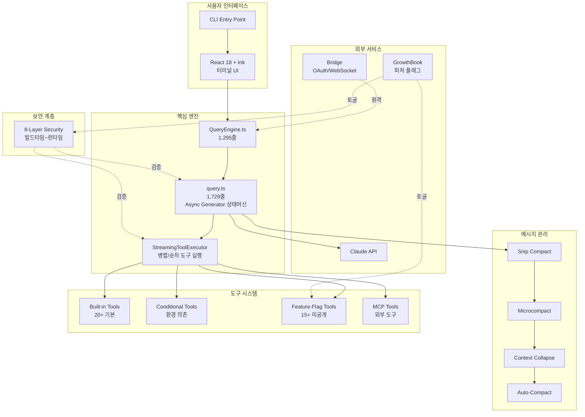
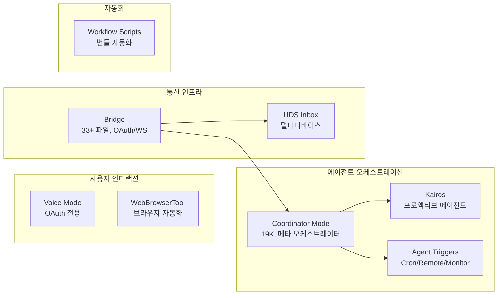

# Claude Code 아키텍처 심층 분석 (Phase 1)

> npm source map leak으로 노출된 Claude Code 핵심 엔진(4,600+ 파일) 기반 분석
> 공식 오픈소스 279개 플러그인 파일 외, 비공개 상용 코드의 아키텍처를 역분석한 문서

---

## 목차

1. [기술 스택 및 전체 아키텍처](#1-기술-스택-및-전체-아키텍처)
2. [에이전틱 루프 (query.ts)](#2-에이전틱-루프-queryts)
3. [메시지 압축 4계층](#3-메시지-압축-4계층)
4. [도구 시스템](#4-도구-시스템)
5. [보안 8계층](#5-보안-8계층)
6. [미공개 기능](#6-미공개-기능)

---

## 1. 기술 스택 및 전체 아키텍처

### 1.1 기술 스택

| 영역 | 기술 | 역할 |
|------|------|------|
| 런타임 | **Bun** | Node.js 대비 빠른 기동, 네이티브 TypeScript 지원, 번들러 내장 |
| 언어 | **TypeScript strict** | 모든 코드에 strict mode 적용, DeepImmutable 등 고급 타입 활용 |
| 터미널 UI | **React 18 + Ink** | JSX 기반 터미널 렌더링, 상태 관리를 React 패턴으로 통합 |
| AI SDK | **@anthropic-ai/sdk** | Claude API 호출, 스트리밍, 메시지 관리 |
| 도구 프로토콜 | **@modelcontextprotocol/sdk** | MCP 서버 연동, 외부 도구 통합 |
| 피처 플래그 | **GrowthBook** | 런타임 기능 토글, 킬스위치, A/B 테스트 |

### 1.2 전체 아키텍처 다이어그램



### 1.3 파일 구성 규모

```
전체 파일 수: 4,600+
├── 핵심 엔진 (비공개 상용)
│   ├── query.ts          -- 1,729줄 (에이전틱 루프)
│   ├── QueryEngine.ts    -- 1,295줄 (상태 관리)
│   ├── yoloClassifier.ts -- 52K (자동모드 안전검증)
│   ├── 파일시스템 검증    -- 62K
│   ├── Coordinator Mode   -- 19K
│   └── Bridge            -- 33+ 파일
└── 공식 오픈소스: 279개 플러그인 파일
```

---

## 2. 에이전틱 루프 (query.ts)

### 2.1 핵심 패턴: Async Generator 상태머신

Claude Code의 에이전틱 루프는 **Async Generator**로 구현된 상태머신이다. 제너레이터는 각 단계에서 이벤트를 `yield`하며, 외부 소비자(QueryEngine)가 이벤트를 처리한다.

```typescript
// query.ts - 메인 시그니처
export async function* query(params: QueryParams): AsyncGenerator<
  StreamEvent | RequestStartEvent | Message | TombstoneMessage | ToolUseSummaryMessage,
  Terminal // 반환 타입: 9개 터미널 상태 중 하나
> {
  // 불변 파라미터 (생성 시 고정)
  const {
    messages,        // 대화 이력
    systemPrompt,    // 시스템 프롬프트
    canUseTool,      // 도구 사용 권한 함수
    toolUseContext,  // 도구 컨텍스트 (40+ 필드)
    taskBudget,      // 토큰 예산
    maxTurns,        // 최대 턴 수
    fallbackModel,   // 폴백 모델
    querySource,     // 쿼리 소스 식별자
  } = params;

  // 가변 상태 (원자적 업데이트 - "Continue Site" 패턴)
  let state = {
    messages: [...messages],
    toolUseContext,
    autoCompactTracking: { consecutiveFailures: 0 },
    maxOutputTokensRecoveryCount: 0,
    hasAttemptedReactiveCompact: false,
    maxOutputTokensOverride: undefined as number | undefined,
    pendingToolUseSummary: undefined,
    stopHookActive: false,
    turnCount: 0,
    transition: undefined as StateTransition | undefined,
  };

  // 상태 전환은 개별 필드 변경이 아닌 객체 재할당
  // → 원자적 전환 보장, 부분 업데이트로 인한 불일치 방지
  while (true) {
    state = { ...state, /* 변경된 필드만 덮어씀 */ };
    // ... 6단계 파이프라인 실행
  }
}
```

**"Continue Site" 패턴**: 상태 전환 시 개별 필드를 변경하지 않고, 전체 상태 객체를 새로 할당한다. 이는 중간 상태(partial update)가 외부에 노출되는 것을 방지하며, 제너레이터의 `yield` 시점에서 항상 일관된 상태를 보장한다.

### 2.2 6단계 파이프라인

```
┌─────────────────────────────────────────────────────────────────┐
│                    에이전틱 루프 1 턴                              │
│                                                                 │
│  ┌──────────┐  ┌──────────┐  ┌──────────┐                      │
│  │ Stage 1  │→│ Stage 2  │→│ Stage 3  │                      │
│  │Pre-Req   │  │API Call  │  │Error     │                      │
│  │Compaction│  │&Stream   │  │Recovery  │                      │
│  │(365-548) │  │(659-863) │  │(1062-1256│                      │
│  └──────────┘  └──────────┘  └──────────┘                      │
│       │              │              │                            │
│       ▼              ▼              ▼                            │
│  ┌──────────┐  ┌──────────┐  ┌──────────┐                      │
│  │ Stage 4  │→│ Stage 5  │→│ Stage 6  │                      │
│  │Stop Hooks│  │Tool      │  │Post-Tool │                      │
│  │& Budget  │  │Execution │  │& State   │                      │
│  │(1267-1355│  │(1363-1520│  │Transition│                      │
│  └──────────┘  └──────────┘  │(1547-1727│                      │
│                               └──────────┘                      │
└─────────────────────────────────────────────────────────────────┘
         ↑                                    │
         └────────── 다음 턴 ─────────────────┘
```

#### Stage 1: Pre-Request Compaction (365-548줄)

API 호출 전에 컨텍스트 윈도우를 최적화하는 5단계 압축 캐스케이드.

```typescript
// Stage 1: 압축 캐스케이드 (비용 순서대로 시도)
async function preRequestCompaction(state: LoopState): Promise<LoopState> {
  // 1. Tool Result Budget - 개별 도구 결과 크기 제한
  state = applyToolResultBudget(state);

  // 2. Snip Compact - 오래된 내부 메시지 삭제 (무료)
  const snipResult = snipCompact(state.messages);
  if (snipResult.snipTokensFreed > 0) {
    state = { ...state, messages: snipResult.messages };
    // snipTokensFreed가 충분하면 이후 단계 스킵
    return state;
  }

  // 3. Microcompact - 도구 결과를 placeholder로 교체 (무료)
  state = microcompact(state);

  // 4. Context Collapse - Preview→Commit 2단계 (저비용)
  state = contextCollapse(state);

  // 5. Auto-Compact - Claude API로 요약 생성 (고비용, 최후의 수단)
  if (needsAutoCompact(state)) {
    state = await autoCompact(state);
  }

  return state;
}
```

#### Stage 2: API Call & Streaming (659-863줄)

```typescript
// Stage 2: StreamingToolExecutor로 병렬 도구 실행
class StreamingToolExecutor {
  // 동시성 안전 도구: 병렬 실행 가능
  private static readonly CONCURRENCY_SAFE_TOOLS = new Set([
    'FileRead', 'Glob', 'Grep', 'WebSearch', 'WebFetch'
  ]);

  // 상태 변경 도구: 순차 실행 필수
  private static readonly STATE_MUTATING_TOOLS = new Set([
    'FileWrite', 'Bash', 'FileEdit'
  ]);

  async executeTools(toolCalls: ToolCall[]): Promise<ToolResult[]> {
    const concurrent: ToolCall[] = [];
    const sequential: ToolCall[] = [];

    for (const call of toolCalls) {
      if (this.isConcurrencySafe(call.tool)) {
        concurrent.push(call);
      } else {
        sequential.push(call);
      }
    }

    // 읽기 전용 도구는 동시 실행
    const concurrentResults = await Promise.all(
      concurrent.map(call => this.executeTool(call))
    );

    // 상태 변경 도구는 순차 실행
    const sequentialResults: ToolResult[] = [];
    for (const call of sequential) {
      sequentialResults.push(await this.executeTool(call));
    }

    return [...concurrentResults, ...sequentialResults];
  }

  private isConcurrencySafe(tool: string): boolean {
    return StreamingToolExecutor.CONCURRENCY_SAFE_TOOLS.has(tool);
  }
}

// 중단 사유 타입
type AbortReason =
  | 'sibling_error'        // 동시 실행 도구 중 하나가 실패
  | 'user_interrupted'     // 사용자가 Ctrl+C
  | 'streaming_fallback';  // 스트리밍 오류로 폴백

// TombstoneMessage: 모델 폴백 시 대화 일관성 유지
interface TombstoneMessage {
  type: 'tombstone';
  originalModel: string;
  fallbackModel: string;
  reason: string;
  // 이전 모델의 응답을 tombstone으로 표시하여
  // 폴백 모델이 혼동 없이 이어갈 수 있도록 함
}
```

#### Stage 3: Error Recovery (1062-1256줄)

두 가지 독립적 복구 전략이 존재한다.

```typescript
// PTL(Prompt Too Long, 413) 복구 - 3단계
async function handlePromptTooLong(state: LoopState): Promise<LoopState | Terminal> {
  // 1단계: Context Collapse Drain (비용 0)
  //   - 아직 커밋되지 않은 Context Collapse를 전부 적용
  const collapsed = contextCollapseDrain(state);
  if (collapsed.tokenCount < state.contextWindow) {
    return collapsed;
  }

  // 2단계: Reactive Compact (API 1회 호출)
  //   - 긴급 요약 생성
  if (!state.hasAttemptedReactiveCompact) {
    const compacted = await reactiveCompact(state);
    return { ...compacted, hasAttemptedReactiveCompact: true };
  }

  // 3단계: Strip Retry
  //   - 최근 도구 결과를 제거하고 재시도
  return stripAndRetry(state);
}

// Max-Output-Tokens 복구 - 3단계
async function handleMaxOutputTokens(state: LoopState): Promise<LoopState | Terminal> {
  // 1단계: Token Cap Escalation (비용 0)
  //   - 8K → 16K → 32K → 64K 순차 증가
  if (state.maxOutputTokensOverride === undefined || state.maxOutputTokensOverride < 64000) {
    const nextCap = escalateTokenCap(state.maxOutputTokensOverride ?? 8000);
    return { ...state, maxOutputTokensOverride: nextCap };
  }

  // 2단계: Resume Message Injection (최대 3회)
  //   - "계속 작성하세요" 메시지를 주입하여 이어쓰기 유도
  if (state.maxOutputTokensRecoveryCount < 3) {
    state.messages.push({
      role: 'user',
      content: '[System: Your response was truncated. Please continue from where you left off.]'
    });
    return { ...state, maxOutputTokensRecoveryCount: state.maxOutputTokensRecoveryCount + 1 };
  }

  // 3단계: Recovery Exhaustion → 터미널 상태
  return { terminal: 'model_error', reason: 'max_output_tokens_exhausted' };
}

function escalateTokenCap(current: number): number {
  const caps = [8000, 16000, 32000, 64000];
  const idx = caps.indexOf(current);
  return idx < caps.length - 1 ? caps[idx + 1] : current;
}
```

#### Stage 4: Stop Hooks & Token Budget (1267-1355줄)

```typescript
// 감소 수익(diminishing returns) 감지 로직
interface StopHookState {
  continuationCount: number;
  deltaSinceLastCheck: number;
  lastDeltaTokens: number;
}

function shouldStopLoop(hook: StopHookState): boolean {
  // 3회 이상 연속 실행 AND
  // 마지막 검사 이후 변화량 < 500 토큰 AND
  // 직전 턴 출력 < 500 토큰
  return (
    hook.continuationCount >= 3 &&
    hook.deltaSinceLastCheck < 500 &&
    hook.lastDeltaTokens < 500
  );
  // → 모델이 실질적 진전 없이 반복하는 것을 감지하여 중단
}
```

#### Stage 5: Tool Execution (1363-1520줄)

```typescript
// 실시간 UI 업데이트를 위한 Promise 기반 진행률 전달
class ToolExecutionPipeline {
  private progressAvailableResolve: (() => void) | null = null;

  async execute(toolCalls: ToolCall[]): AsyncGenerator<ToolProgress | ToolResult> {
    for (const call of toolCalls) {
      // 스트리밍 모드: 도구 실행 중 실시간 진행률 yield
      const result = this.executeTool(call);

      // progressAvailableResolve Promise로 UI에 즉시 알림
      if (this.progressAvailableResolve) {
        this.progressAvailableResolve();
        this.progressAvailableResolve = null;
      }

      yield result;
    }
  }

  // 배치 모드: 모든 도구 완료 후 한번에 반환
  async executeBatch(toolCalls: ToolCall[]): Promise<ToolResult[]> {
    return Promise.all(toolCalls.map(call => this.executeTool(call)));
  }
}
```

#### Stage 6: Post-Tool & State Transition (1547-1727줄)

```typescript
// 턴 종료 후 상태 전환
async function postToolTransition(state: LoopState): Promise<LoopState> {
  // 1. 스킬 디스커버리
  //   - 도구 실행 결과에서 새로운 스킬 후보 감지
  const discoveredSkills = await discoverSkills(state);

  // 2. 메모리 첨부
  //   - 프로젝트 메모리(.claude/memory) 파일 로드 및 첨부
  const memories = await attachMemories(state);

  // 3. 큐 드레인
  //   - 대기 중인 이벤트(사용자 입력, 시스템 알림) 처리
  const queuedEvents = drainEventQueue();

  // 4. MCP 도구 갱신
  //   - 연결된 MCP 서버의 도구 목록 리프레시
  const updatedTools = await refreshMCPTools(state.toolUseContext);

  return {
    ...state,
    discoveredSkills,
    memories,
    toolUseContext: { ...state.toolUseContext, mcpTools: updatedTools },
  };
}
```

### 2.3 9개 터미널 상태

```typescript
type Terminal =
  | { terminal: 'completed' }           // 정상 완료
  | { terminal: 'blocking_limit' }      // 토큰 예산 소진
  | { terminal: 'aborted_streaming' }   // 스트리밍 중 중단
  | { terminal: 'aborted_tools' }       // 도구 실행 중 중단
  | { terminal: 'prompt_too_long' }     // PTL 복구 실패
  | { terminal: 'image_error' }         // 이미지 처리 오류
  | { terminal: 'model_error' }         // 모델 오류
  | { terminal: 'hook_stopped' }        // Stop Hook에 의한 중단
  | { terminal: 'max_turns' };          // 최대 턴 수 도달
```

### 2.4 QueryEngine.ts (1,295줄)

QueryEngine은 query 제너레이터를 소비하는 상위 관리자로, 영속 상태와 세션 관리를 담당한다.

```typescript
class QueryEngine {
  // 영속 상태
  private mutableMessages: Message[] = [];
  private permissionDenials: Map<string, number> = new Map();
  private totalUsage: TokenUsage = { input: 0, output: 0 };

  // 세션 상태
  private readFileState: Map<string, FileReadState> = new Map();
  private discoveredSkillNames: Set<string> = new Set();
  private loadedNestedMemoryPaths: Set<string> = new Set();

  async run(input: UserMessage): Promise<Terminal> {
    const generator = query({
      messages: this.mutableMessages,
      // ...
    });

    for await (const event of generator) {
      // 이벤트 타입별 처리
      if (isStreamEvent(event)) {
        yield event; // UI로 전달
      } else if (isMessage(event)) {
        // 비대칭 영속화 전략
        if (event.role === 'user') {
          // 사용자 메시지: 블로킹 저장 (데이터 손실 방지)
          await this.persistSync(event);
        } else {
          // 어시스턴트 메시지: 비동기 fire-and-forget (성능 우선)
          this.persistAsync(event);
        }
      }
    }

    return generator.return;
  }

  // 블로킹 저장: 반드시 완료 후 다음 단계 진행
  private async persistSync(message: Message): Promise<void> {
    await writeToStorage(message);
  }

  // 비동기 저장: 완료를 기다리지 않음
  private persistAsync(message: Message): void {
    writeToStorage(message).catch(err => {
      console.error('Failed to persist assistant message:', err);
    });
  }
}
```

**비대칭 영속화**: 사용자 메시지는 반드시 저장 완료 후 루프를 진행(블로킹)하지만, 어시스턴트 메시지는 fire-and-forget으로 비동기 저장한다. 사용자 입력 손실은 치명적이지만, 어시스턴트 응답은 재생성 가능하므로 성능을 우선한다.

---

## 3. 메시지 압축 4계층

### 3.1 계층 구조 개요

```
비용    정보손실   계층
─────  ────────  ────────────────────────────
무료    높음      Layer 1: Snip Compact
무료    중간      Layer 2: Microcompact
저비용  중간      Layer 3: Context Collapse
고비용  낮음      Layer 4: Auto-Compact

※ 비용이 낮은 계층부터 우선 적용 (캐스케이드)
```

### 3.2 Layer 1: Snip Compact

오래된 내부 메시지를 통째로 삭제한다. API 호출 없이 즉시 실행.

```typescript
interface SnipCompactResult {
  messages: Message[];
  snipTokensFreed: number; // 해제된 토큰 수
}

function snipCompact(messages: Message[]): SnipCompactResult {
  let snipTokensFreed = 0;
  const retained: Message[] = [];

  for (let i = 0; i < messages.length; i++) {
    const msg = messages[i];
    const age = messages.length - i;

    // 오래된 내부 메시지(도구 결과, 중간 사고 등)를 삭제
    if (isInternalMessage(msg) && age > SNIP_AGE_THRESHOLD) {
      snipTokensFreed += estimateTokens(msg);
      continue; // 삭제
    }

    retained.push(msg);
  }

  return { messages: retained, snipTokensFreed };
  // snipTokensFreed가 충분하면 Auto-Compact 트리거 불필요
}
```

### 3.3 Layer 2: Microcompact

특정 도구 결과의 내용을 placeholder 문자열로 교체한다.

```typescript
// 대상 도구 타입
const MICROCOMPACT_TARGETS = [
  'file_read', 'shell', 'grep', 'glob',
  'web_search', 'web_fetch', 'file_edit', 'file_write'
];

function microcompact(state: LoopState): LoopState {
  const messages = state.messages.map(msg => {
    if (!isToolResult(msg)) return msg;
    if (!MICROCOMPACT_TARGETS.includes(msg.toolType)) return msg;

    // 캐시 핀 상태 확인 (CACHED_MICROCOMPACT 피처)
    // → 캐시된 메시지는 prompt cache hit를 위해 보존
    if (isCachePinned(msg)) {
      return msg; // 캐시 핀된 메시지는 건드리지 않음
    }

    return {
      ...msg,
      content: '[Old tool result content cleared]',
      // 원본 토큰 수 대비 극소량으로 교체
    };
  });

  return { ...state, messages };
}
```

### 3.4 Layer 3: Context Collapse

**Preview → Commit 2단계** 구조로, 원본을 보존하면서 컨텍스트를 축소한다.

```typescript
// Context Collapse: 읽기 시점 프로젝션 + 원본 보존
interface ContextCollapseState {
  original: Message[];   // 원본 보존 (prompt cache hit 최적화)
  projected: Message[];  // 축소된 프로젝션 (API에 전송)
  committed: boolean;    // Commit 여부
}

function contextCollapsePreview(messages: Message[]): ContextCollapseState {
  // Preview 단계: 축소 결과를 미리 계산하되, 원본 유지
  const projected = messages.map(msg => {
    if (canCollapse(msg)) {
      return collapseMessage(msg); // 요약/축소 버전 생성
    }
    return msg;
  });

  return {
    original: messages,   // 원본 그대로 보존
    projected,            // 축소된 버전
    committed: false,     // 아직 커밋 안 됨
  };
}

function contextCollapseCommit(state: ContextCollapseState): Message[] {
  // Commit 단계: projected를 실제 메시지로 확정
  // → 이 시점 이후 original은 폐기 가능
  return state.projected;
}

// 읽기 시점 프로젝션: API 호출 시에만 projected를 사용하고,
// 내부적으로는 original을 유지하여 prompt cache hit 극대화
```

### 3.5 Layer 4: Auto-Compact

Claude API를 호출하여 대화를 요약한다. 가장 비용이 높지만 정보 손실이 가장 낮다.

```typescript
const AUTO_COMPACT_THRESHOLD_BUFFER = 13000;
const MAX_CONSECUTIVE_AUTOCOMPACT_FAILURES = 3; // 서킷브레이커

async function autoCompact(state: LoopState): Promise<LoopState> {
  const threshold = state.effectiveContextWindow - AUTO_COMPACT_THRESHOLD_BUFFER;

  if (estimateTokens(state.messages) < threshold) {
    return state; // 아직 임계값 미만
  }

  // 서킷브레이커: 연속 실패 3회 시 Auto-Compact 비활성화
  if (state.autoCompactTracking.consecutiveFailures >= MAX_CONSECUTIVE_AUTOCOMPACT_FAILURES) {
    return state; // 서킷 열림 → 스킵
  }

  try {
    // 4단계 파이프라인
    // Step 1: 이미지 스트리핑 (이미지 블록 제거)
    const textOnly = stripImages(state.messages);

    // Step 2: API 라운드 그룹핑 (연관 메시지 묶기)
    const grouped = groupByAPIRound(textOnly);

    // Step 3: Thinking 블록 제거 (모델 내부 사고 제거)
    const noThinking = removeThinkingBlocks(grouped);

    // Step 4: Claude API로 요약 생성
    const summary = await callCompactAPI(noThinking);

    // 실패 시 PTL 재시도 (토큰을 20%씩 감소)
    // → 요약 입력 자체가 너무 클 경우 점진적 축소
    return {
      ...state,
      messages: [{ role: 'system', content: summary }, ...recentMessages(state)],
      autoCompactTracking: { consecutiveFailures: 0 },
    };
  } catch (error) {
    return {
      ...state,
      autoCompactTracking: {
        consecutiveFailures: state.autoCompactTracking.consecutiveFailures + 1,
      },
    };
  }
}
```

### 3.6 압축 전략 비교

```
┌──────────────────────────────────────────────────────────────┐
│                  컨텍스트 윈도우 관리 흐름                      │
│                                                              │
│  토큰 사용량                                                  │
│  ▲                                                          │
│  │    ┌─── 임계값 (EffectiveWindow - 13000) ────────────    │
│  │    │                                                      │
│  │    │  ④ Auto-Compact                                     │
│  │    │     (API 호출)                                       │
│  │    │                                                      │
│  │  ③ Context Collapse                                      │
│  │     (Preview→Commit)                                     │
│  │                                                          │
│  │  ② Microcompact                                          │
│  │     (placeholder 교체)                                    │
│  │                                                          │
│  │  ① Snip Compact                                          │
│  │     (오래된 메시지 삭제)                                    │
│  │                                                          │
│  └──────────────────────────────────────────────────── ▶ 턴  │
└──────────────────────────────────────────────────────────────┘
```

---

## 4. 도구 시스템

### 4.1 Tool 인터페이스

```typescript
// ToolUseContext: 도구 실행에 필요한 모든 컨텍스트 (40+ 필드)
interface ToolUseContext {
  // 파일시스템
  cwd: string;
  allowedPaths: string[];
  fileReadState: Map<string, FileReadState>;

  // 권한
  canUseTool: (tool: string) => boolean;
  permissionDenials: Map<string, number>;

  // 세션
  sessionId: string;
  userId: string;
  userType: UserType;

  // 예산
  taskBudget: TokenBudget;
  totalUsage: TokenUsage;

  // MCP
  mcpServers: MCPServerConnection[];
  mcpTools: MCPTool[];

  // 기능 플래그
  featureFlags: FeatureFlags;

  // ... 30+ 추가 필드
}

// DeepImmutable 래핑으로 도구가 컨텍스트를 변경하는 것을 방지
type ImmutableToolUseContext = DeepImmutable<ToolUseContext>;

// DeepImmutable 유틸리티 타입
type DeepImmutable<T> =
  T extends Map<infer K, infer V> ? ReadonlyMap<DeepImmutable<K>, DeepImmutable<V>> :
  T extends Set<infer V> ? ReadonlySet<DeepImmutable<V>> :
  T extends Array<infer V> ? ReadonlyArray<DeepImmutable<V>> :
  T extends object ? { readonly [K in keyof T]: DeepImmutable<T[K]> } :
  T;
```

### 4.2 3계층 등록 시스템

```typescript
// 3계층 도구 등록
enum ToolRegistrationTier {
  ALWAYS_ENABLED,       // 20+ 기본 도구 (항상 활성)
  CONDITIONALLY_ENABLED, // 환경 의존 (OS, 런타임 등)
  FEATURE_FLAG_GATED,   // 15+ 미공개 도구 (피처 플래그)
}

// Always Enabled 도구 예시
const ALWAYS_ENABLED_TOOLS = [
  'FileRead', 'FileWrite', 'FileEdit',
  'Bash', 'Glob', 'Grep',
  'WebSearch', 'WebFetch',
  'AgentTool', 'TodoRead', 'TodoWrite',
  // ... 20+ 도구
];

// Conditionally Enabled: 환경에 따라 활성화
function isConditionallyEnabled(tool: Tool, context: ToolUseContext): boolean {
  // 예: Git 도구는 Git 저장소 내에서만 활성화
  if (tool.name === 'GitLog' && !context.isGitRepo) return false;
  // 예: Docker 도구는 Docker 사용 가능 시에만
  if (tool.name === 'DockerExec' && !context.hasDocker) return false;
  return true;
}

// Feature-Flag Gated: GrowthBook 플래그에 의해 제어
function isFeatureFlagEnabled(tool: Tool, flags: FeatureFlags): boolean {
  return flags.isEnabled(tool.featureFlagKey);
}

// ANT(Anthropic 내부) 전용 도구
const ANT_ONLY_TOOLS = [
  'REPLTool',              // 대화형 REPL
  'ConfigTool',            // 시스템 설정
  'TungstenTool',          // 내부 인프라
  'SuggestBackgroundPRTool' // 백그라운드 PR 제안
];
```

### 4.3 assembleToolPool: 도구 풀 조립

```typescript
// 빌트인과 MCP 도구를 분리 정렬 후 연결
// → 순서가 변하면 prompt cache가 깨지므로, 캐시 안정성을 위해 정렬 고정
function assembleToolPool(
  builtinTools: Tool[],
  mcpTools: MCPTool[],
  context: ToolUseContext
): Tool[] {
  // 1. 빌트인 도구: 이름순 정렬 (캐시 안정성)
  const sortedBuiltin = [...builtinTools].sort((a, b) =>
    a.name.localeCompare(b.name)
  );

  // 2. MCP 도구: 서버 이름 → 도구 이름 순 정렬
  const sortedMCP = [...mcpTools].sort((a, b) => {
    const serverCmp = a.serverName.localeCompare(b.serverName);
    return serverCmp !== 0 ? serverCmp : a.name.localeCompare(b.name);
  });

  // 3. 빌트인 먼저, MCP 뒤에 연결
  //   → 순서가 고정되어야 system prompt의 도구 목록이 변하지 않고
  //     prompt cache hit율이 유지됨
  return [...sortedBuiltin, ...sortedMCP];
}
```

### 4.4 Tool Search (Beta): 지연 로딩

```typescript
// ToolSearchTool: 필요할 때만 도구를 로딩하는 메타 도구
class ToolSearchTool implements Tool {
  name = 'ToolSearch';

  // 사용 가능한 모든 도구의 메타데이터 (이름, 설명)만 보유
  // 실제 실행 로직은 필요 시 동적 로딩
  private toolRegistry: Map<string, ToolMetadata> = new Map();

  async execute(params: { query: string }): Promise<ToolSearchResult> {
    // 쿼리와 매칭되는 도구를 검색
    const matches = this.searchTools(params.query);

    // 매칭된 도구의 스키마를 반환
    // → 모델이 다음 턴에서 해당 도구를 호출할 수 있도록
    return {
      tools: matches.map(tool => ({
        name: tool.name,
        description: tool.description,
        parameters: tool.parameterSchema,
      })),
    };
  }
}
```

---

## 5. 보안 8계층

### 5.1 보안 계층 아키텍처

```mermaid
graph TB
    subgraph "빌드타임"
        L1[Layer 1: 빌드타임 게이트<br/>feature() + USER_TYPE<br/>Dead Code Elimination]
    end

    subgraph "런타임 - 원격 제어"
        L2[Layer 2: GrowthBook 킬스위치<br/>5개 킬스위치 플래그]
        L8[Layer 8: 바이패스 킬스위치<br/>즉시 차단]
    end

    subgraph "런타임 - 설정"
        L3[Layer 3: 설정 기반 규칙<br/>8개 소스 우선순위]
    end

    subgraph "런타임 - AI 판단"
        L4[Layer 4: yoloClassifier.ts<br/>52K, Claude API 안전검증]
    end

    subgraph "런타임 - 패턴 매칭"
        L5[Layer 5: 위험 패턴 감지<br/>DANGEROUS_BASH_PATTERNS]
    end

    subgraph "런타임 - 파일시스템"
        L6[Layer 6: 파일시스템 검증<br/>62K, 경로/심링크/glob]
    end

    subgraph "런타임 - 사용자 인터랙션"
        L7[Layer 7: Trust Dialog<br/>초기 세션 검토]
    end

    L1 --> L2 --> L3 --> L4 --> L5 --> L6 --> L7
    L8 -.->|긴급 차단| L2
```

### 5.2 Layer 1: 빌드타임 게이트

```typescript
// feature() + USER_TYPE 분기
// Bun 번들러가 Dead Code Elimination으로 false 브랜치를 완전 제거
function feature(flag: string): boolean {
  // 빌드 시점에 상수로 치환됨
  return FEATURE_FLAGS[flag] ?? false;
}

// 사용 예시
if (feature('voice_mode') && USER_TYPE === 'ant') {
  // 이 블록은 일반 사용자 빌드에서 완전히 제거됨
  registerVoiceModeTools();
}

// Bun 번들러 설정
// {
//   define: {
//     'USER_TYPE': JSON.stringify('external'),
//     'FEATURE_FLAGS.voice_mode': 'false',
//   }
// }
// → false 브랜치의 코드가 번들에 포함되지 않음
```

### 5.3 Layer 2: GrowthBook 킬스위치

```typescript
// 5개 핵심 킬스위치
const KILLSWITCHES = {
  // 음성 모드 비활성화 (긍정적 이름 = 비활성화)
  tengu_amber_quartz_disabled: boolean,

  // 권한 바이패스 비활성화
  tengu_bypass_permissions_disabled: boolean,

  // 자동 모드 설정
  tengu_auto_mode_config: {
    enabled: boolean,
    // ... 세부 설정
  },

  // 원격 제어 브릿지
  tengu_ccr_bridge: boolean,

  // 신뢰 장치 인증 강화
  tengu_sessions_elevated_auth_enforcement: boolean,
};

// 런타임에 GrowthBook에서 실시간 조회
function isFeatureEnabled(key: keyof typeof KILLSWITCHES): boolean {
  return growthbook.getFeatureValue(key, false);
}
```

### 5.4 Layer 3: 설정 기반 규칙

```typescript
// 8개 소스 우선순위 (높은 순)
type SettingSource =
  | 'userSettings'     // 1순위: 사용자 개인 설정 (~/.claude/settings.json)
  | 'projectSettings'  // 2순위: 프로젝트 설정 (.claude/settings.json)
  | 'localSettings'    // 3순위: 로컬 설정 (.claude/settings.local.json)
  | 'flagSettings'     // 4순위: 피처 플래그 설정
  | 'policySettings'   // 5순위: 조직 정책
  | 'cliArg'           // 6순위: CLI 인자
  | 'command'          // 7순위: 명령어 기본값
  | 'session';         // 8순위: 세션 기본값

// 설정 해석: 높은 우선순위가 낮은 우선순위를 덮어씀
function resolveSettings(sources: Record<SettingSource, Settings>): Settings {
  const priority: SettingSource[] = [
    'userSettings', 'projectSettings', 'localSettings',
    'flagSettings', 'policySettings', 'cliArg', 'command', 'session'
  ];

  let resolved: Settings = {};
  // 낮은 우선순위부터 적용 → 높은 우선순위가 덮어씀
  for (const source of [...priority].reverse()) {
    resolved = { ...resolved, ...sources[source] };
  }
  return resolved;
}
```

### 5.5 Layer 4: yoloClassifier.ts (52K)

자동 모드에서 도구 실행 전 Claude API를 호출하여 안전성을 검증한다.

```typescript
// 자동모드 안전검증 (yoloClassifier.ts)
class YoloClassifier {
  // 읽기 전용 도구는 검증 없이 바이패스
  private static readonly WHITELIST = new Set([
    'FileRead', 'Glob', 'Grep', 'WebSearch', 'WebFetch',
    'TodoRead', 'GitLog', 'GitDiff',
  ]);

  private consecutiveDenials = 0;
  private totalDenials = 0;

  async classify(toolCall: ToolCall): Promise<'allow' | 'deny' | 'prompt'> {
    // 화이트리스트 도구는 즉시 허용
    if (YoloClassifier.WHITELIST.has(toolCall.tool)) {
      return 'allow';
    }

    // Claude API로 안전성 판단
    const result = await this.callClassifierAPI(toolCall);

    if (result === 'deny') {
      this.consecutiveDenials++;
      this.totalDenials++;

      // 연속 거부 3회 또는 총 거부 20회 → 프롬프팅 폴백
      // (자동 모드를 포기하고 사용자에게 묻기)
      if (this.consecutiveDenials >= 3 || this.totalDenials >= 20) {
        return 'prompt'; // 사용자에게 직접 확인
      }
    } else {
      this.consecutiveDenials = 0; // 연속 카운트 리셋
    }

    return result;
  }
}
```

### 5.6 Layer 5: 위험 패턴 감지

```typescript
// 위험한 Bash 명령 패턴
const DANGEROUS_BASH_PATTERNS: string[] = [
  'python',   // 스크립트 실행
  'node',     // 스크립트 실행
  'ruby',     // 스크립트 실행
  'curl',     // 네트워크 요청
  'wget',     // 네트워크 요청
  'sudo',     // 권한 상승
  'docker',   // 컨테이너 조작
  'rm -rf',   // 파괴적 삭제
  'chmod',    // 권한 변경
  'chown',    // 소유권 변경
  // ... 기타 패턴
];

function containsDangerousPattern(command: string): boolean {
  return DANGEROUS_BASH_PATTERNS.some(pattern =>
    command.toLowerCase().includes(pattern)
  );
}
```

### 5.7 Layer 6: 파일시스템 검증 (62K)

```typescript
// 파일시스템 보안 검증
class FileSystemValidator {
  // 절대 경로 정규화
  normalizePath(path: string): string {
    // 상대경로 → 절대경로 변환
    // '..' 탈출 시도 감지
    const normalized = resolve(path);

    // CWD 또는 허용 경로 내인지 확인
    if (!this.isWithinAllowedPaths(normalized)) {
      throw new SecurityError(`Path outside allowed directories: ${path}`);
    }

    return normalized;
  }

  // 심링크 탈출 방지
  async resolveSymlink(path: string): Promise<string> {
    const real = await realpath(path);

    // 심링크 해석 후에도 허용 경로 내인지 재확인
    if (!this.isWithinAllowedPaths(real)) {
      throw new SecurityError(`Symlink escapes allowed directory: ${path} -> ${real}`);
    }

    return real;
  }

  // glob 안전 확장
  safeGlob(pattern: string, cwd: string): string[] {
    // glob 패턴이 허용 경로를 벗어나지 않도록 검증
    const expanded = glob.sync(pattern, { cwd });
    return expanded.filter(p => this.isWithinAllowedPaths(resolve(cwd, p)));
  }

  // CWD 전용 모드 vs 전체 접근 모드
  private isWithinAllowedPaths(path: string): boolean {
    if (this.mode === 'cwd_only') {
      return path.startsWith(this.cwd);
    }
    // 전체 접근 모드: allowedPaths 목록 확인
    return this.allowedPaths.some(allowed => path.startsWith(allowed));
  }
}
```

### 5.8 Layer 7 & 8: Trust Dialog 및 바이패스 킬스위치

```typescript
// Layer 7: Trust Dialog - 초기 세션에서 위험 요소 검토
async function showTrustDialog(context: SessionContext): Promise<TrustDecision> {
  const risks: TrustRisk[] = [];

  // MCP 서버 검토
  if (context.mcpServers.length > 0) {
    risks.push({ type: 'mcp', servers: context.mcpServers });
  }

  // Hooks 검토
  if (context.hooks.length > 0) {
    risks.push({ type: 'hooks', hooks: context.hooks });
  }

  // Bash 도구 접근 검토
  if (context.bashEnabled) {
    risks.push({ type: 'bash' });
  }

  // API 키 검토
  if (context.apiKeys.length > 0) {
    risks.push({ type: 'api_keys', keys: context.apiKeys });
  }

  // 사용자에게 검토 요청
  return promptUser(risks);
}

// Layer 8: 바이패스 킬스위치 - GrowthBook으로 즉시 차단
function checkBypassKillswitch(): boolean {
  // tengu_bypass_permissions_disabled가 true이면
  // 모든 바이패스 모드가 즉시 비활성화됨
  return growthbook.getFeatureValue('tengu_bypass_permissions_disabled', false);
}
```

---

## 6. 미공개 기능

### 6.1 기능 맵 개요



### 6.2 Voice Mode

```typescript
// Voice Mode: OAuth 전용, voice_stream 엔드포인트 사용
// 킬스위치: tengu_amber_quartz_disabled

interface VoiceModeConfig {
  endpoint: 'voice_stream';
  auth: 'oauth'; // OAuth 전용 (API 키 불가)
  killswitch: 'tengu_amber_quartz_disabled';
}

// 음성 모드 활성화 조건
function canEnableVoiceMode(context: ToolUseContext): boolean {
  return (
    feature('voice_mode') &&
    context.authType === 'oauth' &&
    !growthbook.getFeatureValue('tengu_amber_quartz_disabled', false)
  );
}
```

### 6.3 WebBrowserTool

```typescript
// WebBrowserTool: Bun WebView API를 사용한 실제 브라우저 자동화
class WebBrowserTool implements Tool {
  name = 'WebBrowser';

  async execute(params: {
    url: string;
    action: 'navigate' | 'click' | 'type' | 'screenshot' | 'extract';
    selector?: string;
    text?: string;
  }): Promise<BrowserResult> {
    // Bun의 WebView API로 실제 브라우저 인스턴스 제어
    const page = await this.getOrCreatePage();

    switch (params.action) {
      case 'navigate':
        await page.goto(params.url);
        break;
      case 'click':
        await page.click(params.selector!);
        break;
      case 'type':
        await page.type(params.selector!, params.text!);
        break;
      case 'screenshot':
        return { screenshot: await page.screenshot() };
      case 'extract':
        return { content: await page.evaluate('document.body.innerText') };
    }

    return { success: true };
  }
}
```

### 6.4 Coordinator Mode (19K)

메타 오케스트레이터로, 여러 서브에이전트를 관리한다.

```typescript
// Coordinator Mode: 제한된 도구 세트만 허용
const COORDINATOR_MODE_ALLOWED_TOOLS = [
  'AgentTool',       // 서브에이전트 생성/관리
  'TaskStop',        // 작업 중단
  'SendMessage',     // 메시지 전송
  'SyntheticOutput', // 합성 출력 생성
];

interface CoordinatorState {
  agents: Map<string, AgentInstance>;
  sharedScratchpad: SharedMemory;    // 공유 스크래치패드
  gitWorktrees: Map<string, string>; // 에이전트별 Git Worktree
}

class CoordinatorMode {
  private state: CoordinatorState;

  // 서브에이전트 생성 시 Git Worktree 격리
  async spawnAgent(task: TaskDefinition): Promise<AgentInstance> {
    // 각 에이전트에 독립적인 Git Worktree 할당
    const worktree = await createGitWorktree(task.id);

    const agent = new AgentInstance({
      task,
      cwd: worktree.path,
      // 공유 스크래치패드로 에이전트 간 소통
      scratchpad: this.state.sharedScratchpad,
    });

    this.state.agents.set(task.id, agent);
    this.state.gitWorktrees.set(task.id, worktree.path);

    return agent;
  }

  // 에이전트 간 메시지 전달
  async sendMessage(from: string, to: string, message: string): Promise<void> {
    const targetAgent = this.state.agents.get(to);
    if (!targetAgent) throw new Error(`Agent ${to} not found`);
    await targetAgent.receiveMessage({ from, content: message });
  }
}
```

### 6.5 Kairos (프로액티브 에이전트)

```typescript
// Kairos: 사용자 요청 없이 자발적으로 작업하는 프로액티브 에이전트
// 전용 도구 세트

class SendUserFileTool implements Tool {
  name = 'SendUserFile';
  // 사용자에게 파일을 능동적으로 전송
}

class PushNotificationTool implements Tool {
  name = 'PushNotification';
  // 모바일/데스크톱 푸시 알림 전송
}

class SubscribePRTool implements Tool {
  name = 'SubscribePR';
  // PR 이벤트 구독 (리뷰 요청, CI 결과 등)
}

class SleepTool implements Tool {
  name = 'Sleep';
  // 주기적 깨어남을 위한 슬립 도구
}

// Kairos 작동 흐름
// PR 리뷰 요청 감지 → CI 체크 모니터링 → 결과 분석
// → 푸시 알림 전송 → Sleep → 주기적 깨어남 → 반복
async function kairosLoop(subscription: PRSubscription): Promise<void> {
  while (subscription.active) {
    // PR 상태 확인
    const prStatus = await checkPRStatus(subscription.prId);

    if (prStatus.ciCompleted) {
      // CI 결과 분석 및 알림
      const analysis = await analyzeCIResults(prStatus.ciResults);
      await pushNotification({
        title: `PR #${subscription.prId} CI 완료`,
        body: analysis.summary,
      });
    }

    // 주기적 슬립 후 깨어남
    await sleep(subscription.checkInterval);
  }
}
```

### 6.6 Agent Triggers

```typescript
// Cron 기반 트리거
class CronCreateTool implements Tool {
  name = 'CronCreate';
  async execute(params: {
    schedule: string;  // cron 표현식
    task: string;      // 실행할 작업
  }): Promise<CronJob> {
    return scheduleCronJob(params.schedule, params.task);
  }
}

class CronDeleteTool implements Tool {
  name = 'CronDelete';
  async execute(params: { jobId: string }): Promise<void> {
    await deleteCronJob(params.jobId);
  }
}

class CronListTool implements Tool {
  name = 'CronList';
  async execute(): Promise<CronJob[]> {
    return listCronJobs();
  }
}

// 원격 트리거 + 모니터링
class RemoteTriggerTool implements Tool {
  name = 'RemoteTrigger';
  // 외부 이벤트(웹훅 등)로 에이전트 실행 트리거
}

class MonitorTool implements Tool {
  name = 'Monitor';
  // 시스템/서비스 상태 모니터링
}
```

### 6.7 UDS Inbox (멀티디바이스 메시징)

```typescript
// UDS Inbox: 여러 디바이스/클라이언트 간 메시지 교환
interface UDSInbox {
  // 커스텀 프로토콜 스킴
  schemes: ['bridge://', 'other://'];

  // 메시지 전송
  send(to: DeviceId, message: InboxMessage): Promise<void>;

  // 메시지 수신 (구독 기반)
  subscribe(callback: (message: InboxMessage) => void): Unsubscribe;
}

// bridge:// - Bridge 서버 경유 메시지
// other:// - 기타 프로토콜 (UDS 소켓 등)
```

### 6.8 Workflow Scripts

```typescript
// 번들 자동화 스크립트
interface WorkflowScript {
  name: string;
  steps: WorkflowStep[];

  // 서브에이전트 재귀 실행 차단
  // → 워크플로우 내에서 또 다른 워크플로우를 실행하는 것을 방지
  maxRecursionDepth: 0;
}

function executeWorkflow(script: WorkflowScript, context: ToolUseContext): void {
  if (context.workflowDepth > script.maxRecursionDepth) {
    throw new Error('Workflow recursion blocked: sub-agent cannot invoke workflows');
  }
  // ... 스크립트 단계별 실행
}
```

### 6.9 Bridge (33+ 파일)

```typescript
// Bridge: 원격 제어 인프라
// OAuth → CCR API → WebSocket 터널

interface BridgeConfig {
  auth: {
    // Standard 티어: 기본 OAuth 인증
    standard: OAuthConfig;
    // Elevated 티어: JWT 신뢰장치 토큰 추가
    elevated: {
      oauth: OAuthConfig;
      deviceToken: JWTDeviceToken; // 신뢰 장치 인증
    };
  };

  // CCR (Claude Code Remote) API
  ccrApi: {
    endpoint: string;
    // WebSocket 터널로 실시간 양방향 통신
    websocket: WebSocketTunnelConfig;
  };

  // Git Worktree 세션 격리
  // → 각 원격 세션이 독립적인 Git Worktree에서 작업
  sessionIsolation: {
    strategy: 'git_worktree';
    basePath: string;
  };
}

// 인증 티어
type AuthTier = 'standard' | 'elevated';

// 신뢰 장치 토큰 (JWT)
interface JWTDeviceToken {
  deviceId: string;
  issuedAt: number;
  expiresAt: number;
  trustLevel: 'verified' | 'unverified';
}

// Bridge 연결 흐름
async function establishBridgeConnection(config: BridgeConfig): Promise<BridgeSession> {
  // 1. OAuth 인증
  const oauthToken = await authenticate(config.auth.standard);

  // 2. (선택) Elevated 인증
  let authTier: AuthTier = 'standard';
  if (config.auth.elevated) {
    const deviceToken = await verifyDeviceToken(config.auth.elevated.deviceToken);
    if (deviceToken.trustLevel === 'verified') {
      authTier = 'elevated';
    }
  }

  // 3. CCR API 연결
  const ccrSession = await connectCCR(config.ccrApi, oauthToken);

  // 4. WebSocket 터널 수립
  const tunnel = await ccrSession.openWebSocketTunnel();

  // 5. Git Worktree 격리
  const worktree = await createIsolatedWorktree(config.sessionIsolation);

  return {
    tunnel,
    worktree,
    authTier,
  };
}
```

---

## 부록: 핵심 수치 요약

| 항목 | 수치 |
|------|------|
| 전체 파일 수 | 4,600+ |
| 공식 오픈소스 파일 | 279개 |
| query.ts | 1,729줄 |
| QueryEngine.ts | 1,295줄 |
| yoloClassifier.ts | 52K |
| 파일시스템 검증 | 62K |
| Coordinator Mode | 19K |
| Bridge 파일 수 | 33+ |
| 기본 도구 수 | 20+ |
| 미공개 도구 수 | 15+ |
| ToolUseContext 필드 | 40+ |
| 보안 계층 수 | 8 |
| 메시지 압축 계층 | 4 |
| 터미널 상태 | 9 |
| Auto-Compact 임계값 버퍼 | 13,000 토큰 |
| 서킷브레이커 임계값 | 연속 3회 실패 |
| yolo 프롬프팅 폴백 | 연속거부 3회 / 총거부 20회 |
| 설정 소스 우선순위 | 8개 계층 |
| GrowthBook 킬스위치 | 5개 |
