# Claude Code 하네스 엔지니어링 관점 종합 분석

> Claude Code v2.1.88 소스 코드 기반 하네스 엔지니어링 심층 분석
> 분석 일시: 2026-03-31

---

## 목차

1. [하네스 엔지니어링 개요](#1-하네스-엔지니어링-개요)
2. [Claude Code의 멀티 에이전트 아키텍처](#2-claude-code의-멀티-에이전트-아키텍처)
3. [하네스 패턴별 Claude Code 구현 매핑](#3-하네스-패턴별-claude-code-구현-매핑)
4. [스킬 시스템과 자동 생성](#4-스킬-시스템과-자동-생성)
5. [에러 핸들링과 복구](#5-에러-핸들링과-복구)
6. [격리와 공유](#6-격리와-공유)
7. [Claude Code를 하네스로 활용하기 위한 가이드](#7-claude-code를-하네스로-활용하기-위한-가이드)

---

## 1. 하네스 엔지니어링 개요

### 1.1 하네스 엔지니어링의 정의

하네스 엔지니어링(Harness Engineering)은 도메인에 맞는 **전문 에이전트 팀을 설계**하고, 에이전트가 사용할 **스킬까지 자동 생성**하는 메타 레벨의 에이전트 오케스트레이션 기법이다. 단순히 하나의 에이전트를 호출하는 것이 아니라, **에이전트 간의 협업 구조(아키텍처 패턴)**, **통신 프로토콜**, **에러 핸들링 전략**을 포함하는 완결된 작업 시스템을 구성한다.

**Claude Code에서의 의미**: Claude Code는 단순한 터미널 UI가 아니라, 그 자체가 **프로덕션 그레이드 에이전트 런타임**이다. 내부에 하네스 엔지니어링의 6가지 아키텍처 패턴이 모두 구현되어 있으며, 이를 활용하면 외부 오케스트레이션 프레임워크 없이도 복잡한 멀티 에이전트 워크플로를 구성할 수 있다.

### 1.2 6가지 아키텍처 패턴과 Claude Code 내부 구현 매핑

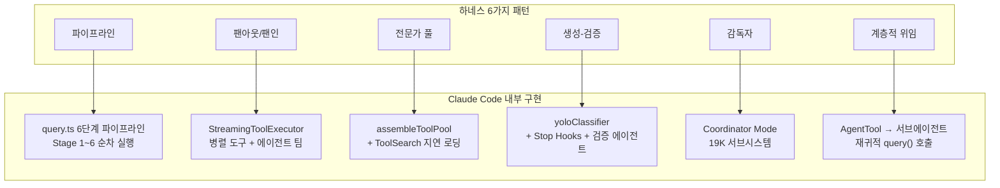

| 하네스 패턴 | Claude Code 구현체 | 핵심 파일 | 규모 |
|------------|-------------------|----------|------|
| **파이프라인** | query.ts 6단계 파이프라인 | `src/query.ts` | 1,729줄 |
| **팬아웃/팬인** | StreamingToolExecutor + TeamCreate | `src/services/tools/` + `src/tools/TeamCreateTool/` | - |
| **전문가 풀** | assembleToolPool + ToolSearch | `src/tools.ts` + `src/tools/ToolSearchTool/` | - |
| **생성-검증** | yoloClassifier + VERIFICATION_AGENT | `yoloClassifier.ts` (52K) + `built-in/verificationAgent.ts` | - |
| **감독자** | Coordinator Mode | `src/coordinator/coordinatorMode.ts` | 19K |
| **계층적 위임** | AgentTool → runAgent → query() | `src/tools/AgentTool/runAgent.ts` | 974줄 |

---

## 2. Claude Code의 멀티 에이전트 아키텍처

### 2.1 Coordinator Mode (19K 서브시스템) 상세 분석

Coordinator Mode는 Claude Code의 메타 오케스트레이터이다. 환경변수 `CLAUDE_CODE_COORDINATOR_MODE=1`과 피처 플래그 `feature('COORDINATOR_MODE')`로 활성화된다.

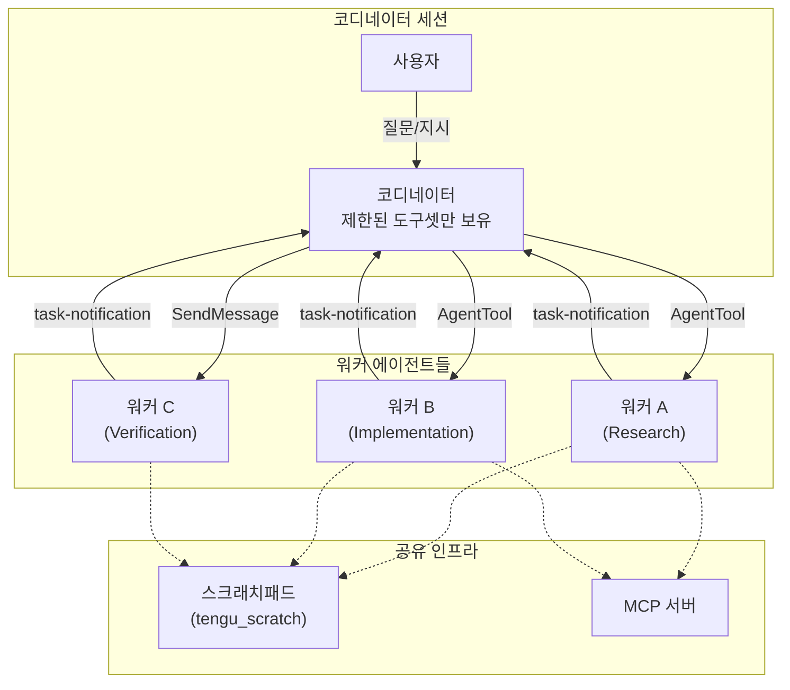

#### 활성화 메커니즘

```typescript
// src/coordinator/coordinatorMode.ts
export function isCoordinatorMode(): boolean {
  if (feature('COORDINATOR_MODE')) {
    return isEnvTruthy(process.env.CLAUDE_CODE_COORDINATOR_MODE)
  }
  return false
}
```

세션 재개(resume) 시 모드 불일치를 감지하여 자동으로 환경변수를 전환한다:

```typescript
export function matchSessionMode(
  sessionMode: 'coordinator' | 'normal' | undefined,
): string | undefined {
  const currentIsCoordinator = isCoordinatorMode()
  const sessionIsCoordinator = sessionMode === 'coordinator'
  if (currentIsCoordinator === sessionIsCoordinator) return undefined
  // 환경변수를 라이브로 전환 — 캐싱 없이 즉시 반영
  if (sessionIsCoordinator) {
    process.env.CLAUDE_CODE_COORDINATOR_MODE = '1'
  } else {
    delete process.env.CLAUDE_CODE_COORDINATOR_MODE
  }
  return sessionIsCoordinator
    ? 'Entered coordinator mode to match resumed session.'
    : 'Exited coordinator mode to match resumed session.'
}
```

### 2.2 COORDINATOR_MODE_ALLOWED_TOOLS: 제한된 도구셋

코디네이터는 직접 코드를 작성하거나 파일을 읽지 않는다. 오케스트레이션 전용 도구만 사용할 수 있다:

```typescript
// 코디네이터가 사용 가능한 도구
const COORDINATOR_TOOLS = [
  'AgentTool',        // 워커 에이전트 생성
  'SendMessageTool',  // 기존 워커에 후속 지시
  'TaskStopTool',     // 실행 중인 워커 중단
  'SyntheticOutput',  // 합성 출력 생성
]

// 코디네이터가 사용할 수 없는 내부 워커 도구
const INTERNAL_WORKER_TOOLS = new Set([
  TEAM_CREATE_TOOL_NAME,
  TEAM_DELETE_TOOL_NAME,
  SEND_MESSAGE_TOOL_NAME,
  SYNTHETIC_OUTPUT_TOOL_NAME,
])
```

**핵심 설계 원칙**: "Workers can't see your conversation. Every prompt must be self-contained."
코디네이터는 워커에게 자급자족(self-contained) 프롬프트를 작성해야 한다. 이는 하네스 패턴에서 **감독자** 역할의 핵심 계약이다.

### 2.3 워커 에이전트 생성/관리/통신 메커니즘

#### 워커 생성 (`AgentTool`)

워커는 `runAgent()` 함수를 통해 생성되며, 부모와 동일한 `query()` 함수를 사용한다(서브에이전트 풀 피델리티):

```typescript
// src/tools/AgentTool/runAgent.ts
export async function* runAgent({
  agentDefinition,      // 에이전트 정의 (시스템 프롬프트, 허용 도구 등)
  promptMessages,       // 초기 프롬프트 메시지
  toolUseContext,       // 부모 컨텍스트 (격리됨)
  isAsync,              // 비동기 실행 여부
  worktreePath,         // Git Worktree 경로 (격리)
  ...
}): AsyncGenerator<Message, void> {
  // 1. 에이전트 ID 생성
  const agentId = createAgentId()

  // 2. 에이전트 전용 MCP 서버 초기화 (부모에 추가적)
  const { clients, tools, cleanup } = await initializeAgentMcpServers(
    agentDefinition, parentClients
  )

  // 3. 서브에이전트 컨텍스트 생성 (격리)
  const agentToolUseContext = createSubagentContext(toolUseContext, {
    agentId, options: agentOptions, ...
  })

  // 4. query() 루프 실행 — 부모와 동일한 에이전틱 루프
  for await (const message of query({
    messages: initialMessages,
    systemPrompt: agentSystemPrompt,
    canUseTool, toolUseContext: agentToolUseContext,
    maxTurns: maxTurns ?? agentDefinition.maxTurns,
  })) {
    yield message  // 부모에게 메시지 전달
  }
}
```

#### 워커 통신 (`SendMessageTool`)

코디네이터는 완료된 워커에게 `SendMessage`로 후속 지시를 보낼 수 있다. 워커의 기존 컨텍스트가 유지되므로 연속 작업에 효과적이다.

#### 워커 결과 수신 (`task-notification`)

워커 결과는 XML 형식의 `<task-notification>`으로 코디네이터에게 전달된다:

```xml
<task-notification>
  <task-id>{agentId}</task-id>
  <status>completed|failed|killed</status>
  <summary>{human-readable status summary}</summary>
  <result>{agent's final text response}</result>
  <usage>
    <total_tokens>N</total_tokens>
    <tool_uses>N</tool_uses>
    <duration_ms>N</duration_ms>
  </usage>
</task-notification>
```

### 2.4 에이전트 팀 (TeamCreate) vs 서브 에이전트 (AgentTool) 차이

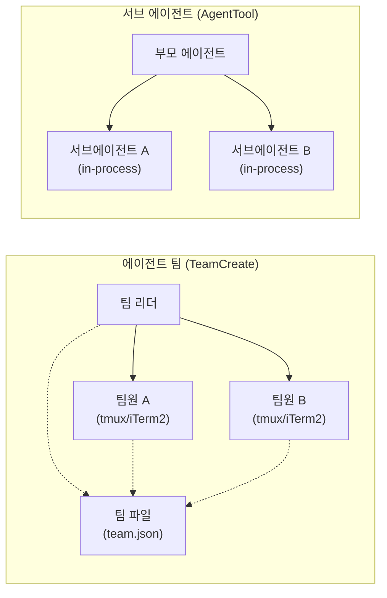

| 특성 | 에이전트 팀 (TeamCreate) | 서브 에이전트 (AgentTool) |
|------|------------------------|------------------------|
| **활성화 조건** | `CLAUDE_CODE_EXPERIMENTAL_AGENT_TEAMS=1` | 항상 사용 가능 |
| **실행 방식** | 별도 프로세스 (tmux/iTerm2) | 인프로세스 (async generator) |
| **통신** | 팀 파일(JSON) + SendMessage | query() yield/return |
| **격리** | 완전한 프로세스 격리 | 컨텍스트 레벨 격리 |
| **사용 사례** | 2+ 에이전트, 장기 협업 | 단발성 작업, 통신 불필요 |
| **피처 플래그** | `isAgentSwarmsEnabled()` | 없음 (기본 제공) |
| **컨텍스트 공유** | 팀 파일, 스크래치패드 | forkContextMessages |

```typescript
// TeamCreateTool 핵심 — 팀 파일 기반 협업
const teamFile: TeamFile = {
  name: finalTeamName,
  description: _description,
  createdAt: Date.now(),
  leadAgentId,
  leadSessionId: getSessionId(),
  members: [{
    agentId: leadAgentId,
    name: TEAM_LEAD_NAME,
    agentType: leadAgentType,
    model: leadModel,
    joinedAt: Date.now(),
    tmuxPaneId: '',
    cwd: getCwd(),
    subscriptions: [],
  }],
}
```

### 2.5 내장 에이전트 목록

Claude Code에는 6개의 빌트인 에이전트가 존재한다:

| 에이전트 | 역할 | 조건 |
|---------|------|------|
| **GENERAL_PURPOSE_AGENT** | 범용 서브에이전트 | 항상 |
| **EXPLORE_AGENT** | 읽기 전용 코드 탐색 | `tengu_amber_stoat` |
| **PLAN_AGENT** | 읽기 전용 계획 수립 | `tengu_amber_stoat` |
| **STATUSLINE_SETUP_AGENT** | 상태 표시줄 설정 | 항상 |
| **CLAUDE_CODE_GUIDE_AGENT** | Claude Code 사용 가이드 | 비SDK 진입점 |
| **VERIFICATION_AGENT** | 코드 검증 | `tengu_hive_evidence` |

코디네이터 모드에서는 이 목록이 `getCoordinatorAgents()`로 대체된다.

---

## 3. 하네스 패턴별 Claude Code 구현 매핑

### 3.1 파이프라인 패턴: query.ts 6단계 파이프라인

하네스의 **파이프라인 패턴**(순차 의존 작업)은 Claude Code의 핵심 에이전틱 루프 자체가 구현하고 있다.

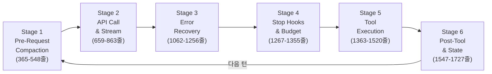

각 Stage는 이전 Stage의 결과에 의존하며, **Continue Site 패턴**(상태 객체 전체 재할당)으로 원자적 전환을 보장한다:

```typescript
// query.ts — Async Generator 상태머신
export async function* query(params: QueryParams): AsyncGenerator<...> {
  let state = {
    messages: [...messages],
    autoCompactTracking: { consecutiveFailures: 0 },
    maxOutputTokensRecoveryCount: 0,
    hasAttemptedReactiveCompact: false,
    turnCount: 0,
    // ...
  };

  while (true) {
    // Stage 1: 압축 캐스케이드 (비용 순서대로)
    state = await preRequestCompaction(state);
    // Stage 2: API 호출 & 스트리밍
    const response = await callAPI(state);
    // Stage 3: 에러 복구 (PTL, Max-Output-Tokens)
    state = await handleErrors(state, response);
    // Stage 4: Stop Hooks & 토큰 예산 검사
    if (shouldStopLoop(state)) break;
    // Stage 5: 도구 실행
    state = await executeTools(state);
    // Stage 6: 스킬 디스커버리, 메모리, MCP 갱신
    state = await postToolTransition(state);
    // 상태 전환은 전체 객체 재할당 — 원자적 보장
    state = { ...state, turnCount: state.turnCount + 1 };
  }
}
```

### 3.2 팬아웃/팬인 패턴: StreamingToolExecutor + 에이전트 팀

하네스의 **팬아웃/팬인 패턴**(병렬 독립 작업)은 두 수준에서 구현된다.

#### 수준 1: 도구 레벨 병렬 실행

```typescript
// StreamingToolExecutor — 도구 안전성에 따른 병렬/순차 분기
class StreamingToolExecutor {
  // 읽기 전용 도구: 동시 실행 가능
  static readonly CONCURRENCY_SAFE_TOOLS = new Set([
    'FileRead', 'Glob', 'Grep', 'WebSearch', 'WebFetch'
  ]);
  // 상태 변경 도구: 순차 실행 필수
  static readonly STATE_MUTATING_TOOLS = new Set([
    'FileWrite', 'Bash', 'FileEdit'
  ]);

  async executeTools(toolCalls: ToolCall[]): Promise<ToolResult[]> {
    const concurrent = toolCalls.filter(c => this.isConcurrencySafe(c.tool));
    const sequential = toolCalls.filter(c => !this.isConcurrencySafe(c.tool));
    // 팬아웃: 읽기 전용 도구는 Promise.all로 동시 실행
    const concurrentResults = await Promise.all(
      concurrent.map(call => this.executeTool(call))
    );
    // 팬인: 순차 도구 결과와 병합
    const sequentialResults = [];
    for (const call of sequential) {
      sequentialResults.push(await this.executeTool(call));
    }
    return [...concurrentResults, ...sequentialResults];
  }
}
```

#### 수준 2: 에이전트 레벨 병렬 실행

코디네이터 시스템 프롬프트에 명시된 핵심 원칙:

> **"Parallelism is your superpower. Workers are async. Launch independent workers concurrently whenever possible."**

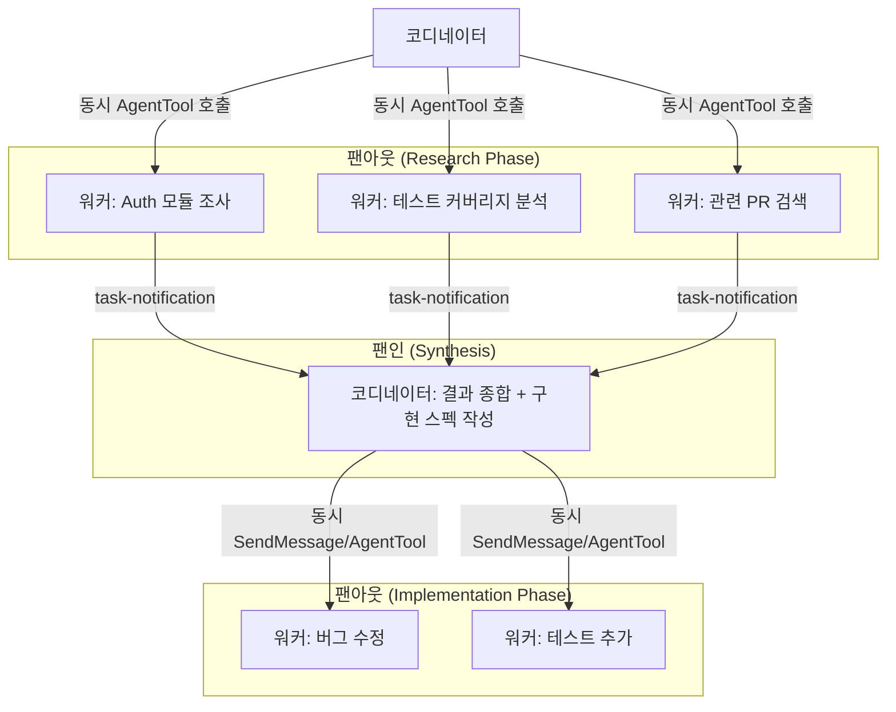

코디네이터의 워크플로 가이드에서 병렬성 관리 규칙:

| 작업 유형 | 병렬성 | 이유 |
|----------|-------|------|
| 읽기 전용 (Research) | 자유롭게 병렬 | 상태 변경 없음 |
| 쓰기 작업 (Implementation) | 파일셋별 1개씩 | 충돌 방지 |
| 검증 (Verification) | 구현과 병렬 가능 | 다른 파일 영역일 때 |

### 3.3 전문가 풀 패턴: assembleToolPool + Tool Search

하네스의 **전문가 풀 패턴**(상황별 선택 호출)은 Claude Code의 도구 풀 조립 시스템으로 구현된다.

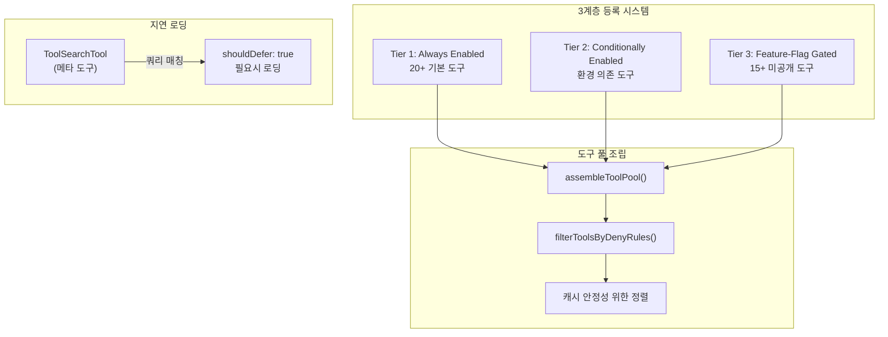

```typescript
// assembleToolPool — 빌트인 + MCP 도구를 분리 정렬 후 병합
function assembleToolPool(
  builtinTools: Tool[], mcpTools: MCPTool[], context: ToolUseContext
): Tool[] {
  // 빌트인: 이름순 정렬 (캐시 안정성)
  const sortedBuiltin = [...builtinTools].sort((a, b) =>
    a.name.localeCompare(b.name)
  );
  // MCP: 서버명 → 도구명 순 정렬
  const sortedMCP = [...mcpTools].sort((a, b) => {
    const serverCmp = a.serverName.localeCompare(b.serverName);
    return serverCmp !== 0 ? serverCmp : a.name.localeCompare(b.name);
  });
  // 순서 고정 → prompt cache hit율 유지
  return [...sortedBuiltin, ...sortedMCP];
}
```

**ToolSearch**: 40개 이상의 도구 전체를 시스템 프롬프트에 포함하면 토큰 낭비이므로, `shouldDefer: true`인 도구는 메타데이터만 노출하고 모델이 `ToolSearch` 쿼리로 필요한 도구를 찾아 로딩한다.

### 3.4 생성-검증 패턴: yoloClassifier + Stop Hooks + 코드 리뷰 에이전트

하네스의 **생성-검증 패턴**(생성 후 품질 검수)은 Claude Code 전반에 걸쳐 다층적으로 구현된다.

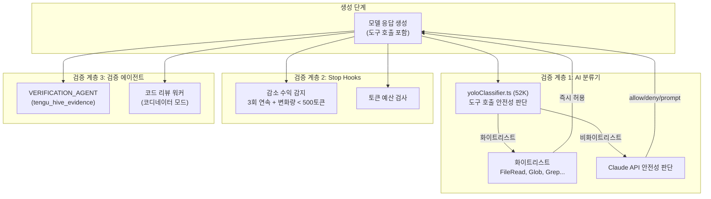

**yoloClassifier**: 자동 모드(bypassPermissions)에서 도구 실행 전 안전성을 검증한다. 읽기 전용 도구는 바이패스하고, 쓰기/실행 도구는 Claude API로 판단한다.

**Stop Hooks (감소 수익 감지)**:

```typescript
function shouldStopLoop(hook: StopHookState): boolean {
  return (
    hook.continuationCount >= 3 &&        // 3회 이상 연속 실행
    hook.deltaSinceLastCheck < 500 &&     // 마지막 검사 이후 변화량 미미
    hook.lastDeltaTokens < 500            // 직전 턴 출력도 미미
  );
  // → 실질적 진전 없는 반복을 감지하여 중단
}
```

**검증 에이전트 (Coordinator Mode)**: 코디네이터의 워크플로에서 Verification 단계는 독립 워커로 수행된다. 구현 워커와 검증 워커를 분리하여, 구현 가정이 검증에 영향을 주지 않도록 한다:

> "Verifier should see the code with fresh eyes, not carry implementation assumptions."

### 3.5 감독자 패턴: Coordinator Mode

하네스의 **감독자 패턴**(중앙 에이전트가 동적 분배)은 Coordinator Mode 그 자체이다.

코디네이터 시스템 프롬프트의 4단계 워크플로:

| 단계 | 수행자 | 목적 |
|------|-------|------|
| **Research** | 워커 (병렬) | 코드베이스 조사, 파일 탐색, 문제 이해 |
| **Synthesis** | **코디네이터** | 결과 읽기, 접근법 도출, 구현 스펙 작성 |
| **Implementation** | 워커 | 스펙에 따른 코드 변경, 커밋 |
| **Verification** | 워커 | 변경 검증 (테스트, 타입체크) |

**핵심**: Synthesis 단계는 반드시 코디네이터가 수행한다. "Never write 'based on your findings'" — 이해를 워커에게 위임하지 않는 것이 감독자 패턴의 핵심 계약이다.

### 3.6 계층적 위임 패턴: AgentTool → 서브에이전트 재귀

하네스의 **계층적 위임 패턴**(상위→하위 재귀적 위임)은 `AgentTool → runAgent() → query()` 체인으로 구현된다.

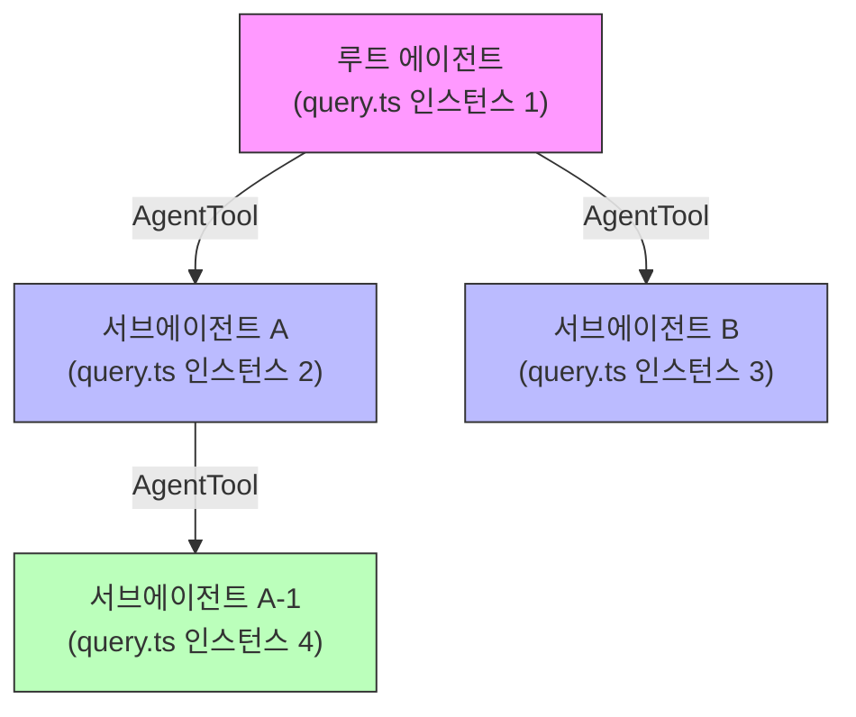

서브에이전트는 부모와 **동일한 `query()` 함수**를 사용하되, 격리된 컨텍스트에서 실행된다:

```typescript
// runAgent.ts — 서브에이전트 컨텍스트 생성
const agentToolUseContext = createSubagentContext(toolUseContext, {
  options: agentOptions,          // 격리된 도구 풀, MCP 클라이언트
  agentId,                        // 고유 에이전트 ID
  readFileState: agentReadFileState,  // 격리된 파일 캐시
  abortController: agentAbortController,  // 독립적 중단 컨트롤러
});

// 비동기 에이전트는 완전 격리, 동기 에이전트는 부모와 일부 공유
const agentAbortController = isAsync
  ? new AbortController()        // 비동기: 독립적
  : toolUseContext.abortController;  // 동기: 부모와 공유
```

재귀 방지 메커니즘: `feature('FORK_SUBAGENT')` 게이트와 `querySource === 'agent:builtin:fork'` 가드로 무한 재귀를 차단한다.

---

## 4. 스킬 시스템과 자동 생성

### 4.1 bundledSkills 구조

Claude Code의 스킬 시스템은 하네스의 스킬 자동 생성과 직접적으로 연결되는 핵심 인프라이다.

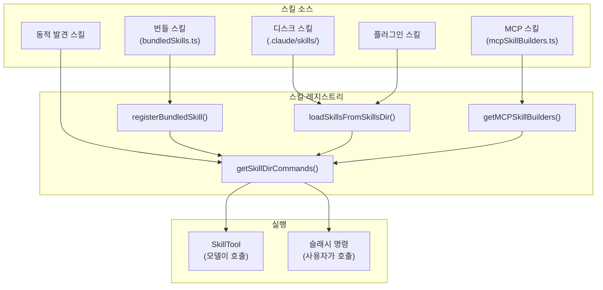

**BundledSkillDefinition** 인터페이스:

```typescript
// src/skills/bundledSkills.ts
export type BundledSkillDefinition = {
  name: string
  description: string
  aliases?: string[]
  whenToUse?: string             // 모델이 자동 호출할 조건
  argumentHint?: string
  allowedTools?: string[]        // 스킬 실행 시 허용되는 도구
  model?: string                 // 특정 모델 지정
  disableModelInvocation?: boolean
  userInvocable?: boolean
  isEnabled?: () => boolean      // 동적 활성화 조건
  hooks?: HooksSettings          // 스킬별 훅
  context?: 'inline' | 'fork'   // 실행 컨텍스트
  agent?: string                 // 연계 에이전트
  files?: Record<string, string> // 참조 파일 (디스크에 추출)
  getPromptForCommand: (args: string, context: ToolUseContext) =>
    Promise<ContentBlockParam[]>
}
```

17개의 번들 스킬이 존재한다:

```
src/skills/bundled/
├── batch.ts           # 배치 처리
├── claudeApi.ts       # Claude API 활용
├── claudeApiContent.ts
├── claudeInChrome.ts  # Chrome 연동
├── debug.ts           # 디버깅
├── index.ts
├── keybindings.ts
├── loop.ts            # 반복 실행
├── loremIpsum.ts
├── remember.ts        # 메모리 저장
├── scheduleRemoteAgents.ts  # 원격 에이전트 스케줄링
├── simplify.ts        # 코드 단순화
├── skillify.ts        # 스킬 자동 생성
├── stuck.ts           # 막혔을 때 도움
├── updateConfig.ts    # 설정 업데이트
├── verify.ts          # 검증
└── verifyContent.ts
```

### 4.2 스킬 로딩/발견 메커니즘

스킬은 5개 소스에서 계층적으로 로딩된다:

```typescript
// src/skills/loadSkillsDir.ts — 5개 소스 병렬 로딩
const [managedSkills, userSkills, projectSkillsNested,
       additionalSkillsNested, legacyCommands] = await Promise.all([
  // 1. 정책 관리 스킬 (Enterprise)
  loadSkillsFromSkillsDir(managedSkillsDir, 'policySettings'),
  // 2. 사용자 스킬 (~/.claude/skills/)
  loadSkillsFromSkillsDir(userSkillsDir, 'userSettings'),
  // 3. 프로젝트 스킬 (.claude/skills/)
  Promise.all(projectSkillsDirs.map(dir =>
    loadSkillsFromSkillsDir(dir, 'projectSettings')
  )),
  // 4. 추가 디렉토리 (--add-dir)
  Promise.all(additionalDirs.map(dir =>
    loadSkillsFromSkillsDir(join(dir, '.claude', 'skills'), 'projectSettings')
  )),
  // 5. 레거시 명령 (.claude/commands/)
  loadSkillsFromCommandsDir(cwd),
]);
```

**동적 스킬 발견**: 파일 작업 시 경로를 따라 올라가며 `.claude/skills/` 디렉토리를 탐색한다:

```typescript
// discoverSkillDirsForPaths — 파일 경로에서 스킬 디렉토리 자동 발견
export async function discoverSkillDirsForPaths(
  filePaths: string[], cwd: string
): Promise<string[]> {
  for (const filePath of filePaths) {
    let currentDir = dirname(filePath);
    // CWD까지 올라가며 .claude/skills/ 탐색
    while (currentDir.startsWith(resolvedCwd + pathSep)) {
      const skillDir = join(currentDir, '.claude', 'skills');
      if (!dynamicSkillDirs.has(skillDir)) {
        dynamicSkillDirs.add(skillDir);
        // gitignore 체크 후 로딩
        if (!(await isPathGitignored(currentDir, resolvedCwd))) {
          newDirs.push(skillDir);
        }
      }
      currentDir = dirname(currentDir);
    }
  }
  return newDirs.sort(/* 깊이 기준 정렬 — 가까운 스킬 우선 */);
}
```

**조건부 스킬 활성화**: `paths` frontmatter를 가진 스킬은 해당 경로의 파일이 접촉될 때만 활성화된다:

```typescript
// activateConditionalSkillsForPaths — 경로 매칭으로 지연 활성화
export function activateConditionalSkillsForPaths(
  filePaths: string[], cwd: string
): string[] {
  for (const [name, skill] of conditionalSkills) {
    const skillIgnore = ignore().add(skill.paths);
    for (const filePath of filePaths) {
      if (skillIgnore.ignores(relativePath)) {
        dynamicSkills.set(name, skill);  // 활성화
        conditionalSkills.delete(name);   // 대기 목록에서 제거
        activated.push(name);
        break;
      }
    }
  }
  return activated;
}
```

### 4.3 MCP 스킬 빌더

MCP 서버에서 제공하는 프롬프트를 Claude Code 스킬로 변환하는 브릿지:

```typescript
// src/skills/mcpSkillBuilders.ts — 순환 의존성 방지를 위한 레지스트리 패턴
export type MCPSkillBuilders = {
  createSkillCommand: typeof createSkillCommand
  parseSkillFrontmatterFields: typeof parseSkillFrontmatterFields
}

let builders: MCPSkillBuilders | null = null

export function registerMCPSkillBuilders(b: MCPSkillBuilders): void {
  builders = b
}

export function getMCPSkillBuilders(): MCPSkillBuilders {
  if (!builders) {
    throw new Error(
      'MCP skill builders not registered — loadSkillsDir.ts has not been evaluated yet'
    )
  }
  return builders
}
```

이 패턴은 `client.ts → mcpSkills.ts → loadSkillsDir.ts → ... → client.ts`의 순환 의존성을 **write-once 레지스트리**로 해결한다. `loadSkillsDir.ts`가 모듈 초기화 시 빌더를 등록하며, MCP 서버 연결 시 이 빌더를 통해 스킬을 동적 생성한다.

---

## 5. 에러 핸들링과 복구

### 5.1 에이전트 실패 시 복구 전략

Claude Code는 7가지 독립적 에러 복구 메커니즘을 갖추고 있다:

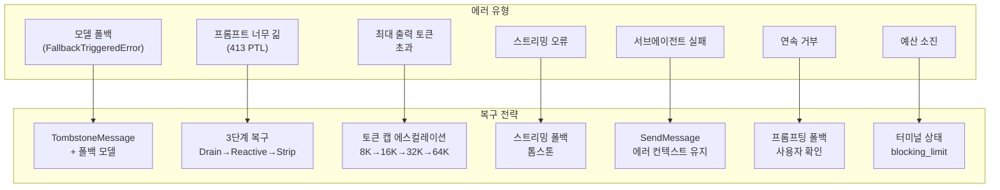

#### PTL(Prompt Too Long, 413) 3단계 복구

```typescript
async function handlePromptTooLong(state): Promise<LoopState | Terminal> {
  // 1단계: Context Collapse Drain (비용 0)
  const collapsed = contextCollapseDrain(state);
  if (collapsed.tokenCount < state.contextWindow) return collapsed;

  // 2단계: Reactive Compact (API 1회 호출)
  if (!state.hasAttemptedReactiveCompact) {
    const compacted = await reactiveCompact(state);
    return { ...compacted, hasAttemptedReactiveCompact: true };
  }

  // 3단계: Strip Retry — 최근 도구 결과 제거 후 재시도
  return stripAndRetry(state);
}
```

#### 코디네이터의 워커 실패 처리

코디네이터 시스템 프롬프트에 명시된 실패 처리 전략:

> "When a worker reports failure: Continue the same worker with SendMessage -- it has the full error context. If a correction attempt fails, try a different approach or report to the user."

| 상황 | 메커니즘 | 이유 |
|------|---------|------|
| 실패 후 수정 | **Continue** (SendMessage) | 에러 컨텍스트 보존 |
| 완전히 잘못된 접근 | **Spawn fresh** (AgentTool) | 오염된 컨텍스트 회피 |
| 수정 시도도 실패 | 다른 접근 시도 또는 사용자 보고 | 에스컬레이션 |

### 5.2 서킷 브레이커

Auto-Compact 서킷 브레이커가 무한 압축 시도를 방지한다:

```typescript
const MAX_CONSECUTIVE_AUTOCOMPACT_FAILURES = 3;

async function autoCompact(state: LoopState): Promise<LoopState> {
  // 서킷 브레이커: 연속 실패 3회 시 Auto-Compact 비활성화
  if (state.autoCompactTracking.consecutiveFailures >=
      MAX_CONSECUTIVE_AUTOCOMPACT_FAILURES) {
    return state;  // 서킷 열림 → 스킵
  }

  try {
    const summary = await callCompactAPI(state);
    return {
      ...state,
      autoCompactTracking: { consecutiveFailures: 0 },  // 리셋
    };
  } catch (error) {
    return {
      ...state,
      autoCompactTracking: {
        consecutiveFailures:
          state.autoCompactTracking.consecutiveFailures + 1,
      },
    };
  }
}
```

> "Before the circuit breaker, some sessions were hammering the API with over 3,000 doomed compaction attempts. At scale, that was a quarter million wasted API calls per day."

### 5.3 감소 수익(Diminishing Returns) 감지

```typescript
interface StopHookState {
  continuationCount: number;
  deltaSinceLastCheck: number;
  lastDeltaTokens: number;
}

function shouldStopLoop(hook: StopHookState): boolean {
  return (
    hook.continuationCount >= 3 &&      // 3회 이상 연속 실행
    hook.deltaSinceLastCheck < 500 &&   // 변화량 미미
    hook.lastDeltaTokens < 500          // 직전 출력도 미미
  );
}
```

이 메커니즘은 모델이 실질적 진전 없이 반복하는 "루프 탈출" 패턴을 감지한다. 9가지 터미널 상태 중 `hook_stopped`로 종료된다.

### 5.4 에이전트 리소스 정리

`runAgent()`의 `finally` 블록은 7가지 정리 작업을 수행한다:

```typescript
try {
  for await (const message of query({ ... })) { yield message; }
} finally {
  await mcpCleanup();                    // 1. 에이전트 전용 MCP 서버 정리
  clearSessionHooks(rootSetAppState, agentId);  // 2. 세션 훅 정리
  cleanupAgentTracking(agentId);         // 3. 프롬프트 캐시 추적 정리
  agentToolUseContext.readFileState.clear();  // 4. 파일 캐시 메모리 해제
  initialMessages.length = 0;            // 5. 포크 메시지 메모리 해제
  unregisterPerfettoAgent(agentId);      // 6. Perfetto 트레이스 해제
  // 7. 백그라운드 bash 태스크 종료
  killShellTasksForAgent(agentId, ...);
}
```

---

## 6. 격리와 공유

### 6.1 Git Worktree 격리

Git Worktree는 에이전트 간 파일시스템 충돌을 방지하는 핵심 격리 메커니즘이다.

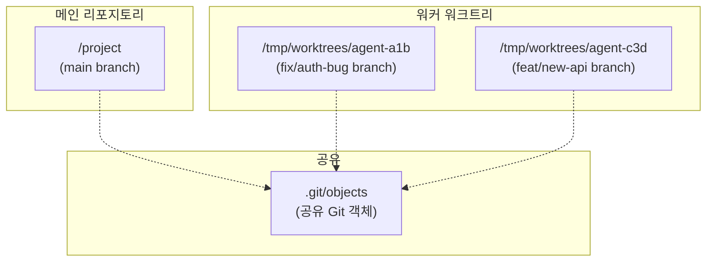

```typescript
// src/tools/EnterWorktreeTool/EnterWorktreeTool.ts
export const EnterWorktreeTool = buildTool({
  name: ENTER_WORKTREE_TOOL_NAME,
  async call(input) {
    // 1. 이미 워크트리에 있는지 확인
    if (getCurrentWorktreeSession()) {
      throw new Error('Already in a worktree session');
    }

    // 2. 메인 리포지토리 루트로 이동
    const mainRepoRoot = findCanonicalGitRoot(getCwd());
    if (mainRepoRoot && mainRepoRoot !== getCwd()) {
      process.chdir(mainRepoRoot);
      setCwd(mainRepoRoot);
    }

    // 3. 워크트리 생성 및 전환
    const worktreeSession = await createWorktreeForSession(
      getSessionId(), slug
    );
    process.chdir(worktreeSession.worktreePath);
    setCwd(worktreeSession.worktreePath);

    // 4. 캐시 무효화 (CWD 변경에 따른)
    clearSystemPromptSections();
    clearMemoryFileCaches();

    return {
      data: {
        worktreePath: worktreeSession.worktreePath,
        worktreeBranch: worktreeSession.worktreeBranch,
        message: `Created worktree at ${worktreeSession.worktreePath}...`,
      },
    };
  },
});
```

코디네이터 모드에서 워커에 Worktree를 할당하는 3가지 스폰 모드:

| 모드 | 설명 | 사용 사례 |
|------|------|----------|
| `single-session` | 단일 세션, 격리 없음 | 간단한 작업 |
| `same-dir` | 같은 디렉토리에서 실행 | 읽기 전용 작업 |
| `worktree` | 독립 Git Worktree 할당 | 쓰기 작업, 브랜치 분리 |

### 6.2 공유 스크래치패드 (tengu_scratch)

에이전트 간 정보 공유를 위한 전용 디렉토리. GrowthBook 피처 게이트 `tengu_scratch`로 제어된다.

```typescript
// src/coordinator/coordinatorMode.ts
function isScratchpadGateEnabled(): boolean {
  return checkStatsigFeatureGate_CACHED_MAY_BE_STALE('tengu_scratch')
}

export function getCoordinatorUserContext(
  mcpClients: ReadonlyArray<{ name: string }>,
  scratchpadDir?: string,
): { [k: string]: string } {
  // ...
  if (scratchpadDir && isScratchpadGateEnabled()) {
    content += `\nScratchpad directory: ${scratchpadDir}\n` +
      `Workers can read and write here without permission prompts. ` +
      `Use this for durable cross-worker knowledge — ` +
      `structure files however fits the work.`
  }
  return { workerToolsContext: content }
}
```

스크래치패드의 핵심 특성:
- **권한 프롬프트 없음**: 워커가 자유롭게 읽기/쓰기 가능
- **내구성**: 워커 종료 후에도 데이터 유지
- **구조 자유**: 워커가 작업에 맞게 파일 구조 결정
- **교차 워커**: 모든 워커가 동일한 디렉토리에 접근

### 6.3 세션 격리

각 에이전트 인스턴스는 다층 격리를 가진다:

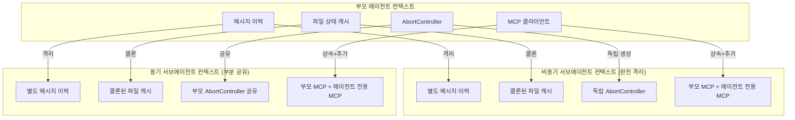

```typescript
// 비동기 vs 동기 에이전트 격리 수준
const agentAbortController = isAsync
  ? new AbortController()            // 비동기: 완전 독립
  : toolUseContext.abortController;   // 동기: 부모와 공유

const agentToolUseContext = createSubagentContext(toolUseContext, {
  shareSetAppState: !isAsync,         // 동기만 AppState 공유
  shareSetResponseLength: true,       // 둘 다 메트릭 공유
});
```

에이전트 메모리 최적화:
- **Explore/Plan 에이전트**: CLAUDE.md 생략 (읽기 전용이므로 커밋/PR 규칙 불필요) -- 주당 5~15 Gtok 절약
- **Git 상태 생략**: Explore/Plan은 stale한 gitStatus 대신 `git status` 직접 실행 -- 주당 1~3 Gtok 절약

---

## 7. Claude Code를 하네스로 활용하기 위한 가이드

### 7.1 기존 하네스 플러그인(revfactory/harness)과의 연결점

[revfactory/harness](https://github.com/revfactory/harness) 플러그인은 Claude Code의 내부 메커니즘을 활용하여 에이전트 팀과 스킬을 자동 생성한다.

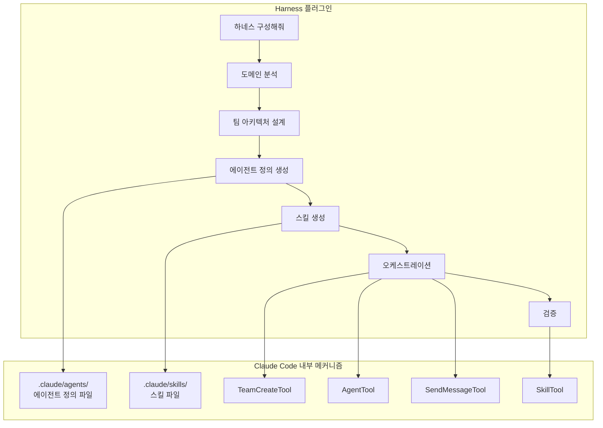

연결 매핑:

| Harness 6단계 워크플로 | Claude Code 내부 메커니즘 |
|-----------------------|------------------------|
| 1. 도메인 분석 | EXPLORE_AGENT, 코드베이스 탐색 |
| 2. 팀 아키텍처 설계 | TeamCreate vs AgentTool 선택 |
| 3. 에이전트 정의 생성 | `.claude/agents/*.md` 생성, `loadAgentsDir.ts` |
| 4. 스킬 생성 | `.claude/skills/*/SKILL.md` 생성, `loadSkillsDir.ts` |
| 5. 오케스트레이션 | Coordinator Mode 시스템 프롬프트 |
| 6. 검증 | VERIFICATION_AGENT, Stop Hooks |

### 7.2 Claude Code 내부 메커니즘을 활용한 커스텀 하네스 구성 방법

#### 방법 1: 에이전트 정의 파일로 전문가 팀 구성

`.claude/agents/` 디렉토리에 마크다운 파일로 에이전트를 정의한다:

```markdown
---
# .claude/agents/security-auditor.md
name: Security Auditor
description: 보안 취약점을 분석하는 전문 에이전트
allowed-tools:
  - Grep
  - FileRead
  - Glob
  - Bash(grep *)
  - Bash(find *)
permission-mode: plan   # 읽기 전용
effort: high
max-turns: 30
---

당신은 보안 감사 전문가입니다.

## 역할
- 코드베이스에서 보안 취약점 탐지
- OWASP Top 10 기준 분석
- 의존성 취약점 확인

## 보고 형식
파일 경로, 줄 번호, 심각도, 수정 제안을 포함하세요.
```

#### 방법 2: 스킬 파일로 도메인 작업 자동화

```markdown
---
# .claude/skills/code-review/SKILL.md
name: code-review
description: 종합 코드 리뷰 수행
when_to_use: 사용자가 코드 리뷰를 요청하거나 PR 검토가 필요할 때
allowed-tools:
  - FileRead
  - Grep
  - Glob
  - Bash(git diff *)
  - Bash(git log *)
agent: security-auditor   # 연계 에이전트
---

# 코드 리뷰 스킬

## 검토 항목
1. **아키텍처**: 설계 패턴 준수 여부
2. **보안**: 취약점 존재 여부 (security-auditor 에이전트 활용)
3. **성능**: 병목 지점 분석
4. **코드 스타일**: 프로젝트 규약 준수

## 출력
마크다운 형식의 종합 리뷰 리포트
```

#### 방법 3: Coordinator Mode로 멀티 에이전트 오케스트레이션

```bash
# 코디네이터 모드 활성화
CLAUDE_CODE_COORDINATOR_MODE=1 claude

# 에이전트 팀 기능 활성화
CLAUDE_CODE_EXPERIMENTAL_AGENT_TEAMS=1 claude
```

### 7.3 실전 활용 시나리오

#### 시나리오 1: 병렬 코드 리뷰 (팬아웃/팬인)

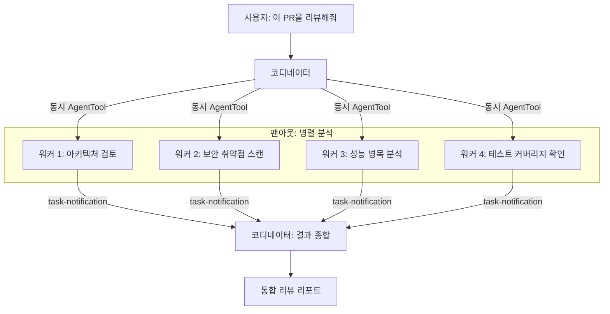

#### 시나리오 2: 파이프라인 기반 기술 문서 생성

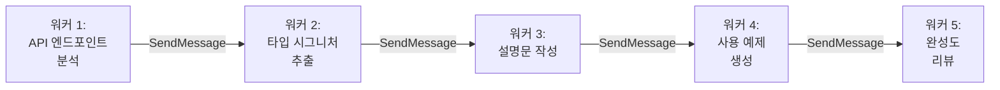

#### 시나리오 3: 감독자 패턴으로 풀스택 개발

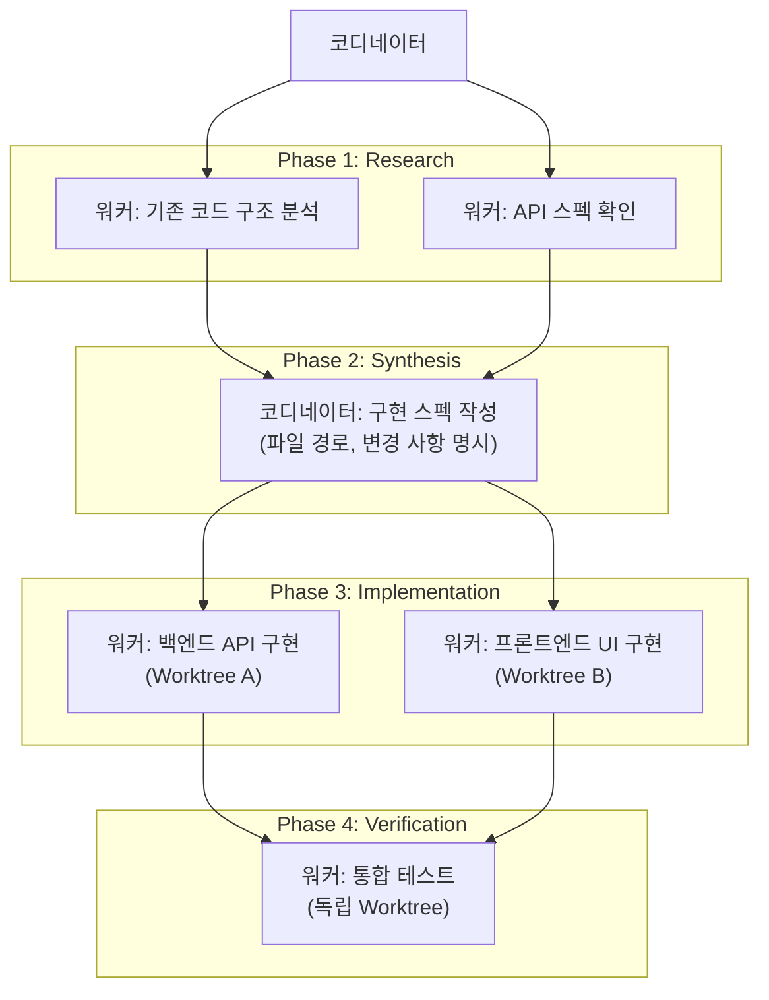

#### 시나리오 4: 생성-검증 루프로 안전한 마이그레이션

```
[코디네이터]
  ├── 생성 워커: DB 스키마 마이그레이션 코드 작성
  │     └── 자체 검증: 테스트 실행 + 커밋
  ├── 검증 워커: 마이그레이션 코드 독립 검증
  │     ├── 롤백 시나리오 테스트
  │     ├── 데이터 무결성 검증
  │     └── 에지 케이스 탐색
  └── 코디네이터: 양쪽 결과 종합, 필요시 수정 지시
```

### 7.4 하네스 활용 체크리스트

1. **패턴 선택**: 작업의 의존 관계에 따라 6가지 패턴 중 선택
   - 순차 의존 → 파이프라인
   - 독립 병렬 → 팬아웃/팬인
   - 상황별 전문가 → 전문가 풀
   - 품질 검수 → 생성-검증
   - 동적 분배 → 감독자
   - 재귀적 분해 → 계층적 위임

2. **에이전트 정의**: `.claude/agents/`에 에이전트별 시스템 프롬프트, 허용 도구, 권한 모드 정의

3. **스킬 정의**: `.claude/skills/`에 도메인 작업을 스킬로 캡슐화

4. **격리 전략**: 쓰기 작업에는 Git Worktree 사용, 공유 정보에는 스크래치패드 활용

5. **에러 처리**: SendMessage로 실패 워커 복구, 완전 실패 시 새 워커 스폰

6. **검증**: 구현 워커와 검증 워커를 분리하여 독립적 품질 검수 보장

---

## 부록: 핵심 수치 요약

| 항목 | 수치 |
|------|------|
| 전체 소스 파일 | 1,902개 |
| 총 코드 라인 | 512,664줄 |
| 빌트인 도구 | 40+ |
| 피처 플래그 | 60+ |
| 번들 스킬 | 17개 |
| 빌트인 에이전트 | 6개 |
| 슬래시 명령 | 80+ |
| 보안 계층 | 8 |
| 메시지 압축 계층 | 4 |
| 에이전틱 루프 단계 | 6 |
| 터미널 상태 | 9 |
| 에러 복구 메커니즘 | 7 |
| 서킷 브레이커 임계값 | 연속 3회 실패 |
| Bridge 파일 수 | 31 |
| Coordinator Mode | 19K |
| yoloClassifier | 52K |
| Max 동시 세션 (Bridge) | 32 |
